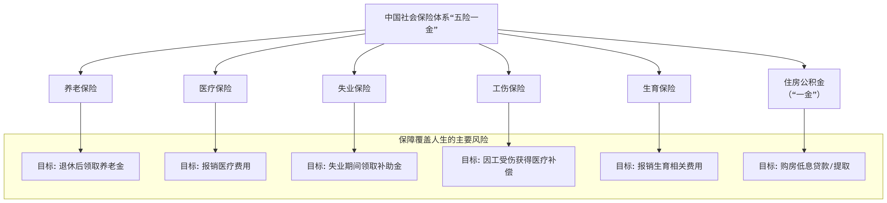

# 我国“五险一金”体系

[[toc]]

## 🧭 一、什么是“五险一金”？

“五险一金”是中国用人单位依法必须为职工缴纳的**社会保障+住房福利制度**，全称包括：

| 类别        | 内容                                             |
| ----------- | ------------------------------------------------ |
| 🖐 **五险** | 养老保险、医疗保险、失业保险、工伤保险、生育保险 |
| 🏠 **一金** | 住房公积金                                       |

✅ **法律强制性缴纳**：

- 用人单位必须为在职员工缴纳
- 属于员工法定权益
- 一般在员工工资中体现为“代扣代缴”

## 🧩 二、“五险一金”缴纳组成一览表

| **项目**    | **缴费主体**     | **单位缴费比例（约）** | **个人缴费比例（约）** | **主要作用**                     |
| ----------- | ---------------- | ---------------------- | ---------------------- | -------------------------------- |
| 🧓 养老保险 | 单位 + 个人      | 16%                    | 8%                     | 退休后领取养老金                 |
| 🏥 医疗保险 | 单位 + 个人      | 10%                    | 2% + 3 元              | 医疗报销、看病用医保卡           |
| 🏚 失业保险  | 单位 + 个人      | 0.5% \~ 1%             | 0.2%                   | 失业时可领取失业金               |
| 💼 工伤保险 | 单位（个人不缴） | 0.2% \~ 1.9%           | 0                      | 因工受伤、住院赔偿               |
| 🤰 生育保险 | 单位（个人不缴） | 0.5% \~ 1%             | 0                      | 怀孕生产津贴、产检住院报销       |
| 🏠 公积金   | 单位 + 个人      | 5% \~ 12%（各地浮动）  | 5% \~ 12%（对等缴纳）  | 购房首付、公积金贷款、租房提取等 |

> ⚠️ 各地区比例略有不同，以上为普遍区间，请以当地人社局/住房公积金中心为准。

## 🧾 三、住房公积金详解（“一金”）

### ✅ 什么是住房公积金？

- 是国家为帮助职工解决住房问题而设立的福利制度；
- **单位和个人按月等额缴纳**；
- 储存在个人专属“公积金账户”中；
- **全部归个人所有**，可提取、可贷款。

### 🏠 公积金的主要用途

| 用途            | 说明                                     |
| --------------- | ---------------------------------------- |
| 💰 买房首付     | 可提取公积金用于购房（首套为主）         |
| 🏦 公积金贷款   | 可申请低利率的公积金贷款，利率远低于商贷 |
| 🏘️ 租房提取     | 无购房也可按月或年度提取用于租房         |
| 🧾 重大支出提取 | 疾病、失业、退休、出境定居等情况可支取   |
| 👥 转移合并     | 跳槽后可转到新单位，账户合并             |
| 🧓 退休提取     | 退休时可一次性全部支取                   |

### 💼 公积金举例说明（北京为例）

- 假设职工月工资 10,000 元，缴纳比例 12%
- 单位缴纳 1,200 元，个人缴纳 1,200 元
- 每月入账公积金账户：2,400 元

✅ 一年后账户余额约 2.9 万，买房时可全额提取或用于贷款。

## 🔁 四、“五险一金”与工资的关系

### 📉 到手工资怎么计算？

假设月工资为 **10,000 元**，缴费如下（按高比例地区估算）：

| 项目            | 扣款金额（约） |
| --------------- | -------------- |
| 养老（8%）      | 800 元         |
| 医疗（2%+3 元） | 203 元         |
| 失业（0.2%）    | 20 元          |
| 公积金（12%）   | 1,200 元       |
| **合计**        | **2,223 元**   |

👉 **到手工资 ≈ 7,777 元**（不含个税，仅供参考）

## 📚 五、“五险一金”常见用途对照表

| 项目     | 是否强制 | 用于生活中的什么？                           |
| -------- | -------- | -------------------------------------------- |
| 养老保险 | ✅ 是    | 退休后每月领取养老金                         |
| 医疗保险 | ✅ 是    | 看病报销、医保卡支付门诊费                   |
| 失业保险 | ✅ 是    | 被裁员时可领取失业金                         |
| 工伤保险 | ✅ 是    | 工伤住院、误工补助、一次性伤残金             |
| 生育保险 | ✅ 是    | 女职工生育津贴、产检、住院费用报销           |
| 公积金   | ✅ 是    | 买房首付、住房贷款、租房提取、重大困难支取等 |

## ❓ 六、常见问题 Q\&A

### Q1：单位不给交社保和公积金合法吗？

❌ 不合法。法律规定，**用人单位必须为职工缴纳五险一金**。如不交，员工可向人社局举报。

### Q2：自己能交“五险一金”吗？

- **五险**：自由职业者可通过灵活就业方式缴纳“养老+医疗”，其余险种暂不可单独缴；
- **一金（公积金）**：部分城市开放“自由缴存公积金”，但覆盖有限。

### Q3：换工作了，五险一金怎么办？

- 可直接由新单位继续缴纳，无需中断；
- 可通过\*\*“社保转移”+“公积金转移”\*\*合并账户。

::: tip 总结

“五险一金”是每个职工最基础也是最重要的保障体系，影响你的一生：从**看病、生娃、失业、买房、退休**，每一个关键节点都与你缴纳的五险一金息息相关。

:::
