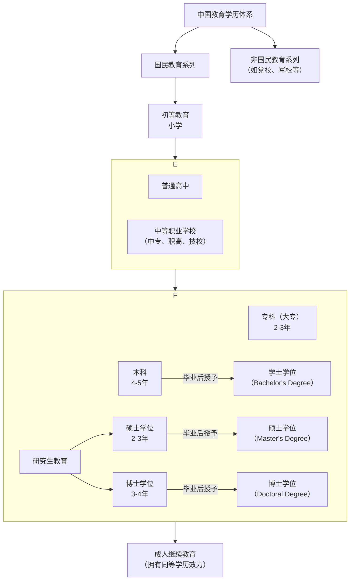

# 我国教育学历划分总结

[[toc]]


我国的教育学历体系主要分为国民教育系列和非国民教育系列，我们通常所说的学历主要是指国民教育系列。其层级划分如下图所示：



## 🧭 一、学历的基本分类

我国的学历教育可以按照**层次结构**划分为：

| 层级       | 教育阶段         | 是否属于学历教育 | 学历层次       |
| ---------- | ---------------- | ---------------- | -------------- |
| 学前教育   | 幼儿园           | ❌ 否            | 无学历         |
| 基础教育   | 小学、初中、高中 | ✅ 是            | 初中、高中学历 |
| 高等教育   | 专科、本科及以上 | ✅ 是            | 高等学历       |
| 研究生教育 | 硕士、博士       | ✅ 是            | 研究生学历     |

## 🎓 二、中国学历等级划分总表

| **层次** | **学历名称**             | **常见学位/证书**      | **学制（年）**      | **说明**                         |
| -------- | ------------------------ | ---------------------- | ------------------- | -------------------------------- |
| 第一级   | 小学学历                 | ——                     | 6                   | 基础教育，义务教育阶段           |
| 第二级   | 初中学历                 | ——                     | 3                   | 初中毕业即具备初中学历           |
| 第三级   | 高中学历（含中专、技校） | ——                     | 3                   | 高中、职业高中、中专、技校等     |
| 第四级   | **大专/专科**            | 毕业证，部分授“副学士” | 2-3                 | 高职高专，应用技能为主           |
| 第五级   | **本科**                 | 学士学位 + 毕业证      | 4（部分 3 年/5 年） | 普通高校本科教育                 |
| 第六级   | **硕士研究生**           | 硕士学位 + 毕业证      | 2-3                 | 学术型硕士 or 专业型硕士         |
| 第七级   | **博士研究生**           | 博士学位 + 毕业证      | 3-6                 | 最高学历层次，可继续做博士后研究 |

## 🧾 三、学历 VS 学位的区别

| 项目     | 学历                 | 学位                             |
| -------- | -------------------- | -------------------------------- |
| 定义     | 指接受教育达到的层次 | 国家对具备某学术水平者授予的称号 |
| 是否必须 | 上学毕业通常获得学历 | 学位需达到 GPA、论文等标准       |
| 授予单位 | 教育行政部门+学校    | 学校授予（受国务院学位办监管）   |
| 举例     | 本科学历             | 学士学位                         |

✅ 举个例子：

- 有人读完本科，但未获得学士学位（如考试/论文未达标），那他只有“本科学历”，**没有本科学位**。

## 🏫 四、各阶段对应学校类型举例

| 教育阶段 | 常见学校类型                     |
| -------- | -------------------------------- |
| 小学     | 各地小学、实验小学等             |
| 初中     | 初级中学、九年一贯制学校         |
| 高中     | 普通高中、职业高中、中专、技校   |
| 专科     | 高职院校、专科学校               |
| 本科     | 综合大学、本科院校、独立学院     |
| 研究生   | 各高校研究生院、中科院等研究机构 |

## 🧪 五、普通教育 vs 成人/非全日制学历

| 类型         | 举例               | 是否国家承认    | 是否可继续深造/考公    |
| ------------ | ------------------ | --------------- | ---------------------- |
| 普通高等教育 | 高考统招全日制     | ✅ 是           | ✅ 是                  |
| 成人高考     | 成考脱产、函授     | ✅ 是           | ✅ 是                  |
| 网络教育     | 国家开放大学等     | ✅ 是（限机构） | ✅ 是                  |
| 自学考试     | 自考本科、自考专科 | ✅ 是           | ✅ 是                  |
| 民办/培训类  | 各类学历班、进修班 | ❌ 否           | ❌ 否（不能考研/考公） |

## 🧠 六、报考公务员/事业编的学历要求

| 报考岗位层级     | 通常最低学历要求              |
| ---------------- | ----------------------------- |
| 国家公务员       | 本科及以上（有些岗位限硕士）  |
| 地方公务员       | 大专起步，普遍要求本科        |
| 事业单位（教师） | 大专/本科起步，教师资格证另计 |
| 三支一扶/村官等  | 大专及以上                    |

## 🏁 七、学历提升常见路径图

```text
初中 → 高中/中专 → 专科 → 本科 → 硕士 → 博士
                    ↓
               成人自考本科
```
