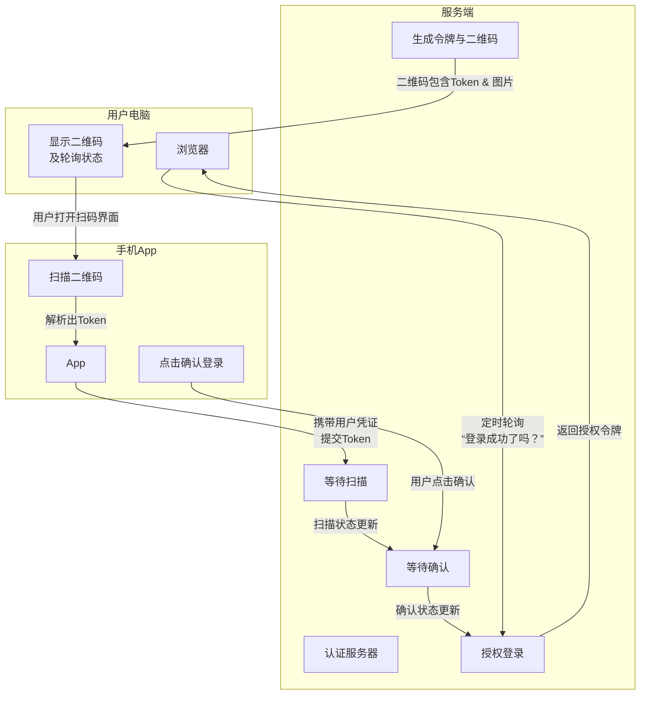

# 一扫即登：扫码登录的原理

[[toc]]

## 核心思想：授权，而非传输密码

首先要明确一个核心概念：扫码登录的本质是 **“授权”** ，而不是“传输密码”。

在整个流程中，你的密码**从未**被传输或填写。它依赖的是一个你已经登录并信任的设备（通常是手机），去授权另一个新设备（通常是电脑）进行登录。这就像你用一把物理钥匙（手机），去授权复制一把新的临时钥匙（电脑会话）。

为了直观地把握全局，下图清晰地展示了扫码登录全过程中，用户、手机 App 与服务端三者之间的交互流程：

**流程图解析：**



**图片解析：**


## 五步拆解：从二维码到登录成功

让我们结合上面的流程图，一步步拆解这个过程：

### 第 1 步：电脑生成二维码

当你在电脑上点击“扫码登录”时：

1.  你的**浏览器**会向网站的**认证服务器**发起一个请求：“我准备扫码登录了”。
2.  服务器会生成一个**唯一的、临时的、有时效的身份标识**，我们称之为 `Token`（令牌）。例如，它可能是一个像 `xyz123abc` 这样的随机字符串。
3.  服务器将这个 `Token` 与当前的浏览器会话绑定，并将其编码成一个 URL（例如 `https://example.com/auth?token=xyz123abc`），再生成二维码图片。
4.  图片显示在屏幕上，同时，浏览器开始**不断地向服务器轮询**：“请问 `Token: xyz123abc` 的状态变了吗？用户扫码了吗？”

### 第 2 步：手机扫描二维码

1.  你拿出已经登录了对应 App（如微信、淘宝）的**手机**，打开扫一扫功能。
2.  手机摄像头扫描二维码，App**解析出里面的 URL 和 `Token`**。

例如：

```
https://example.com/scan?login_key=88a9-x9
```

### 第 3 步：手机确认登录（关键授权步骤）

1.  手机 App 会**携带解析出的 `Token` 和它本身已存储的登录凭证**（代表你已在此手机登录），一起发送给服务器。
2.  通常，手机会弹出一个确认界面，显示“请在电脑上登录 XXX”，你点击**“确认”**。这一步至关重要，它确保了登录行为是你的主动意愿，防止误操作。

### 第 4 步：服务器完成授权绑定

服务器收到手机的请求后，会进行三重验证：

1.  **验手机**：通过手机传来的凭证，确认你是合法用户（比如用户张三）。
2.  **验 Token**：确认 `Token (xyz123abc)` 是有效且未过期的。
3.  **绑关系**：将 `Token (xyz123abc)` 和你的身份（用户张三）**绑定在一起**，并将该 `Token` 的状态标记为“已授权”。

### 第 5 步：电脑轮询成功，完成登录

1.  此时，电脑浏览器又一次轮询服务器：“`Token (xyz123abc)` 的状态变了吗？”
2.  服务器这次返回成功信息：“登录成功！”，并附上电脑端登录所需的凭证（如设置 Cookie）。
3.  浏览器收到响应，知道你已授权，于是将页面跳转或刷新，你便看到自己已经登录了。

## 为什么它既方便又安全？

1.  **密码零输入，防窃听**：整个过程密码不参与，从根本上避免了密码在输入时被键盘记录器或钓鱼网站窃取的风险。
2.  **双重认证（2FA）**：这本质上是一种双因子认证。你拥有的东西（已登录的手机）和你的操作（点击确认）共同完成了登录，安全性远高于单一密码。
3.  **临时令牌**：二维码背后的 `Token` 是临时的（通常 1-2 分钟有效），且一次性使用。即使被恶意截获，也很快会失效。
4.  **用户知情与控制**：关键的“确认”步骤让你拥有最终决定权，防止被恶意二维码“偷袭”登录。

## 扫码登录的状态管理

让我们来详细拆解一下这个过程到底有哪几个状态：

### 核心的五个状态

通常，一个完整的扫码登录流程包含以下五个关键状态：

#### 1. 待扫描（Pending / Generated）

- **含义**：二维码刚生成，正在等待被手机扫描。
- **表现**：电脑屏幕显示二维码，提示"请使用手机 App 扫码"。
- **后台逻辑**：服务器已生成 Token，但尚未收到任何扫描请求。

#### 2. 已扫描（Scanned / Detected）

- **含义**：手机已经成功扫描二维码，但用户尚未点击确认。
- **表现**：电脑界面变为"扫描成功，请在手机端确认"；手机弹出确认对话框。
- **触发条件**：手机 App 解析 Token 并发送到服务器验证其有效性。
- **安全意义**：防止恶意二维码被扫描后直接登录，给用户反悔的机会。

#### 3. 已确认（Confirmed / Authorized）

- **含义**：用户在手机端点击了"确认登录"按钮。
- **表现**：手机显示"登录成功"；电脑界面仍在等待或开始跳转。
- **触发条件**：用户主动点击确认，手机将授权信息发送到服务器。
- **关键作用**：这是真正的授权动作，服务器将 Token 与用户身份绑定。

#### 4. 已登录（Logged In / Success）

- **含义**：电脑端已完成登录，获得了用户会话。
- **表现**：电脑界面跳转到登录后的首页，显示用户信息。
- **触发条件**：电脑轮询到"已确认"状态，服务器返回登录凭证。

#### 5. 已过期/失效（Expired / Invalid）

- **含义**：二维码超过有效期或因其他原因失效。
- **表现**：电脑显示"二维码已过期，请刷新重试"。
- **触发条件**：
  - 时间过期（通常 1-2 分钟）
  - 被新二维码替换
  - 用户多次扫描同一二维码
  - 安全风险被系统主动终止

这五个状态形成一个严格的单向流转：

```
待扫描 → 已扫描 → 已确认 → 已登录
  ↓        ↓        ↓        ↓
过期     过期     过期     (正常结束)
```
