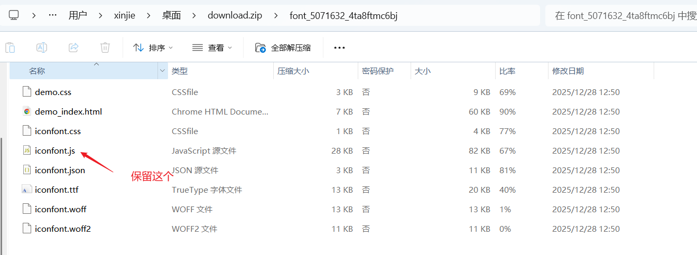
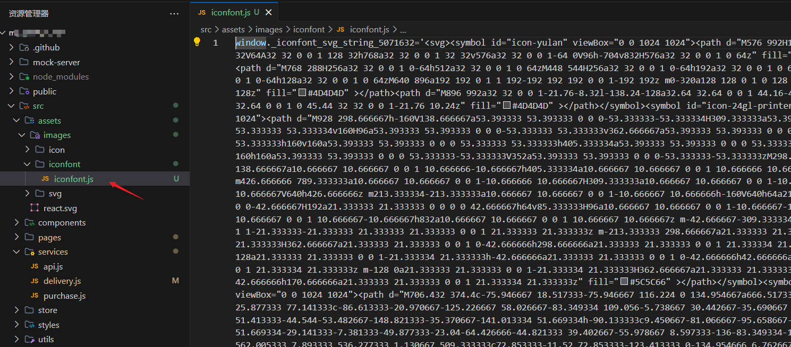
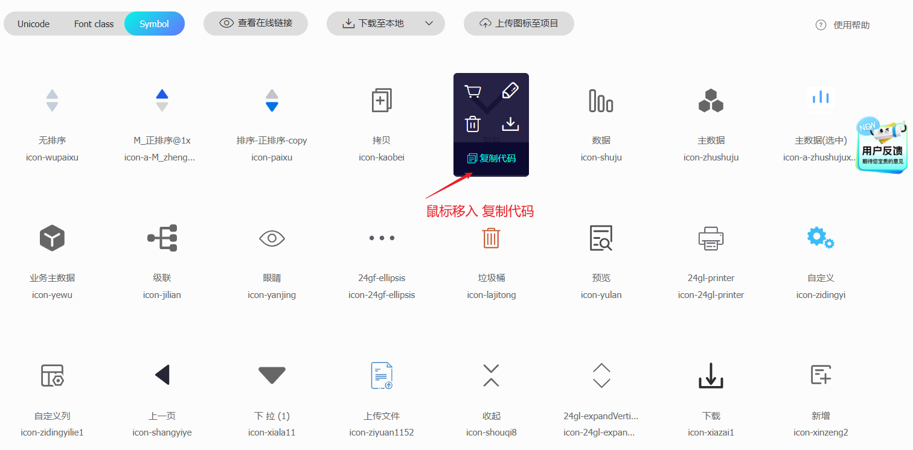

# 🚀 最佳实践：Ant Design 项目集成阿里 Iconfont 图标库

[[toc]]

虽然 `Ant Design `等 UI 库提供了丰富的内置图标，但业务场景往往需要定制化、品牌化或彩色的矢量图标。**阿里矢量图标库 (Iconfont)** 是目前的行业标准解决方案。

## 1. 为什么要封装？

直接使用 `createFromIconfontCN` 虽然能跑通，但在实际项目中存在痛点：
*   **依赖外网**：直接使用 CDN 链接 (`//at.alicdn.com/...`)，一旦 Iconfont 服务器波动或内网环境无法访问公网，图标就会挂掉。
*   **重复代码**：到处写 `<Icon type="icon-xxx" />`，难以统一管理样式（如悬停变色）。
*   **维护成本**：图标库更新时，需要全项目搜索替换 URL。

我们的方案通过以下方式解决这些问题：
1.  **本地化部署**：将 JS 文件下载到项目内 (`src/assets`)。
2.  **组件封装**：提供统一的 `<IconFont />` 接口。
3.  **样式增强**：内置悬停交互和尺寸控制。


## 2. 实现步骤

###  第一步：资源准备

#### 1. 下载已经加入购物车的矢量图（选中Symbol）

如图：


#### 2. 把iconfont.js这个js文件放到项目中

下载的文件只需要 `iconfont.js`，其他文件不需要



然后放到静态资源文件夹下:

```
src/
  assets/
    iconfont/
      iconfont.js  <-- 下载的 Symbol JS 文件
```



### 第二步：组件实现 (`IconFont/index.jsx`)

我们使用 `@ant-design/icons` 的 `createFromIconfontCN` 方法，并加载本地脚本。注意这里使用了 `?url` 后缀（Vite/Webpack 常见用法）来获取文件路径字符串。

```jsx
import { createFromIconfontCN } from '@ant-design/icons';
import iconUrl from "@/assets/iconfont/iconfont.js?url"; // 引入本地脚本路径
import styles from './IconFont.module.scss';

// 初始化阿里图标库原始组件
const AntdIconFont = createFromIconfontCN({
    scriptUrl: iconUrl, // 使用本地资源，无需外网
});

/**
 * @description 自定义图标组件 - 使用阿里矢量图
 * @param {string} type - 图标类型 (必传，对应 Iconfont 网站上的标识)
 * @param {string} className - 额外的类名
 * @param {boolean} hover - 是否开启悬停效果，默认为 true
 * @param {object} style - 行内样式
 */
const IconFont = ({ type, className = '', hover = true, ...props }) => {
    // 组合样式：模块化样式 + 悬停逻辑 + 自定义类名
    const combinedClassName = `${styles.iconfont} ${!hover ? styles.noHover : ''} ${className}`.trim();

    return (
        <AntdIconFont
            type={type}
            className={combinedClassName}
            {...props}
        />
    );
};

export default IconFont;
```

### 第三步：样式定义 (`IconFont.module.scss`)

使用 CSS Modules 确保样式隔离，同时加入标准化的交互效果。

```scss
.iconfont {
  display: inline-block;
  color: inherit;       // 默认继承父级颜色
  font-style: normal;
  line-height: 0;
  text-align: center;
  text-transform: none;
  vertical-align: -0.125em; // 对齐文字基线
  font-size: 14px;      // 默认大小
  cursor: pointer;
  transition: all 0.3s; // 平滑过渡

  // 默认悬停效果
  &:hover {
    color: #1890ff;       // 悬停变主题色
    transform: scale(1.1); // 微调放大效果
  }

  // 无悬停效果状态
  &.noHover {
    cursor: default;
    &:hover {
      color: inherit;
      transform: none;
    }
  }
}
```

## 3. 如何使用

封装后的组件使用非常简单。

**1. 基础用法**
传入`type`名称（从 Iconfont 网站复制的代码）：
```jsx
<IconFont type="icon-home" />
```

如图：



**2. 禁用悬停效果**
用于仅展示的场景（如按钮内部或静态文本）：
```jsx
<IconFont type="icon-user" hover={false} />
```

**3. 自定义大小和颜色**
因为是 SVG 字体图标，可以通过 `style` 或 `className` 随意控制：
```jsx
<IconFont
  type="icon-settings"
  style={{ fontSize: '24px', color: 'red' }}
/>
```

## 4. 方案亮点总结

1.  **稳定性**：本地引入 `iconfont.js` 彻底消除了 CDN 不稳定的风险，内网离线环境也能完美运行。
2.  **体验感**：内置的 `transform: scale(1.1)` 和颜色过渡，让用户的操作能得到即时、细腻的反馈。
3.  **扩展性**：组件结构清晰，未来如果需要切换多色图标或增加全局配置，只需修改这一个文件即可。

---

*   **为什么要加 `?url`?**：在现代构建工具（如 Vite）中，直接 import JS 文件通常导入的是模块内容。加上 `?url` 是强制打包器返回该文件的 URL 路径，这正是 `scriptUrl` 参数所需要的。
*   **Symbol 模式**：本方案使用的是 Symbol 引用方式（SVG），支持多色图标，且缩放不失真，优于旧版的 Font-class 方式。


