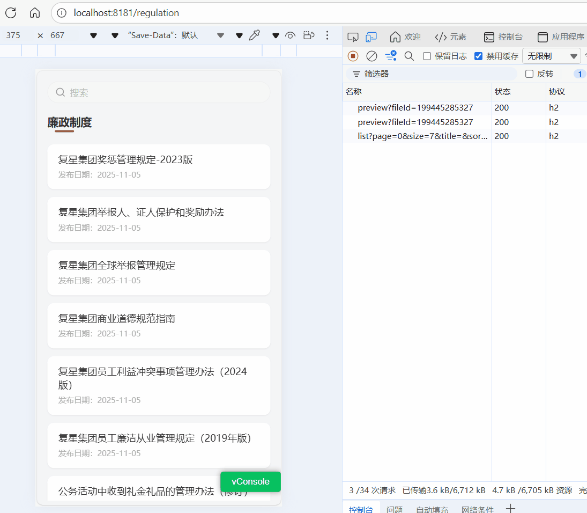

# 基于 IntersectionObserver 更流畅的懒加载实现

[[toc]]

在现代前端开发中，**懒加载（Lazy Loading）** 已经成为优化性能和提升用户体验的标配功能之一。尤其是在列表类页面（如文章列表、制度文档、图片墙等）中，**一次性加载所有数据不仅浪费流量，还可能造成页面卡顿**。

本文将以一个实际项目为例，讲解如何使用 **IntersectionObserver API** 实现优雅的前端懒加载。

## 🌟 一、什么是 IntersectionObserver？

`IntersectionObserver` 是浏览器原生提供的一个 **可观察元素可见性变化的 API**。简单来说，它能帮我们“监听”某个元素是否出现在视口中。

> 当元素进入或离开视口时，回调函数会被触发。

**核心优势：**

- 不需要监听 `scroll` 事件；
- 浏览器原生支持，性能更好；
- 可配置 `rootMargin`（提前加载距离）；
- 异步执行，不阻塞主线程。

## 🧩 二、懒加载的常见应用场景

- **图片懒加载**：只有当图片进入视口时才加载资源；
- **无限滚动列表**：当滚动到底部时，自动加载下一页；
- **广告曝光监测**：检测广告区域是否被用户看到。

本文聚焦第二种：**滚动到底部自动加载更多数据**。

## ⚙️ 三、功能目标

我们的目标是构建一个“廉政制度”页面，当用户滚动到列表底部时自动加载下一页数据。

主要功能包括：

1. **初次加载数据**
2. **输入关键词搜索**
3. **滚动到底部触发加载更多**
4. **防止首次渲染误触发**
5. **数据加载完成后关闭加载提示**

**如图所示：**



## 💻 四、核心实现代码

来看关键部分的实现逻辑（已省略部分业务代码）：

```tsx
import { useEffect, useState, useRef, useCallback } from "react";
import { getEthicsRegulationList } from "../../api/backendApi";

function PolicyList() {
  const [regulations, setRegulations] = useState([]);
  const [page, setPage] = useState(0);
  const [hasMore, setHasMore] = useState(true);

  const observerRef = useRef<HTMLDivElement | null>(null);
  const firstLoadRef = useRef(true); // ✅ 初次加载保护标志

  // 获取数据
  const fetchData = useCallback(
    async (reset = false) => {
      const res = await getEthicsRegulationList({ page, size: 7 });
      if (reset) {
        setRegulations(res.content || []);
      } else {
        setRegulations((prev) => [...prev, ...(res.content || [])]);
      }
      setHasMore(!res.last);
    },
    [page]
  );

  // 初始化加载
  useEffect(() => {
    fetchData(true);
  }, []);

  // IntersectionObserver 实现懒加载
  useEffect(() => {
    if (!observerRef.current) return;

    const observer = new IntersectionObserver(
      (entries) => {
        const entry = entries[0];
        // ✅ 避免第一次渲染时触发加载
        if (entry.isIntersecting && hasMore && !firstLoadRef.current) {
          setPage((prev) => prev + 1);
        }
      },
      { rootMargin: "100px" } // 提前 100px 触发加载
    );

    observer.observe(observerRef.current);
    return () => observer.disconnect();
  }, [hasMore]);

  // 页码变化时加载下一页
  useEffect(() => {
    if (page === 0) return;
    fetchData();
  }, [page]);

  // 首次加载完成后，关闭“首次加载保护”
  useEffect(() => {
    if (regulations.length > 0) {
      firstLoadRef.current = false;
    }
  }, [regulations]);

  return (
    <div className="policy-list">
      {regulations.map((item, index) => (
        <div key={index} className="policy-card">
          {item.title}
        </div>
      ))}

      {/* 观察点（加载触发点） */}
      <div ref={observerRef} className="loading-more">
        {hasMore ? "加载更多..." : "已加载全部"}
      </div>
    </div>
  );
}

export default PolicyList;
```

## 🔍 五、实现思路拆解

### 1. 设置观察目标

我们在列表底部放置一个空的 `<div>`：

```html
<div ref="{observerRef}" className="loading-more"></div>
```

这个元素就是“触发点”——当它出现在视口中时，就意味着用户滚动到底部。

### 2. 创建 IntersectionObserver 实例

```js
const observer = new IntersectionObserver(
  (entries) => {
    const entry = entries[0];
    if (entry.isIntersecting && hasMore) {
      setPage((prev) => prev + 1);
    }
  },
  { rootMargin: "100px" }
);
```

- `entries[0].isIntersecting`：表示目标元素是否进入视口；
- `rootMargin`：设置“提前加载”的距离；

  - 例如 `"100px"` 表示当元素距离视口底部 100px 时就触发。

### 3. 首次加载保护

首次渲染时，观察目标往往默认可见，会误触发加载。

因此使用一个 `useRef` 标记：

```js
const firstLoadRef = useRef(true);

useEffect(() => {
  if (regulations.length > 0) {
    firstLoadRef.current = false;
  }
}, [regulations]);
```

在懒加载逻辑中增加判断：

```js
if (entry.isIntersecting && hasMore && !firstLoadRef.current) {
  setPage((prev) => prev + 1);
}
```

### 4. 页码变化时加载下一页

```js
useEffect(() => {
  if (page === 0) return; // 初次加载已处理
  fetchData();
}, [page]);
```

当 `page` 变化时重新请求数据，并将结果追加到已有数据中。

## 💡 六、rootMargin 的妙用

`rootMargin` 是懒加载的“提前量”。假设设置为 `"100px"`，意味着当底部触发点距离视口底部还有 100px 时就开始加载，避免滚动到底才触发、用户等待的卡顿感。

## 总结

| 对比项   | IntersectionObserver | scroll 事件监听      |
| -------- | -------------------- | -------------------- |
| 性能     | 异步执行，浏览器优化 | 高频触发，需手动节流 |
| 可维护性 | 简洁明了，配置灵活   | 逻辑复杂             |
| 支持性   | 现代浏览器原生支持   | 所有浏览器通用       |

> 💬 懒加载并不只是“少加载”，而是让“用户感觉快”。

这才是现代前端性能优化的核心思想。
