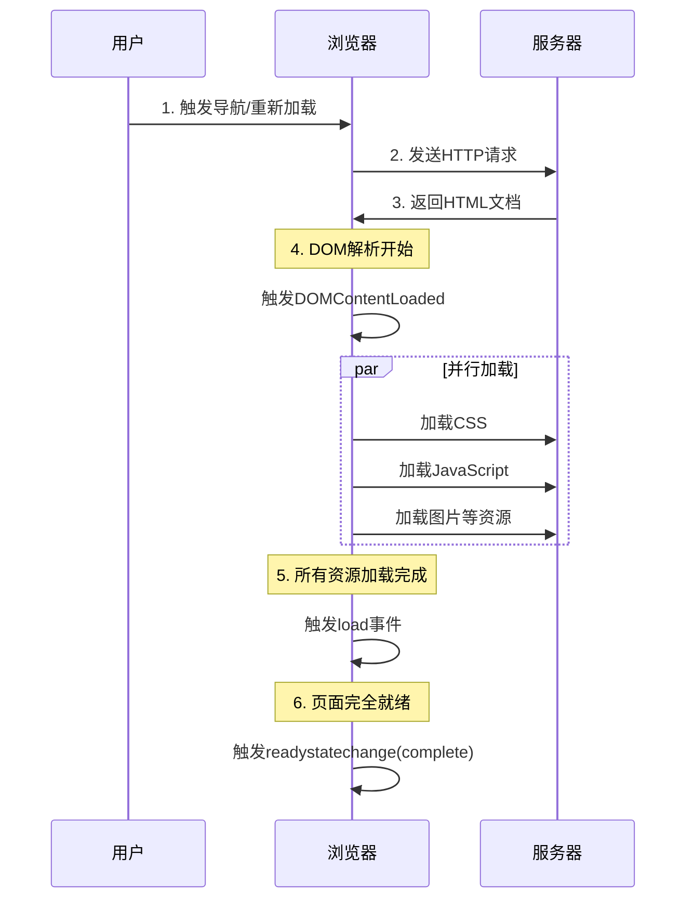

# NProgress 如何“跟随”页面加载？

> `NProgress` 是前端开发中常见的一个进度条组件，但你是否好奇过它为什么能跟随页面加载？事实上，它并不能真正追踪浏览器加载进度，而是通过智能模拟和事件绑定创造这种“跟随”的假象。

## 核心真相：NProgress 无法追踪真实加载进度

首先要明确一个关键事实：**NProgress 本身无法精确获取浏览器对页面或资源的真实加载进度百分比**。

现代浏览器确实提供了加载进度信息，但出于安全和性能考虑，这些信息对 JavaScript 是**不可见**或**受限**的。NProgress 采用的是一种更巧妙的设计哲学：

**通过模拟进度增长，并绑定到开发者控制的加载事件上，从而创建流畅的视觉反馈。**

## NProgress 的核心机制：两套“跟随”策略

### 1. “涓滴”算法：智能模拟进度

当调用 `NProgress.start()` 时，会触发“涓滴”（trickle）算法：

```javascript
// 简化的算法逻辑
NProgress.trickle = function () {
  return NProgress.inc(0.1 + Math.random() * 0.1); // 随机增量前进
};

// 进度永远不会自行达到100%
// 必须由开发者显式调用NProgress.done()来完成
```

这种设计模拟了真实世界加载的不确定性：进度以随机、缓慢的方式前进，给用户“正在加载”的心理暗示，但永远不会自行完成，避免了假完成或卡在 99%的尴尬。

### 2. 事件驱动：绑定关键生命周期

NProgress 真正的“跟随”能力来自于开发者将其绑定到应用的关键事件上：

```javascript
// 示例：在路由系统中绑定
router.beforeEach((to, from, next) => {
  NProgress.start(); // 路由开始前启动进度条
  next();
});

router.afterEach(() => {
  NProgress.done(); // 路由完成后结束进度条
});

// 示例：在HTTP请求中绑定
axios.interceptors.request.use((config) => {
  NProgress.start();
  return config;
});

axios.interceptors.response.use(
  (response) => {
    NProgress.done();
    return response;
  },
  (error) => {
    NProgress.done();
    return Promise.reject(error);
  }
);
```

## 浏览器真正的加载事件：NProgress 的模仿对象

为了理解 NProgress 在模仿什么，我们需要了解浏览器真实的加载事件。以下流程图展示了传统页面加载的关键事件触发顺序：



### 🎯 关键事件详解：

#### 1. **DOMContentLoaded** - 核心内容就绪

```javascript
document.addEventListener("DOMContentLoaded", function () {
  console.log("DOM已完全解析，可以操作DOM元素");
  // 此时CSSOM可能尚未构建完成
});
```

- **触发时机**：HTML 文档完全被解析和加载，DOM 树构建完成
- **不等待**：样式表、图像和子框架的加载完成
- **NProgress 对应**：在单页应用中，这类似于路由组件解析完成

#### 2. **load** - 所有资源加载完成

```javascript
window.addEventListener("load", function () {
  console.log("页面所有资源（图片、CSS等）已加载完成");
  // 这是传统页面加载的"完成"时刻
});
```

- **触发时机**：页面及其所有依赖资源（图片、CSS、JS 等）完全加载
- **NProgress 对应**：`NProgress.done()` 应该在此事件或其等效时刻调用

#### 3. **readystatechange** - 更细粒度的状态追踪

```javascript
document.onreadystatechange = function () {
  console.log("当前状态:", document.readyState);
  // 状态值：
  // loading - 文档仍在加载
  // interactive - DOM已可交互，但资源仍在加载
  // complete - 文档和资源全部加载完成
};
```

#### 4. **beforeunload/unload** - 页面离开事件

```javascript
window.addEventListener("beforeunload", function (event) {
  // 可以在这里启动进度条
  NProgress.start();
});

window.addEventListener("unload", function () {
  // 页面即将卸载
});
```

## 现代前端框架中的实现策略

在 Vue、React 等单页应用（SPA）中，NProgress 的实现方式与传统页面有所不同：

### Vue Router 集成示例

```javascript
import NProgress from 'nprogress';
import 'nprogress/nprogress.css';

const router = new VueRouter({ ... });

// 全局前置守卫
router.beforeEach((to, from, next) => {
    if (from.name !== null) { // 不是首次加载
        NProgress.start();
    }
    next();
});

// 全局后置钩子
router.afterEach(() => {
    NProgress.done();
});

// 处理异步组件加载
Vue.mixin({
    beforeRouteEnter(to, from, next) {
        next(vm => {
            // 组件内部资源加载完成后
            vm.$once('hook:mounted', () => {
                if (to.meta.needsProgress) {
                    NProgress.done();
                }
            });
        });
    }
});
```

### 处理异步组件加载

```javascript
// Vue异步组件
const AsyncComponent = () => ({
  component: import("./MyComponent.vue"),
  loading: {
    render(h) {
      NProgress.start();
      return h("div", "加载中...");
    }
  },
  error: ErrorComponent,
  delay: 200, // 延迟显示加载状态
  timeout: 3000 // 超时时间
});
```

## NProgress 的配置与优化

为了获得更好的“跟随”效果，可以调整 NProgress 的配置：

```javascript
NProgress.configure({
  minimum: 0.08, // 最小百分比
  trickleSpeed: 200, // 涓滴速度
  showSpinner: false, // 是否显示旋转图标
  easing: "ease", // 动画缓动函数
  speed: 500, // 动画速度
  template: `<div class="bar" role="bar"></div>` // 自定义模板
});
```

## 什么是涓滴算法？

涓滴算法 是`NProgress` 用来模拟加载进度的心理学策略——通过缓慢、随机的小幅进度增长，让用户感觉页面确实在“努力加载”，即使它并不知道真实进度。

想象一个沙漏，你无法知道具体流了多少沙子，但看到沙子流动，就知道时间在流逝。涓滴算法就是这种“视觉安慰剂”。

```js
// 简化的涓滴逻辑
function trickle() {
  // 每次增加一个很小的随机值
  const randomIncrement = 0.1 + Math.random() * 0.1; // 0.1-0.2之间的随机值
  progress += randomIncrement;

  // 关键：永远不会自动达到100%
  if (progress < 0.95) {
    // 卡在95%以下
    setTimeout(trickle, 200); // 200ms后再次增长
  }
}
```

**背后的心理学原理**

- 进度可见性：人脑对不确定的等待容忍度很低，可见的进度能显著降低焦虑
- 假性进展：即使不是真实进度，运动本身就能提供安慰（如同电梯的“关门”按钮）
- 期望管理：缓慢增长设定了“这需要时间”的预期，避免了突然卡住的挫折感
