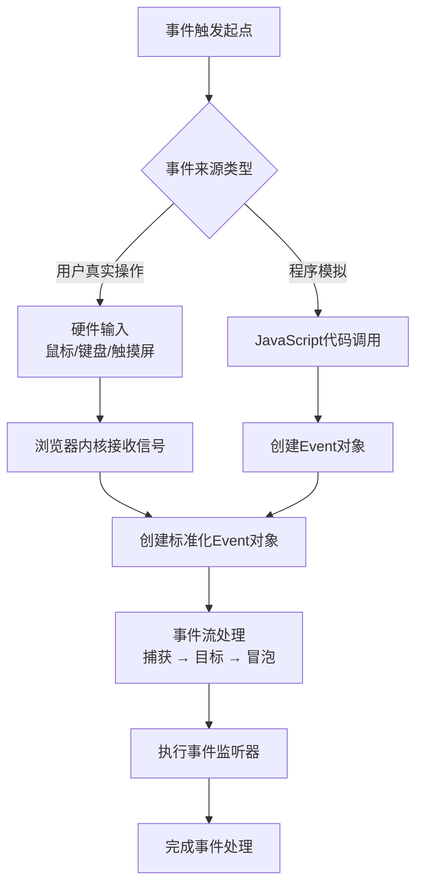

# 为什么不点击鼠标也能通过MouseEvent实现点击事件

> 在一个普通的网页上，当我们用一行简单的 `element.click()` 或几行创建 MouseEvent 的代码，就能触发完整的点击响应时，这背后隐藏着浏览器事件系统一套精巧的设计哲学。

## 事件系统的本质：发布-订阅模式

在深入 MouseEvent 之前，需要理解浏览器事件系统的核心设计模式——**发布-订阅模式**（Pub/Sub）。

当我们在元素上添加事件监听器时：

```javascript
button.addEventListener("click", function (event) {
  console.log("按钮被点击了！");
});
```

我们实际上是在告诉浏览器：“当这个按钮有点击事件**发布**时，请**订阅**并执行这个函数。”

浏览器内部维护着一个**事件调度中心**，记录了哪些元素订阅了哪些类型的事件。当事件发生时，调度中心负责将事件分发给所有相关的订阅者。

## 为什么可以“伪造”点击事件？

### 1. 统一的事件处理接口

浏览器设计了一个统一的**事件处理机制**，无论事件来源是真实用户操作（鼠标、键盘、触摸屏）还是程序生成，都**走相同的处理流程**：



这种设计的**核心优势**在于：

- **一致性**：开发者无需关心事件来源，处理逻辑完全一致
- **可测试性**：自动化测试可以完全模拟用户交互
- **可扩展性**：浏览器可以轻松支持新的事件类型

### 2. Event 对象的标准化

所有事件都继承自基础的 `Event` 接口。当我们创建 MouseEvent 时：

```javascript
const clickEvent = new MouseEvent("click", {
  bubbles: true,
  cancelable: true,
  clientX: 100,
  clientY: 100,
  button: 0 // 主按钮（通常是左键）
});
```

我们创建的是一个**完全符合规范的事件对象**，它与真实鼠标点击产生的事件对象**在结构上完全一致**。浏览器的事件系统无法（也无需）区分这个对象是来自硬件还是 JavaScript 代码。

### 3. 事件流的确定性

浏览器的事件处理遵循**确定性的三个阶段**：

1. **捕获阶段**（Capturing Phase）：从 window 向下传递到目标元素
2. **目标阶段**（Target Phase）：在目标元素上触发
3. **冒泡阶段**（Bubbling Phase）：从目标元素向上冒泡到 window

当我们调用 `dispatchEvent()` 时，浏览器**忠实地执行这个完整流程**：

```javascript
// 假设我们有这样的HTML结构
// <div id="parent">
//   <button id="child">点击我</button>
// </div>

const parent = document.getElementById("parent");
const child = document.getElementById("child");

// 添加事件监听器（第三个参数 true 表示在捕获阶段触发）
parent.addEventListener("click", () => console.log("父元素-捕获"), true);
child.addEventListener("click", () => console.log("子元素-目标"));
parent.addEventListener("click", () => console.log("父元素-冒泡"));

// 模拟点击
child.dispatchEvent(new MouseEvent("click", { bubbles: true }));

// 控制台输出：
// 父元素-捕获
// 子元素-目标
// 父元素-冒泡
```

## 深入 MouseEvent 的实现细节

### 构造函数参数解析

`MouseEvent` 构造函数接受两个参数：

```javascript
new MouseEvent(type, eventInitDict);
```

**type**：事件类型字符串，如 `'click'`、`'dblclick'`、`'mousedown'` 等。

**eventInitDict**：一个配置对象，可以包含以下关键属性：

| 属性                                       | 类型    | 默认值  | 描述                               |
| ------------------------------------------ | ------- | ------- | ---------------------------------- |
| `bubbles`                                  | Boolean | `false` | 事件是否冒泡                       |
| `cancelable`                               | Boolean | `false` | 事件是否可取消                     |
| `view`                                     | Window  | `null`  | 事件关联的窗口                     |
| `detail`                                   | Number  | `0`     | 点击次数（对于 click 事件）        |
| `screenX`, `screenY`                       | Number  | `0`     | 相对于屏幕的坐标                   |
| `clientX`, `clientY`                       | Number  | `0`     | 相对于视口的坐标                   |
| `ctrlKey`, `altKey`, `shiftKey`, `metaKey` | Boolean | `false` | 修饰键状态                         |
| `button`                                   | Number  | `0`     | 鼠标按钮（0:左键, 1:中键, 2:右键） |
| `buttons`                                  | Number  | `0`     | 按下的按钮掩码                     |

### 与 element.click() 的差异对比

虽然都能触发点击，但两者有本质区别：

```javascript
// 方法1：直接调用click方法
button.click();

// 方法2：创建并派发MouseEvent
const event = new MouseEvent("click", {
  bubbles: true,
  cancelable: true,
  view: window,
  detail: 1,
  clientX: 100,
  clientY: 100,
  button: 0
});
button.dispatchEvent(event);
```

**关键差异**：

| 特性             | `element.click()`                | `new MouseEvent() + dispatchEvent()`        |
| ---------------- | -------------------------------- | ------------------------------------------- |
| **事件对象属性** | 部分属性为默认值（如坐标为 0）   | 可完全自定义所有属性                        |
| **事件流控制**   | 总是冒泡                         | 可通过 `bubbles: false` 阻止冒泡            |
| **可取消性**     | 不可通过 `preventDefault()` 取消 | 如果 `cancelable: true` 则可取消            |
| **相关事件**     | 只触发 click 事件                | 可触发任意鼠标事件（mousedown、mouseup 等） |
| **浏览器兼容性** | 所有浏览器完美支持               | 现代浏览器支持，IE 有部分限制               |

### 真实模拟完整点击序列

一个真实的鼠标点击实际上会触发一系列事件：

1. `mousedown` → 2. `mouseup` → 3. `click`

我们可以精确模拟这个序列：

```javascript
function simulateCompleteClick(element, x = 0, y = 0) {
  // 触发 mousedown
  element.dispatchEvent(
    new MouseEvent("mousedown", {
      bubbles: true,
      cancelable: true,
      clientX: x,
      clientY: y,
      button: 0
    })
  );

  // 触发 mouseup
  element.dispatchEvent(
    new MouseEvent("mouseup", {
      bubbles: true,
      cancelable: true,
      clientX: x,
      clientY: y,
      button: 0
    })
  );

  // 触发 click
  element.dispatchEvent(
    new MouseEvent("click", {
      bubbles: true,
      cancelable: true,
      clientX: x,
      clientY: y,
      button: 0,
      detail: 1 // 点击次数
    })
  );
}

// 使用
simulateCompleteClick(document.getElementById("myButton"), 100, 100);
```