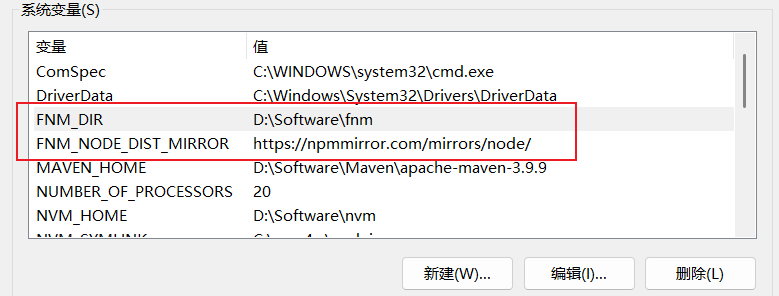
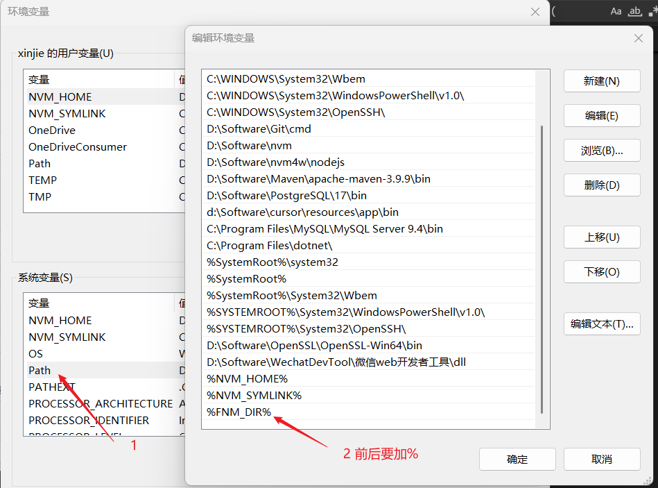
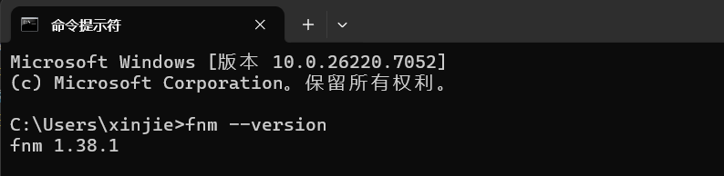

# 使用 FNM (Fast Node Manager) 管理多个 Node.js 版本

[[toc]]

在现代前端和后端开发中，管理不同的 Node.js 版本是一个常见且必不可少的需求。尤其是在不同项目之间切换时，可能需要不同版本的 Node.js 来保证项目运行环境的一致性。我们可以使用 **fnm (Fast Node Manager)** 来管理和切换 Node.js 版本。

**fnm** 是一个轻量级的 Node.js 版本管理工具，它不仅非常快速，而且安装、使用都非常简单。

## 🔑 一、为什么选择 FNM？

在过去，Node.js 版本管理工具如 **nvm** 已经广泛使用。但 **fnm** 以其以下优势脱颖而出：

- **超快性能**：fnm 使用 Rust 编写，性能比 nvm 快。
- **轻量级**：占用更少的磁盘空间。
- **简易安装与配置**：跨平台支持，配置简单。
- **兼容性好**：支持类 Unix 系统（macOS, Linux）及 Windows 通过 WSL。

**mvn 的缺点具有以下：**

1. 不太稳定，有时候会出现一些问题。
2. 不能安装老版本的 Node.js，例如 v12 及 以下的版本（需要手动下载文件放到 nvm 的安装目录下）。
3. 不能根据项目自动切换 Node.js 版本，需要 `nvm use` 手动切换。

## 🛠️ 二、如何安装 FNM？

### 1. 安装 FNM（macOS / Linux）

在 **macOS** 或 **Linux** 上，安装 fnm 非常简单，支持 Homebrew 或直接使用安装脚本。

#### 通过 Homebrew 安装（macOS / Linux）

如果你已经安装了 Homebrew，可以通过以下命令安装 fnm：

```bash
brew install fnm
```

#### 通过安装脚本安装（macOS / Linux）

如果没有 Homebrew，可以使用官方安装脚本：

```bash
curl -fsSL https://fnm.vercel.app/install | bash
```

这将会自动安装 fnm，并将相关路径添加到你的 shell 配置文件中（如 `.bashrc`、`.zshrc` 等）。

### 2. 安装 FNM（Windows）

**先下载**

[github 下载地址](https://github.com/Schniz/fnm/releases)


下载的是一个 zip 压缩包，解压之后我放在了`D:\Software\fnm`目录下,如下图：


> 后面使用 `fnm install `安装的版本都会存放到 `D:\Software\fnm\node-versions` 里面。

**配置环境变量**

右键点击此电脑，选择属性，然后点击左侧的“高级系统设置”，新建 `FNM_DIR`和 `FNM_NODE_DIST_MIRROR` 。

```
FNM_DIR 的值为：刚才解压的目录
FNM_NODE_DIST_MIRROR 的值为：`https://npmmirror.com/mirrors/node/`
```

**如下图：**



**然后编辑系统变量 Path，把 FNM_DIR 加入 Path 中**



**最终验证 fnm 命令**

打开新的终端窗口，输入 `fnm --version` 验证安装是否成功。如果显示版本号，说明安装成功。如下:

{width=80%}

## 🧑‍💻 三、使用 FNM 管理 Node.js 版本

安装完成后，你就可以开始使用 `fnm` 来管理多个` Node.js` 版本了。

### 1. 安装 Node.js 版本

使用 fnm 安装 Node.js 版本非常简单，只需执行以下命令：

```bash
fnm install 14
fnm install 16
```

这里的 `14` 和 `16` 代表你想要安装的 Node.js 版本。你可以安装任何官方支持的版本（包括最新的 LTS 版本、稳定版本等）。

### 2. 切换 Node.js 版本

安装好多个版本后，使用以下命令切换到你需要的版本：

```bash
fnm use 14
fnm use 16
```

这将使当前终端会话使用指定的 Node.js 版本。如果需要查看当前使用的版本，可以运行：

```bash
fnm current
```

### 3. 设置默认 Node.js 版本

如果你想要设置一个默认版本，可以使用：

```bash
fnm default 16
```

这将使 `Node.js 16.x` 成为默认版本，新的终端会话将会自动使用该版本。

## 🔄 四、管理和查看已安装的版本

### 1. 列出已安装的 Node.js 版本

你可以使用以下命令查看已安装的所有 Node.js 版本：

```bash
fnm list

## 运行如下：
C:\Users\xinjie>fnm list
* v12.22.12 default
* v14.21.3
* v18.20.8
* v20.19.5
* system
```

这将列出所有你通过 `fnm` 安装的版本。

### 2. 卸载 Node.js 版本

如果你不再需要某个 `Node.js `版本，可以轻松卸载：

```bash
fnm uninstall 14
```

这样可以释放磁盘空间，删除不再使用的版本。

## 🧰 五、FNM 高级功能

### 1. 使用 `.nvmrc` 文件自动切换 Node 版本

如果你在多个项目之间切换，可以在每个项目根目录下创建 `.nvmrc` 文件，指定该项目使用的 Node.js 版本。例如，文件内容可以是：

```
16
```

> .nvmrc 只是一个 “告诉 nvm 该用哪个 Node 版本” 的纯文本文件，里面只有一行内容: 版本号

**随后在：**

1. 地址栏输入 `%USERPROFILE%\Documents` ，确认会自动跳转到用户文档目录。
2. 新建`WindowsPowerShell`目录。(注意：如果已经有了该目录，直接跳过这一步)。
3. 然后在`WindowsPowerShell`目录下 新建一个名为 `Microsoft.PowerShell_profile.ps1` 的文件。
4. `Microsoft.PowerShell_profile.ps1` 使用记事本打开，内容如下：

```bash
# --- PowerShell 启动配置，fnm 自动切换 Node，只在有 .nvmrc 时触发 ---

# 设置 UTF-8 编码，避免中文乱码
[Console]::OutputEncoding = [System.Text.Encoding]::UTF8
chcp 65001 > $null 2>&1

# fnm 初始化（必保留）
fnm env --use-on-cd | Out-String | Invoke-Expression

# 记录上次 Node 版本，避免重复提示
$global:LastNodeVersion = $null

# prompt 包装函数，每次显示命令行提示时触发
function global:prompt {

    # 检测当前目录或父目录是否有 .nvmrc
    $nvmrc = Get-ChildItem -Path (Get-Location) -Recurse -Depth 1 -Filter ".nvmrc" -ErrorAction SilentlyContinue | Select-Object -First 1

    if ($nvmrc) {
        # 读取版本
        $version = Get-Content $nvmrc.FullName | Select-Object -First 1
        if ($version) {
            # 仅在版本变化时执行
            if ($version -ne $global:LastNodeVersion) {
                nvm use $version | Out-Null
                $global:LastNodeVersion = $version
            }
        }
    }

    # 返回默认 prompt
    return "PS $(Get-Location)> "
}

```

如图目录：


配置完成，后面每次进入到你的前端项目的终端时，`fnm `会自动根据项目根目录下的 `.nvmrc` 文件切换到指定的 Node.js 版本。

::: info 细节

在 `Windows PowerShell` 中，创建 Microsoft.PowerShell_profile.ps1 文件的目的是定制 PowerShell 环境，使得每次启动 PowerShell 时自动加载指定的配置。  
例如，你可以在这个文件中设置常用的别名、环境变量、自动加载模块等。这样，可以提高开发效率，避免每次启动 PowerShell 时手动配置。这个文件存放在 C:\Users\<你的用户名>\Documents\WindowsPowerShell\ 目录下。

:::

### 2. 查看可用的 Node.js 版本

如果你不确定可以安装哪些版本，可以使用以下命令查看所有可用版本：

```bash
fnm ls-remote
```

这将列出 Node.js 的所有稳定版本、LTS 版本等。

## 六、常用命令总结

- `fnm install <version>`：安装指定版本。
- `fnm use <version>`：切换当前会话使用的 Node 版本。
- `fnm default <version>`：设置默认版本。
- `fnm list`：查看已安装的版本。
- `fnm uninstall <version>`：卸载某个版本。
