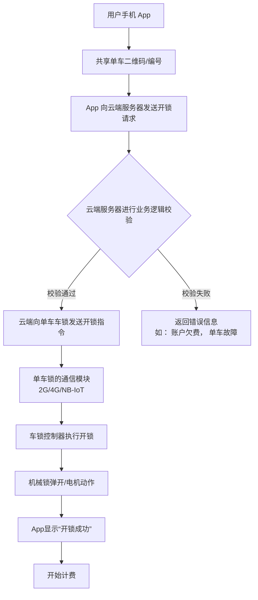

# 共享单车的扫码开锁逻辑

[[toc]]

共享单车的“扫码开锁”逻辑。这背后是一套典型的物联网应用，涉及移动端、云端和单车硬件之间的协同工作。

我们可以将整个扫码开锁的逻辑分为以下几个核心步骤：

### 整体架构图（逻辑层面）

### 详细步骤分解

#### 第 1 步：扫描二维码

- **二维码里有什么？**
  - 你扫描的二维码并不直接包含开锁指令，它本质上是一个`身份证`。
  - 它通常编码了一串**唯一的数字编号**，这个编号与云平台数据库中这辆单车的身份信息是绑定的。
  - 可能包含的信息有：**单车 ID、车辆型号、所属区域**等元数据。

#### 第 2 步：App 向云端发送请求

- 手机 App 在识别出二维码中的单车编号后，会立即组装一个“开锁请求”数据包，并通过移动网络（4G/5G/Wi-Fi）发送到共享单车公司的云端服务器。
- 这个数据包通常包含：
  - **单车编号**（从二维码获取）
  - **用户身份标识**（你的用户 ID 或 Token）
  - **地理位置信息**（确保你就在车旁边）
  - **时间戳**

#### 第 3 步：云端服务器的业务逻辑校验（核心环节）

这是整个流程中最关键的一步，云端服务器在收到请求后，会进行一系列复杂的校验，以确保业务的合法性和安全性：

1.  **用户身份认证**：验证你的账号是否有效、已登录。
2.  **支付状态检查**：检查你的账户余额是否充足、是否已缴纳押金（如果需要）、是否有未支付的订单。
3.  **单车状态检查**：在数据库中查询这辆单车：
    - 是否是**可用的状态**（非故障、非报修、非已骑行中）。
    - 是否处于**合法的运营区域**。
4.  **风控规则检查**：
    - 用户行为是否异常（例如，短时间内频繁开锁关锁）。
    - 地理位置是否匹配（防止远程开锁）。
5.  **生成骑行订单**：如果所有校验都通过，云端会在数据库中为你创建一条新的**骑行订单**，状态为“进行中”，并记录开始时间。

#### 第 4 步：云端向单车车锁发送开锁指令

- 校验通过后，云端服务器会通过移动网络（通常是 2G/4G Cat.1 或 NB-IoT 这类低功耗广域物联网技术）找到对应的单车。
- 云端向单车内置的**通信模块（MCU）** 发送“开锁指令”。
- 这个指令通常是加密的，以防止被恶意截获和破解。

#### 第 5 步：单车执行开锁

- 单车上的通信模块收到云端指令后，会将其传递给**主控制器**。
- 主控制器（一块简单的单片机）会驱动**电机或电磁锁**的电路，执行物理开锁动作。
  - **马蹄锁**：电机转动，带动锁舌收回，“咔哒”一声锁就开了。
  - **电子集成锁**：直接控制锁体内的电机解锁。

#### 第 6 步：确认开锁与开始计费

- 车锁打开后，单车上的传感器（如振动传感器、锁舌状态传感器）会检测到状态变化。
- 单车会**主动上报“开锁成功”的信号**给云端服务器。
- 云端服务器收到确认后，立即向你的手机 App 发送“开锁成功”的通知，并**正式开始计费**。

### 技术要点与关键问题

#### 1. 如果网络信号不好怎么办？

这是一个非常常见的问题，共享单车的设计考虑了弱网或无网环境：

- **“伪开锁”流程**：你的开锁请求到达云端并校验通过后，即使云端无法立即将指令下发给单车（单车所在位置信号差），App 也可能先显示“开锁中”或“开锁成功”。这是因为云端**单方面相信了开锁会成功**，并开始了计费。实际上，云端会**持续重试**发送开锁指令，直到单车在信号恢复后收到为止。
- **单车的离线能力**：部分单车设计有简单的离线逻辑，比如收到一个特定的“一次性密码”也能开锁，但这较少见。主流方案还是依赖网络。

#### 2. 二维码被损坏或篡改怎么办？

- **手动输入编号**：所有单车的二维码旁边，都有一串**物理编号**。如果二维码无法扫描，你可以在 App 内手动输入这串数字，后续流程完全一样。
- **防篡改措施**：二维码本身没有防篡改功能，但恶意粘贴其他二维码属于“物理攻击”，需要通过运营（巡逻、举报）和法律手段来解决。

#### 3. 通信技术

- 早期主要使用**2G**网络。
- 现在主流是**NB-IoT**和**4G Cat.1**。它们具有**低功耗、广覆盖、成本低**的特点，非常适合共享单车这种需要长时间待机、数据量极小的物联网设备。

#### 4. 安全性与功耗

- **安全性**：指令传输全程加密，防止重放攻击和指令伪造。
- **功耗**：单车车锁的绝大部分时间处于**深度睡眠状态**，只有收到“唤醒”信号（如云端开锁指令、或用户手动关锁）时才会全功率工作，以此保证长达数月的续航。

### 总结

共享单车的扫码逻辑，本质上是一个 **“云端决策，单车执行”** 的物联网控制模型。手机 App 只是一个发起请求和显示结果的交互界面，所有核心的业务逻辑（身份、支付、风控）都在云端完成，单车则是一个受控的、联网的简单执行终端。这种架构保证了系统的集中管理、高可靠性和可扩展性。
