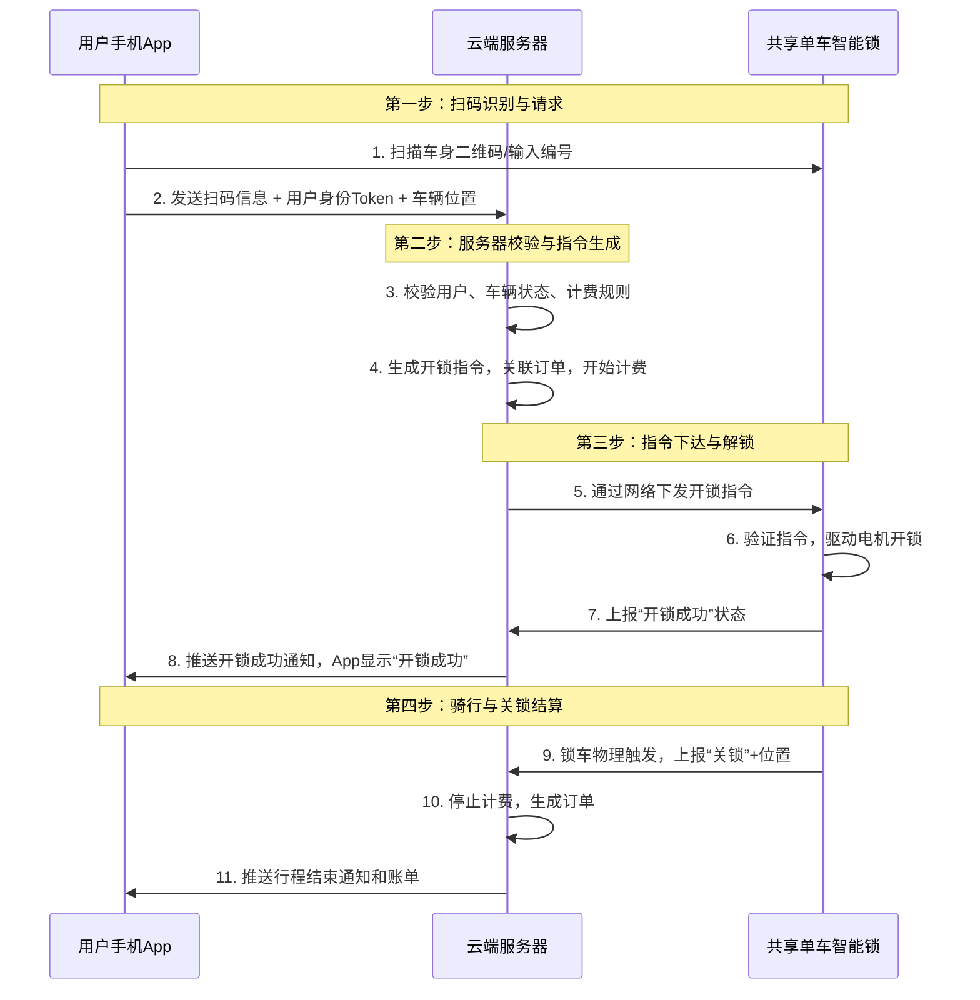

# 共享单车的扫码开锁逻辑

[[toc]]

共享单车的扫码开锁逻辑是一个非常经典的**物联网（IoT）应用实例**，它结合了移动互联网、嵌入式系统和后端服务。与普通扫码登录相比，它多了对**物理硬件（智能锁）的控制**环节。

其核心原理是：**手机 App 通过扫描单车二维码，获取单车唯一身份标识，然后请求云端服务器向该单车发送开锁指令。**

下图清晰地展示了从用户扫码到锁开的完整流程与数据交互：

---

下面我们来详细拆解图中的每一个阶段和关键技术点：

### 第一阶段：扫码识别与开锁请求 (用户发起)

1.  **二维码内容**：单车上印刷的**二维码（或输入编号）**，本质上是这辆单车的**全球唯一编号（Vehicle ID）** 和一个简短的服务器地址。它**不包含开锁密码或指令本身**。
2.  **App 动作**：你打开 App 扫码后，App 会：
    - 解析出车辆 ID。
    - 将 **车辆 ID + 你的用户身份 Token（代表已登录账户）+ 当前手机 GPS 定位** 打包，通过蜂窝网络（4G/5G）发送到**云端服务器**。

### 第二阶段：服务器校验与指令生成 (云端决策)

这是**最核心的业务逻辑处理层**，所有安全和计费规则都在这里。

3.  **身份与状态校验**：
    - **用户校验**：账户是否有效、有无欠费、信用分是否足够。
    - **车辆校验**：这辆车 ID 是否存在、是否已被预约或骑行、是否报修、是否在可运营区域（电子围栏）。
    - **位置校验**：手机 GPS 位置与车辆上报的最近位置是否在合理范围内（防远程开锁）。
4.  **业务处理**：校验通过后，服务器：
    - **创建一条骑行订单**，状态为“开锁中”，开始计时（或准备开始）。
    - **生成一个一次性的、有时效的“开锁指令”**。这个指令通常是动态密钥，包含车辆 ID、指令序列号、时间戳等信息，并经过加密。

### 第三阶段：指令下达与物理开锁 (车锁执行)

5.  **通信链路**：服务器通过**移动网络（内置的 SIM 卡，通常是 2G/NB-IoT）** 将开锁指令下发到目标单车的**通信模块（MCU）**。
6.  **锁端验证**：单车的智能锁主控芯片接收到指令后，会进行本地验证（如校验指令格式、时效性、是否重复等）。
7.  **执行开锁**：验证通过后，主控芯片**控制电机或电磁铁**，驱动机械锁舌收回，完成开锁。
    - **“开锁成功”信号反馈**：锁内的传感器（如霍尔传感器）检测到锁舌状态变化，会通过通信模块向服务器上报“开锁成功”状态。
8.  **用户感知**：服务器收到锁端成功反馈后，立即通过**推送服务**通知你的手机 App：“开锁成功，可以骑行了”。

### 第四阶段：结束骑行与关锁结算 (流程闭环)

9.  **关锁触发**：骑行结束后，你手动合上锁栓（机械动作）。
    - 锁栓合上的瞬间，会触发一个**物理开关**。
    - 智能锁检测到关锁信号，立即通过移动网络向服务器发送“**关锁结束**”报文，并**附上关锁时的大致位置**（基于基站定位或最后通信位置）。
10. **订单结算**：服务器收到关锁信号后：
    - 将对应订单状态更新为“已完成”。
    - **停止计时计费**。
    - 根据骑行时长、套餐规则等，生成最终账单，并从你的账户扣费（或生成待支付订单）。
    - 更新车辆状态为“可用”。
11. **推送账单**：手机 App 立刻收到行程结束通知和费用明细。

---

### 关键技术要点与安全设计

1.  **低功耗广域网通信（LPWAN）**：
    - 车辆锁内置的是 **NB-IoT 或 2G 模块**，而非 Wi-Fi 或蓝牙。因为它们需要**广域、低功耗、长待机**（单车可能几周才被骑一次），NB-IoT 是主流选择。
2.  **开锁指令的动态性**：
    - 每次开锁指令都是**云端动态生成、一次性有效**的，即使被截获也无法重复使用。
3.  **离线机制（容灾设计）**：
    - 在信号极差的地方，开锁流程可能卡住。有些设计是：服务器下发一个离线密码（一串数字）到 App，用户在锁上小键盘输入该密码开锁。密码同样有时效性。
4.  **蓝牙辅助开锁**：
    - 为了提升开锁速度和成功率，许多单车增加了**蓝牙**模块。流程变为：App 通过蓝牙与附近的单车快速连接，然后将云端指令通过蓝牙通道转发给单车，再由单车用其移动网络与云端做最终确认。这样速度快，且更省电（蓝牙功耗远低于移动网络通信）。
5.  **状态心跳**：
    - 单车会定期（如每几小时）向服务器发送“心跳包”，报告位置（粗略基站定位）、电量、锁状态等，便于运维管理。

### 总结

共享单车的扫码开锁是一个 **“云端决策，锁端执行”** 的强控制流程。**二维码只是一个启动按钮和身份识别器**，真正的智能和安全控制都在云端。这个设计保证了：

- **集中控制**：所有开锁、计费、状态管理由云端统一处理，逻辑清晰。
- **安全可靠**：开锁指令动态下发，锁端有基本验证。
- **可运营**：可以随时在后台禁用某辆车、调整计费规则、查看车辆分布。

它与“扫码登录”最大的区别在于，**多了对物理硬件的远程控制和安全、实时的状态同步需求**，是一个典型的物联网系统。
