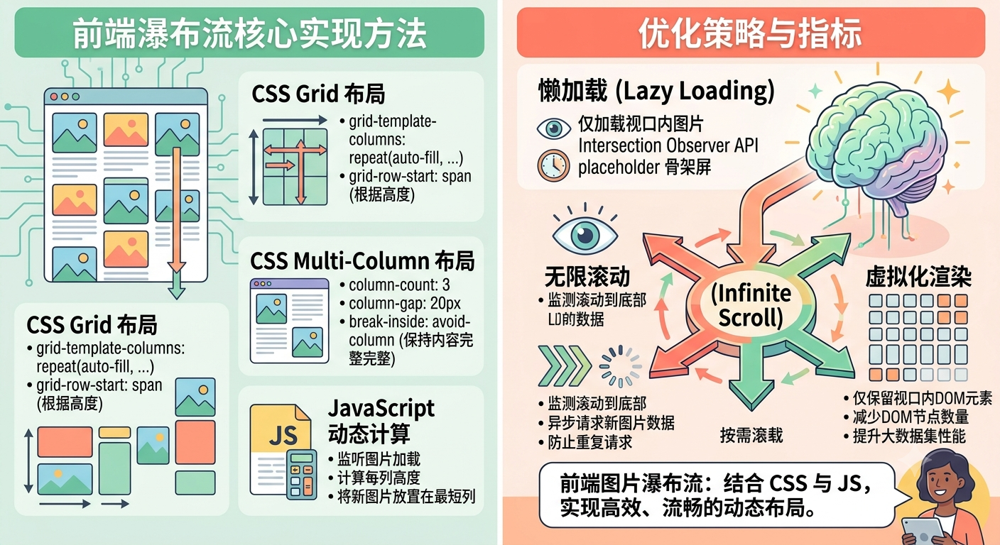
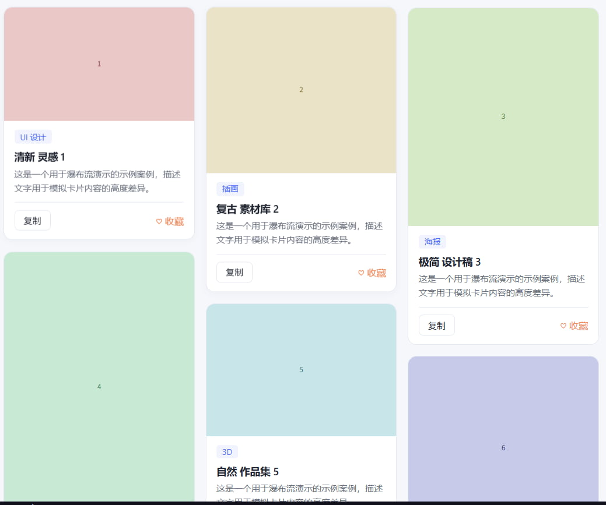

# 图片瀑布流是如何实现的？

> 面向读者：前端初学者 / 想理解瀑布流原理的开发者。
>
> 本文配套一个**可直接在浏览器打开运行的演示页** `瀑布流预览演示.html`(在文章的末尾)，讲解内容与演示代码逐行对应，建议边看边改。



## 一、什么是瀑布流

瀑布流（Masonry / Waterfall）是一种图片/卡片布局：

- 页面分成多列，内容从上到下排列；
- 各列高度**不强制相等**，卡片按"哪里矮往哪里放"的原则分配；
- 视觉上就像水流一层层往下淌，因此得名。

它常见于图片社区、电商商品墙、灵感素材站等。典型代表：Pinterest（最早推广）、花瓣网、Behance 等。

瀑布流要解决的核心问题只有一个：**如何把一堆高度不等的卡片塞进 N 列，让每一列都尽量填满、不留下大段空白。** 演示页里每张封面图的高度都在 300~800px 之间波动，正是为了模拟这种"高矮不一"的真实素材。




## 二、业界有哪些主流实现方案

动手写代码前，先盘点市面上的主流做法，方便对比。按"复杂度"从低到高排序：

### 方案 A：CSS 多列（`columns`）

```css
.masonry {
  column-count: 3;          /* 分成 3 列 */
  column-gap: 15px;         /* 列间距 */
}
.card {
  break-inside: avoid;      /* 防止卡片被拦腰截断 */
  margin-bottom: 15px;
}
```

- 优点：**代码极简**，几行 CSS 搞定，无需任何 JS。
- 缺点：
  1. 卡片默认**按行排列**，顺序是"先横着填满第一行，再第二行"，而瀑布流期望"先竖着填满第一列"。排序语义不同，最新内容不一定出现在顶部前列。
  2. 对卡片内部交互（如 hover 效果、点击区域）处理麻烦。
  3. 列数与卡片真实高度不好精细控制。

### 方案 B：JS 计算绝对定位

用 JS 测量每张卡片真实高度，然后手动设置每张卡片的 `top` / `left` 坐标，绝对定位摆放。

- 优点：最自由，像素级精确。
- 缺点：需要等待图片/内容加载完再测量，容易**跳动闪烁**；滚动时大量 DOM 需要同步计算，性能开销大；代码量最大。

### 方案 C：网格列 + 列高贪心分配（本项目所用）

外层用 `CSS Grid` 分成 N 列，每列是一个普通纵向容器；然后用 JS 把卡片**分配**到各个列里，分配依据是"预估的列高"。

- 优点：
  - 顺序语义可控（可让最新内容横排顶部）；
  - 用**估算高度**而非真实测量，无闪烁、性能好；
  - 每个列就是普通容器，卡片交互、hover 完全不受影响；
  - 响应式切列数非常自然（改一个 Grid 模板列数即可）。
- 缺点：高度是"估算"的，如果估算公式与真实卡片高度偏差大，均衡效果会打折。

### 方案 D：现成组件库

如 `masonry-layout`、`react-masonry-css`、`masonry.js` 等。本质是上面某几种方案的封装，开箱即用。


## 三、跟着演示页一步步实现

演示页 `docs/瀑布流预览演示.html` 采用**方案 C：CSS Grid 多列 + JS 列高贪心分配**。下面按"思考顺序"讲清楚，每段都对应 HTML 里的真实代码。

### 3.1 第一步：决定分几列（响应式）

先根据屏幕宽度决定列数：手机 1 列、平板 2 列、桌面 3 列。

```js
function getMasonryColumnCount() {
  if (typeof window === 'undefined') return 3;                     // SSR 时兜底
  if (window.matchMedia('(max-width: 760px)').matches) return 1;   // 手机 1 列
  if (window.matchMedia('(max-width: 860px)').matches) return 2;   // 平板 2 列
  return 3;                                                        // 桌面 3 列
}
```

- 结果存进变量 `columnCount`，并监听 `resize` 事件，拖动窗口时列数实时变化。
- 每次列数变化，就更新外层 Grid 的类名 `caseGridColumns1/2/3`，对应不同的 `grid-template-columns`：

```scss
.caseGridColumns3 { grid-template-columns: repeat(3, minmax(0, 1fr)); }
.caseGridColumns2 { grid-template-columns: repeat(2, minmax(0, 1fr)); }
.caseGridColumns1 { grid-template-columns: 1fr; }
```

> 小知识点：`matchMedia().matches` 比 `window.innerWidth` 更贴近 CSS 断点语义，且能避免"内外宽度不一致"的经典坑。

### 3.2 第二步：预估每张卡片的高度

瀑布流要"填平"各列，就必须知道每张卡片大概多高。演示页不测量真实高度，而是**按公式估算**：

```js
// 估算列宽：容器约 1240px，减左右留白与列间距后均分
function estimateColumnWidth(columnCount) {
  const usableWidth = 1200 - (columnCount - 1) * 15;
  return Math.floor(usableWidth / columnCount);
}

// 估算单个卡片高度：封面图（列宽 × 图片宽高比）+ 固定底座
function estimateCaseStackHeight(item, columnWidth) {
  const coverHeight = columnWidth * (item.imgH / item.imgW);
  const FIXED_BODY_HEIGHT = 196;   // 标签 + 标题 + 描述 + 按钮 + 内边距
  return coverHeight + FIXED_BODY_HEIGHT;
}
```

估算公式 = **封面图高度（列宽 × 图片宽高比）+ 固定底座 196px**。

这里有个和原版项目的差异，值得注意：

- 本项目（`src/views/HomePage.tsx`）所有封面统一 `aspect-ratio: 4/5`，所以估算写死成「列宽 × 5/4」。
- 演示页为了体现高低错落，封面高度随每张图真实宽高比变化，所以改成「列宽 × 每张图的高宽比」——估算必须和真实渲染一致，否则"均衡"就是假的。

### 3.3 第三步：把卡片分到各列（贪心均衡）—— 核心算法

有了高度估算，就能做分配了。算法思路一句话：**最新的几张横排顶部，其余的"哪儿矮往哪儿放"。**

```js
function distributeCasesIntoColumns(caseItems, columnCount) {
  const columns = Array.from({ length: columnCount }, () => []);
  const columnHeights = Array.from({ length: columnCount }, () => 0);  // 各列累计估算高度
  const columnWidth = estimateColumnWidth(columnCount);

  caseItems.forEach((item, index) => {
    // 前 columnCount 个（最新）案例先各占一列顶部
    const targetColumn = index < columnCount ? index : findShortestColumn(columnHeights);
    columns[targetColumn].push(item);
    columnHeights[targetColumn] += estimateCaseStackHeight(item, columnWidth);
  });
  return columns;
}
```

辅助函数 `findShortestColumn` 找出当前累计高度最矮的列：

```js
function findShortestColumn(columnHeights) {
  let shortest = 0;
  for (let i = 1; i < columnHeights.length; i += 1) {
    if (columnHeights[i] < columnHeights[shortest]) shortest = i;
  }
  return shortest;
}
```

**为什么"前 N 个先各占一列顶部"？**
因为瀑布流期望最新内容最醒目。如果全部按"最矮列"分配，最新的案例可能全堆在第一列。所以先强制前 N 条横铺顶部，之后才进入均衡模式。这是"均衡"和"内容优先级"之间的取舍。

**为什么叫"贪心"？**
每一步只挑"当前最矮的列"放进去，不看全局最优，这就是典型的贪心策略（Greedy）。它不求完美等高，但计算快、效果稳定，足够好看。

### 3.4 第四步：渲染到网格里

分配完的二维数组 `columns`，渲染成「外层 Grid 分 N 列 + 每列一个纵向容器」：

```js
function renderColumns() {
  const loaded = allItems.slice(0, (currentPage + 1) * PAGE_SIZE);   // 当前已加载的数据
  const columns = distributeCasesIntoColumns(loaded, columnCount);   // 分列

  gallery.innerHTML = '';
  columns.forEach((columnCases, i) => {
    const col = document.createElement('div');
    col.className = 'caseColumn';                                     // 每列一个纵向容器
    columnCases.forEach((item) => col.appendChild(createCard(item))); // 列内排卡片
    gallery.appendChild(col);
  });
}
```

对应的样式（`docs/瀑布流预览演示.html` 的 `<style>`）：

```scss
.caseGrid {
  display: grid;
  align-items: start;        // 各列顶部对齐
  gap: 15px;
}
.caseColumn {
  display: grid;
  align-content: start;      // 列内卡片从顶部排布
  gap: 15px;
  min-width: 0;
}
```

结构关系是：

```
.caseGrid（外层 Grid，分 N 列）
  └── .caseColumn（第 1 列，纵向排列卡片）
  └── .caseColumn（第 2 列，纵向排列卡片）
  └── .caseColumn（第 3 列，纵向排列卡片）
```


## 四、配合瀑布流的两个重要细节

### 4.1 图片懒加载 + 高度稳定

瀑布流图片多，必须懒加载。演示页的卡片这样创建图片：

```js
const img = document.createElement('img');
img.className = 'cover';
img.src = makeCoverUrl(item);   // 用 SVG 占位图模拟真实图片，无需外网
img.alt = item.title;
img.loading = 'lazy';           // 滚动到附近才真正加载
img.decoding = 'async';         // 异步解码，不阻塞主线程
```

配套的样式关键点：封面设 `height: auto`，**高度由图片自身宽高比决定**，从而形成高低错落：

```scss
.cover {
  display: block;
  width: 100%;
  height: auto;      /* 高度随真实图片宽高比变化，形成瀑布流错落感 */
  object-fit: cover;
  background: #eef1f7;  /* 加载前的占位底色 */
}
```

> 原版项目更进一步：封面用 `aspect-ratio: 4/5` 在加载前**占住固定高度**，防止列塌陷、页面跳动。这是"高度估算能成立"的前提。演示页因要体现错落感，改成了随图片自适应，两者各有适用场景。

### 4.2 无限滚动（加载更多）

配合 `IntersectionObserver` 实现"滚到底自动加载下一页"，并提前 480px 预加载：

```js
const observer = new IntersectionObserver(
  (entries) => {
    if (entries[0].isIntersecting) loadMoreCases();
  },
  { root: null, rootMargin: '0px 0px 480px 0px', threshold: 0 }  // 提前 480px 触发
);
observer.observe(loadMoreTrigger);   // 监听页面底部一个不可见的"哨兵"元素
```

每次加载一页（24 条），追加后重新分列渲染。另外还有一个「加载更多」按钮兜底，避免个别浏览器 `IntersectionObserver` 失效时无法继续加载。

> 演示页踩到的一个坑（已修复）：首屏内容不足一屏时，哨兵一开始就在视口内，无限滚动会连续触发把数据一次性全加载完。解决办法是给 `loadMoreCases` 加一把 `isLoadingMore` 锁，渲染完成（下一帧）后才允许再次触发。

---
## 五、这套方案是主流的吗？

**是，而且是目前工程上相当主流且推荐的做法。**

业界当前的主流共识可以这样概括：

| 方案 | 使用场景 | 主流程度 |
|------|----------|----------|
| CSS `columns` | 简单展示、顺序不重要 | 常用但语义受限 |
| JS 绝对定位 | 追求像素级精确 | 偏重、用得少 |
| **Grid 多列 + 列高贪心分配** | **通用生产项目** | **主流推荐** |
| 现成组件库 | 快速接入、不想手写 | 常见（本质多为方案 C） |

本项目采用的**「CSS Grid 分列 + JS 预估高度贪心分配」**，正是 Pinterest 系瀑布流社区总结出来的、兼顾「顺序可控、性能好、交互友好、响应式自然」的主流工程方案。很多开源库（如 `react-masonry-css`）底层思路与此一致，只是把分配逻辑封装成了组件。

相比极简的 CSS `columns`，它多了一点 JS 代码，但换来了：
1. **最新内容可置于顶部前列**（内容运营价值）；
2. **列高更均衡**，视觉不突兀；
3. **卡片交互无副作用**，hover/点击体验正常；
4. **切列数只改模板列**，响应式零成本。

相比纯 JS 绝对定位，它**不需要测量真实高度**，因此没有闪烁、性能更优。

**一句话总结**：这套方案是"主流"的，而且在**「内容有优先级 + 需要响应式 + 追求性能」**的场景下，属于最优解之一。


## 六、给想要借鉴的同学：踩坑提醒

1. **高度估算公式必须与真实卡片样式强绑定。**
   估算的封面高度、底座高度，必须和实际渲染出来的卡片高度一致，否则"均衡"就是假的。原版项目改封面 `aspect-ratio` 或卡片内边距时，**必须同步改 `estimateCaseStackHeight` 里的常量**（演示页则是按每张图真实比例估算）。

2. **封面图尽量有稳定高度占位（`aspect-ratio`）。**
   没有占位高度，图片加载过程中列会反复跳动。若你想追求错落感而自适应高度，也要接受首屏可能略有跳动。

3. **内容顺序 vs 列均衡的取舍要想清楚。**
   "前 N 条横排顶部"是本项目的业务取舍。如果你只想追求极致等高，把前 N 条也交给贪心逻辑即可。没有绝对正确，取决于产品诉求。

4. **懒加载和无限滚动是瀑布流的"标配"。**
   图片多、列表长，这两样不做好，再好的布局也是白搭。无限滚动要留意"首屏不足一屏时的连发加载"问题（见 4.2）。


## 七、相关代码位置速查

| 内容 | 演示页位置 | 原版项目位置 |
|------|-----------|-------------|
| 响应式列数 | `getMasonryColumnCount` | `src/views/HomePage.tsx` 同名函数 |
| 贪心分列主算法 | `distributeCasesIntoColumns` | 同名函数 |
| 找最矮列 | `findShortestColumn` | 同名函数 |
| 估算列宽 / 卡片高 | `estimateColumnWidth` / `estimateCaseStackHeight` | 同名函数 |
| Grid 网格样式 | `<style>` 里的 `.caseGrid` / `.caseColumn` | `src/views/HomePage.module.scss` |
| 卡片 + 懒加载 | `createCard` | `src/components/cases/CaseCard.tsx` |
| 无限滚动 hook | `IntersectionObserver` 段 | `src/hooks/useCases.ts` |
| 图片按需缩放 | （演示用 SVG 占位图） | `src/utils/imageUrl.ts` |


## 八、案例源码

```html
<!DOCTYPE html>
<html lang="zh-CN">
<head>
  <meta charset="UTF-8" />
  <meta name="viewport" content="width=device-width, initial-scale=1.0" />
  <title>瀑布流方案预览 - 参考 Prompt Gallery Studio</title>
  <style>
    /* =========================================================
       瀑布流演示：参考项目「CSS Grid 多列 + JS 列高贪心分配」方案
       src/views/HomePage.tsx + HomePage.module.scss
       ========================================================= */

    :root {
      /* 参考项目 globals.scss 主题变量：冷白基底 + 靛蓝主色 */
      --page-background: #f5f7fb;
      --card-background: #ffffff;
      --color-primary: #4f6ef7;
      --color-text: #1f2430;
      --color-text-secondary: #6b7280;
      --color-border: #e5e9f2;
      --color-accent: #f08a5d;
      --gap: 15px;
    }

    * {
      box-sizing: border-box;
      margin: 0;
      padding: 0;
    }

    body {
      font-family: -apple-system, BlinkMacSystemFont, "Segoe UI", "PingFang SC",
        "Microsoft YaHei", sans-serif;
      background: var(--page-background);
      color: var(--color-text);
      padding: 24px 20px 80px;
    }

    /* ---------- 头部说明 ---------- */
    .header {
      max-width: 1240px;
      margin: 0 auto 24px;
      padding: 20px 24px;
      background: var(--card-background);
      border: 1px solid var(--color-border);
      border-radius: 12px;
    }
    .header h1 {
      font-size: 20px;
      margin-bottom: 8px;
    }
    .header p {
      color: var(--color-text-secondary);
      font-size: 13px;
      line-height: 1.7;
    }
    .badge {
      display: inline-block;
      margin: 6px 8px 0 0;
      padding: 3px 10px;
      border-radius: 999px;
      background: rgba(79, 110, 247, 0.1);
      color: var(--color-primary);
      font-size: 12px;
      font-weight: 600;
    }
    .column-count-label {
      float: right;
      font-size: 13px;
      color: var(--color-text-secondary);
    }

    /* ---------- 瀑布流核心样式（对应 HomePage.module.scss） ---------- */
    .caseGrid {
      display: grid;
      align-items: start;      /* 各列顶部对齐 */
      gap: var(--gap);
    }
    .caseGridColumns3 { grid-template-columns: repeat(3, minmax(0, 1fr)); }
    .caseGridColumns2 { grid-template-columns: repeat(2, minmax(0, 1fr)); }
    .caseGridColumns1 { grid-template-columns: 1fr; }

    .caseColumn {
      display: grid;
      align-content: start;    /* 列内卡片从顶部排布 */
      gap: var(--gap);
      min-width: 0;
    }

    /* ---------- 卡片（对应 CaseCard） ---------- */
    .card {
      background: var(--card-background);
      border: 1px solid var(--color-border);
      border-radius: 12px;
      overflow: hidden;
      transition: transform 0.15s ease, box-shadow 0.15s ease;
    }
    .card:hover {
      transform: translateY(-3px);
      box-shadow: 0 8px 24px rgba(31, 36, 48, 0.08);
    }
    .cover {
      display: block;
      width: 100%;
      height: auto;
      /* 瀑布流演示：不再强制固定比例，让封面高度随真实图片宽高比变化，
         从而形成高低错落的瀑布流效果 */
      object-fit: cover;
      background: #eef1f7;   /* 占位底色 */
    }
    .body {
      padding: 12px 14px;
    }
    .tags {
      display: flex;
      flex-wrap: wrap;
      gap: 6px;
      margin-bottom: 8px;
    }
    .tag {
      font-size: 11px;
      padding: 2px 8px;
      border-radius: 4px;
      background: rgba(79, 110, 247, 0.08);
      color: var(--color-primary);
    }
    .title {
      font-size: 14px;
      font-weight: 600;
      line-height: 1.4;
      margin-bottom: 4px;
    }
    .desc {
      font-size: 12px;
      color: var(--color-text-secondary);
      line-height: 1.6;
      margin-bottom: 10px;
    }
    .actions {
      display: flex;
      align-items: center;
      justify-content: space-between;
      padding-top: 10px;
      border-top: 1px solid var(--color-border);
    }
    .btn {
      font-size: 12px;
      border: 1px solid var(--color-border);
      border-radius: 6px;
      padding: 5px 12px;
      background: #fff;
      color: var(--color-text);
      cursor: pointer;
      transition: background 0.15s ease;
    }
    .btn:hover {
      background: var(--color-primary);
      border-color: var(--color-primary);
      color: #fff;
    }
    .favorite {
      color: var(--color-accent);
      cursor: pointer;
      user-select: none;
    }

    /* ---------- 加载更多（对应 loadMoreBar） ---------- */
    .loadMoreBar {
      max-width: 1240px;
      margin: 24px auto 0;
      display: flex;
      align-items: center;
      justify-content: center;
      gap: 12px;
      color: var(--color-text-secondary);
      font-size: 13px;
    }
    .loadMoreBtn {
      font-size: 13px;
      border: none;
      border-radius: 8px;
      padding: 10px 28px;
      background: var(--color-primary);
      color: #fff;
      cursor: pointer;
    }
    .loadMoreBtn:hover {
      opacity: 0.9;
    }
    .loadMoreBtn:disabled {
      opacity: 0.6;
      cursor: not-allowed;
    }

    /* 底部哨兵：不可见，供 IntersectionObserver 监听 */
    .loadMoreTrigger {
      height: 1px;
    }
  </style>
</head>
<body>

  <header class="header">
    <h1>瀑布流方案预览（参考本项目）</h1>
    <p>
      外层用 <b>CSS Grid</b> 按响应式列数分成 N 列，每列是纵向容器；
      再用 <b>JS 贪心算法</b>（最新 N 条横排顶部 + 其余放进当前最矮列）把卡片分配到各列，
      并用「列宽 × 图片宽高比 + 固定底座」<b>估算高度</b> 保证各列均衡。
      这里的封面图高度各不相同，正好形成高低错落的瀑布流。
      拖动窗口宽度，观察列数在 1 / 2 / 3 之间切换。
    </p>
    <span class="badge">CSS Grid 多列</span>
    <span class="badge">列高贪心分配</span>
    <span class="badge">aspect-ratio 占位防塌陷</span>
    <span class="badge">IntersectionObserver 无限滚动</span>
    <span class="column-count-label" id="columnCountLabel">当前 3 列</span>
  </header>

  <main id="gallery" class="caseGrid caseGridColumns3"></main>

  <div class="loadMoreBar">
    <button id="loadMoreBtn" class="loadMoreBtn">加载更多案例</button>
    <span id="countLabel">已显示 0 / 0</span>
  </div>
  <div id="loadMoreTrigger" class="loadMoreTrigger"></div>

  <script>
    /* =========================================================
       一、模拟数据（与项目用例一致：标题、标签、描述、宽高不同的封面）
       ========================================================= */
    const TAGS = ['UI 设计', '插画', '海报', '电商', '3D', '品牌', '动效', '字体'];
    const ADJ = ['清新', '复古', '极简', '赛博朋克', '自然', '几何', '手绘', '渐变'];
    const NOUN = ['灵感', '素材库', '设计稿', '案例', '作品集', '概念图', '情绪板', '海报'];

    // 用随机宽高比生成占位图，模拟真实瀑布流里"高矮不一"的卡片
    function makeMockItem(index) {
      const w = 500;
      // 高度在 300 ~ 800 之间大幅波动，让每张封面宽高比差异明显，
      // 渲染出来就是高低错落的瀑布流效果
      const h = 300 + ((index * 137) % 501);
      return {
        id: index,
        title: ADJ[index % ADJ.length] + ' ' + NOUN[index % NOUN.length] + ' ' + (index + 1),
        desc: '这是一个用于瀑布流演示的示例案例，描述文字用于模拟卡片内容的高度差异。',
        tag: TAGS[index % TAGS.length],
        imgW: w,
        imgH: h,
      };
    }

    // 模拟"分页加载"：每次追加一批
    const PAGE_SIZE = 24;
    const TOTAL = 96;   // 模拟总共 96 条
    const allItems = Array.from({ length: TOTAL }, (_, i) => makeMockItem(i));

    /* =========================================================
       二、瀑布流核心逻辑（对应 HomePage.tsx 的四个函数）
       ========================================================= */

    // 2.1 响应式列数：手机 1 列、平板 2 列、桌面 3 列
    function getMasonryColumnCount() {
      if (typeof window === 'undefined') return 3;
      if (window.matchMedia('(max-width: 760px)').matches) return 1;
      if (window.matchMedia('(max-width: 860px)').matches) return 2;
      return 3;
    }

    // 2.2 估算列宽：容器约 1240px，减左右留白与列间距后均分
    function estimateColumnWidth(columnCount) {
      const usableWidth = 1200 - (columnCount - 1) * 15;
      return Math.floor(usableWidth / columnCount);
    }

    // 2.3 估算单个卡片高度：封面图（列宽 × 图片宽高比）+ 固定底座
    // 本项目用固定 aspect-ratio 4:5，故为「列宽 × 5/4」；
    // 本演示因为图片高度各不相同，改成按真实宽高比估算，列均衡才准确
    function estimateCaseStackHeight(item, columnWidth) {
      const coverHeight = columnWidth * (item.imgH / item.imgW);
      const FIXED_BODY_HEIGHT = 196;
      return coverHeight + FIXED_BODY_HEIGHT;
    }

    // 2.4 找当前累计高度最矮的列
    function findShortestColumn(columnHeights) {
      let shortest = 0;
      for (let i = 1; i < columnHeights.length; i += 1) {
        if (columnHeights[i] < columnHeights[shortest]) shortest = i;
      }
      return shortest;
    }

    // 2.5 贪心分列主算法：最新 N 条横排顶部，其余放进最矮列
    function distributeCasesIntoColumns(caseItems, columnCount) {
      const columns = Array.from({ length: columnCount }, () => []);
      const columnHeights = Array.from({ length: columnCount }, () => 0);
      const columnWidth = estimateColumnWidth(columnCount);

      caseItems.forEach((item, index) => {
        const targetColumn = index < columnCount ? index : findShortestColumn(columnHeights);
        columns[targetColumn].push(item);
        columnHeights[targetColumn] += estimateCaseStackHeight(item, columnWidth);
      });
      return columns;
    }

    /* =========================================================
       三、渲染
       ========================================================= */
    const gallery = document.getElementById('gallery');
    const countLabel = document.getElementById('countLabel');
    const columnCountLabel = document.getElementById('columnCountLabel');
    const loadMoreBtn = document.getElementById('loadMoreBtn');
    const loadMoreTrigger = document.getElementById('loadMoreTrigger');

    let currentPage = 0;                 // 已加载到第几页
    let columnCount = getMasonryColumnCount();

    // 生成占位图 URL（纯 SVG，宽高可调，避免依赖网络图片）
    function makeCoverUrl(item) {
      const hue = (item.id * 47) % 360;
      const svg =
        `<svg xmlns='http://www.w3.org/2000/svg' width='${item.imgW}' height='${item.imgH}'>` +
        `<rect width='100%' height='100%' fill='hsl(${hue},45%,85%)'/>` +
        `<text x='50%' y='50%' font-size='18' fill='hsl(${hue},45%,35%)' text-anchor='middle'` +
        ` dominant-baseline='middle'>${item.id + 1}</text></svg>`;
      return 'data:image/svg+xml;charset=utf-8,' + encodeURIComponent(svg);
    }

    function createCard(item) {
      const card = document.createElement('article');
      card.className = 'card';

      // 封面：loading="lazy" 懒加载 + aspect-ratio 占位高度
      const img = document.createElement('img');
      img.className = 'cover';
      img.src = makeCoverUrl(item);
      img.alt = item.title;
      img.loading = 'lazy';
      img.decoding = 'async';

      const body = document.createElement('div');
      body.className = 'body';
      body.innerHTML =
        `<div class="tags"><span class="tag">${item.tag}</span></div>` +
        `<div class="title">${item.title}</div>` +
        `<div class="desc">${item.desc}</div>` +
        `<div class="actions">` +
        `  <button class="btn" onclick="alert('示例：复制提示词')">复制</button>` +
        `  <span class="favorite" onclick="this.textContent=this.textContent==='♡ 收藏'?'♥ 已收藏':'♡ 收藏'">♡ 收藏</span>` +
        `</div>`;

      card.appendChild(img);
      card.appendChild(body);
      return card;
    }

    // 把二维列数组渲染到 DOM
    function renderColumns() {
      // 只重新渲染当前已加载的数据
      const loaded = allItems.slice(0, (currentPage + 1) * PAGE_SIZE);
      const columns = distributeCasesIntoColumns(loaded, columnCount);

      gallery.innerHTML = '';
      columns.forEach((columnCases, i) => {
        const col = document.createElement('div');
        col.className = 'caseColumn';
        columnCases.forEach((item) => col.appendChild(createCard(item)));
        gallery.appendChild(col);
      });

      countLabel.textContent = `已显示 ${loaded.length} / ${TOTAL}`;
      loadMoreBtn.disabled = loaded.length >= TOTAL;
    }

    // 加载下一页（isLoadingMore 防止无限滚动在首屏不足一屏时连续触发
    // 导致一次性加载到底）
    let isLoadingMore = false;
    function loadMoreCases() {
      if (isLoadingMore) return;
      if ((currentPage + 1) * PAGE_SIZE >= TOTAL) return;
      isLoadingMore = true;
      currentPage += 1;
      renderColumns();
      // 渲染完成后重新打开，允许下次触发
      requestAnimationFrame(() => {
        isLoadingMore = false;
      });
    }

    /* =========================================================
       四、事件：resize 切列数 + 无限滚动（IntersectionObserver）
       ========================================================= */
    function handleResize() {
      const next = getMasonryColumnCount();
      if (next === columnCount) return;
      columnCount = next;

      // 切换列数：更新 Grid 类名（对应 caseGridColumns1/2/3）
      gallery.className = 'caseGrid caseGridColumns' + columnCount;
      columnCountLabel.textContent = `当前 ${columnCount} 列`;
      renderColumns();
    }
    window.addEventListener('resize', handleResize);

    // 同步列数与 Grid 类名（首次进入页面调用，保证首屏立即渲染）
    function syncColumnClass() {
      columnCount = getMasonryColumnCount();
      gallery.className = 'caseGrid caseGridColumns' + columnCount;
      columnCountLabel.textContent = `当前 ${columnCount} 列`;
      renderColumns();
    }

    // 无限滚动：哨兵进入视口（提前 480px）即加载下一页
    const observer = new IntersectionObserver(
      (entries) => {
        if (entries[0].isIntersecting) loadMoreCases();
      },
      { root: null, rootMargin: '0px 0px 480px 0px', threshold: 0 }
    );
    observer.observe(loadMoreTrigger);

    loadMoreBtn.addEventListener('click', loadMoreCases);

    // 初始化：首次进入立即渲染首屏（不能用 handleResize，因其对相同列数会直接 return）
    syncColumnClass();
  </script>
</body>
</html>

```
