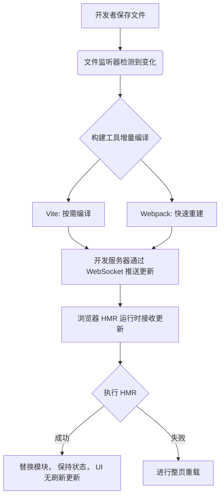

# 前端本地开发构建和更新的过程

[[toc]]

## 一、开发环境启动时发生了什么？

当你运行 `npm run dev` 的时候，本质上经历了以下几个阶段：

### 1. Node 进程启动

- Vite/webpack 的 CLI 命令启动一个 Node 进程。
- Node 读取 `vite.config.js` 或 `webpack.config.js` 配置。
- 创建一个 **Dev Server**（底层一般用 `http` + `koa`/`express`）。

### 2. 依赖预构建（仅 Vite）

- Vite 会用 `esbuild` 把 `node_modules` 里的依赖（react、react-dom、lodash…）快速预编译成 ESM 格式。
- 为什么要预构建？

  - `node_modules` 里通常是 CommonJS，浏览器不能直接跑。
  - 避免浏览器发太多 `import` 请求，合并成少量 bundle。

- 结果会缓存到 `node_modules/.vite/`。

### 3. 启动本地服务

- 服务监听在 `http://localhost:5173`（端口可配）。
- 提供：

  - 静态文件服务（HTML、图片、字体）。
  - 模块转换服务（JSX/TS → JS）。
  - HMR WebSocket 服务（实时更新通知）。

## 二、浏览器请求资源时发生了什么？

当你打开 `http://localhost:5173`：

### 1. HTML 响应

- 浏览器先请求 `/index.html`。
- Dev Server 拦截并可能注入一些运行时代码（如 HMR 脚本）。
- 浏览器解析到：

  ```html
  <script type="module" src="/src/main.jsx"></script>
  ```

### 2. 模块请求

- 浏览器会去请求 `/src/main.jsx`。
- Dev Server 发现这是源码文件 → 走插件链处理：

  - 解析 JSX → `React.createElement`
  - 如果是 TS → 去掉类型注解
  - 替换 `import.meta.env` → 注入环境变量

- 返回一个浏览器能执行的 ESM 脚本。

例如你写的：

```jsx
import React from "react";
const App = () => <h1>Hello</h1>;
export default App;
```

Vite 转换后可能变成：

```js
import React from "/node_modules/.vite/deps/react.js";
const App = () => React.createElement("h1", null, "Hello");
export default App;
```

### 3. 依赖加载

- 如果脚本里有 `import React from 'react'`，浏览器会发请求 `/node_modules/.vite/deps/react.js`。
- 这个文件是 Vite **预构建**好的，直接返回。

这样，整个应用就在浏览器里运行起来了。

## 三、更新代码时发生了什么？（HMR 流程）

当你修改 `App.jsx` 里的内容，比如：

```jsx
<h1>Hello</h1> → <h1>Hello World!</h1>
```

会发生：

### 1. 文件系统监听

- Dev Server 内部用 `chokidar` 监听文件变动。
- 一旦 `App.jsx` 变了 → 触发编译。

### 2. 增量编译

- Vite 用 `esbuild` 或 babel 插件只重新编译变动的文件。
- 不会重新打整个包（这是 webpack 慢的原因）。

### 3. HMR 消息推送

- Dev Server 通过 **WebSocket** 向浏览器发送消息：

  ```json
  { "type": "update", "path": "/src/App.jsx" }
  ```

### 4. 浏览器执行模块热替换

- 浏览器的 Vite runtime 收到消息。
- 它会请求 `/src/App.jsx` 最新编译结果。
- 只替换该模块，并触发 React Fast Refresh：

  - UI 会更新
  - 组件 state 不会丢失

## 四、生产构建时的不同点

运行：

```bash
npm run build
```

流程和开发完全不同：

1. **全量打包**

   - Vite 内部调用 Rollup，把所有模块打成 bundle。
   - 生成 hash 文件名（`app.abc123.js`），防止缓存污染。

2. **代码优化**

   - Tree-shaking（移除没用的代码）。
   - Scope hoisting（减少闭包层级）。
   - 压缩（Terser/Esbuild）。

3. **产物输出**

   - `dist/` 目录：

     ```
     dist/
     ├── index.html
     ├── assets/
     │   ├── index-xxxx.js
     │   ├── vendor-xxxx.js
     │   └── style-xxxx.css
     ```

## 五、与 webpack 对比

| 特性     | Vite                       | webpack                  |
| -------- | -------------------------- | ------------------------ |
| 开发启动 | 秒级（原生 ESM + esbuild） | 慢（需要先打 bundle）    |
| 更新速度 | 增量更新，几乎秒级         | HMR 需要 rebuild，慢     |
| 依赖处理 | esbuild 预构建             | babel/ts-loader 全量编译 |
| 打包器   | Rollup                     | webpack 本身             |
| 插件生态 | 新但增长快                 | 成熟，功能强大           |

## 六、流程图


