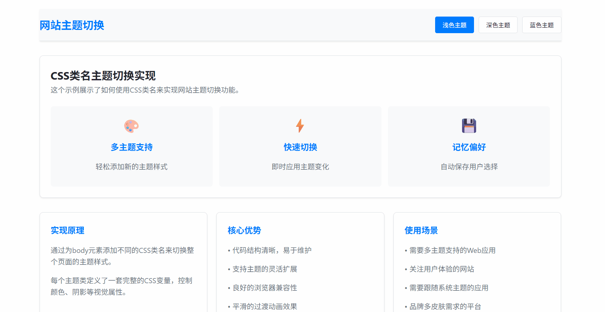

# 网站主题切换原理与实践：CSS 类名切换方案

[[toc]]

在现代 Web 开发中，为用户提供主题切换功能已经成为提升用户体验的重要方式。无论是浅色/深色主题切换，还是多色彩主题选择，都能让用户根据自己的偏好和环境选择最舒适的界面。

**实现效果**



## 一、核心原理

主题切换的核心原理是通过改变 HTML 元素的 CSS 类名，从而应用不同的样式规则。具体来说：

1. **定义多个主题样式**：为每个主题创建对应的 CSS 类
2. **动态切换类名**：使用 JavaScript 在运行时切换 HTML 元素的类名
3. **样式级联应用**：利用 CSS 的级联特性，新类名的样式会覆盖默认样式

## 二、实现方案

### 1. CSS 主题定义

首先，我们为每个主题定义一套完整的 CSS 变量：

```css
/* 浅色主题 */
.theme-light {
  --primary-bg: #ffffff;
  --secondary-bg: #f8f9fa;
  --primary-text: #212529;
  --accent-color: #007bff;
  --border-color: #dee2e6;
}

/* 深色主题 */
.theme-dark {
  --primary-bg: #121212;
  --secondary-bg: #1e1e1e;
  --primary-text: #e9ecef;
  --accent-color: #4dabf7;
  --border-color: #495057;
}

/* 应用主题变量 */
body {
  background-color: var(--primary-bg);
  color: var(--primary-text);
  transition: all 0.3s ease;
}
```

### 2. HTML 结构

在 HTML 中，我们设置默认主题并创建主题切换控件：

```html
<body class="theme-light">
  <header>
    <div class="theme-switcher">
      <button class="theme-btn active" data-theme="theme-light">浅色</button>
      <button class="theme-btn" data-theme="theme-dark">深色</button>
    </div>
  </header>
  <!-- 页面内容 -->
</body>
```

### 3. JavaScript 切换逻辑

实现主题切换的核心 JavaScript 代码：

```javascript
class ThemeManager {
  constructor() {
    this.body = document.body;
    this.themeButtons = document.querySelectorAll(".theme-btn");
    this.init();
  }

  init() {
    // 加载保存的主题
    this.loadTheme();
    // 绑定事件
    this.bindEvents();
    // 监听系统主题变化
    this.watchSystemTheme();
  }

  bindEvents() {
    this.themeButtons.forEach((button) => {
      button.addEventListener("click", (e) => {
        const theme = e.target.dataset.theme;
        this.setTheme(theme);
      });
    });
  }

  setTheme(theme) {
    // 移除所有主题类
    this.body.classList.remove("theme-light", "theme-dark");
    // 添加新主题类
    this.body.classList.add(theme);

    // 更新按钮状态
    this.updateButtonStates(theme);

    // 保存到本地存储
    this.saveTheme(theme);
  }

  updateButtonStates(activeTheme) {
    this.themeButtons.forEach((button) => {
      button.classList.toggle("active", button.dataset.theme === activeTheme);
    });
  }

  saveTheme(theme) {
    localStorage.setItem("user-theme", theme);
  }

  loadTheme() {
    const savedTheme = localStorage.getItem("user-theme");
    if (savedTheme) {
      this.setTheme(savedTheme);
    }
  }

  watchSystemTheme() {
    if (window.matchMedia) {
      const mediaQuery = window.matchMedia("(prefers-color-scheme: dark)");

      mediaQuery.addEventListener("change", (e) => {
        // 只有用户没有手动选择时才跟随系统
        if (!localStorage.getItem("user-theme")) {
          this.setTheme(e.matches ? "theme-dark" : "theme-light");
        }
      });
    }
  }
}

// 初始化主题管理器
new ThemeManager();
```

## 三、关键技术细节

### 1. CSS 变量（自定义属性）的使用

CSS 变量让我们能够集中管理主题相关的颜色、间距等值：

```css
:root {
  --transition-duration: 0.3s;
  --border-radius: 8px;
}

.theme-light {
  --primary-bg: #ffffff;
  --text-color: #333333;
}

.theme-dark {
  --primary-bg: #1a1a1a;
  --text-color: #ffffff;
}

.component {
  background: var(--primary-bg);
  color: var(--text-color);
  transition: all var(--transition-duration) ease;
}
```

### 2. 平滑过渡效果

通过 CSS transition 实现主题切换时的平滑动画：

```css
* {
  transition: background-color 0.3s ease, color 0.3s ease, border-color 0.3s ease;
}
```

### 3. 持久化存储

使用 localStorage 保存用户选择，确保刷新页面后主题保持一致：

```javascript
saveTheme(theme) {
    localStorage.setItem('user-theme', theme);
}

loadTheme() {
    return localStorage.getItem('user-theme') || 'theme-light';
}
```

### 4. 系统主题检测

自动检测用户操作系统的主题偏好：

```javascript
watchSystemTheme() {
    if (window.matchMedia) {
        const mediaQuery = window.matchMedia('(prefers-color-scheme: dark)');

        // 初始检测
        if (!localStorage.getItem('user-theme')) {
            this.setTheme(mediaQuery.matches ? 'theme-dark' : 'theme-light');
        }

        // 监听变化
        mediaQuery.addEventListener('change', (e) => {
            if (!localStorage.getItem('user-theme')) {
                this.setTheme(e.matches ? 'theme-dark' : 'theme-light');
            }
        });
    }
}
```

## 四、进阶功能

### 1. 主题扩展性

轻松添加新主题：

```css
.theme-blue {
  --primary-bg: #e3f2fd;
  --accent-color: #2196f3;
  --text-color: #0d47a1;
}

.theme-green {
  --primary-bg: #e8f5e8;
  --accent-color: #4caf50;
  --text-color: #1b5e20;
}
```

### 2. 组件级主题支持

为特定组件设置主题：

```css
.card {
  background: var(--card-bg, var(--secondary-bg));
  border: 1px solid var(--card-border, var(--border-color));
}

.theme-dark .card {
  --card-bg: #2d2d2d;
  --card-border: #404040;
}
```

### 3. 性能优化

避免不必要的重绘和回流：

```javascript
setTheme(theme) {
    // 使用requestAnimationFrame优化性能
    requestAnimationFrame(() => {
        this.body.classList.remove(...this.body.classList);
        this.body.classList.add(theme);
    });
}
```

## 五、最佳实践

1. **渐进增强**：确保在没有 JavaScript 的情况下，默认主题仍能正常工作
2. **无障碍访问**：为主题切换按钮提供适当的 ARIA 标签
3. **性能考虑**：避免在主题切换时进行复杂的 DOM 操作
4. **测试覆盖**：在不同设备和浏览器上测试主题切换功能
5. **用户反馈**：在切换主题时提供视觉反馈

## 案例源码

```html
<!DOCTYPE html>
<html lang="zh-CN">
  <head>
    <meta charset="UTF-8" />
    <meta name="viewport" content="width=device-width, initial-scale=1.0" />
    <title>CSS类名主题切换</title>
    <style>
      /* 基础样式 */
      * {
        margin: 0;
        padding: 0;
        box-sizing: border-box;
        /* 实现颜色的过渡效果 */
        transition: background-color 0.3s ease, color 0.3s ease, border-color 0.3s ease;
      }

      body {
        font-family: "Segoe UI", Tahoma, Geneva, Verdana, sans-serif;
        line-height: 1.6;
        background-color: #ffffff;
        color: #333333;
      }

      .container {
        max-width: 1200px;
        margin: 0 auto;
        padding: 20px;
      }

      /* 浅色主题 - 默认 */
      .theme-light {
        --primary-bg: #ffffff;
        --secondary-bg: #f8f9fa;
        --primary-text: #212529;
        --secondary-text: #6c757d;
        --accent-color: #007bff;
        --border-color: #dee2e6;
        --card-bg: #ffffff;
        --shadow: 0 0.125rem 0.25rem rgba(0, 0, 0, 0.075);
      }

      /* 深色主题 */
      .theme-dark {
        --primary-bg: #121212;
        --secondary-bg: #1e1e1e;
        --primary-text: #e9ecef;
        --secondary-text: #adb5bd;
        --accent-color: #4dabf7;
        --border-color: #495057;
        --card-bg: #2d2d2d;
        --shadow: 0 0.125rem 0.25rem rgba(0, 0, 0, 0.5);
      }

      /* 蓝色主题 */
      .theme-blue {
        --primary-bg: #e3f2fd;
        --secondary-bg: #bbdefb;
        --primary-text: #0d47a1;
        --secondary-text: #1565c0;
        --accent-color: #2196f3;
        --border-color: #90caf9;
        --card-bg: #ffffff;
        --shadow: 0 0.125rem 0.25rem rgba(33, 150, 243, 0.3);
      }

      /* 应用主题变量 */
      body {
        background-color: var(--primary-bg);
        color: var(--primary-text);
      }

      /* 头部样式 */
      header {
        background-color: var(--secondary-bg);
        padding: 1rem 0;
        border-bottom: 1px solid var(--border-color);
        box-shadow: var(--shadow);
      }

      .header-content {
        display: flex;
        justify-content: space-between;
        align-items: center;
      }

      .logo {
        font-size: 1.5rem;
        font-weight: bold;
        color: var(--accent-color);
      }

      .theme-switcher {
        display: flex;
        gap: 10px;
      }

      .theme-btn {
        padding: 8px 16px;
        border: 1px solid var(--border-color);
        border-radius: 4px;
        background-color: var(--card-bg);
        color: var(--primary-text);
        cursor: pointer;
        transition: all 0.2s;
      }

      .theme-btn:hover {
        transform: translateY(-2px);
        box-shadow: var(--shadow);
      }

      .theme-btn.active {
        background-color: var(--accent-color);
        color: white;
        border-color: var(--accent-color);
      }

      /* 主内容区域 */
      main {
        padding: 2rem 0;
      }

      .card-grid {
        display: grid;
        grid-template-columns: repeat(auto-fit, minmax(300px, 1fr));
        gap: 20px;
        margin-top: 2rem;
      }

      .card {
        background-color: var(--card-bg);
        border-radius: 8px;
        padding: 1.5rem;
        box-shadow: var(--shadow);
        border: 1px solid var(--border-color);
      }

      .card h3 {
        color: var(--accent-color);
        margin-bottom: 1rem;
      }

      .card p {
        color: var(--secondary-text);
        margin-bottom: 1rem;
      }

      /* 特性展示 */
      .features {
        display: grid;
        grid-template-columns: repeat(auto-fit, minmax(250px, 1fr));
        gap: 15px;
        margin-top: 1.5rem;
      }

      .feature {
        padding: 1rem;
        background-color: var(--secondary-bg);
        border-radius: 6px;
        text-align: center;
      }

      .feature-icon {
        font-size: 2rem;
        margin-bottom: 0.5rem;
      }

      /* 页脚 */
      footer {
        background-color: var(--secondary-bg);
        padding: 1.5rem 0;
        border-top: 1px solid var(--border-color);
        margin-top: 3rem;
        text-align: center;
        color: var(--secondary-text);
      }

      /* 响应式设计 */
      @media (max-width: 768px) {
        .header-content {
          flex-direction: column;
          gap: 1rem;
        }

        .theme-switcher {
          width: 100%;
          justify-content: center;
        }
      }
    </style>
  </head>
  <body class="theme-light">
    <div class="container">
      <header>
        <div class="header-content">
          <div class="logo">网站主题切换</div>
          <div class="theme-switcher">
            <button class="theme-btn active" data-theme="theme-light">浅色主题</button>
            <button class="theme-btn" data-theme="theme-dark">深色主题</button>
            <button class="theme-btn" data-theme="theme-blue">蓝色主题</button>
          </div>
        </div>
      </header>

      <main>
        <div class="card">
          <h2>CSS类名主题切换实现</h2>
          <p>这个示例展示了如何使用CSS类名来实现网站主题切换功能。</p>

          <div class="features">
            <div class="feature">
              <div class="feature-icon">🎨</div>
              <h3>多主题支持</h3>
              <p>轻松添加新的主题样式</p>
            </div>
            <div class="feature">
              <div class="feature-icon">⚡</div>
              <h3>快速切换</h3>
              <p>即时应用主题变化</p>
            </div>
            <div class="feature">
              <div class="feature-icon">💾</div>
              <h3>记忆偏好</h3>
              <p>自动保存用户选择</p>
            </div>
          </div>
        </div>

        <div class="card-grid">
          <div class="card">
            <h3>实现原理</h3>
            <p>通过为body元素添加不同的CSS类名来切换整个页面的主题样式。</p>
            <p>每个主题类定义了一套完整的CSS变量，控制颜色、阴影等视觉属性。</p>
          </div>

          <div class="card">
            <h3>核心优势</h3>
            <p>• 代码结构清晰，易于维护</p>
            <p>• 支持主题的灵活扩展</p>
            <p>• 良好的浏览器兼容性</p>
            <p>• 平滑的过渡动画效果</p>
          </div>

          <div class="card">
            <h3>使用场景</h3>
            <p>• 需要多主题支持的Web应用</p>
            <p>• 关注用户体验的网站</p>
            <p>• 需要跟随系统主题的应用</p>
            <p>• 品牌多皮肤需求的平台</p>
          </div>
        </div>
      </main>

      <footer>
        <p>&copy; 2024 ThemeSwitch 示例. 所有主题切换均使用CSS类名实现.</p>
      </footer>
    </div>

    <script>
      document.addEventListener("DOMContentLoaded", function () {
        const themeButtons = document.querySelectorAll(".theme-btn");
        const body = document.body;

        // 从localStorage加载保存的主题
        const savedTheme = localStorage.getItem("theme") || "theme-light";
        setTheme(savedTheme);

        // 为每个主题按钮添加点击事件
        themeButtons.forEach((button) => {
          button.addEventListener("click", function () {
            const theme = this.getAttribute("data-theme");
            setTheme(theme);

            // 保存用户选择到localStorage
            localStorage.setItem("theme", theme);
          });
        });

        function setTheme(theme) {
          console.log("theme:", theme);

          // 移除所有主题类
          body.classList.remove("theme-light", "theme-dark", "theme-blue");
          // 添加当前主题类
          body.classList.add(theme);

          // 更新按钮的active状态
          themeButtons.forEach((button) => {
            if (button.getAttribute("data-theme") === theme) {
              button.classList.add("active");
            } else {
              button.classList.remove("active");
            }
          });
        }

        // 监听系统主题变化（可选功能）
        if (window.matchMedia) {
          const darkModeMediaQuery = window.matchMedia("(prefers-color-scheme: dark)");

          darkModeMediaQuery.addEventListener("change", (e) => {
            // 只有当用户没有手动选择主题时，才跟随系统
            if (!localStorage.getItem("theme")) {
              if (e.matches) {
                setTheme("theme-dark");
              } else {
                setTheme("theme-light");
              }
            }
          });
        }
      });
    </script>
  </body>
</html>
```
