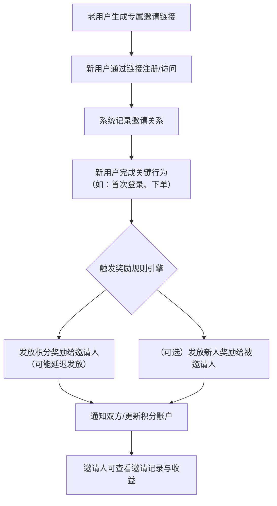

# 邀请新用户返利链接的实现原理

大家好！在电商、社群或工具类 App 中，我们经常能看到类似这样的活动：

> **“成功邀请 1 位新好友，立享 100 积分！”**

看起来简单的几句话，背后其实隐藏着一套严谨、高效且富有挑战性的系统架构。今天，我就带大家“拆解”一下这种裂变营销背后的技术实现原理，看看从点击链接到积分到账，都发生了什么。

## 一、 核心流程总览：四步走战略

为了让你快速抓住重点，我们先把复杂的系统交互浓缩成四个关键步骤：

1. **“生成”**：给每个用户生成一个独一无二的“身份证”（邀请码）。
2. **“传递”**：新用户点击带邀请码的链接。
3. **“绑定”**：新用户注册时，系统悄悄把新老用户的关系存起来。
4. **“发钱”**：当新用户满足条件（如注册成功或完成首单），系统给老用户（甚至新用户）发积分。

接下来，我们逐步深入各个环节。

## 二、 核心环节一：邀请码的诞生与链接设计

### 1. 邀请码怎么生成的？

当你看到链接中的 `inviteCode=qmhjqmo7k7`，这个 `qmhjqmo7k7` 就是邀请人的唯一标识。它一般不由用户自定义，而是系统生成的，通常有两种主要做法：

* **混淆加密算法 (推荐)**：使用像 `Hashids` 这样的算法，将用户的真实数字 ID（如 `108392`）加密成一串看似随机、较短的字符串。**优点：既保证唯一性，又不会暴露平台真实的用户数量。**
* **随机字符串**：直接生成一串高强度的随机字符串。**缺点：需要在数据库中建立 `随机码 -> 用户 ID` 的映射表。**

### 2. 活动链接的结构

一个标准的邀请链接通常是这样的：

> `[https://your-app.com/events/invite?inviteCode=USER_A_UNIQUE_CODE](https://your-app.com/events/invite?inviteCode=USER_A_UNIQUE_CODE)`

* `[https://your-app.com/events/invite](https://your-app.com/events/invite)`：活动落地的页面，负责接收流量。
* `?inviteCode=USER_A_UNIQUE_CODE`：这是灵魂，它告诉系统是谁发起的这次邀请。

## 三、 核心环节二：从“点击”到“注册”，如何不跟丢？

这是裂变系统中最关键、也最容易出错的地方。新用户点击链接到真正完成注册，中间可能会发生很多事情：他们可能会犹豫、切换网络、甚至先去浏览器搜一下，然后再回来注册。**必须保证邀请人标识（inviteCode）不丢失。**

### 技术实现路径圖

下面是这个过程的技术交互流程图：

**关键点解释：**

* **前端暂存**：当新用户打开活动页时，前端 JavaScript 会迅速从 URL 中把 `inviteCode` 抠出来，存入 `Cookie` 或 `LocalStorage`（本地存储）。哪怕用户关闭页面重新打开，只要在 Cookie 有效期内，系统依然知道他们是被邀请来的。
* **OAuth 授权跳转的处理**：如果注册需要微信授权，邀请码会被作为 `state` 参数传给授权平台，回调时再带回来，全程不丢失。

## 四、 核心环节三：绑定归属与奖励触发

当新用户提交注册请求，且后端校验 `inviteCode` 合法后，真正的魔法开始了。

### 1. 绑定关系：建立数据库的持久化记忆

系统会在数据库中写入一条记录，终身标记新老用户的邀请关系。通常使用一个专门的**关系表**来存：

| 字段名名 | 描述 |
| --- | --- |
| `id` | 主键 |
| `inviter_id` | 邀请人 ID（老用户） |
| `invitee_id` | 被邀请人 ID（新用户） |
| `status` | 邀请状态（如：0-已注册, 1-已达标） |
| `created_at` | 绑定时间 |

**重点在于数据的唯一性：** `invitee_id` 字段通常会有**唯一约束 (UNIQUE KEY)**。这意味着，一个新用户只能被邀请一次，无法同时成为两个老用户的“被邀请人”，防止重复刷奖励。

### 2. 奖励触发：要么“即时”，要么“异步”

奖励的触发方式通常有两种：

* **即时奖励（注册即送）**：绑定关系成功后，紧接着调用积分服务的 API，在同一个请求中给老用户加上积分。**优点：实现简单；缺点：如果积分服务挂了，整个注册请求都会失败，体验极差。**
* **异步触发（推荐）**：系统在绑定关系成功后，只往**消息队列 (如 MQ)** 里扔一个 `USER_REGISTERED`（用户已注册）的消息。积分服务会异步消费这个消息，完成发积分操作。**优点：系统解耦，注册更稳定。**

## 五、 核心环节四：积分发放与风控

看似到了最后一步，但却是“羊毛党”疯狂盯着的一环。如果这里不做风控，平台可能会被瞬间刷光。

### 1. 积分发放的“原子性”与“幂等性”

发放积分不仅仅是把数字加 100，还涉及积分流水记录。系统必须确保：

* **原子性**：给用户加分和记录加分流水，必须同时成功或同时失败。
* **幂等性 (Idempotency)**：最关键的技术点。**不管这个“注册成功”的消息发送了多少次，老用户只能得到一次 100 积分奖励。** 这通常通过建立带有唯一索引的“积分流水表”来实现（例如：索引由 `邀请关系 ID` + `活动 ID` 组合而成）。

### 2. 核心挑战：风险控制 (Antifraud)

这是一个必须正面硬刚的战役。羊毛党会用脚本自动化生成手机号、用模拟器修改设备指纹，来批量注册刷分。系统需要构筑多道防线：

* **人机校验**：注册接口前接入图形验证码、滑动验证码或行为验签。
* **黑名单校验**：手机号段校验（防止虚假手机）、IP 黑名单。
* **频率限制**：限制同一个 IP 或同一个设备号，在单位时间内的注册数量。
* **设备指纹 (核心)**：通过收集设备的硬件信息生成唯一标识。如果一个设备一天内关联了 10 个不同的新注册账号，那妥妥的机器刷分。
