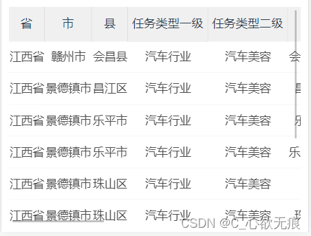
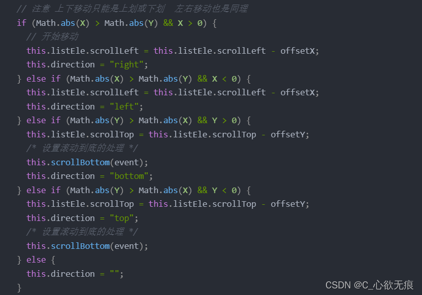

# vue 项目中解决 IOS+H5 页面滑动边界橡皮筋回弹 bug

[[toc]]

## 1、问题描述

最近遇到一个问题，我们在企业微信中的 H5 项目中需要用到 `table` 表格（支持懒加载 上划加载数据）。但是他们在锁头、锁列的情况下，依旧会出现边界橡皮筋效果。就会显示的很奇怪。

::: tip 什么是 ios 橡皮筋效果

们知道元素超出所给定的高度会出现滚动条 | 横向的或纵向的，在 ios 手机上当在全局范围或局部范围出现滚动的地方时，滑动使滚动到头时还可以继续拖拽出一段距离的空白，松开手时立刻回弹回去。  

:::

虽不影响功能，但是操作有点别扭，感觉这个 `table` 表格滑动的时候像是飘着上面的，不是固定的。 


## 2、尝试思路

**针对这个问题我也尝试了不同的方案都不尽人意:**

1，首先想到先使用 `css` 解决，前后使用了绝对定位和固定定位来提高层级，发现问题依然存在；

2，然后是用 `css` 属性 `&::-webkit-scrollbar { display: none;}` 来隐藏滚动条 ，还是不行，

3，后面引入网上的 `inobounce` 插件还是不行。此插件会禁用页面的 `touchmove` 事件，导致页面无法进行滑动；

4，因为我用的是原生的 `table` 来布局的，难道是 `table` 标签的问题，后面我又重新用 `div` 来实现 `table` 表格的布局，发现还是会出现橡皮筋效果，说明不是标签的问题，是 `ios` 浏览器隐藏的特性；

## 3、解决方案

最后我想到，既然我关不掉，那我自己完全控制滑动好了；原理是禁用掉页面`touchumove`的默认的滑动效果，使用元素的`scrollLeft 和scrollTop`这两个原生的可写属性，来进行元素的上下和左右移动；

::: tip 这样做的好处在于

我自己完全控制了拖拽滑动行为。坏处在于丢失了原生滑动的惯性滑动，看着没那么丝滑了。不过这点也可以后续通过 JavaScript 来优化（暂时还没写 ，写出来的效果不太好，不丝滑）。 

:::

**效果图如下：**

可以上下左右滑动，是固顶的，向上滑动时标题部分不会跟随移动；可以懒加载：当下滑到触底时会向父元素传递一个事件告诉父组件该请求下一页的数据了；

{width=50%}

**主要实现代码如下：**

表格组件部分代码如下：tableStrick.vue

```javascript
  data() {
   return {
      listEle: null, // dom元素
      // 记录坐标
      touchX: "",
      touchY: "",
      // 滑动坐标
      startX: 0,
      startY: 0,
      // 滑动方向
      direction: "",
    };
  }

  mounted() {
    /* 获取dom元素 这里最好不要用原生的dom获取方式 */
    this.listEle = this.$refs.main;
    /* 自己实现滚动效果 不会出现滚动回弹问题 但是滚动不丝滑了且没有惯性 */
    this.listEle.addEventListener("touchstart", this.touchstart, false);
    this.listEle.addEventListener("touchmove", this.touchmove, false);
    this.listEle.addEventListener("touchend", this.touchend, false);
  },
  methods:{
    /* 修改 浏览器默认的滑动容器行为 */
    // 1，手指接触屏幕
    touchstart(event) {
      this.touchX = event.changedTouches[0].clientX;
      this.touchY = event.changedTouches[0].clientY;
      // 获取此刻手指的横坐标startX和纵坐标startY
      this.startX = event.touches[0].pageX;
      this.startY = event.touches[0].pageY;
    },
    // 2, 手指滑动的过程
    touchmove(event) {
      event.preventDefault();
      // 计算手指偏移量
      const offsetX = event.changedTouches[0].clientX - this.touchX;
      const offsetY = event.changedTouches[0].clientY - this.touchY;

      // 触摸的坐标
      this.touchX = event.changedTouches[0].clientX;
      this.touchY = event.changedTouches[0].clientY;

      // 手指滑动的方向
      let moveEndX = event.changedTouches[0].pageX;
      let moveEndY = event.changedTouches[0].pageY;
      let X = moveEndX - this.startX;
      let Y = moveEndY - this.startY;
      // 注意 上下移动只能是上划或下划  左右移动也是同理
      if (Math.abs(X) > Math.abs(Y) && X > 0) {
        // 开始移动
         console.log('我向右滑了)
        this.listEle.scrollLeft = this.listEle.scrollLeft - offsetX;
        this.direction = "right";
      } else if (Math.abs(X) > Math.abs(Y) && X < 0) {
       	console.log('我向左滑了)
        this.listEle.scrollLeft = this.listEle.scrollLeft - offsetX;
        this.direction = "left";
      } else if (Math.abs(Y) > Math.abs(X) && Y > 0) {
      	console.log('我向下滑了)
        this.listEle.scrollTop = this.listEle.scrollTop - offsetY;
        /* 设置滚动到底的处理 */
        this.scrollBottom(event);
        this.direction = "bottom";
      } else if (Math.abs(Y) > Math.abs(X) && Y < 0) {
      	console.log('我向上滑了)
        this.listEle.scrollTop = this.listEle.scrollTop - offsetY;
        this.direction = "top";
        /* 设置滚动到底的处理 */
        this.scrollBottom(event);
      } else {
        this.direction = "";
      }
    },
    // 3，手指离开屏幕
    touchend(event) {
      this.touchX = event.changedTouches[0].clientX;
      this.touchY = event.changedTouches[0].clientY;
      // TODO  此处可以进行优化滚动的惯性 暂未实现
    },
    // 监听滚动条  注意 scroll 可能是横向滚动条 也可能是纵向滚动条
    scrollBottom(event) {
      // 1，可视区域
      let clientHeight = this.listEle.clientHeight;
      // 2，滚动文档高度
      let scrollHeight = this.listEle.scrollHeight;
      // 3，此处相等说明：没有纵向滚动条  可能出现了横向滚动条 所以要忽略
      if (clientHeight == scrollHeight) {
        return;
      }
      // 4，已滚动的高度
      let scrollTop = parseInt(this.listEle.scrollTop);
      // 这里 -2 是为了控制误差
      if (scrollTop + clientHeight >= scrollHeight - 2) {
        console.log("滚动到底了");
        // 把事件传出去 父元素开始请求下一页的数据
        this.$emit("scrollBottom");
      }
    },

  }
```

::: tip 上面代码讲解 

1，mounted 里面获取表格元素或父元素，然后监听手指点击事件，移动事件，离开事件；

2，touchstart 方法中记录坐标，touchmove 使用 event.preventDefault();禁用掉原先的滑动效果，自己通过 this.listEle.scrollLeft 和 this.listEle.scrollTop 来进行移动；

3，注意：下面的代码的意思是先要计算滑动的方向，然后再进行向对应的移动，防止上下左右一起移动，导致移动时太过敏感导致表格一直抖动； 

{width=70%}

4，scrollBottom 方法是懒加载的处理 ，如果需要的话可以加上；主要是判断上下滑动时距离是否触底，触底就让父组件请求数据。

:::

**最后注意：**

最后需要注意的是需要使用了懒加载 ：需要对父元素中的 scrollBottom 这个方法进行防抖设置，因为滑动到底部触底时存在多次连续触底的行为（比较灵敏），这样会同时执行多次 scrollBottom 这个方法；导致数据请求过多；防抖可以使用`lodash`库里面的`debounce`方法；

使用如下：在 mounted 中对 scrollBottom 进行防抖 ，也可以对实际请求接口的 自定义方法 进行防抖，

```js
mounted(){
  /* 设置接口防抖 */
    this.scrollBottom= _.debounce(this.scrollBottom, 500);
}

```
