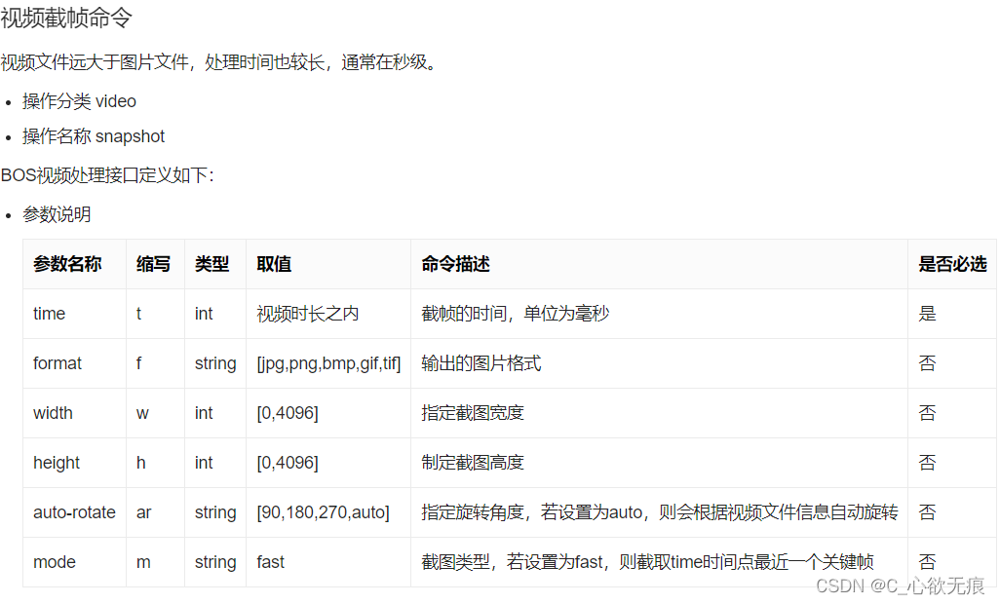

# IOS 手机中关于 video 标签 poster 属性兼容问题（ios 视频截帧）

[[toc]]

## 一、需求如下

移动端 `h5` 页面（微信浏览器下）需要上传视频并回显封面，用户点击中间的播放三角可以进行视频的预览；  
问题就出现在 `ios` 手机上使用 `video` 的 `poster` 属性并不能显示出视频封面，而安卓手机可以正常显示视频的第一帧；

**效果图**

::: info

{width=350}

:::

## 二、问题分析

::: warning

注意在 ios 系统中有个保护机制, 如果 video 标签未开始播放, 是不会去加载视频的。所以也就是说, video 标签还未去加载视频, 就显示不出来视频首帧画面；

:::

把 video 标签加上` autoplay`（自动播放）属性和` muted`（静音）属性, 就正常看到视频的画面了；

要想在 video 标签中显示首帧画面, 需要添加 poster 属性, 属性值应该是图片的 url；或者直接使用 img 标签替代 video 的位置，当点击播放的时候再弹层展示需要播放的视频；

---

**通过视频截帧获取到视频首帧图片的 url；**

在 ios 上面为了能够获取到视频的首帧，需要在生成 video 标签的时候添加上`autoplay`属性和`muted`属性；否则你截出来的是白屏；

### 2.1 第一种方式

```js
/**
 * 获取视频的第一帧 来当做封面  在ios上面会可能会出现截出黑色的情况
 * @param url 视频的url 可以是一个由window.URL.createObjectURL返回的视频内存临时地址（推荐使用）
 */
export function getFirstImg(url) {
  return new Promise(function (resolve, reject) {
    try {
      let dataURL = "";
      let width = "90"; // 单位是px
      let height = "90";
      let listen = "canplay"; //需要监听的事件

      let video = document.createElement("video");
      let canvas = document.createElement("canvas");
      //使用严格模式
      ("use strict");
      video.setAttribute("crossOrigin", "anonymous"); //处理跨域
      video.setAttribute("src", url);
      video.setAttribute("width", width);
      video.setAttribute("height", height);
      video.currentTime = 1; // 第一帧
      video.preload = "auto"; //metadata:抓取原数据
      //判断IOS 监听 durationchange或progress  但是在ios会出现黑屏
      if (/iPad|iPhone|iPod/.test(navigator.userAgent)) {
        video.load();
        video.autoplay = true;
        video.muted = true; //静音
        listen = "loadeddata";
      }
      // 第二版 dataLoad
      video.addEventListener(listen, () => {
        console.log("我走了");
        canvas.width = width;
        canvas.height = height;
        canvas.getContext("2d").drawImage(video, 0, 0, width, height); //绘制canvas
        dataURL = canvas.toDataURL("image/jpeg"); //转换为base64
        resolve(dataURL);
      });
    } catch (error) {
      console.log("视频截帧的失败报错:", error);
    }
  });
}
```

### 2.2 第二种方式

```javascript
export function getFirstImg(url) {
  const video = document.createElement("video");
  video.crossOrigin = "anonymous"; // 允许url跨域
  video.autoplay = true; // 自动播放
  video.muted = true; // 静音
  video.src = url;
  return new Promise((resolve, reject) => {
    try {
      video.addEventListener(
        "loadedmetadata",
        () => {
          console.log("loadedmetadata");
          video.currentTime = 2;
          const canvas = document.createElement("canvas");
          video.addEventListener("canplaythrough", () => {
            console.log("canplaythrough");
            canvas.width = video.videoWidth;
            canvas.height = video.videoHeight;
            canvas.getContext("2d").drawImage(video, 0, 0, canvas.width, canvas.height);
            const firstFrame = canvas.toDataURL();
            // console.log(firstFrame); // 输出第一帧画面的Base64编码字符串
            resolve(firstFrame);
          });
        },
        { once: true }
      );
    } catch (err) {
      console.error(err);
      reject("");
    }
  });
}
```

前端来获取视频首帧终究不是上上策，因为前端处理视频，就需要视频加载这个过程，如果页面上有很多视频，那访问这样页面，岂不是要偷偷浪费用户流量来加载；

## 三、利用视频的自动播放和暂停来获取视频的首帧

上面的这种是视频截帧的方式在 ios 上创造 video 节点且需要设置视频自动播放；并使用 cavans 绘制第一帧的图像并返回 base64;

既然这么麻烦，为啥不本来就让他自动播放，并在播放到 100-200 毫秒的时候主动暂停视频呢；这样也可以达到视频截帧的效果，而且代码也比较简单监听视频的`canplay`事件并在里面暂停视频；如下：

`vue中template里面的处理`：

```javascript
<video autoplay muted playsinline preload="auto" :src="filePreviewObj.fileUrl" @canplay="canplay($event)" />
```

`canplay方法的处理`：

```javascript
/* 视频播放 获取第一帧 */
canplay(event){
  setTimeout(() => {
    event.target.pause(); // 暂停播放视频 以此来获取封面
  }, 200);
};
```

这种方式大家可以去试一下，亲测有效；

## 四、视频截帧的其他方式

其实上传文件，现在最流行的不是 bos 就是 oss

### 4.1，BOS:百度云对象存储

官方链接：[https://cloud.baidu.com/doc/BOS/s/Yl06cyatz](https://cloud.baidu.com/doc/BOS/s/Yl06cyatz)



使用如下：直接在视频的原链接后面拼接字符串即可

```javascript
处理的视频URL为：<原视频URL>?x-bce-process=video/snapshot,t_7000,f_png,w_800,h_600,m_fast
```

### 4.2，OSS:阿里云对象存储

官方链接: [https://help.aliyun.com/document_detail/64555.html](https://help.aliyun.com/document_detail/64555.html)

::: info 参数 描述 取值范围

**t :** 指定截图时间。如果设置的截图时间 t 超过了视频时长，则返回视频的最后一帧关键帧。 [0,视频时长] 单位：ms

**w :** 指定截图宽度，如果指定为 0，则自动计算。 [0,视频宽度] 单位：像素（px）

**h :** 指定截图高度，如果指定为 0，则自动计算；如果 w 和 h 都为 0，则输出为原视频宽高。 [0,视频高度] 单位：像素（px）

**m :** 指定截图模式，不指定则为默认模式，根据时间精确截图。如果指定为 fast，则截取该时间点之前的最近的一个关键帧。 枚举值：fast

**f :** 指定输出图片的格式。 枚举值：jpg 和 png

:::

**使用示例:**

原视频链接：https://oss-console-img-demo-cn-hangzhou.oss-cn-hangzhou.aliyuncs.com/video.mp4

使用 fast 模式截取视频 7s 处的内容，输出为 JPG 格式的图片，宽度为 800，高度为 600。

```javascript
处理后的URL为：https://oss-console-img-demo-cn-hangzhou.oss-cn-hangzhou.aliyuncs.com/video.mp4?x-oss-process=video/snapshot,t_7000,f_jpg,w_800,h_600,m_fast
```
