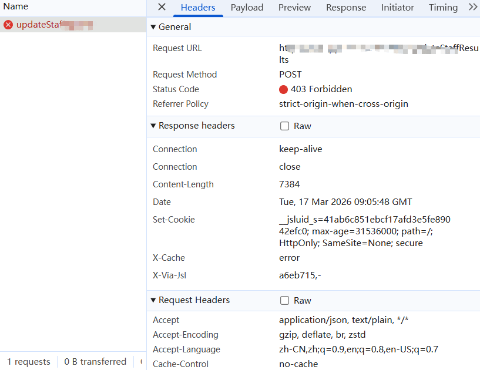

# 诡异 Bug：为什么 "to find more" 这个短语会让后端报错？

## 一、问题现象

某次开发中，我遇到了一个极其诡异的 Bug：

**当用户在绩效输入框只要输入带有 "to find more" 时，后端竟然报错了！**

- ❌ `to find more` → 后端报错
- ✅ `to find` → 正常
- ✅ `find more` → 正常
- ✅ `to search additional` → 正常（同义替换）

三个单词分开都没问题，组合在一起就爆炸。



## 二、根因分析

经过测试排查，确认问题根源：**WAF/安全中间件的黑名单过滤**

### 2.1 为什么是这三个词？

`to` + `find` + `more` 的组合触发了 **SQL 注入攻击特征库** 的匹配规则：

| 攻击模式 | 特征说明 |
|---------|---------|
| 信息探测 | `find more` = "查找更多信息"，被识别为扫描器行为 |
| UNION 注入 | `to` + `find` 可能匹配某些变形的 `UNION SELECT` 检测 |
| 时间盲注 | `find` 关联 `SELECT` 操作 |

这不是语法错误，而是**安全规则误杀**。

## 三、前端解决方案（无需改后端）

### 3.1 方案一：同义词替换（最简单）

```javascript
const safeText = userInput.replace(/to find more/gi, "to search additional");
```

**优点**：零成本，立即生效
**缺点**：语义略有变化

### 3.2 方案二：零宽字符绕过（视觉无损）

这是本文重点介绍的技巧。

**什么是零宽字符？**

**零宽字符（Zero-Width Characters）** 是一类特殊的 Unicode 控制字符，它们在视觉上**完全不显示**，不占用任何空间，但确实存在于字符串中。

常见零宽字符：

| 字符 | Unicode | 名称 | 用途 |
|------|---------|------|------|
| `​` | `U+200B` | 零宽空格（ZWSP） | 最常用，长单词换行控制 |
| `‍` | `U+200D` | 零宽连字符（ZWJ） | 表情符号组合（如👨‍👩‍👧） |
| `‌` | `U+200C` | 零宽非连字符（ZWNJ） | 阻止字符连接 |
| `` | `U+FEFF` | 零宽无断空格（BOM） | 文件字节序标记 |

**为什么能绕过过滤？**

安全过滤通常依赖正则表达式匹配关键词。插入零宽字符后：

```
原始:  find        →  正则 /find/ 匹配 ✅
变形:  fi​nd        →  正则 /find/ 匹配 ❌
         ↑
      零宽空格 U+200B
```

视觉上完全一样，但字符串的**字节序列已改变**。

**代码实现**

```javascript
// 存储时插入零宽空格（U+200B）
function bypassFilter(text) {
  // 在关键词中间插入零宽字符，破坏正则匹配
  return text.replace(/to find more/gi, "to fi\u200Bnd mo\u200Bre");
}

// 显示时清洗（移除所有零宽字符）
function cleanText(text) {
  // 匹配常见的零宽字符
  return text.replace(/[\u200B-\u200D\uFEFF]/g, "");
}

// 使用示例
const userInput = "Click here to find more information";
const safeForStorage = bypassFilter(userInput);
// 实际存储: "Click here to fi​nd mo​re information"
// 视觉显示: "Click here to find more information" （看起来一样）

const displayText = cleanText(safeForStorage);
// "Click here to find more information" （完全还原）
```

**零宽字符的其他用途**

| 场景 | 说明 |
|------|------|
| **数字水印** | 在文本中嵌入隐形标识，追踪泄露源 |
| **密码增强** | `password\u200B` 比 `password` 更难破解 |
| **排版控制** | 长 URL 换行：`https://example.com/very\u200B/long/path` |
| **绕过审查** | 社交媒体敏感词变形（慎用） |

**注意事项**

```javascript
// ⚠️ 零宽字符的坑

// 1. 字符串长度计算
"find".length        // 4
"fi\u200Bnd".length  // 5 （零宽字符也算长度！）

// 2. 索引错位
"fi\u200Bnd".indexOf("n")  // 3，不是 2

// 3. 哈希值不同
hash("find") !== hash("fi\u200Bnd")  // true

// 4. 搜索失效
"fi\u200Bnd".includes("find")  // false
```

**最佳实践**：零宽字符仅用于**传输/存储层**，**显示前必须清洗**。

### 3.3 方案三：Base64 编码（最稳妥）

```javascript
const SafeStorage = {
  encode: (text) => btoa(unescape(encodeURIComponent(text))),
  decode: (encoded) => decodeURIComponent(escape(atob(encoded)))
};

// 任何文本都能安全存储
const stored = SafeStorage.encode("to find more"); // "dG8gZmluZCBtb3Jl"
const restored = SafeStorage.decode(stored);       // "to find more"
```

**优点**：完全绕过文本过滤，数据零损失
**缺点**：存储体积增加 ~33%
