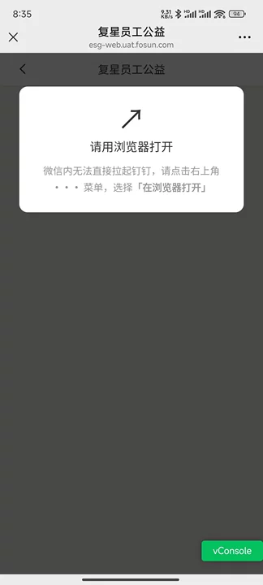
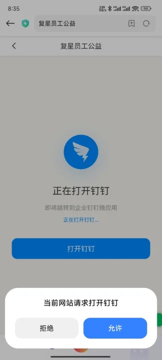

# 浏览器/微信拉起钉钉微应用免登实战

[[toc]]

> 微信里点 `dingtalk://` 为什么毫无反应？怎么把用户「引导到浏览器」再拉起钉钉微应用？同样一句 `window.location.href = scheme`，iOS 和 Android 为什么表现完全不同？从 scheme 唤起原理、微信的拦截边界，到引导链路设计，再到双端差异化唤起与"取消确认框后无法再次唤起"的治理，一次讲透。

## 一、背景与诉求

「复星员工公益」是运行在钉钉内的 H5 微应用，认证走**钉钉免登**：JSAPI 取临时授权码 → 后端换用户信息与 JWT Token → 后续接口凭 Token 鉴权。

可一旦链接被分享到微信、或在外部浏览器打开，这套链路就不成立了。需求收敛成一句话：

> 能不能在微信/浏览器里"拉起钉钉"，完成企业身份免登？

而真正的答案里，"拉起"只占一半，另一半是`引导`：微信里根本唤不起钉钉，必须先把用户引导到浏览器，才谈得上在浏览器里唤起钉钉。

本文的主线就是这条 **「引导 → 唤起 → 免登回跳」链路，难点在唤起环节——iOS 与 Android 在 scheme 唤起上存在系统级差异**。

## 二、为什么微信里拉不起钉钉

这是整件事的第一个认知门槛：**唤起 App 是系统原生能力，但微信在自己容器里把这扇门关上了。**

### 2.1 唤起 App 的本质：URL Scheme

普通浏览器唤起 App，靠的是**自定义 URL Scheme**：

- **iOS**：WebView 遇到 `dingtalk://xxx`，系统走 `UIApplication.openURL:`，查找谁注册了 `dingtalk` 这个 scheme，找到钉钉就拉起；
- **Android**：同理走隐式 Intent，按 `<intent-filter>` 中声明了 `dingtalk` 的 App 去匹配拉起。

这一步是操作系统层面的原生能力，所以 Safari、Chrome、系统浏览器都能正常唤起钉钉。

### 2.2 微信的拦截

微信内置浏览器不是原生 Safari/Chrome，而是微信**自研/定制的 WebView**，并在导航层做了拦截：

- iOS 端是定制 `WKWebView`，微信在 `WKNavigationDelegate` 的 `decidePolicyForNavigationAction` 回调里，**对非 `http/https` 的 scheme 直接 `cancel`**，不转发给系统 `openURL`；
- Android 端是腾讯 X5 内核，同样在导航层把 `dingtalk://` 这类 scheme 拦下，不触发系统 Intent 分发。

同时微信还封堵了常见绕行手段：

| 手段 | 结果 |
|------|------|
| `location.href = 'dingtalk://...'` | 被拦截 |
| `<a href="dingtalk://...">` 点击 | 被拦截 |
| `window.open('dingtalk://...')` | 被拦截 |
| iframe 里塞 scheme | 被拦截 |

### 2.3 根因与结论

根因是**生态闭环**：微信是超级流量入口，若放开任意 scheme 唤起，等于允许任何 H5 把用户导流出微信。所以微信用「白名单 + 开放标签」两种受控方式放行，而钉钉不可能接入微信的开放标签体系。

**结论：**

- 微信内：连钉钉 App 都唤不起，更别说直接拉起「寄生于钉钉 App 内」的微应用；
- 普通浏览器：可以一步唤起钉钉并直达指定微应用；
- 因此，方案的第一步只能是**把用户引导到浏览器**，第二步才是浏览器里唤起钉钉。

## 三、引导用户到浏览器：链路设计

### 3.1 微信内：只做一件事——把人送出去

既然微信拦掉了所有 scheme 通道，那么微信内就不存在"点个按钮直接拉起钉钉"的可能。页面在这一步唯一该做的事是**引导**：

- 展示全屏遮罩，明确指引「点右上角「···」→ 在浏览器打开」；
- 微信开放标签 `wx-open-launch-app` 只服务接入了微信开放平台的 App，钉钉不在其列，这条路同样走不通；
- 不要在这里浪费力气做"唤起尝试"——它一定失败，且失败是静默的，只会让用户以为页面坏了。



### 3.2 浏览器内：唤起钉钉，落点仍是同一个域名

用户到了浏览器，才真正进入主战场。闭环的关键点是：**唤起钉钉时 `redirect_url` 指回当前域名**——

用户点「打开钉钉」→ 钉钉启动 → 钉钉内重新打开 `https://esg-web.uat.fosun.com/` → 此时已是钉钉环境 → 自动走免登进入应用。



整条链路自洽，**全程只需要一个域名、一条链接**：

| 环境 | 判断依据 | 页面该做什么 |
|------|----------|--------------|
| 微信内 | UA 含 `MicroMessenger` | 只展示「请在浏览器打开」引导 |
| 普通浏览器 | 非钉钉、非微信 | 唤起钉钉；失败给「再次点击 / 手机号登录」两条出路 |
| 钉钉内 | UA 含 `DingTalk` | 已是终点：走 JSAPI 免登进入应用 |

### 3.3 唤起落点：把目标页带进 `redirect_url`

分享出去的往往不是根路径，而是活动报名页（`/activity/:id/signup`）或扫码签到页（`/activity-check-in?activityId=x`）。唤起时把目标页拼进 `redirect_url`，钉钉起来后直接落在目标页，而不是回到首页再让用户自己找：

```ts
const redirect = resolveRedirect()   // 从 URL 的 redirect 参数解析
const scheme = buildDingTalkLaunchScheme(
  redirect ? `${window.location.origin}${redirect}` : undefined,
)
```

> `redirect` 来自 URL 参数，属于典型的**开放重定向**风险点，必须做站内白名单校验（只接受以单个斜杠开头的站内路径，拒绝 `http://`、`//`、`javascript:` 等），不能直接拿来跳转。

### 3.4 一个前提：浏览器里别把自己判死

唤起引导能生效的前提是——**页面得先渲染出来**。

若非钉钉环境仍照旧执行钉钉免登，会因拿不到 authcode 直接失败并跳「登录失败页」，引导页根本没机会出现。所以启动阶段要先按环境判断：**非钉钉环境跳过钉钉免登，恢复本地凭证后标记认证就绪**，把页面交回给引导/唤起逻辑。

```ts
const dingTalkEnv = detectDingTalkEnv()
if (dingTalkEnv.isDingTalk) {
  await appStore.initAppAuth()  // 钉钉内：走免登
} else {
  appStore.restoreLocalAuth()   // 从 localStorage 恢复 H5 登录态
  appStore.markAuthReady()      // 标记认证就绪，否则全局 loading 一直挡着引导页
}
```

## 四、钉钉唤起协议解析

钉钉开放了以 `dingtalk://` 为前缀的**统一跳转协议**，本项目用到两种：

### 4.1 打开指定微应用（需 CorpId + AgentId）

```
dingtalk://dingtalkclient/action/openapp?corpid=<企业ID>&container_type=work_platform&app_id=0_<应用ID>&redirect_type=jump&redirect_url=<URL编码后的页面地址>
```

其中 `app_id` 的格式为 `0_` + AgentId，`redirect_url` 是钉钉启动后要打开的 H5 地址，必须 URL 编码。

### 4.2 打开普通链接（降级方案）

```
dingtalk://dingtalkclient/page/link?url=<URL编码后的链接>
```

当没有 CorpId/AgentId（或不确定微应用标识）时，用这个更通用的协议，钉钉启动后在内部打开该链接。

对应实现（`src/utils/dingtalk.ts`）：

```ts
/**
 * 构建唤起钉钉客户端并打开微应用的 URL Scheme
 * @description 钉钉统一跳转协议：优先使用「打开指定微应用」(openapp)，需配置 CorpId 与 AgentId；
 *              未配置时降级为「打开链接」(page/link)。唤起后钉钉会打开 targetUrl 对应页面
 * @param targetUrl - 钉钉打开后跳转的目标 H5 地址，默认当前域名根路径
 * @returns 唤起钉钉的 scheme 字符串
 */
export const buildDingTalkLaunchScheme = (targetUrl?: string): string => {
  const corpId = import.meta.env.VITE_DINGTALK_CORP_ID || ''
  const agentId = import.meta.env.VITE_DINGTALK_AGENT_ID || ''
  const url = targetUrl || `${window.location.origin}/`

  if (corpId && agentId) {
    return `dingtalk://dingtalkclient/action/openapp?corpid=${corpId}&container_type=work_platform&app_id=0_${agentId}&redirect_type=jump&redirect_url=${encodeURIComponent(url)}`
  }
  return `dingtalk://dingtalkclient/page/link?url=${encodeURIComponent(url)}`
}
```

> 协议格式随钉钉版本可能有差异，**以钉钉开放平台后台/官方文档实际下发的 scheme 为准**，前端只需把它抽象成可配置的函数，避免写死。本项目的抽象点就是 `buildDingTalkLaunchScheme(targetUrl)`。

## 五、浏览器里怎么唤起：核心实现

### 5.1 环境检测

`src/utils/dingtalk.ts` 中的环境检测工具是整条链路的地基：

```ts
/**
 * 检测是否在钉钉环境中运行
 * @returns 钉钉环境信息
 */
export const detectDingTalkEnv = (): DingTalkEnv => {
  const ua = navigator.userAgent.toLowerCase()
  const isDingTalk = ua.includes('dingtalk')

  let platform: 'android' | 'ios' | 'pc' | 'unknown' = 'unknown'
  if (ua.includes('android')) {
    platform = 'android'
  } else if (ua.includes('iphone') || ua.includes('ipad')) {
    platform = 'ios'
  } else if (isDingTalk) {
    // 在钉钉中但非移动端 UA，即为 PC（Windows/Mac）钉钉客户端
    platform = 'pc'
  }

  // 从 UA 中提取钉钉版本号
  const match = ua.match(/dingtalk\/([\d.]+)/)
  const version = match ? match[1] : ''

  return { isDingTalk, platform, version }
}
```

**一个容易踩的细节**：`platform` 的 `pc` 分支要求 `isDingTalk === true`。也就是说，**普通 PC 浏览器**（Chrome on Windows）打开时 `platform` 是 `unknown`，而**手机浏览器**（非钉钉）分别识别为 `android` / `ios`。唤起逻辑正是靠这个字段做双端差异化（见第六章）。

微信判定的实现更简单：

```ts
/**
 * 是否在微信内置浏览器中运行
 * @returns 是否在微信环境中
 */
export const isWeChatEnv = (): boolean => /MicroMessenger/i.test(navigator.userAgent)
```

### 5.2 唤起函数

唤起由 `launchDingTalk` 统一收口，`auto` 选项决定「失败后如何收场」（双端差异见第六章）：

```ts
const LAUNCH_TIMEOUT = 3000        // 手动/Android 唤起失败判定超时
const AUTO_LAUNCH_TIMEOUT = 1200   // iOS 自动尝试的失败判定超时（缩短，尽快回落到按钮引导）

const launchDingTalk = (options: { auto?: boolean } = {}): void => {
  const { auto = false } = options
  // 入口带 redirect 时以之为唤起后的落点（如活动报名页），否则回默认根路径
  const redirect = resolveRedirect()
  const scheme = buildDingTalkLaunchScheme(
    redirect ? `${window.location.origin}${redirect}` : undefined,
  )
  if (!scheme) return

  // 当前 document 内的唤起已被浏览器拦截：刷新出全新 document 后重试
  if (launchBlocked) {
    // 自动尝试不做刷新重试（刷新后 iOS 仍无用户手势，只会陷入循环），直接交由用户点击
    if (auto) {
      statusText.value = '请点击下方「打开钉钉」按钮继续'
      return
    }
    const retryCount = getRetryCount()
    if (retryCount >= MAX_RETRY_COUNT) {
      statusText.value = '浏览器已拦截打开钉钉，请刷新页面或更换浏览器重试'
      return
    }
    setRetryCount(retryCount + 1)
    statusText.value = '正在重新打开钉钉...'
    reloadForRetry()
    return
  }

  clearFailTimer()
  statusText.value = '正在打开钉钉...'

  try {
    // 同步执行跳转，保留用户手势（iOS 需要用户手势才会弹出确认框）
    window.location.href = scheme
  } catch (error) {
    console.error('唤起钉钉失败:', error)
    if (!auto) launchBlocked = true
    statusText.value = auto ? '请点击下方「打开钉钉」按钮继续' : '未能打开钉钉，请再次点击按钮重试'
    return
  }

  failTimer = window.setTimeout(() => {
    failTimer = null
    // 页面已隐藏或已失焦 → 钉钉已被拉起（PC 端唤起会新开窗口，标签页未必进入后台）
    if (document.hidden || !document.hasFocus()) return
    // 页面仍在前台活跃 → 唤起失败：多为未安装钉钉，或用户取消了确认框被浏览器拦截
    if (!auto) launchBlocked = true
    statusText.value = auto ? '请点击下方「打开钉钉」按钮继续' : '未能打开钉钉，请再次点击按钮重试'
  }, auto ? AUTO_LAUNCH_TIMEOUT : LAUNCH_TIMEOUT)
}
```

页面上的两个按钮对应唤起失败后的两条出路：**「打开钉钉」重试唤起**、**「没有钉钉账号，用手机号登录」兜底**。

> 早期版本还有「未安装钉钉 → 下载按钮」的兜底，现已移除，改为**重试引导 + 手机号登录**这条更闭环的路径。

### 5.3 如何判断"唤起成功了"

浏览器没有查询 App 是否安装的 API，只能**近似判断**：唤起成功后页面会进入后台或失焦。上面的 `setTimeout` 就是这一判断的落点——超时后页面仍在前台活跃，即判定为失败。

同时监听 `visibilitychange` 做即时响应，并处理「从钉钉返回」的场景：

```ts
/**
 * 页面可见性变化处理
 * @description 页面进入后台（隐藏）即代表钉钉被成功唤起，清除兜底定时器；
 *              从钉钉返回、页面重新可见时清除「已被拦截」标记，使用户可再次点击唤起
 */
const handleVisibilityChange = (): void => {
  if (document.hidden) {
    clearFailTimer()
    statusText.value = '已跳转到钉钉'
    return
  }
  // 重新可见只可能发生在「已成功唤起过（页面隐藏过）」之后，故此处重置拦截标记是安全的
  launchBlocked = false
}
```


## 六、重点：iOS 与 Android 拉起钉钉的差异

这一章是整件事最"反直觉"的部分。同样是 `window.location.href = scheme`，双端表现却完全不同。

### 6.1 两个系统级差异

| 差异点 | Android | iOS |
|--------|---------|-----|
| scheme 跳转是否要求用户手势 | 不要求，脚本可直接跳转 | **要求**：非用户手势的 `location.href` 跳转会被系统静默忽略 |
| 是否有「是否打开钉钉」确认框 | 通常直接唤起或弹一次确认 | 弹系统确认框，且**只有用户手势触发时才会弹** |
| 失败表现 | 多数会有可见反馈 | 静默失败（不报错、不弹窗、页面无变化） |
| 取消后的后果 | 当前 document 记住"已拒绝"，后续跳转被拦截 | 同左（Chrome/Edge 内核），Safari 表现略有差异 |

**关键认知：iOS 上"没反应"往往不是代码没执行，而是系统把这次跳转丢掉了。** 所以 iOS 的自动唤起只能是「尽力而为」，**按钮永远是必需的兜底入口**。

### 6.2 当前策略：双端都主动尝试一次，但失败判定与后果不同

进入唤起页时（`onMounted`）：

```ts
// 双端默认展示「打开钉钉 / 手机号登录」两个按钮，并在进入页面时各主动唤起一次：
// - Android：无手势限制，可直接唤起；重试刷新进入的新 document 同样自动唤起
//   （新 document 不受上一次「拒绝」影响，确认框会重新弹出）
// - iOS：系统要求 scheme 跳转由「用户手势的同步调用栈」触发，页面加载时的脚本调用多数不被放行，
//   且被忽略时是静默的（不报错、不弹窗），故此处仅作尽力尝试；无论成功与否都保留按钮引导，
//   用户手动点击时走原生唤起
if (env.platform !== 'ios') {
  launchDingTalk()
} else {
  launchDingTalk({ auto: true })
}
```

**双端行为对照表：**

| 维度 | Android（及 PC/未知端） | iOS |
|------|------------------------|-----|
| 进入页面时的调用 | `launchDingTalk()`（`auto=false`） | `launchDingTalk({ auto: true })` |
| 是否自动尝试 | 是 | 是（**无条件**尽力尝试一次） |
| 失败判定超时 | `LAUNCH_TIMEOUT` = 3000ms | `AUTO_LAUNCH_TIMEOUT` = 1200ms |
| 失败后是否标记「document 已被拦截」 | **是**（`launchBlocked = true`） | **否** |
| 失败提示文案 | 未能打开钉钉，请再次点击按钮重试 | 请点击下方「打开钉钉」按钮继续 |
| 手动点击的行为 | 若已被拦截 → 先刷新出新的 document 再重试；否则原生唤起 | 原生唤起（处于用户手势同步调用栈内，系统会弹确认框） |
| 为什么这样设计 | 自动唤起成功率高，失败即进入「刷新重试」通道提高二次成功率 | 自动唤起成功率低，**不能**因自动失败就标记拦截，否则会把随后的手动点击也拖进"刷新重试"分支 |

### 6.3 一个历史坑：iOS「手势激活窗口」判断等于从不尝试

早期实现曾尝试用 `navigator.userActivation.isActive` 判断是否处于「用户手势激活窗口」，仅在激活态内才自动唤起。实践结果：

- 外部 App（微信/浏览器）打开的新 document **不携带激活态**；
- 且路由懒加载 chunk 的耗时早已超出瞬态激活窗口（一般 5 秒内衰减）。

于是这个条件在页面加载时**几乎恒为 `false`**，等价于"从不自动唤起"。最终改为**双端统一无条件尽力尝试一次**（`commit 57c86e5`），同时把自动尝试的超时单独缩短到 1200ms，避免无效场景下用户长时间停在「正在打开钉钉」而误以为页面卡死。

> 结论：不要试图用 API 精确判断"能不能唤起"：iOS 的静默失败没有可靠信号。**能做的只有：尽力尝试 + 缩短判定 + 保留按钮。**

### 6.4 取消确认框后点按钮没反应：document 级拦截与刷新重试

这是双端都会遇到的坑，但在实际场景中多见于 Android/Chrome 与部分 iOS 浏览器：

**现象**：用户第一次点「打开钉钉」弹了确认框，选择了取消；之后再点按钮**毫无反应**，控制台可见 `Navigation is blocked`。

**根因**：Chrome / Edge 等内核对**当前 document** 记住了「该协议已被用户拒绝」，此后同一 document 内再次跳转 `dingtalk://` 会被静默拦截。**拦截记录挂在 document 上，不会随按钮点击重置。**

**方案**：既然记录挂在 document 上，就**换一个 document**——带标记刷新页面后重试：

```ts
/** 唤起失败后自动重试的标记参数名：URL 带该参数即表示本次是「重试」刷新出来的新 document */
const RETRY_PARAM = 'ddRetry'
/** 同一会话内允许的最大自动重试次数（避免用户反复取消确认框导致页面无限刷新） */
const MAX_RETRY_COUNT = 2
/** 重试次数在 sessionStorage 中的存储键 */
const RETRY_COUNT_KEY = '__dd_launch_retry_count__'

/**
 * 带重试标记刷新出全新的 document
 * @description 浏览器对 scheme 唤起的「拒绝」记录挂在当前 document 上，只有重新加载页面
 *              （换一个 document）才能让钉钉的「是否打开钉钉」确认框重新弹出
 */
const reloadForRetry = (): void => {
  const url = new URL(window.location.href)
  url.searchParams.set(RETRY_PARAM, String(Date.now()))
  window.location.replace(url.toString())
}
```

配套的两个防失控措施：

1. **重试次数上限**：`sessionStorage` 计数，达到 2 次后停止刷新，改为提示「浏览器已拦截打开钉钉，请刷新页面或更换浏览器重试」；
2. **正常进入时重置计数**：非重试进入（URL 无 `ddRetry`）把计数归零，保证每次访问都有完整的重试机会。

```ts
const isRetryEntry = new URLSearchParams(window.location.search).has(RETRY_PARAM)
if (!isRetryEntry) {
  // 正常进入：重置重试次数，保证每次访问都有完整的重试机会
  setRetryCount(0)
}
```

> 为什么 iOS 的 `auto` 分支不参与刷新重试：刷新后的新 document 里 iOS 依然没有用户手势，自动唤起照样会被忽略，只会陷入"刷新 → 失败 → 再刷新"的死循环。所以 iOS 自动失败只提示用户点击，**把重试权交回用户手势**。

### 6.5 双端最终体验小结

| 环节 | Android | iOS |
|------|---------|-----|
| 进入唤起页 | 立即自动唤起 + 弹确认框 | 尽力自动唤起（多数静默被忽略）+ 按钮引导 |
| 用户点「打开钉钉」 | 原生唤起 | 原生唤起，系统弹确认框 |
| 用户取消确认框 | 记为 document 拦截，再点 → 自动刷新重试（最多 2 次） | 视内核而定；再点按钮仍会重新尝试 |
| 未安装钉钉 | 3 秒后提示「未能打开钉钉，请再次点击按钮重试」 | 1.2 秒后提示「请点击下方按钮继续」 |
| 始终失败 | 提示后引导「手机号登录」 | 提示后引导「手机号登录」 |


## 七、多环境适配

UAT 与 PRD 是两套独立的钉钉应用，**CorpId/AgentId 各不相同**：

| 环境 | 前端域名 | CorpId | AgentId |
|------|----------|--------|---------|
| DEV | 本地（代理 UAT 后端） | `ding6f768bca630f8220` | `4723304218` |
| UAT | `esg-web.uat.fosun.com` | `ding6f768bca630f8220` | `4723304218` |
| PRD | `esg-web.fosun.com` | `ding7a05491d2e914134` | `4776111835` |

取值来自各环境 `.env` 文件：

```bash
# .env.uat
VITE_DINGTALK_AGENT_ID=4723304218
VITE_DINGTALK_CORP_ID=ding6f768bca630f8220

# .env.production
VITE_DINGTALK_AGENT_ID=4776111835
VITE_DINGTALK_CORP_ID=ding7a05491d2e914134
# 钉钉应用 Key（用于 dd.config 鉴权配置）
VITE_DINGTALK_APP_KEY=ding23xztt5u70opdlpg
```

**Vue 入口（主流程）天然适配**：CorpId/AgentId 走 `import.meta.env`（`build:uat` 注入 UAT 值、`build:prd` 注入 PRD 值），`redirect_url` 走 `window.location.origin`，两套环境零额外配置。

**纯静态 HTML 入口无法读环境变量**：`public/` 目录文件是原样拷贝，不经过 Vite 的环境变量替换，`import.meta.env` 在纯 HTML 里无效。项目早期为此写了一份 `public/open-dingtalk.html`（按域名硬编码映射配置）：

```js
const ENV_CONFIG = {
  'esg-web.uat.fosun.com': { corpId: 'ding6f768bca630f8220', agentId: '4723304218' },
  'esg-web.fosun.com':      { corpId: 'ding7a05491d2e914134', agentId: '4776111835' },
}
const ACTIVE_CONFIG = ENV_CONFIG[window.location.hostname] || ENV_CONFIG['esg-web.uat.fosun.com']
```

> **现状说明**：唤起引导能力已完全收敛到 Vue 唤起页，源码中已不再引用 `open-dingtalk.html`（仅保留文件本身，可直接访问 URL 打开）。多环境的推荐做法以 `.env` + `import.meta.env` 为准。


## 八、踩坑与注意事项

### 8.1 坑一：iOS 自动唤起成功率极低，且失败是静默的

iOS 要求 scheme 跳转由「用户手势的同步调用栈」触发。页面加载时的脚本调用多数被系统忽略，且不报错、不弹窗。**结论：iOS 的按钮兜底不是"可选优化"，而是功能必需的组成部分**；自动尝试只做"尽力而为"，并把失败判定超时压到 1200ms 以便快速回落。

### 8.2 坑二：区分 iOS/Android 的"进入时调用方式"

不是简单地「iOS 不自动、Android 自动」，而是双端都调用，但语义不同：

- Android 走 `launchDingTalk()`（`auto=false`）：失败会标记 `launchBlocked`，进入「刷新重试」通道；
- iOS 走 `launchDingTalk({ auto: true })`：失败只提示点击，**不标记拦截**，保证手动点击时走原生唤起而不是被拖进刷新重试。

### 8.3 坑三：用户取消确认框后，同一 document 内再也唤不起

Chrome/Edge 会在 document 级别记住「已拒绝该 scheme」，点击按钮将毫无反应（`Navigation is blocked`）。**必须先刷新出全新 document**（`location.replace` 带 `ddRetry` 时间戳）再触发唤起；同时用 `sessionStorage` 计数 + 上限 2 次防止无限刷新。

### 8.4 坑四：未安装钉钉无法直接判定

浏览器没有查询 App 安装状态的 API，只能靠**超时 + 页面可见性/焦点**近似判断：唤起成功则 `document.hidden` 或失去焦点；超时后页面仍在前台活跃，大概率是未安装或取消确认框。此时给出「再次点击重试」与「手机号登录」两条出路，而不是死等。

### 8.5 坑五：唤起落点带的 redirect 是开放重定向风险点

`redirect_url` 里拼接的目标页若直接取自 URL 参数，就可能被构造成站外地址。必须做**站内白名单校验**（仅接受以单个斜杠开头的站内路径，拒绝 `http://`、`//`、`javascript:` 与危险字符），不能图省事直接透传。

### 8.6 坑六：静态文件读不到环境变量

`public/` 目录文件不参与 Vite 编译，`import.meta.env` 无效。**多环境配置要么走源码（环境变量），要么在静态文件里按域名硬编码映射**，二者不能混用。

### 8.7 坑七：图标还原

最初手绘的飞鸟 path 严重不像钉钉 logo。后改用 Remix Icon 官方 `dingding-fill` 图标（`viewBox 24x24`，蓝色圆 + 白色飞鸟镂空），并去掉多余的背景渐变，改用 `filter: drop-shadow` 让阴影跟随圆形轮廓，才达到还原效果。


## 九、总结

「微信里拉起钉钉」本质是一道**平台边界**题：唤起 App 是系统能力，微信人为关掉了这扇门，所以方案的第一步只能是**把用户引导出微信**；而一旦进入浏览器，又会撞上 **iOS/Android 的手势限制差异**。

落地要点：

| 层次 | 手段 |
|------|------|
| 原理认知 | 微信拦截非 http/https scheme；普通浏览器可唤起；微应用寄生于钉钉 App 内 |
| 引导层 | 微信内只做「在浏览器打开」引导，不做无谓唤起尝试；开放标签对钉钉无效 |
| 协议层 | `openapp`（打开微应用）优先，`page/link`（打开链接）降级 |
| 唤起层 | 单一域名闭环：`redirect_url` 指回自身 → 钉钉内免登；目标页经 `redirect` 透传 |
| 双端层 | Android 自动唤起（3s 判定，失败标记拦截走刷新重试）；iOS 尽力自动（1.2s 判定，失败仅提示点击，不标记拦截） |
| 重试层 | 取消确认框导致 document 级拦截 → 带 `ddRetry` 标记刷新出新 document 重试，上限 2 次 |
| 兜底层 | 唤起始终失败 → 引导「手机号登录」，保证用户有可自救路径 |
| 配置层 | 环境变量适配多环境；静态页按域名映射兜底（现已非主流程） |

一句话概括：**把用户引导到浏览器，用 scheme 唤起钉钉，落点仍回同一个域名**——引导是前提，唤起是核心，双端差异与刷新重试决定这套方案的成败。

---

*作者：gouxinjie · 适用技术栈：Vue 3 + Vite + TypeScript + 钉钉 JSAPI*
