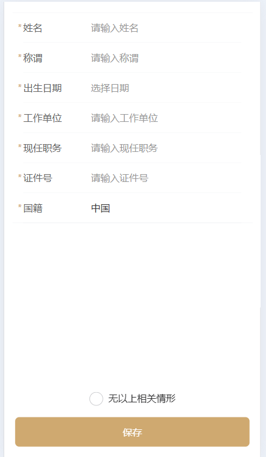
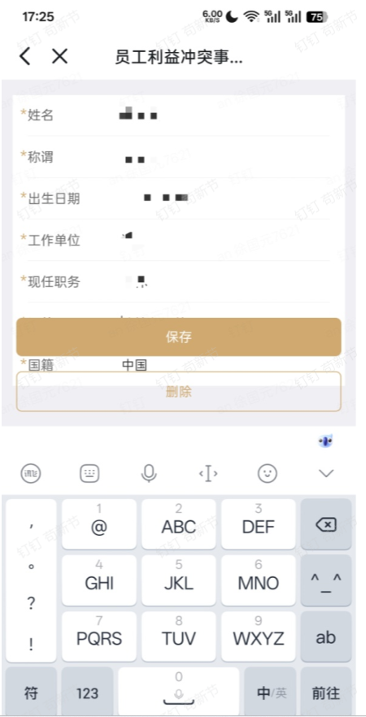

# 移动端软键盘弹出，fixed 底部按钮被顶上去？

[[toc]]

在移动端开发表单页面时，经常会遇到一个经典问题：

> 当输入框获取焦点，软键盘弹出后，底部 `position: fixed` 按钮被顶上去。

比如：

* 底部「保存」按钮
* 底部提交栏
* 操作工具条

尤其在 `Android` 上表现最明显。

**如图所示**：

正常情况：



异常情况：



## 一、问题本质

在移动端：

* `position: fixed` 是基于 **可视视口（Visual Viewport）**
* 软键盘弹出后
* 浏览器会改变可视区域高度

于是：

```
viewport 变小
fixed 重新计算位置
按钮被顶上去
```

⚠️ 这不是 CSS 写错，而是浏览器机制问题。

## 二、不同平台差异

| 平台              | 表现          |
| --------------- | ----------- |
| iOS Safari      | 新版大多正常      |
| Android Chrome  | 会 resize 视口 |
| Android WebView | 可能更严重       |
| 企业微信            | 常被顶上去       |

## 三、解决方案汇总

我们从“简单 → 稳定 → 高级”依次分析。

### 方案一：使用 Flex 布局替代 fixed（最推荐）

不要让按钮脱离文档流。

```html
<div class="page">
  <div class="content">
    表单内容
  </div>
  <div class="footer">
    <button>保存</button>
  </div>
</div>
```

**CSS**

```css
html, body {
  height: 100%;
  margin: 0;
}

.page {
  height: 100vh;
  display: flex;
  flex-direction: column;
}

.content {
  flex: 1;
  overflow-y: auto;
}

.footer {
  padding: 16px;
  background: #fff;
}
```

 **优点**

* 不依赖 JS
* 不受键盘影响
* 稳定性最高
* 企业项目首选

 **缺点**

* 页面结构需要重构

### 方案二：使用 100dvh（现代浏览器推荐）

传统的 `100vh` 在移动端是有问题的。

现代浏览器支持：

```css
.page {
  height: 100dvh;
}
```

**dvh 是什么？**

* dynamic viewport height
* 会根据软键盘动态变化

**优点**

* 代码简单
* 现代浏览器支持好

**缺点**

* 老浏览器不支持

### 方案三：键盘弹出时隐藏底部按钮

如果输入时不需要按钮：

```js
window.addEventListener('resize', () => {
  const footer = document.querySelector('.footer')

  if (window.innerHeight < window.screen.height * 0.75) {
    footer.style.display = 'none'
  } else {
    footer.style.display = 'block'
  }
})
```

**优点**

* 实现简单
* 适合搜索页等场景

**缺点**

* 体验一般
