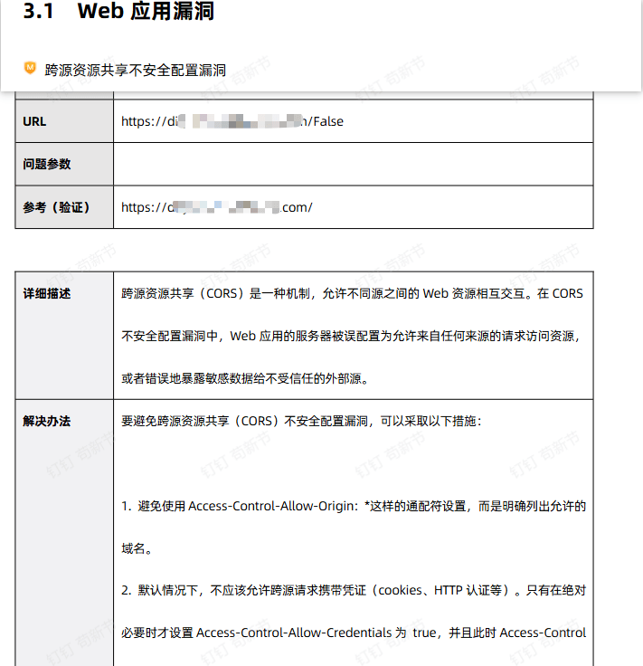
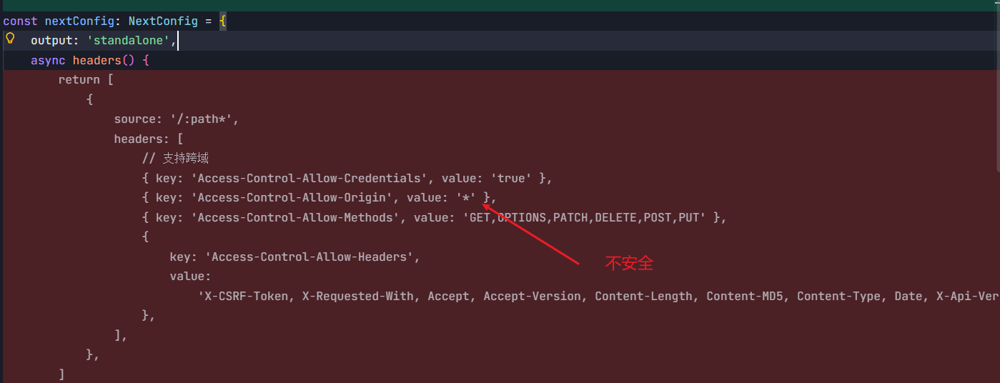
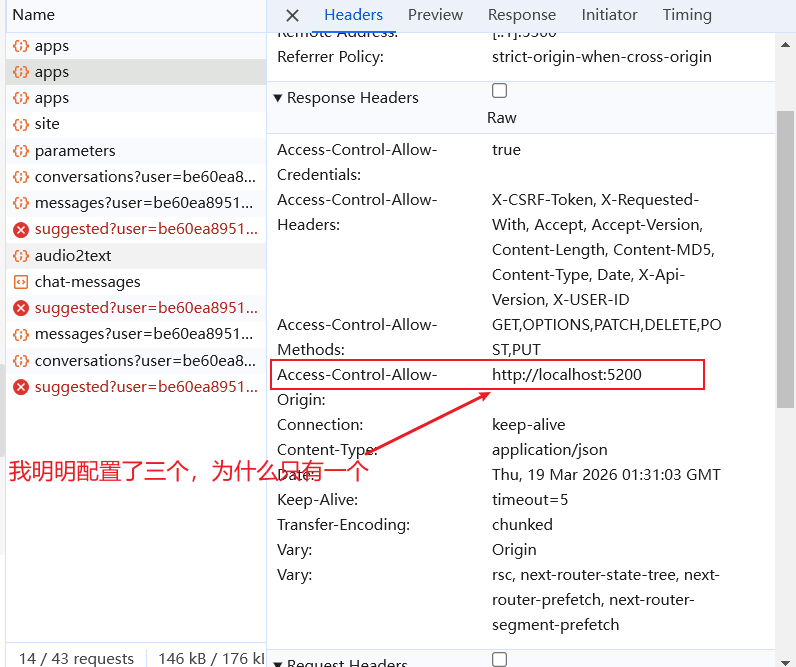

# 一次 CORS 漏洞修复复盘：从“全放开”到“按来源精确放行”

最近在漏洞扫描中，我们命中了一个典型的安全问题：**跨源资源共享（CORS）配置不安全**。这篇文章把前因后果、排查过程、误区、落地方案和经验沉淀完整记录下来，给后续同类问题提供可复用模板。

## 一、问题背景

- 漏扫报告指出平台存在 CORS 风险，核心点是服务端允许了过宽的跨域访问策略。
- 原配置属于“方便联调、但生产高风险”的类型：跨域头全局下发，且来源策略过于宽松。
- 业务现状是前端（react-app）会跨域调用 platform 的 `/api/client/**` 代理接口，因此 `CORS` 必须可用，但不能“无差别开放”。

**报告截图如下：**

我的代码中确实没有精确配置白名单（`next.config.ts `中没有精确处理）

{width=500}

**问题代码如下：**

{width=500}

## 二、根因分析

根因可以归纳为两条：

- **策略层面**：历史配置偏宽松，不符合生产最小暴露原则。
- **环境层面**：`next.config.ts` 中 设置了 `Access-Control-Allow-Origin: *`

## 三、问题修复

重新改动 `next.config.ts`和环境变量配置，只对 `/api/:path*` 路径加 CORS，不影响页面资源。

`next.config.ts` 改动

```typescript
import type { NextConfig } from 'next'

// 读取环境变量配置
const corsAllowOrigins = (process.env.CORS_ALLOW_ORIGIN ?? '')
 .split(',')
 .map(origin => origin.trim())
 .filter(Boolean)

const corsAllowCredentials = process.env.CORS_ALLOW_CREDENTIALS === 'true'
const escapeRegex = (value: string) => value.replace(/[.*+?^${}()|[\]\\]/g, '\\$&')

const nextConfig: NextConfig = {
 output: 'standalone',
 async headers() {
  if (corsAllowOrigins.length === 0) {
   return []
  }

  const headers = [
   { key: 'Access-Control-Allow-Methods', value: 'GET,OPTIONS,PATCH,DELETE,POST,PUT' },
   {
    key: 'Access-Control-Allow-Headers',
    value:
     'X-CSRF-Token, X-Requested-With, Accept, Accept-Version, Content-Length, Content-MD5, Content-Type, Date, X-Api-Version, X-USER-ID',
   },
   { key: 'Vary', value: 'Origin' },
  ]

  if (corsAllowCredentials) {
   headers.push({ key: 'Access-Control-Allow-Credentials', value: 'true' })
  }
  return corsAllowOrigins.map(origin => ({
   source: '/api/:path*',
   has: [{ type: 'header', key: 'origin', value: `^${escapeRegex(origin)}$` }],
   headers: [...headers, { key: 'Access-Control-Allow-Origin', value: origin }],
  }))
 },
}

export default nextConfig

```

`.env` 环境变量添加以下变量

```env
# CORS 白名单，多个来源用逗号分隔
CORS_ALLOW_ORIGIN="http://localhost:5200,http://127.0.0.1:5200,https://baidu.com"

# 是否允许携带凭证（如 Cookies、HTTP 认证等）
CORS_ALLOW_CREDENTIALS=true
```

## 四、常见疑问

### 4.1 为什么我配置了三个，浏览器中的`access-control-allow-origin:http://localhost:5200`只有一个

如图所示：

{width=500}

这是正常的，**不是配置失败**。

**为什么只看到一个**

- 浏览器每次请求只会带一个 `Origin`。
- CORS 规范要求服务端响应 `Access-Control-Allow-Origin` 也是**单个值**（或 `*`，但你现在禁用 `*` 了）。
- 你配置多个白名单的意义是：**不同来源的请求来时，各自命中并回写自己的 origin**，而不是一次响应返回 3 个 origin。

你现在的规则就是这个逻辑（按请求头 `origin` 精确匹配）：

所以当你从 `http://localhost:5200` 发请求，浏览器里看到：

- `access-control-allow-origin: http://localhost:5200`
这正是预期行为。
