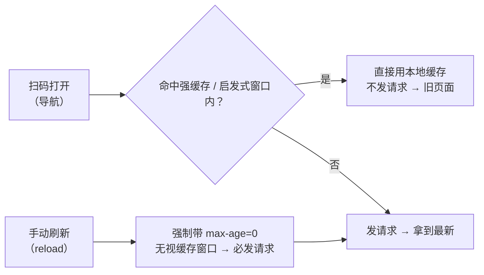
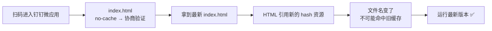

# 钉钉微应用页面缓存问题治理

[[toc]]

> **主题**：解决钉钉内置 WebView 里 H5 微应用的页面缓存问题——"发版了，用户打开还是旧页面"。
>
> 本文把整件事的**来龙去脉**讲清楚：问题从哪来（钉钉 WebView 的缓存特性）→ 中间试过哪些手段、为什么都没根治 → 最后怎么在 Nginx 上找到真正的根因并彻底解决。
>
> **结论先行**：缓存头必须落到**服务端响应头**这一层才能根治；而这次真正卡住的，也不是缓存算法，是**部署架构认知**——这个项目是 `proxy_pass` 反向代理，不是 Nginx 直接托管静态文件。


## 一、来龙去脉：一次缓存治理的完整时间线

三篇文章讲的其实是同一件事的三个阶段。先看全貌：

| 阶段 | 起因 | 现象 | 定位与处置 | 结论 |
|------|------|------|-----------|------|
| **① 初始需求** | 发版后钉钉里打开还是旧页面 | 旧页面 | 分析出钉钉 WebView 遵循 HTTP 缓存；尝试常规手段：HTML `meta` 禁缓存、构建产物加 hash、服务端 `no-cache`、后台改首页地址加版本号 | 基础配置，能缓解，但**管不住"用户此刻拿到的是哪一版"** |
| **② 应用层兜底** | 想解决"用户使用中也能感知发版" | 扫码进旧、刷新进新、**反复横跳**；且"弹过提示、点过刷新"的用户，下次进来**又变旧且不再提示** | 定位到两个致命点：扫码走"服从缓存"路径、刷新走"强制验证"路径；以及刷新前就把版本号写进 `localStorage`，而 `reload()` 在钉钉 WebView 里破不了缓存 → 本地状态被"写脏"，检测永久失效。处置：改为 HTML 内嵌版本 + 加载前自检 + 换 URL 强制重载 | 仍是**应用层兜底**，治标不治本 |
| **③ 服务端根治** | 在 Nginx 上落实缓存头 | 加完配置，`/assets/*.js` 全部 **404**，页面白屏 | 按顺序排掉五个坑：请求头≠响应头 → `always` 缓存 404 → **真正根因：反向代理架构下新增的 location 块缺 `proxy_pass`，请求被截断** | **根治** |

> 回看这条线：①② 阶段都在"应用层"打补丁——可应用层的代码本身就写在**旧 HTML** 里，跑的还是被缓存摆布的那一份；用户不点刷新、或刷新没真正突破缓存，补丁就等于不存在。
>
> 只有把缓存头落到服务端，让"**扫码**"和"**刷新**"走**同一条验证路径**，让入口 HTML 每次导航都去问一次服务器，才是真正的根治。**这正是本文的重点。**


## 二、问题现象（钉钉场景）

| 操作 | 结果 |
|------|------|
| 扫码打开活动链接 | 旧页面 |
| 手动刷新浏览器 | 新页面 |
| 再次扫码 | **又回到旧页面** |
| 发版后首次进入 | 曾弹过"发现新版本"，点刷新后正常 |
| 下次再进入 | **又变旧，且不再提示** |
| 加了 Nginx 缓存配置后 | `/assets/*.js` 变 404，页面白屏 |

一句话概括：**"扫码进旧、刷新进新、反复横跳，加了配置又 404"**。


## 三、钉钉微应用为什么会缓存（机制层来龙去脉）

### 3.1 HTTP 三种缓存策略

要理解"横跳"，先要理解浏览器（含钉钉 WebView）对缓存有三种态度：

| 策略 | 触发条件 | 行为 |
|------|---------|------|
| **强缓存** | 响应头 `Cache-Control: max-age=xxx` | 有效期内**不发请求**，直接用本地缓存 |
| **协商缓存** | 响应头 `no-cache` + `ETag`/`Last-Modified` | 每次**都发请求**验证，304 用缓存 / 200 用新内容 |
| **启发式缓存** | 响应头**没有** `Cache-Control` | 浏览器自己估算新鲜期：`(Date - Last-Modified) × 10%` |

### 3.2 关键：扫码和刷新走的是两条不同的缓存路径



**核心**：`index.html` 响应头里没有 `Cache-Control` 时，浏览器走**启发式缓存**，估算出的"新鲜期"随部署时间漂移、完全不可控。窗口内扫码 → 不发请求 → 命中旧缓存；而刷新带 `max-age=0` 强制验证 → 必然拿到最新。

> "反复横跳"的本质：**扫码走"服从缓存"路径，刷新走"强制验证"路径**，而验证的结果只作用于发起验证的那一个缓存空间（手机钉钉 WebView 和 PC 浏览器甚至不是同一份缓存）。

### 3.3 钉钉 WebView 的特殊性

钉钉内置 WebView 与普通浏览器一样遵循 HTTP 缓存协议，但多了几个特点，让问题更严重：

1. **长驻不销毁**：钉钉会在应用内缓存多个 WebView 实例，用户从会话/工作台反复进出时可能复用已加载的实例，页面状态与缓存一并保留。
2. **缓存策略更激进**：对 H5 静态资源通常开启强缓存（`max-age`），部分网络环境下还会命中 CDN 缓存。
3. **无刷新入口**：普通浏览器有"刷新按钮"，而钉钉 WebView 大多没有，用户**无法手动强制刷新**，只能"认命"看到旧页面。

### 3.4 第二层根因：SPA 的 `index.html` 就是版本入口

SPA 的 `index.html` 里引用的是带 hash 的 chunk，**旧 HTML 引用旧 chunk，整个应用就都是旧版本**。所以缓存治理的起点，就是**让 `index.html` 每次导航都向服务器验证**。

> 这就决定了必须"两条腿走路"：
> - **HTML 不缓存**（`no-cache, must-revalidate`）——每次导航都验证；
> - **带 hash 的资源长缓存**（`max-age=31536000, immutable`）——内容变了文件名就变，不可能复用旧缓存；没变则高效复用，二次访问秒开。
>
> 注意：`index.html` 里的 `<meta http-equiv="Cache-Control">` 只能作为**无法控制响应头时的兜底**——它**仅对 HTML 自身生效，对 JS/CSS 无效**，真正决定资源缓存的是服务端响应头。

### 3.5 结论

要让"扫码"也走验证路径，必须给 `index.html` 显式配置 **`no-cache`**——这就是整个缓存治理的起点，而它只能落在服务端响应头上。


## 四、落地第一步：加上服务端缓存头

| 层 | 配置 | 目的 |
|----|------|------|
| HTML | `Cache-Control: no-cache, must-revalidate` | 每次导航都验证，不再命中启发式缓存 |
| assets | `Cache-Control: public, max-age=31536000, immutable` | 带 hash 的资源长缓存，二次访问秒开 |

于是运维在 Nginx 上加了这样一段：

```nginx
server {
    ...
    add_header Cache-Control "no-cache, must-revalidate" always;

    location /assets/ {
        add_header Cache-Control "public, max-age=31536000, immutable" always;
    }
}
```

**就是从这一刻起，坑开始一个接一个地出现。**


## 五、上线踩坑实录（按排查顺序）

### 5.1 坑一：请求头 ≠ 响应头

加完配置后验证，浏览器里看到：

```
/ 的 Cache-Control: max-age=0
version.json?_=... 的 Cache-Control: no-cache
```

乍一看"好像生效了"，**其实这两个都是请求头（Request Headers），不是响应头（Response Headers）**。

| 板块 | 含义 | 谁决定缓存 |
|------|------|-----------|
| Request Headers | 浏览器**发给**服务器的 | ❌ 不影响缓存策略 |
| Response Headers | 服务器**返回给**浏览器的 | ✅ **决定缓存的关键** |

- `/` 的 `max-age=0` 是浏览器刷新时自动加的"强制验证"；
- `version.json` 的 `no-cache` 是前端代码主动加的。

**真正要看的是 Response Headers 里有没有 `no-cache`。** 用 curl 直接看响应头，才发现四个路径的 Response Headers 里**一个 `Cache-Control` 都没有**——配置根本没作用到实际请求。

### 5.2 坑二：`always` 让 404 被缓存一年

继续排查，浏览器 F12 里出现了一句致命的：

```
Status Code: 404 Not Found (from disk cache)
```

一个 **404 竟然被浏览器缓存了**。原因在配置里的 **`always`**：

```nginx
location /assets/ {
    add_header Cache-Control "public, max-age=31536000, immutable" always;
    #                                                         ↑ 元凶
}
```

`always` 的含义是"**无论什么状态码都加这个头**"，于是：

```
assets 文件还没部署好时
  → 浏览器请求 JS → 服务器 404
  → 因为 always，404 也带上了 max-age=31536000, immutable
  → 浏览器把「404」当正常资源缓存一年
  → 之后文件就算部署好了，浏览器也直接读缓存的 404，永远不再请求服务器
```

**教训**：`always` 用在 HTML 的 `no-cache` 上无害，用在 assets 的**长缓存**上，会把 404 也"保鲜"一年。assets 的 `add_header` **不能带 `always`**。

### 5.3 坑三（真正的根因）：反向代理架构 + location 截断请求

去掉 `always` 后，404 依然存在。这时用户抛出一个关键质疑：

> "没加配置之前是好的，加完就不行了，怎么解释？"

顺着这条线索，看到**完整 server 块**后，真相大白——**这个 Nginx 是反向代理，不是静态托管**：

```nginx
server {
    ...
    location / {
        proxy_pass http://k8sPbsESGWebUat;   # ← 请求转发给 K8s 后端，文件根本不在 Nginx 本机
    }
    location /assets/ {
        add_header Cache-Control "public, max-age=31536000, immutable";
        # ← 这里只有 add_header，没有 proxy_pass！
    }
}
```

**根因**：`/assets/xxx.js` 匹配 `location /assets/`（比 `location /` 更具体），但这个块里**没有 `proxy_pass`**。于是请求**不再转发给后端**，Nginx 只能在本机目录找文件 → 404。

| 阶段 | `/assets/xxx.js` 的走向 | 结果 |
|------|------------------------|------|
| 加配置前 | 走 `location /` → `proxy_pass` 转发后端 | ✅ 200 |
| 加配置后 | 被 `location /assets/` 截住，无 `proxy_pass` → 本机找不到 | ❌ 404 |

**这就是"加了配置才坏"的完整答案**：不是 `add_header` 的错，而是**新加的 location 块"截断"了请求，却没把它转交给后端**。

顺带解释了另一个怪象：`/index.html` 一度返回 404——当时加的 `location = /index.html` 同样是只有 `add_header` 没有 `proxy_pass`，把原本走 `location /` 的请求截断了。

### 5.4 弯路：一度误判"文件没部署"

排查中途，因为 curl 一直返回 404，曾误判为"assets 目录没部署上去"。用户一句"之前 Jenkins 部署一直正常"点醒了排查方向。

**教训**：`add_header` 物理上不可能导致 404（它只往响应里加字段，不参与文件查找）。404 只有两种可能——文件真不在，或路径解析错误。而"加配置前正常、加配置后 404"这种**时间相关性**，最该怀疑的是**配置改动本身**，而不是部署。


## 六、最终配置：让扫码与刷新走同一条路

### 6.1 正确配置（反向代理架构）

```nginx
server {
    listen 443 ssl;
    listen 80;
    if ($scheme = http) {
        rewrite ^(.*)$ https://$host$1 permanent;
    }

    server_name  esg-web.uat.fosun.com;
    # ... access_log / error_log / ssl 证书保持不变 ...

    # HTML / version.json 等：no-cache（server 块默认，所有 location 继承）
    add_header Cache-Control "no-cache, must-revalidate" always;

    # 所有请求转发到后端
    location / {
        proxy_pass http://k8sPbsESGWebUat;
    }

    # assets：长缓存 + 转发后端（关键：必须有 proxy_pass，且不能带 always）
    location /assets/ {
        add_header Cache-Control "public, max-age=31536000, immutable";
        proxy_pass http://k8sPbsESGWebUat;
    }
}
```

上面配置的作用是：Nginx 只是个反向代理，请求最终被转发到 K8s 集群里由 k8sPbsESGWebUat 这个 Service 背后的 Pod 来处理。 用户访问的是你的 Nginx 域名（esg-web.uat.fosun.com）。

### 6.2 三个关键点

1. **`location /assets/` 必须带 `proxy_pass`**——否则请求被截断，404；
2. **assets 的 `add_header` 不能带 `always`**——否则 404 被缓存一年；
3. **反向代理架构下不需要 `try_files`**——SPA 路由回退由后端（`k8sPbsESGWebUat`）负责，Nginx 只管转发。

### 6.3 为什么这样就根治了（闭环）



入口 `index.html` 一旦 `no-cache`，**扫码和刷新的行为就被拉齐了**：都得先向服务器验证一次 → 必得拿到最新 HTML → HTML 里的 chunk 文件名是新的 → 旧缓存天然失效。整条链路不再依赖用户在应用里"点一下刷新"，这才叫根治。

> 补充：若前面还有 **CDN**，必须同步把 `index.html` / `version.json` 设为不缓存或极短 TTL，否则服务端的头会被 CDN 的缓存挡住。


## 七、验证

```bash
curl -s -o /dev/null -w "%{http_code}\n" https://esg-web.uat.fosun.com/assets/vant-vendor-sw567x7T.js
# 200

curl -sI https://esg-web.uat.fosun.com/activity-check-in | grep -i cache-control
# Cache-Control: no-cache, must-revalidate
```

| 请求 | 最终状态 |
|------|---------|
| `/`、`/activity-check-in` | 200 + `no-cache, must-revalidate` ✅ |
| `/assets/*.js` / `*.css` | 200 + `public, max-age=31536000, immutable` ✅ |
| `/version.json` | 200 + `no-cache, must-revalidate` ✅ |

> 验证要点：**只看 Response Headers**——用 `curl -I` 或 F12 的 Network → Response Headers，不要被 Request Headers 里的 `max-age=0` / `no-cache` 误导。


## 八、经验总结

| 坑 | 一句话教训 |
|----|-----------|
| 启发式缓存 | 响应头没有 `Cache-Control` 时，浏览器会自己估算新鲜期（`(Date-Last-Modified)×10%`），导致"扫码旧、刷新新"的横跳 |
| 钉钉 WebView | 长驻不销毁、缓存更激进、无刷新入口，普通浏览器的经验在这里不成立 |
| 请求头/响应头 | 排查缓存问题时，**只看 Response Headers**；`max-age=0` 出现在 Request Headers 是刷新行为，不代表配置生效 |
| `always` | 长缓存头一旦带 `always`，404 也会被缓存一年；`always` 只适合 no-cache 这类"验证型"头 |
| 反向代理 vs 静态托管 | 看到 `proxy_pass` 就知道是反向代理：文件不在 Nginx 本机，`try_files`/`root` 都无关，SPA 回退由后端负责 |
| location 截断请求 | **新增任何 location 块，都必须带齐它要处理的指令**（这里是 `proxy_pass`），否则会把原走 `location /` 的请求"截住"后遗弃 |
| 时间相关性 | "加了配置才坏"最该怀疑配置本身，而不是凭空推断"文件没部署" |
| 应用层兜底治标 | 前端的版本检测/自检类手段，代码本身就运行在旧 HTML 里，用户不刷新或刷新没突破缓存就等于失效；**根治必须回到响应头** |

> **核心结论**：一次缓存治理，最终暴露出的并不是缓存算法的问题，而是**部署架构认知**的问题——这个项目是 `proxy_pass` 反向代理，而不是 Nginx 直接托管静态文件。搞清楚"**文件到底在哪一层、请求最终被谁处理**"，是排查 Nginx 缓存与 404 问题的第一前提。

### 一页速查

```
现象：钉钉里扫码进旧、刷新进新、反复横跳
  ↓
机制：index.html 响应头缺 Cache-Control → 浏览器启发式缓存
      扫码"服从缓存"不发请求；刷新带 max-age=0 强制验证 → 两条路径不一致
  ↓
根治：Nginx 分层响应头
      HTML   → Cache-Control: no-cache, must-revalidate    （可带 always）
      assets → Cache-Control: public, max-age=31536000, immutable（不能带 always）
      ↓
落地：每个 location 块都要带齐 proxy_pass（反向代理下无 try_files）
  ↓
验证：curl -I 只看 Response Headers，确认三个路径的缓存头正确
```
