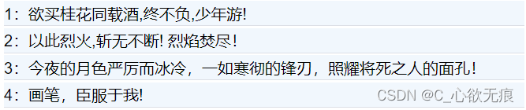
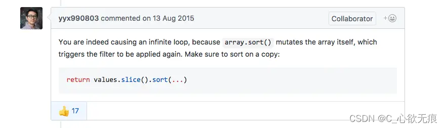

# vue 使用 sort 排序时报死循环错误

[[toc]]

## 问题描述：

在做一个项目的过程中，需要对后端返回的数据做`sort()`排序处理，然后使用 v-for 指令渲染页面数据；视图虽然渲染出来了，但是控制台报错如下：   

```js
// 组件渲染函数中可能有一个无限更新循环
You may have an infinite update loop in a component render function
```

## 1，报错的代码如下：

```javascript
 <div class="list">
      <ul v-for="(item, index) in sortList(copyTextList)" :key="index">
        <li class="item">{{ index + 1 }}：{{ item.text }}</li>
      </ul>
    </div>
  export default {
    data() {
    return {
      // 多行文本进行复制
      copyTextList: [],
    };
  },
   mounted() {
    this.initList();
  },
    methods: {
      // 请求数据
    async initList() {
      const { isSuccess, data, code } = await api.requestList.queryCopyList();
      if (isSuccess) {
        this.copyTextList = data;
      }
    },
    // 排序操作
    sortList(list) {
       let sortList = list.sort((a, b) => {
        return a.num - b.num;
      });
      return sortList;
    }
  }

```

**运行效果图如下：**

{width=70%}

如上代码所示：先在 mounted 里面请求数据，然后赋值给 data 里面的`copyTextList`数组，v-for 的时候再对数组进行排序操作；

## 2，问题分析

`问题产生的原因`：你在 data 中定义了一个响应式变量，而这个响应式变量的状态是通过一个函数来返回的，返回的状态结果要显示在 Dom 中，而这个函数的内部是一个循环；

`问题来了`：循环没有及时终止，导致变量一直在更新，而 Dom 又一直在渲染，无限循环，渲染-更新 卡死；

## 3，解决方案

### 第一种

具体问题不一样，但都是死循环类型，所以处理方式也是差不多的。就是不直接对响应式数据进行操作，对响应式数据的副本进行排序然后并返回计算结果；

下面是`尤玉溪`在 github 上面给出的解决方案；先使用一个空的 slice 方法，然后在使用 sort 排序方法；不能直接使用 sort 方法；因为 sort 方法会改变原数组，从而导致多次渲染；

 而数组的 slice() 方法返回一个新的数组对象，这一对象是一个由 begin 和 end 决定的原数组的浅拷贝（包括 begin，不包括 end）。原始数组不会被改变。

`所以` 上面我的错误代码可以改为：

```javascript
 // 排序操作
    sortList(list) {
       let sortList = list.slice().sort((a, b) => {
        return a.num - b.num;
      });
      return sortList;
    }
```

### 第二种

与上面的思路相同；深拷贝一下原数组然后再进行排序：

```javascript
  // 排序操作
 sortList(list) {
      let sortList =JSON.parse(JSON.stringify(list)).sort((a, b) => {
        return a.num - b.num;
      });
      return sortList;
    },
```

### 第三种

这一种方法也能解决问题，但是比较麻烦一点：不推荐使用其实出现报错的根源就在于把数组定义到了 vue 实例的 data 里面，因为 vue 初始化时会把 data 里面的所有数据都添加响应式依赖；会监听数组的变化然后做出一些渲染；那我把数据不定义到 vue 实例里面不就可以了吗；看以下代码改动：

> 我把`copyTextList` 定义到了最上面；然后对他赋值然后直接进行 sort 排序；排完之后再次赋值给一个 data 里面的`newList`让它进行渲染视图；

```javascript
<template>
    <div class="list">
      <ul v-for="(item, index) in newList" :key="index">
        <li class="item">{{ index + 1 }}：{{ item.text }}</li>
      </ul>
    </div>
</template>

<script>
import api from '../../api';
// 把数据定义到了外面
let copyTextList = [];
export default {

  data() {
    return {
      newList: [],
    };
  },
  mounted() {
    this.initList();
  },

  methods: {
    // 请求数据
    async initList() {
      const { isSuccess, data, code } = await api.requestList.queryCopyList();
      if (isSuccess) {
        copyTextList = data;
        this.sortList(copyTextList);
      }
    },
    // 排序操作
    sortList(list) {
      this.newList = list.sort((a, b) => {
        return a.num - b.num;
      });
    },
  },
};
```
