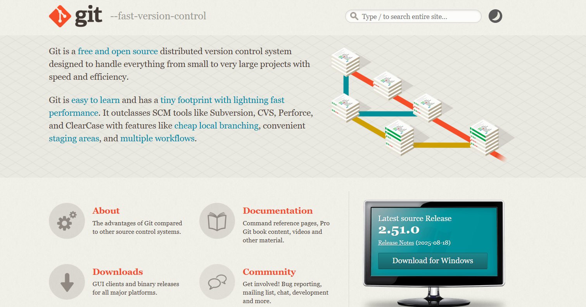

# Git 安装与常用命令指南



`Git` 是一个分布式版本控制软件，用于管理代码的版本。

`Git` 是目前最流行的分布式版本控制系统，无论是个人开发还是团队协作，`Git` 都能高效地管理代码版本。

## 一、Git 安装

### Windows 系统

1. 访问 Git 官网下载页面：https://git-scm.com/download/win
2. 下载适用于 Windows 的安装程序
3. 运行安装程序，按照提示完成安装
4. 安装完成后，在命令行输入 `git --version` 验证安装

### macOS 系统

**使用 Homebrew 安装：**

```bash
brew install git
```

**或下载官方安装程序：** 访问 https://git-scm.com/download/mac

### Linux 系统

**Ubuntu/Debian：**

```bash
sudo apt-get update
sudo apt-get install git
```

**CentOS/Fedora：**

```bash
sudo yum install git
# 或
sudo dnf install git
```

## 二、Git 配置

安装完成后，首先需要配置用户信息：

```bash
git config --global user.name "你的用户名"
git config --global user.email "你的邮箱"
```

查看配置信息：

```bash
git config --list
```

## 三、Git 常用命令

### 1. 基本操作命令

| 命令                     | 描述                             |
| ------------------------ | -------------------------------- |
| `git init`               | 初始化一个新的 Git 仓库          |
| `git status`             | 显示工作目录和暂存区的状态       |
| `git status --short`     | 以简短格式显示状态信息           |
| `git status --porcelain` | 以机器可读的格式显示状态信息     |
| `git branch`             | 列出所有本地分支                 |
| `git branch -a`          | 列出所有本地和远程分支           |
| `git branch -v`          | 列出所有本地分支及其最新提交信息 |
| `git log`                | 显示提交历史                     |
| `git log --oneline`      | 以一行形式显示提交历史           |
| `git log --graph`        | 以图形方式显示提交历史           |
| `gitk`                   | 图形化显示提交历史               |
| `git remote`             | 列出所有远程仓库                 |
| `git remote -v`          | 详细列出所有远程仓库及其 URL     |
| `git config --list`      | 列出所有 Git 配置项              |
| `git config user.name`   | 查看用户名                       |
| `git config user.email`  | 查看邮箱地址                     |

### 2. 文件操作命令

| 命令                              | 描述                                         |
| --------------------------------- | -------------------------------------------- |
| `git add <file>`                  | 添加指定文件到暂存区                         |
| `git add .`                       | 添加所有已修改的文件到暂存区                 |
| `git add -A`                      | 添加所有已修改的文件和未跟踪的新文件到暂存区 |
| `git reset <file>`                | 从暂存区中取消暂存指定文件                   |
| `git reset .`                     | 从暂存区中取消暂存所有文件                   |
| `git reset --hard`                | 取消所有暂存的更改，恢复到上次提交的状态     |
| `git commit -m "Commit message"`  | 提交暂存区中的更改                           |
| `git commit -am "Commit message"` | 提交所有已修改的文件，并添加到暂存区         |
| `git checkout -- <file>`          | 撤销工作目录中的更改                         |
| `git reset HEAD <file>`           | 取消暂存区中的更改                           |
| `git checkout <commit> <file>`    | 恢复指定提交中的文件版本                     |
| `git checkout <branch> <file>`    | 从指定分支恢复文件版本                       |

### 3. 分支操作命令

| 命令                                   | 描述                            |
| -------------------------------------- | ------------------------------- |
| `git branch <branch-name>`             | 创建新分支                      |
| `git checkout -b <branch-name>`        | 创建并切换到新分支              |
| `git switch -c <branch-name>`          | （Git 2.23+）创建并切换到新分支 |
| `git checkout <branch-name>`           | 切换到指定分支                  |
| `git switch <branch-name>`             | （Git 2.23+）切换到指定分支     |
| `git branch -d <branch-name>`          | 删除已合并的本地分支            |
| `git branch -D <branch-name>`          | 强制删除本地分支（即使未合并）  |
| `git merge <branch-name>`              | 将指定分支合并到当前分支        |
| `git merge --no-commit <branch-name>`  | 合并更改但不提交                |
| `git log --graph --oneline --decorate` | 以图形方式显示分支关系          |

### 4. 远程仓库操作命令

| 命令                                        | 描述                                                  |
| ------------------------------------------- | ----------------------------------------------------- |
| `git remote add <name> <url>`               | 添加新的远程仓库                                      |
| `git fetch <remote>`                        | 从远程仓库获取最新的更改                              |
| `git fetch <remote> <branch>`               | 从远程仓库获取指定分支的更改                          |
| `git pull <remote> <branch>`                | 从远程仓库拉取更改并合并到当前分支                    |
| `git pull`                                  | 从默认远程仓库（通常是 `origin`）拉取并合并到当前分支 |
| `git push <remote> <branch>`                | 将本地分支的更改推送到远程仓库                        |
| `git push`                                  | 将当前分支的更改推送到默认远程仓库（通常是 `origin`） |
| `git push --set-upstream <remote> <branch>` | 设置远程分支的追踪关系，并推送更改                    |
| `git push <remote> --delete <branch>`       | 删除远程仓库中的分支                                  |

### 5. 其他常用命令

| 命令                           | 描述                                         |
| ------------------------------ | -------------------------------------------- |
| `git tag <tag-name>`           | 创建新标签                                   |
| `git push <remote> <tag-name>` | 将标签推送到远程仓库                         |
| `git tag`                      | 列出所有本地标签                             |
| `git describe`                 | 显示最近的标签                               |
| `git reset <commit>`           | 将暂存区恢复到指定提交的状态                 |
| `git reset --hard <commit>`    | 将工作目录恢复到指定提交的状态               |
| `git reset --soft <commit>`    | 只移动当前分支的指针，不改变暂存区或工作目录 |
| `git diff > patchfile.patch`   | 导出补丁文件                                 |
| `git apply patchfile.patch`    | 应用补丁文件                                 |
| `git stash`                    | 暂存当前工作目录中的所有更改                 |
| `git stash list`               | 列出所有暂存记录                             |
| `git stash apply`              | 恢复暂存的更改                               |
| `git stash pop`                | 恢复暂存的更改并删除记录                     |

## 四、实用技巧和工作流程

### 1. 忽略文件

创建 `.gitignore` 文件来指定需要忽略的文件和目录，例如：

```
# 忽略日志文件
*.log

# 忽略编译生成的文件
build/
dist/

# 忽略IDE配置文件
.vscode/
.idea/
```

### 2. 典型工作流程

```bash
# 克隆远程仓库
git clone <repository-url>

# 创建新分支进行功能开发
git checkout -b feature/new-feature

# 添加和提交更改
git add .
git commit -m "实现新功能"

# 推送到远程仓库
git push origin feature/new-feature

# 创建拉取请求（在代码托管平台上完成）
```

### 3. 解决冲突

当合并分支遇到冲突时：

1. 打开冲突文件，找到冲突标记（<<<<<<<, =======, >>>>>>>）
2. 手动解决冲突，保留需要的代码
3. 添加解决后的文件：`git add <file>`
4. 完成合并：`git commit`
