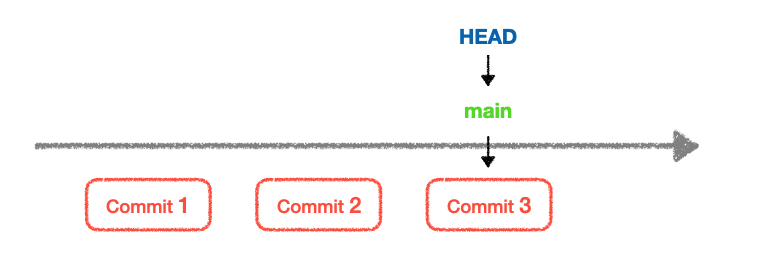
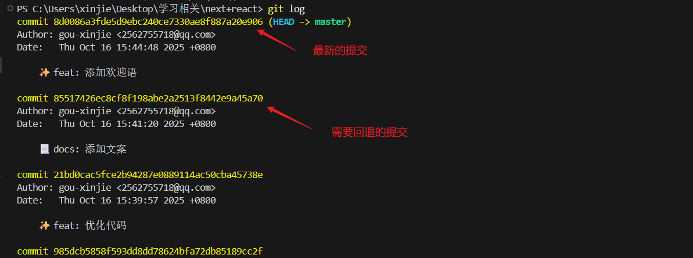
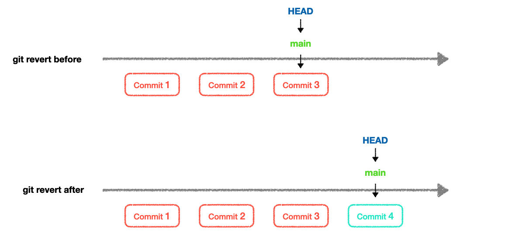
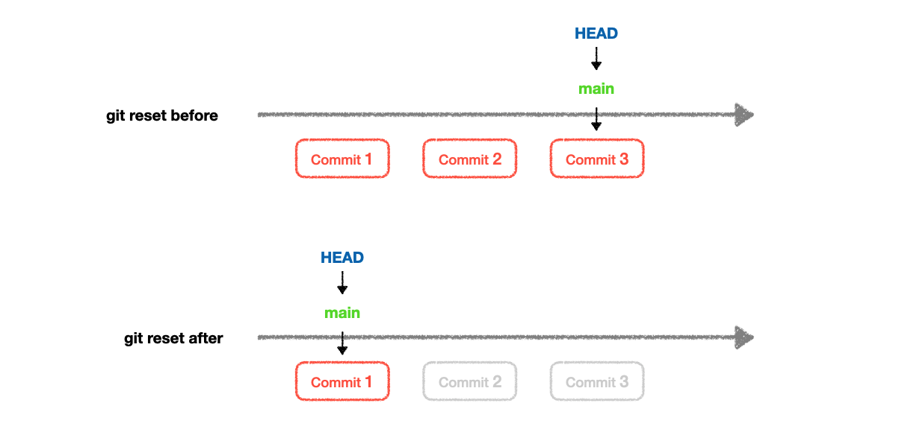

# git 版本回退的两种方式

[[toc]]

只要执行了 `commit` 命令，也就是 `git commit -m '描述'` 就会生成一个提交记录，这个提交记录就有一个唯一的哈希值。有了哈希值就可以回退到前面的提交记录。不能回退最新的提交记录（因为最新的你回不回退没有任何区别）。

**git 提交时间线如下：**




`HEAD` 是指向当前分支最新提交的指针。



## 一、两种回退方式

`git 撤销已 push`代码的方式有两种：`git revert` 和 `git reset`；

`reset` 是重置的意思，`revert` 是恢复、还原的意思，第一感觉 `reset` 的效果比 `revert` 更猛一些，实际情况也的确如此。区别如下：

### 1. git revert 方式

- `1. git revert`：创建一个新的提交来撤销之前的提交；

  - `git revert` 是一种安全的方式来撤销提交。
  - **它会创建一个新的提交记录，这个提交的内容是撤销指定提交的更改。**

**图解如下：**



### 2. git reset 方式

- `git reset`：回退到指定的提交
  - 可以将当前分支的指针回退到指定的提交
  - **注意：`git reset` 会丢弃指定提交之后的所有提交记录，所以在使用时要非常小心。**

**图解如下：**



::: tip

使用这两种撤销时都需要先执行 `git log` 命令查看提交历史，复制要撤销的提交的哈希值。

:::

## 二、 使用 git revert 撤销

### 1. 复制要撤销的提交的哈希值

终端执行 `git log` 命令，复制要撤销的提交的哈希值。

```bash
git log
```

也就是：`8d0086a3fde5d9ebc240ce7330ae8f887a20e906`

### 2. 执行 git revert 命令

```bash
git revert 8d0086a3fde5d9ebc240ce7330ae8f887a20e906
```

::: tip

git revert 命令可没有 --hard 选项。git reset 命令有 --hard 选项(硬回退)。

:::

## 三、使用 git reset 撤销

### 1. 复制要撤销的提交的哈希值

终端执行 `git log` 命令，复制要撤销的提交的哈希值。

```bash
git log
```

也就是：`8d0086a3fde5d9ebc240ce7330ae8f887a20e906`

### 2. 执行 git reset 命令

```bash
git reset --hard 8d0086a3fde5d9ebc240ce7330ae8f887a20e906
```

**git reset 选项总结**

| 选项               | 命令示例                  | 影响范围                                      | 适用场景                       | 危险程度        |
| ------------------ | ------------------------- | --------------------------------------------- | ------------------------------ | --------------- |
| **--soft**         | `git reset --soft HEAD^`  | 只撤销 commit，保留**工作区**和**暂存区**     | 重新组织提交、修改提交信息     | ⭐☆☆☆☆ 最低     |
| **--mixed** (默认) | `git reset --mixed HEAD^` | 撤销 commit 和**暂存区**，保留**工作区**修改  | 重新选择要提交的文件、撤销暂存 | ⭐⭐☆☆☆ 较低    |
| **--hard**         | `git reset --hard HEAD^`  | 完全撤销 commit、暂存区和工作区的**所有修改** | 彻底放弃最近的所有更改         | ⭐⭐⭐⭐⭐ 最高 |
| **--merge**        | `git reset --merge HEAD^` | 在合并冲突时使用，保留未合并文件状态          | 解决合并冲突、撤销失败的合并   | ⭐⭐⭐☆☆ 中等   |
| **--keep**         | `git reset --keep HEAD^`  | 保留工作区本地修改，冲突时中止操作            | 保留本地修改的同时重置提交     | ⭐⭐☆☆☆ 较低    |

快速选择指南:

| 你的需求                       | 推荐选项         |
| ------------------------------ | ---------------- |
| 只想修改提交信息或重新提交     | `--soft`         |
| 取消提交，重新选择要提交的文件 | `--mixed` (默认) |
| 彻底丢弃所有更改，回到之前状态 | `--hard`         |
| 处理合并冲突后的重置           | `--merge`        |
| 保留本地修改的同时重置提交     | `--keep`         |
