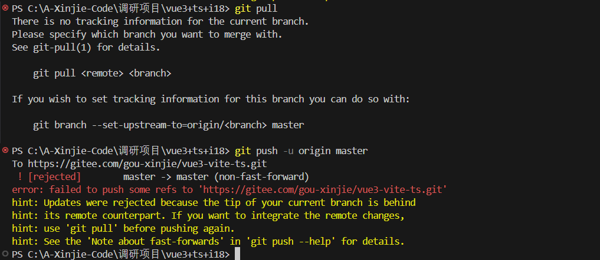

# 工作中常用的git操作(第一部分)

[[toc]]

Git 是一个分布式版本控制系统，它允许开发者有效地协同工作，通过分支管理、变更追踪和历史记录等功能，确保代码的完整性和项目的协同效率，同时还支持错误回滚和代码审查。

## git 常用命令汇总

| 命令类别         | 命令                                        | 描述                                                  |
| ---------------- | ------------------------------------------- | ----------------------------------------------------- |
| **基本操作**     | `git init`                                  | 初始化一个新的 Git 仓库                               |
|                  | `git status`                                | 显示工作目录和暂存区的状态                            |
|                  | `git status --short`                        | 以简短格式显示状态信息                                |
|                  | `git status --porcelain`                    | 以机器可读的格式显示状态信息                          |
|                  | `git branch`                                | 列出所有本地分支                                      |
|                  | `git branch -a`                             | 列出所有本地和远程分支                                |
|                  | `git branch -v`                             | 列出所有本地分支及其最新提交信息                      |
|                  | `git log`                                   | 显示提交历史                                          |
|                  | `git log --oneline`                         | 以一行形式显示提交历史                                |
|                  | `git log --graph`                           | 以图形方式显示提交历史                                |
|                  | `gitk`                                      | 图形化显示提交历史                                    |
|                  | `git remote`                                | 列出所有远程仓库                                      |
|                  | `git remote -v`                             | 详细列出所有远程仓库及其 URL                          |
|                  | `git config --list`                         | 列出所有 Git 配置项                                   |
|                  | `git config user.name`                      | 查看用户名                                            |
|                  | `git config user.email`                     | 查看邮箱地址                                          |
| **文件操作**     | `git add <file>`                            | 添加指定文件到暂存区                                  |
|                  | `git add .`                                 | 添加所有已修改的文件到暂存区                          |
|                  | `git add -A`                                | 添加所有已修改的文件和未跟踪的新文件到暂存区          |
|                  | `git reset <file>`                          | 从暂存区中取消暂存指定文件                            |
|                  | `git reset .`                               | 从暂存区中取消暂存所有文件                            |
|                  | `git reset --hard`                          | 取消所有暂存的更改，恢复到上次提交的状态              |
|                  | `git commit -m "Commit message"`            | 提交暂存区中的更改                                    |
|                  | `git commit -am "Commit message"`           | 提交所有已修改的文件，并添加到暂存区                  |
|                  | `git checkout -- <file>`                    | 撤销工作目录中的更改                                  |
|                  | `git reset HEAD <file>`                     | 取消暂存区中的更改                                    |
|                  | `git checkout <commit> <file>`              | 恢复指定提交中的文件版本                              |
|                  | `git checkout <branch> <file>`              | 从指定分支恢复文件版本                                |
| **分支操作**     | `git branch <branch-name>`                  | 创建新分支                                            |
|                  | `git checkout -b <branch-name>`             | 创建并切换到新分支                                    |
|                  | `git switch -c <branch-name>`               | （Git 2.23+）创建并切换到新分支                       |
|                  | `git checkout <branch-name>`                | 切换到指定分支                                        |
|                  | `git switch <branch-name>`                  | （Git 2.23+）切换到指定分支                           |
|                  | `git branch -d <branch-name>`               | 删除已合并的本地分支                                  |
|                  | `git branch -D <branch-name>`               | 强制删除本地分支（即使未合并）                        |
|                  | `git merge <branch-name>`                   | 将指定分支合并到当前分支                              |
|                  | `git merge --no-commit <branch-name>`       | 合并更改但不提交                                      |
|                  | `git log --graph --oneline --decorate`      | 以图形方式显示分支关系                                |
| **远程仓库操作** | `git remote add <name> <url>`               | 添加新的远程仓库                                      |
|                  | `git fetch <remote>`                        | 从远程仓库获取最新的更改                              |
|                  | `git fetch <remote> <branch>`               | 从远程仓库获取指定分支的更改                          |
|                  | `git pull <remote> <branch>`                | 从远程仓库拉取更改并合并到当前分支                    |
|                  | `git pull`                                  | 从默认远程仓库（通常是 `origin`）拉取并合并到当前分支 |
|                  | `git push <remote> <branch>`                | 将本地分支的更改推送到远程仓库                        |
|                  | `git push`                                  | 将当前分支的更改推送到默认远程仓库（通常是 `origin`） |
|                  | `git push --set-upstream <remote> <branch>` | 设置远程分支的追踪关系，并推送更改                    |
|                  | `git push <remote> --delete <branch>`       | 删除远程仓库中的分支                                  |
| **其他常用命令** | `git tag <tag-name>`                        | 创建新标签                                            |
|                  | `git push <remote> <tag-name>`              | 将标签推送到远程仓库                                  |
|                  | `git tag`                                   | 列出所有本地标签                                      |
|                  | `git describe`                              | 显示最近的标签                                        |
|                  | `git reset <commit>`                        | 将暂存区恢复到指定提交的状态                          |
|                  | `git reset --hard <commit>`                 | 将工作目录恢复到指定提交的状态                        |
|                  | `git reset --soft <commit>`                 | 只移动当前分支的指针，不改变暂存区或工作目录          |
|                  | `git diff > patchfile.patch`                | 导出补丁文件                                          |
|                  | `git apply patchfile.patch`                 | 应用补丁文件                                          |
|                  | `git stash`                                 | 暂存当前工作目录中的所有更改                          |
|                  | `git stash list`                            | 列出所有暂存记录                                      |
|                  | `git stash apply`                           | 恢复暂存的更改                                        |
|                  | `git stash pop`                             | 恢复暂存的更改并删除记录    


## 业务场景一

### 1.1 把新的项目提交到新建的远程仓库中。 (以`gitee`为例)


::: warning 注意
新建的远程仓库里面必须是空的。如果生成了 `.gitignore` 和 `Readme.md` 文件，需要进行额外的操作，下面会讲到。
:::

命令执行顺序：

```sh
# 步骤 1: 创建本地仓库
git init 

# 步骤 2: 添加文件到仓库
git add .
git commit -m '提交的备注信息'

# 步骤 3: 关联远程仓库
git remote add origin 你的远程仓库地址

# 步骤 4: 推送到远程仓库  master是分支名称,有的仓库默认分支是main 也可以新建分支
git push -u origin master

## -u 这个选项用于设置当前本地分支与远程仓库中的某个分支建立追踪关系；后面直接可以使用 git push命令
## origin 是代表远程仓库的名称，用于区分本地仓库
```

::: tip 提示
**-u** 这个选项用于设置当前本地分支与远程仓库中的某个分支建立追踪关系；然后后面直接可以使用 git push命令 了
 
**origin** 是代表远程仓库的名称，用于区分本地仓库
:::


推送成功：如下图


如果执行上述命令`步骤 4`出现下面的错误：


这种情况说明你在初始化远程仓库时自动生成了 `.gitignore` 和 `Readme.md` 等文件，此时远程参考里面已经有提交记录了，而你本地却没有，所以会出现图上的错误。


---


**表明你的当前分支落后于远程分支 - 解决方案如下：**

1.先建立连接，执行：

```sh
git pull --allow-unrelated-histories origin master
```

这个命令用于从远程仓库拉取最新的更改，并允许合并两个不相关的提交历史。就是把远程仓库中的更改合并到本地仓库中。

::: tip 提示
不要直接使用 **git pull** 命令，因为此时本地和远程两个分支可能是完全独立的，没有历史联系。

会直接报错：'fatal: refusing to merge unrelated histories'
:::


2.解决可能的合并冲突:

这个步骤是远程合并到本地仓库的操作，如果有**冲突**，先解决冲突。 一般是因为远程仓库的文件和本地仓库的文件有相同的名字。

```sh
# 解决冲突后，添加解决后的文件
git add <conflicted-file>
# 提交解决后的更改
git commit -m "Resolve conflicts after pulling from origin/main"
```

3.然后在执行

```sh
git push -u origin master
```

4.提交成功

提交成功：如下图:


 
如果不解决冲突直接执行：`git push -u origin master` 会出现下面的错误：




## 业务场景二

### 2.1 合并本地代码到主分支

> 场景描述：比如我现在在 `develop` 分支上开发，开发完成之后需要把我的代码合并到 `master` 主分支上.
>  develop --> master

命令执行顺序：

```sh
# 步骤 1：确保develop分支的状态是干净的 如果有未提交的更改，要先提交
git status

# 步骤 2: 先切换到 master 分支 并 拉取最新的master分支
git checkout master
git pull origin master

# 步骤 3: 合并develop分支到maste
git merge develop

# 步骤 4: 解决冲突并提交 (如果有冲突，需要解决)
git commit -m "Merge develop into master"

# 步骤 5：推送更改到远程master分支
git push origin master
```

::: tip git status命令
git status 命令用于显示工作目录和版本库的状态。这个命令可以帮助你了解当前工作目录中的文件状态，以及哪些文件已经准备好提交（commit）;如图：


:::

**可以看一下我的操作流程：（截图如下）**

1，先提交develop分支上的内容


2，开始合并到远端master分支


### 2.2 合并主分支的代码到develop分支

场景描述：比如我在 `develop` 分支上开发，如何操作才能拉取到主分支 `master` 的最新代码呢？

**其实这就是上面合并本地代码到主分支的逆向操作。**

命令执行顺序：
```sh
## 步骤1、切换到主分支 并拉取最新的master分支
git checkout master
git pull origin master

## 步骤2、切换回自己的开发分支
git checkout develop

## 步骤3、合并主分支代码，这样就拉取到最新的代码啦
git merge master
```

## 业务场景三

### 3.1 临时保存当前工作目录中的所有更改

> 业务场景描述:我们有时会遇到这样的情况，正在dev分支开发新功能，做到一半时有人过来反馈一个bug，让马上解决，但是新功能做到了一半你又不想提交，这时就可以使用git stash命令先把当前进度（工作区和暂存区）保存起来，然后切换到另一个分支去修改bug，修改完提交后，再切回dev分支，使用git stash  pop来恢复之前的进度继续开发新功能。

命令执行顺序：
```sh
## 步骤1、先临时储存当前分支的更改
git checkout dev
git stash

## 步骤2、然后去解决bug...

## 步骤3、解决bug之后，切回dev分支，恢复之前储存的更改，继续开发新功能
git checkout dev
git stash pop
```
操作截图如下：

1，先切换到dev分支，然后临时储存当前分支的更改，去解决bug


2，解决bug之后，切回dev分支，恢复之前储存的更改，继续开发新功能


::: tip git stash相关命令

git stash save “test1” ：可以为本次存储起名字，方便以后查找使用

git stash pop：恢复具体某一次的版本，如果不指定stash_id，则默认恢复最新的存储进度

git stash apply：将堆栈中的内容应用到当前目录，不同于git stash pop，该命令不会将内容从堆栈中删除，也就说该命令能够将堆栈的内容多次应用到工作目录中，适应于多个分支的情况。

git stash drop [stash_id]：删除一个存储的进度。如果不指定stash_id，则默认删除最新的存储进度
:::

## 业务场景四

### 4.1 修改仓库的远程地址

> 业务场景描述：由于服务器的变动，之前的git远程仓库链接不可用，迁移到新的仓库地址，需要修改本地仓库的远程地址。

命令执行顺序：

```sh
## 步骤1、查看当然的远程仓库地址
git remote -v

## 步骤2、修改远程仓库地址
git remote set-url origin 新的远程仓库地址

## 步骤3、查看新的远程仓库地址
git remote -v

## 步骤4、验证  没提示是最好的提示
git fetch origin
```

## 业务场景五

### 5.1 本地仓库同时关联多个远程仓库（gitee和github）

> 业务场景描述:我这边的项目是在gitee上面管理的，但我想也想在github上面也管理一份，这样方便我同事查看代码。也就是同时关联两个远程仓库。
>

由于我之前已经关联了gitee的远程仓库，所以这次只需要关联github的远程仓库。

命令执行顺序：
```sh
# 步骤1：添加github的远程仓库地址；由于我之前关联的gitee的远程仓库别名是origin，所以github的远程仓库为origin-github，区别一下
git remote add origin-github 你的github远程仓库地址

# 步骤2：验证
git remote -v
```
操作步骤如下：


下次提交代码时，需要同时推送到gitee和github两个仓库：

```sh
git push origin master  # 推送到gitee

git push origin-github master # 推送到github
```


