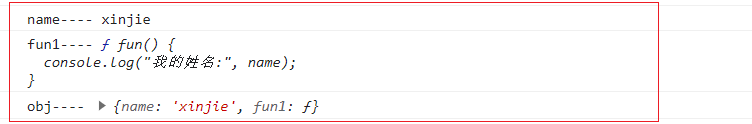

# import()动态导入使用

---

**介绍**

`import()`是 `ES6 中的 ESM 模块`中新增的动态导入语法。它可以让你在运行时异步加载模块。

这对于延迟加载代码片段、按需加载功能或条件性加载模块非常有用。

如果还不太清楚 `ESM 和 CommonJS `规范的区别，可以见这篇文章： 

[ESM 和 CommonJS 规范区别](/column/Node/基础/模块化规范.html)

::: tip 提示 

import 在 ES6 模块规范中，import 默认是静态编译的，也就是在编译过程就已经确认了导入的模块是啥，因此默认是同步的。

import 有引用提升置顶效果，也就是放在何处都会默认在最前面。

但是通过 import()动态引入是异步的，并且是在执行中加载的。 

:::

## 一、import()基本使用

`import()` 函数接收一个模块标识符作为参数，并返回一个 `Promise` 对象。

### 1，基本语法

下面是一个加载本地图片的例子：

```vue
<script setup>
import(`@/assets/images/sign.png`)
  .then((res) => {
    console.log("res----", res);
  })
  .catch((err) => {
    console.log("err----", err);
  });
</script>
```

::: info 成功加载： 

可以看出 default 属性里面的值是图片的地址。 

:::

如果路径错误，则会报错：

::: warning 加载失败： 
Error: Unknown variable dynamic import: ../assets/images/.png 
:::

### 2，根据传参动态加载资源

下面案例是，实现某个函数执行时,根据传参动态加载不同路径的。通常配合 `async` 和 `await` 关键字使用。达到同步的效果。

```vue
<script setup>
const imgSrc = ref("");

loadImgSrc("sign"); // 加载图片

async function loadImgSrc(src) {
  try {
    // 动态导入图片模块
    const modulePath = await import(`@/assets/images/${src}.png`);
    // 将导入的模块路径赋值给 imgSrc
    imgSrc.value = modulePath.default || modulePath;
  } catch (error) {
    console.error("Failed to fetch dynamically imported module:", error);
  }
}
</script>
```

### 3，按需加载模块

通过 `import()` 函数，按需加载模块在真实业务中是很常见的，例如路由组件的懒加载

```js
component: () => import("@/components/button.vue");
```

和动态组件

```js
const MyTest = await import("@/components/MyTest.vue");
```

等等，import() 执行返回的是一个 Promise，所以经常会配合 async/await 一起用。

使用 import() 动态导入模块是一种非常灵活的方式，可以让你在运行时根据不同的条件或用户操作加载不同的模块。这对于优化应用性能、按需加载功能以及条件性加载模块都非常有用。

## 二、import()进阶使用

### 1，可以使用解构语法

动态导入模块时，还可以使用解构语法获取导出的成员。

```vue
<script setup>

async function loadMyJs() {
  const { name, fun, obj, default: myDefault } = await import("./my-module.js");

  console.log("name----", name);
  console.log("fun1----", fun);
  console.log("obj----", obj);
  console.log("myDefault----", myDefault);
}

loadMyJs();
<script>
```

运行如下：



my-module.js

```js
export const name = "xinjie";

export function fun() {
  console.log("我的姓名:", name);
}

export const obj = {
  name: name,
  fun1: () => {
    console.log("fun1的this指向:", this);
  }
};
```

### 2，根据环境导入不同的模块

在服务器端渲染等过程中，可能需要在服务器或浏览器中加载不同的逻辑，因为它们与不同的全局变量或模块交互（例如，浏览器代码可以访问 document 和等 Web API navigator，而服务器代码可以访问服务器文件系统）。

可以通过条件动态导入来执行此操作。

```js
let myModule;

if (typeof window === "undefined") {
  myModule = await import("module-used-on-server");
} else {
  myModule = await import("module-used-in-browser");
}
```

### 3，使用非文字说明符导入模块

动态导入允许任何表达式作为模块说明符，不一定是字符串文字。也可以是我们上面用到过的 `模板字符串动态拼接路径`。

这里，我们同时加载 10 个模块，，，/modules/module-0.js,/modules/module-1.js 等等，并调用 load 每个模块导出的函数。

```js
Promise.all(Array.from({ length: 10 }).map((_, index) => import(`/modules/module-${index}.js`))).then((modules) =>
  modules.forEach((module) => module.load())
);
```
