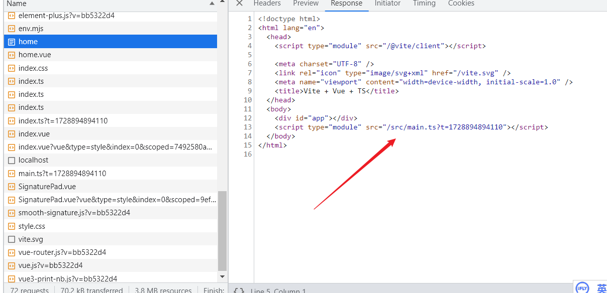

# 客户端渲染和服务器端渲染的区别

## 1、什么是客户端和服务端渲染？

网站渲染可以在服务端和客户端两种环境下进行：

::: tip 客户端渲染

客户端就是你的电脑，或者具体一点，可能是你电脑上打开的浏览器；而服务端就是机房里的服务器。

在客户端渲染中，客户端会先向服务器请求 HTML 文件，服务器会返回一个基础的 HTML 文件，其中包含必要的 JavaScript 脚本。这些脚本在浏览器端运行，
动态请求后端的数据、生成网页内容并渲染到页面上。

:::

用 F12 网络控制台查看加载的网站内容。可以看到刚开始加载的 HTML 文档并不包含网站的数据，只有一个标题、以及一个 JS 脚本。

接下来，浏览器会执行该脚本，并触发后续的数据请求和加载流程，逐渐显示整个页面，所以看到请求的过程是断断续续的。

::: tip 服务端渲染

与客户端渲染相对，服务端渲染是一种将网页在 服务器端 生成并渲染为 HTML 内容的技术。在这种方式下，当用户请求一个网页时，服务器会提前调用后端来获取数据并生成完整的 HTML 文档，然后将其发送到客户端（浏览器）。

浏览器接收到 HTML 后，直接展示页面内容，不用再动态地向后端发送请求来获取数据。

:::

服务端返回的 HTML 文档中，就已经有完整的网站数据和样式了，浏览器只需要解析 HTML 文档并渲染即可。

## 2、二者的优缺点

由于 Ajax、Vue、React 等技术的崛起，现在大多数网站都是基于客户端渲染实现的。

**客户端渲染的优点主要是：**

1.开发方便灵活：开发者不需要区分哪些数据要在服务端加载、哪些数据要在客户端加载，也不用担心哪些 API 无法在服务端使用。

2.减少服务器压力：由于渲染工作由客户端（用户自己的电脑）完成，因此服务器的负载相对较小，只需要提供静态资源。

**服务端渲染的好处是：**

1.减少页面初始加载时间：首次加载时展示完整内容，减少白屏时间，不用等待 JavaScript 加载和执行后才能展示内容。

2.更有利于 SEO，因为搜索引擎爬虫能够直接抓取完整页面的内容，而不依赖于 JavaScript 的执行。

 
**二者的适用场景：**

1.如果你的网站要做 SEO、希望被更多人搜索到，首选服务端渲染，但对服务器配置的要求就更高了；

2.如果你不需要做 SEO，比如面向企业的网站、内部网站、个人学习用的网站，或者是较为复杂、充满各种动态交互的网站，用客户端渲染就好。

能够实现服务端渲染的技术很多，以前有 Java 的 JSP、PHP 等等，现在有基于 React 的 Next.js 和基于 Vue 的 Nuxt.js 框架，可以让你直接用前端的语法开发服务端渲染项目。 

 