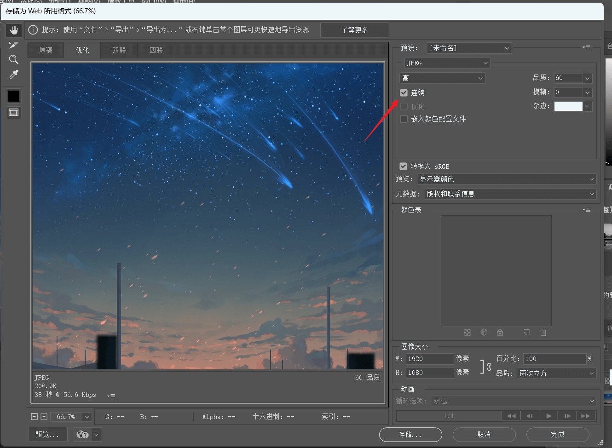

# 网站图片优化方案

## 1. 图片限制

上传图片时，尽量控制图片尺寸和大小在合理的范围内，比如限制图片大小不能超过` 1 MB`，从而避免过大的图片加载。尤其是允许用户自己上传图片的网站，一定要做限制！

图片限制的实现方案很简单，前端和后端都要判断上传图片的大小，超过则拒绝。

## 2. 图片压缩

对于站内的静态图片（比如网站的图标、`Logo`、首页` Banner` 图等），使用网上的图片压缩工具或人工处理一下就好了。

但如果是用户自主上传的图片，比如文章封面图、用户个人头像等，可以采用后端自动压缩的策略，将图片压缩到合适的尺寸和大小。

还可以更改图片的格式，比收入 `Google` 的 `WebP` 格式或者` AVIF` 格式，能够在保持相似图片质量的情况下，提供更小的文件体积。


**线上压缩工具推荐**：TinyPNG、ImageOptim、Kraken.io


## 3. 图片懒加载

图片懒加载是指进入页面时先不加载图片，等到用户滚动到图片所在位置时才进行加载。这样可以明显减少初始页面加载时间，提高用户体验，并且节省资源。

`HTML5` 中引入了 `loading `属性，可以用于图片懒加载。该属性的值可以是 `lazy（懒加载）或 eager（预加载，默认值）`。

::: tip loading 的可选值

**1.eager** 立即加载图像，不管它是否在可视视口（visible viewport）之外（默认值）。

**2.lazy** 延迟加载图像，直到它和视口接近到一个计算得到的距离（由浏览器定义）。目的是在需要图像之前，避免加载图像所需要的网络和存储带宽。这通常会提高大多数典型用场景中内容的性能

:::

```html

```

但其实一般情况下我们都会使用组件库开发前端，组件库的图片组件基本都会内置懒加载支持，不太需要自己写。

## 4.异步加载

和懒加载类似的还有异步加载，是一种在不阻塞页面其他内容加载的情况下加载资源（如 JavaScript、CSS 文件等）的技术。它可以提高页面初始加载速度，并优化用户体验。

一般异步加载主要应用于数据请求，有些用户看不到的数据可以不用加载，也就能减少服务器的带宽占用。

## 5.图片渐进加载

`渐进式加载`其实就是在我们浏览网页时常看见的那种 —— 网速足够慢或者图片尺寸过大时，可以看到图片的加载方式由上至下，一点一点的加载。比如我们随便去一个壁纸库点开一个壁纸，就很明显的看到这种加载方式: 

**实现原理:**

那么到底是什么决定了图片的加载方式呢? 事实上，加载方式在作图的时候就已经被定下来了。

在 photoshop 中，我们按下快捷键`ctrl + shift + alt + s`（弹出储存为 Web 所用格式），再选择 jpeg 格式后可以看到下面有一个连续的选项(悬浮提示以多条路径下载)，该选项默认是不勾选的。



浏览器在加载页面的时候，会读取图片的压缩算法，再根据不同的压缩算法来选择相应的渲染算法。
## 6.CDN 加速

将图片等静态资源存放在 CDN 内容分发网络上，而不是每次访问图片都要从服务器加载，能够有效提高加载速度，并减轻服务器的压力。 CDN 可以说是前端性能优化的利器，能静态化的页面就静态化，然后放到 CDN 上，不用再占用自己的服务器带宽。

但缺点就是 CDN 要按照流量等因素计费。

## 7.缩略图

这种不需要复杂的技术，更多的是业务上的一个思考。

比如由于文章列表页的封面图展示区域比较小，用户其实不需要看到很高清的封面图。这种情况下，我们可以针对每张文章封面图生成一个尺寸极小的缩略图，在列表页展示缩略图而不是高清原图，能够大幅节约图片加载消耗的资源。
