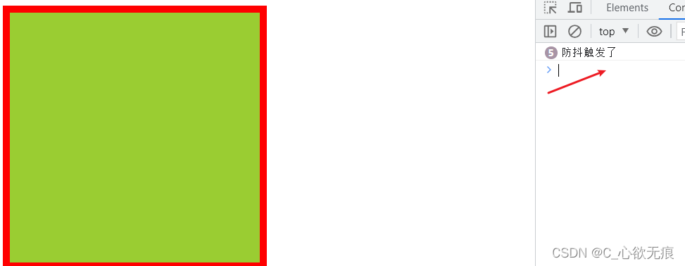
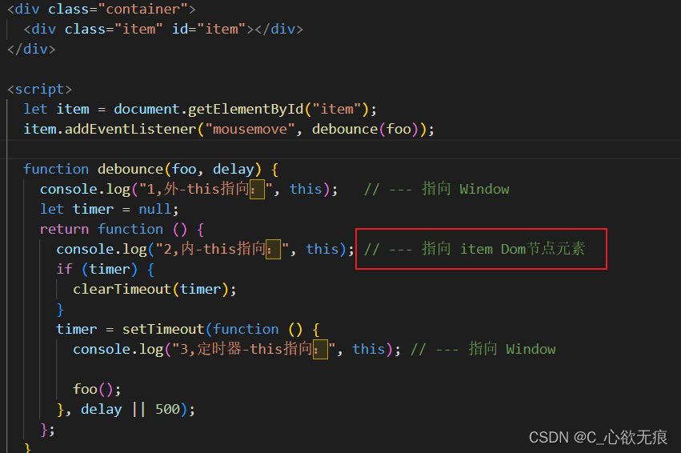

# 关于防抖和节流函数的使用和细节


[[toc]]

___
### 一、什么是防抖

事件响应函数在一段时间后才执行，如果这段时间内再次调用，则重新计算执行时间。必须等待规定时间后才执行此函数；

### 二、应用场景

1，高频的事件监听回调: 比如 onscroll,onresize,oninput,touchmove 等；

2，用户名，手机号，邮箱输入验证时的输入框自动补全事件，搜索框输入搜索（用户最后一次输入完成才请求数据）；

3，浏览器窗口大小改变后，等待调整完成后，在执行 resize 里面的函数；

### 三、实现原理

总的来说，函数节流与函数防抖的原理非常简单，巧妙地使用 setTimeout 来存放待执行的函数，这样可以很方便的利用 clearTimeout 在合适的时机来清除待执行的函数。以及使用利用闭包形成的高级函数；

看下面简单的`案例`：

绿色容器内监听鼠标的移动事件，如果一直移动则什么也不操作，当停下来 500 毫秒之后才打印 `防抖触发了`

{width=80%}

**代码如下：**

```js
<!DOCTYPE html>
<html lang="en">
  <head>
    <meta charset="UTF-8" />
    <meta http-equiv="X-UA-Compatible" content="IE=edge" />
    <meta name="viewport" content="width=device-width, initial-scale=1.0" />
    <title>Document</title>
    <style>
      .item {
        box-sizing: border-box;
        width: 300px;
        height: 300px;
        padding: 20px;
        margin: 10px;
        border: 8px solid red;
        background-color: yellowgreen;
      }
    </style>
  </head>
  <body>
    <div class="container">
      <div class="item" id="item">
      </div>
    </div>
    <script>
      let item = document.getElementById("item");
      item.addEventListener("mousemove", debounce(foo));
      // 基本的防抖函数
      function debounce(foo, delay=500) {
        let timer = null;
        return function () {
          if (timer) {
            clearTimeout(timer); // 触发了相同事件，取消当前计时，重新开始计时
          }
          timer = setTimeout(foo, delay); // 第一次执行，开始一个计时器
        };
      }
       // 执行函数
       function foo() {
         console.log("防抖触发了");
      }
    </script>
  </body>
</html>
```

防抖函数`基本实现`：

```js
function debounce(foo, delay = 500) {
  let timer = null;
  return function () {
    if (timer) {
      clearTimeout(timer); // 触发了相同事件，取消当前计时，重新开始计时
    }
    timer = setTimeout(foo, delay); // 第一次执行，开始一个计时器
  };
}
```

上面会实现一个基本的防抖函数，看似简单的几行代码，则会有以下的细节：

#### 1，第一个问题：为什么使用了闭包（也就是说 timer 为什么定义到了外面）

先复习一下什么是闭包：

```js
function fun() {
  var str = 0;
  function sum() {
    //此处就形成了闭包
    return ++str; //这里使用了外部函数内的变量，此变量会一直被保存下来
  }
  return sum;
}
var count = fun();
console.log(count()); // 1
console.log(count()); // 2
console.log(count()); // 3
```

**闭包概念**：

`闭包（closure）`指有权访问另一个函数作用域中变量的函数。简单理解就是 ，一个作用域可以访问另外一个函数内部的局部变量。

这归功于 js 特有的作用域链式查找，函数内部可以向上直接读取全局变量，会一级级的向上查找，直到找到为之。（此过程不可逆）

一旦使用了闭包且访问了外部函数定义的变量，那么此变量会一直保存下来（使用过多会导致内存泄露）；

而且使用闭包也能把内部定义的变量返回出去，供全局使用；

了解完闭包再回到上面的问题，为什么使用闭包，其实也就是为什么把 timer 这个定时器 id 定义到外面;

**因为：**

如果`timer`的定义放在`return function`函数的里面会导致` if (timer)`这个条件一直不成立，这样的会启动很多定时器， 每次执行这个函数就会新增一个 setTimeout 定时器，那这么多定时器就会差不多同时执行 ，达不到防抖的效果，而且还增加了 js 的运行负担；

我们把`timer`定义到了外面，这样只会同时开启一个定时器，多次进来会清除之前的定时器，而重新启动一个新的定时器，且新的定时器 id 一直被外面`timer`所保存，所以不会同时产生多个 `setTimeout`；也就达到了防抖的效果；

至此，为什么使用闭包介绍完毕；防抖函数中因为使用了定时器，也就会产生了一个新的问题，this 的指向问题；

#### 2，第二个问题：防抖函数中 this 的指向问题：

见下图：

{width=80%}

通过打印可以发现，第一个 `this` 是指向 `Window` 的，第二个 `this` 是指向此 `item` 节点元素的，

至于第三个定时器的 `this` 为什么也指向 window：

**因为**：

> JS 的定时器方法是定义在 `window` 下的，如果不使用箭头函数和主动改变 this 指向，`setInterval 和 setTimeout` 的回调函数中 `this` 的指向的都是 `Window；`

如果调用防抖函数有涉及到上下文，那么就要考虑到定时器中 `this` 的指向问题。就要使用 `apply` 改变 `this` 的指向；

之前的基本的防抖函数可以优化为以下代码：

**`完整的防抖函数`**：

```js
// 防抖
function debounce(foo, delay = 500) {
  let timer = null;
  return function () {
    let _this = this; // 此处保留this

    if (timer) {
      clearTimeout(timer);
    }
    timer = setTimeout(function () {
      foo.apply(_this); // 改变this指向
    }, delay);
  };
}
```

---

### 四、节流函数

节流函数的细节和防抖是一样的，这里就不在赘述了，主要是实现的方式有点不一样；

**概念：**

`节流（throttel）`不管事件的触发频率有多高，只会间隔设定的时间执行一次目标函数。简单来说：每隔单位时间，只执行一次。

**应用场景：** 滚动条滚动时函数的处理，可以通过节流适当减少响应次数；

基本实现： 基本可以满足大部分需求

```js
function throttle(foo, delay = 500) {
  let timer = null;
  return function () {
    if (timer) {
      return false; //定时器还在，等冷却时间
    }
    timer = setTimeout(function () {
      foo();
      clearTimeout(timer); //函数执行完后清除定时器,表示冷却完成
      timer = null; //此处一点要清空
    }, delay);
  };
}
```

带 apply 的实现：

```js
function throttle(foo, delay = 500) {
  let timer = null;
  return function () {
    let _this = this;
    if (timer) {
      return false; //定时器还在，等冷却时间
    }
    timer = setTimeout(function () {
      foo.apply(_this);
      clearTimeout(timer); //函数执行完后清除定时器,表示冷却完成
      timer = null; //此处一点要清空
    }, delay);
  };
}
```

虽然网上这些防抖节流函数有很多版本，重要的知道为什么这么写，能够实现功能就可以了，没必要搞的那么复杂；
