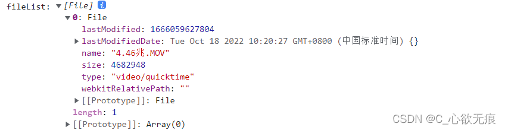

# 文件处理(转 base64,blob,替换 base64 头部)

这里记录一些日常工作中对文件的一些处理（转 base64，blob，替换 base64 头部）

## 获取 file 文件：

```javascript
 // 在vue中的使用 通过selectFile事件获选中的文件
 <input type="file" accept="image/*" multiple="multiple" @change="selectFile($event)" class="inputStyle" />
```

```javascript
async selectFile(el) {
    let filesObj = el.target.files;
    console.log('filesObj:', filesObj);
    let fileList = Object.values(filesObj); // 将对象转化为数组
 }
```

`获取到的File格式如下：`

::: info file格式
{width=100%}
:::

## 1，将获取的 file 类型转为 base64 格式

```javascript
/**
 * 将file文件转化为base64 使用promise
 * @param file 该文件的file类型
 */
export function fileTransferBase64(file) {
  return new Promise((resolve, reject) => {
    const reader = new FileReader(); //异步读取
    reader.readAsDataURL(file);
    // 成功和失败返回对应的信息，reader.result一个base64，可以直接使用
    reader.onload = (e) => {
      resolve(e.target.result);
    };
    // 失败返回失败的信息
    reader.onerror = (error) => {
      console.warn("file文件转化为base64s失败：", error);
      reject(error);
    };
  });
}
```

## 2，将 base64 格式的数据转为 Blob

```javascript
/**
 * 将以base64的图片url数据转换为Blob  并进行上传
 * @param urlData 用url方式表示的base64图片数据
 */
export function convertBase64UrlToBlob(urlData, filename) {
  if (urlData == "" || !urlData) {
    return console.warn("base64的图片不存在");
  }
  // 以base64的图片url数据转换为Blob
  var arr = urlData.split(","),
    mime = arr[0].match(/:(.*?);/)[1],
    bstr = atob(arr[1]),
    n = bstr.length,
    u8arr = new Uint8Array(n);
  while (n--) {
    u8arr[n] = bstr.charCodeAt(n);
  }
  let bold = new Blob([u8arr], { type: mime });
  return bold;
}
```

## 3，直接将 File 类型转为 Blob

```javascript
/**
 * 将file数据转换为Blob
 * @param file格式
 */
export function fileToBlob(file) {
  return new Promise((resolve, reject) => {
    // FileReader  异步读取文件
    const reader = new FileReader();
    // readAsDataURL: dataurl它的本质就是图片的二进制数据， 进行base64加密后形成的一个字符串，
    reader.readAsDataURL(file);
    // 成功和失败返回对应的信息，reader.result一个base64，可以直接使用
    reader.onload = (e) => {
      let arr = e.target.result.split(",");
      let mime = arr[0].match(/:(.*?);/)[1];
      const blob = new Blob([e.target.result], { type: mime });
      resolve(blob);
    };
    // 失败返回失败的信息
    reader.onerror = (error) => {
      console.warn("file数据转换为Blob失败：", error);
      reject(error);
    };
  });
}
```

## 4，获取文件(图片视频等)的本地内存地址进行`回显`

获取的是 blob 开头的一个本地内存的访问链接；可以直接用 img,video 的 src 属性直接访问；如下：

```javascript
blob:http://localhost:8082/ba51f68a-e024-4b9f-af01-08f7c9914e13
```

```javascript
/**
 * 获取文件(图片视频等)的本地内存地址 可以直接访问
 * @param file  该文件的文件流
 */
export function createObjectURLFun(file) {
  let url = "";
  if (window.createObjectURL != undefined) {
    // basic
    url = window.createObjectURL(file);
  } else if (window.URL != undefined) {
    // mozilla(firefox)
    url = window.URL.createObjectURL(file);
  } else if (window.webkitURL != undefined) {
    // webkit or chrome
    url = window.webkitURL.createObjectURL(file);
  }
  return url;
}
```

## 5，替换视频文件的 base64 头部

针对 mov(ios 的录像视频格式)或 avi，wmv 的视频格式，这类的 base64 格式使用 video 的 src 属性不能直接进行播放；所以要统一替换为 mp4 格式才能进行正常播放；

如果是正常的 mp4 格式不进行任何处理

```javascript
/*
 *对视频预览的处理 替换base64头部后缀 替换的视频文件名如下： mov: quicktime, avi:avi, wmv:x-ms-wmv, m2v:x-matroska等
 * 参数是base64  返回值也是base64格式
 */
export function handleBase64Preview(base64Url) {
  if (!base64Url) {
    return false;
  }
  let needReplaceHeaderList = ["data:video/avi", "data:video/quicktime", "data:video/x-ms-wmv", "data:video/x-matroska"];
  let base64Header = base64Url.split(";")[0];
  let newBase64Url = "";
  if (needReplaceHeaderList.includes(base64Header)) {
    newBase64Url = base64Url.replace(base64Header, "data:video/mp4"); //替换成MP4
    // newBase64Url = base64Url.replace(/^data:video\/\w+;base64,/, ''); //删除头部
    return newBase64Url;
  }
  return base64Url;
}
```

## 6，判断是否是苹果设备

```javascript
/**
 * 判断是否是苹果设备 是返回true 否则返回false
 * @param 无
 */
export function isIOS() {
  let ua = navigator.userAgent.toLowerCase();
  if (ua.indexOf("android") != -1) {
    return false;
  }
  if (ua.indexOf("iphone") != -1) {
    return true;
  }
}
```
