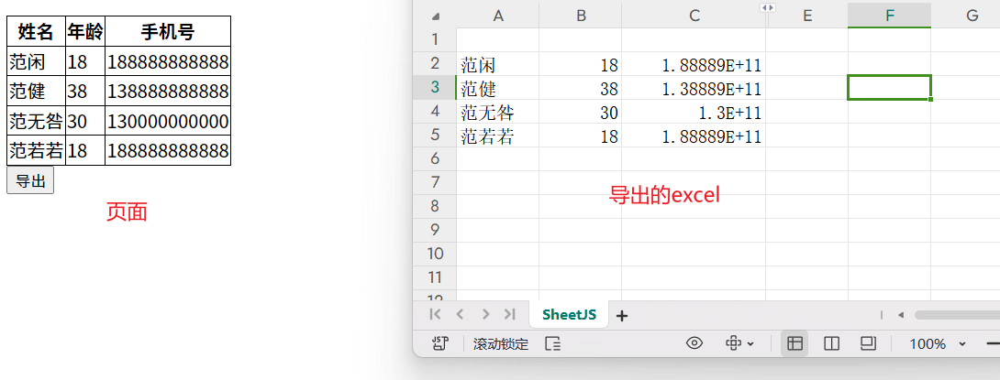

# 使用 XLSX.js 导出 Excel 文件

[[toc]]


在前端开发中，经常会遇到 **将页面表格数据导出为 Excel 文件** 的需求，例如：

* 后台管理系统数据导出
* 报表下载
* 用户数据备份

本文介绍如何使用 **XLSX.js** 将 HTML 表格数据导出为 `.xlsx` 文件。

## 一、实现效果

点击按钮后，将页面中的表格数据导出为 Excel 文件。

::: tip

示例效果：



:::

## 二、引入 XLSX.js

下载 `xlsx.core.min.js`：

```
https://cdnjs.cloudflare.com/ajax/libs/xlsx/0.15.3/xlsx.core.min.js
```

也可以直接通过 CDN 引入：

```html
<script src="https://cdnjs.cloudflare.com/ajax/libs/xlsx/0.15.3/xlsx.core.min.js"></script>
```

## 三、HTML 表格结构

首先准备一个简单的 HTML 表格。

```html
<table id="myTable">
  <thead>
    <tr>
      <th>姓名</th>
      <th>年龄</th>
      <th>手机号</th>
    </tr>
  </thead>
  <tbody>
    <tr>
      <td>范闲</td>
      <td>18</td>
      <td>188888888888</td>
    </tr>
    <tr>
      <td>范健</td>
      <td>38</td>
      <td>138888888888</td>
    </tr>
  </tbody>
</table>

<button onclick="export_table_to_excel('myTable')">
  导出
</button>
```

## 四、核心导出逻辑

点击按钮时调用 `export_table_to_excel` 方法，实现 Excel 导出。

```javascript
function export_table_to_excel(id) {
  const table = document.getElementById(id)

  const result = generateArray(table)
  const data = result[0]
  const ranges = result[1]

  const wb = new Workbook()
  const ws = sheet_from_array_of_arrays(data)

  ws["!merges"] = ranges

  const wsName = "Sheet1"

  wb.SheetNames.push(wsName)
  wb.Sheets[wsName] = ws

  const wbout = XLSX.write(wb, {
    bookType: "xlsx",
    type: "binary"
  })

  const blob = new Blob([s2ab(wbout)], {
    type: "application/octet-stream"
  })

  const a = document.createElement("a")

  a.href = URL.createObjectURL(blob)
  a.download = "table.xlsx"

  a.click()

  URL.revokeObjectURL(a.href)
}
```

## 五、核心实现思路

整个导出流程主要分为 **5 个步骤**：

### 1 获取表格数据

通过 `document.getElementById` 获取 HTML table。

```javascript
const table = document.getElementById("myTable")
```

### 2 解析表格数据

将表格转换为 **二维数组**。

```
[
  ["姓名","年龄","手机号"],
  ["范闲",18,"188888888888"],
  ["范健",38,"138888888888"]
]
```

### 3 生成 Worksheet

使用二维数组生成 Excel 的 **worksheet**。

```javascript
const ws = sheet_from_array_of_arrays(data)
```

### 4 创建 Workbook

Excel 文件本质上是 **Workbook（工作簿） + Worksheet（工作表）**。

```
Workbook
 └── Worksheet
      └── Table Data
```

### 5 生成并下载 Excel

通过 `XLSX.write` 生成 Excel 二进制数据，再通过 `Blob` 下载。

```javascript
const blob = new Blob([s2ab(wbout)])
```

## 六、导出流程图

```
HTML Table
    │
    ▼
解析 Table 数据
(generateArray)
    │
    ▼
生成二维数组
    │
    ▼
生成 Worksheet
(sheet_from_array_of_arrays)
    │
    ▼
创建 Workbook
    │
    ▼
XLSX.write 生成 Excel
    │
    ▼
Blob 下载文件
```

## 七、完整示例代码

完整示例代码如下：

```html
<!DOCTYPE html>
<html>
<head>
<title>HTML Template</title>
<style>
table{
border-collapse: collapse;
}

th,td{
border:1px solid #000;
}
</style>
</head>

<script src="./xlsx.core.min.js"></script>

<body>

<table id="myTable">
<thead>
<tr>
<th>姓名</th>
<th>年龄</th>
<th>手机号</th>
</tr>
</thead>

<tbody>
<tr>
<td>范闲</td>
<td>18</td>
<td>188888888888</td>
</tr>

<tr>
<td>范健</td>
<td>38</td>
<td>138888888888</td>
</tr>

<tr>
<td>范无咎</td>
<td>30</td>
<td>130000000000</td>
</tr>

<tr>
<td>范若若</td>
<td>18</td>
<td>188888888888</td>
</tr>

</tbody>
</table>

<button onclick="export_table_to_excel('myTable')">
导出
</button>

<script>

function export_table_to_excel(id){

var theTable=document.getElementById(id)

var oo=generateArray(theTable)

var ranges=oo[1]

var data=oo[0]

var ws_name="SheetJS"

var wb=new Workbook(),
ws=sheet_from_array_of_arrays(data)

ws["!merges"]=ranges

wb.SheetNames.push(ws_name)

wb.Sheets[ws_name]=ws

var wbout=XLSX.write(wb,{
bookType:"xlsx",
bookSST:false,
type:"binary"
})

const newBlob=new Blob([s2ab(wbout)],{
type:"application/octet-stream"
})

let fileName="test.xlsx"

var a=document.createElement("a")

var url=window.URL.createObjectURL(newBlob)

a.href=url

a.download=fileName

a.click()

window.URL.revokeObjectURL(url)

}

function generateArray(table){

var out=[]
var rows=table.querySelectorAll("tr")
var ranges=[]

for(var R=0;R<rows.length;++R){

var outRow=[]
var row=rows[R]
var columns=row.querySelectorAll("td")

for(var C=0;C<columns.length;++C){

var cell=columns[C]
var colspan=cell.getAttribute("colspan")
var rowspan=cell.getAttribute("rowspan")
var cellValue=cell.innerText

if(cellValue!==""&&cellValue==+cellValue)
cellValue=+cellValue

ranges.forEach(function(range){

if(
R>=range.s.r &&
R<=range.e.r &&
outRow.length>=range.s.c &&
outRow.length<=range.e.c
){

for(var i=0;i<=range.e.c-range.s.c;++i)
outRow.push(null)

}

})

if(rowspan||colspan){

rowspan=Number(rowspan)||1
colspan=Number(colspan)||1

ranges.push({
s:{r:R,c:outRow.length},
e:{r:R+rowspan-1,c:outRow.length+colspan-1}
})

}

outRow.push(cellValue!==""?cellValue:null)

if(colspan)
for(var k=0;k<colspan-1;++k)
outRow.push(null)

}

out.push(outRow)

}

return[out,ranges]

}

function sheet_from_array_of_arrays(data){

var ws={}
var range={
s:{c:10000000,r:10000000},
e:{c:0,r:0}
}

for(var R=0;R!=data.length;++R){

for(var C=0;C!=data[R].length;++C){

if(range.s.r>R)range.s.r=R
if(range.s.c>C)range.s.c=C
if(range.e.r<R)range.e.r=R
if(range.e.c<C)range.e.c=C

var cell={v:data[R][C]}

if(cell.v==null)continue

var cell_ref=XLSX.utils.encode_cell({c:C,r:R})

if(typeof cell.v==="number")cell.t="n"
else if(typeof cell.v==="boolean")cell.t="b"
else cell.t="s"

ws[cell_ref]=cell

}

}

if(range.s.c<10000000)
ws["!ref"]=XLSX.utils.encode_range(range)

return ws

}

function Workbook(){

if(!(this instanceof Workbook))
return new Workbook()

this.SheetNames=[]
this.Sheets={}

}

function s2ab(s){

var buf=new ArrayBuffer(s.length)
var view=new Uint8Array(buf)

for(var i=0;i!=s.length;++i)
view[i]=s.charCodeAt(i)&0xff

return buf

}

</script>

</body>
</html>
```
