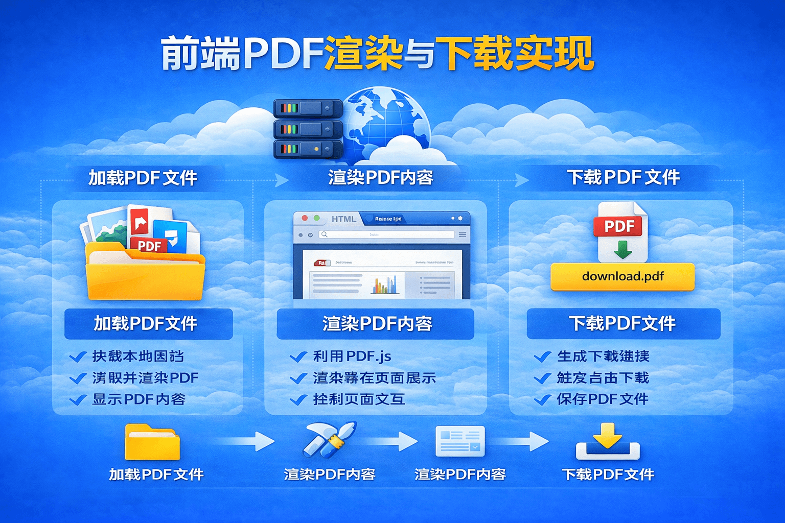

# 前端 PDF 渲染与下载实现：基于 pdf.js 的完整实践

[[toc]]



在企业项目中，经常会遇到 **PDF 文件预览和下载** 的需求，例如：

* 电子处方预览
* 合同文件查看
* 报告文件下载
* 发票或账单展示

浏览器虽然可以直接打开 PDF，但在实际项目中通常需要 **嵌入到页面中进行自定义展示**，例如：

* 自定义弹窗查看
* 控制分页渲染
* 自定义下载按钮
* 控制缩放和样式

因此，很多项目都会使用 **pdf.js** 来实现前端 PDF 渲染。

本文将介绍 **Vue 项目中基于 pdf.js 实现 PDF 预览和下载的完整方案**。

## 一、浏览器中 PDF 的几种实现方式

在前端开发中，常见的 PDF 渲染方式主要有三种：

| 方式     | 优点      | 缺点     |
| ------ | ------- | ------ |
| iframe | 实现简单    | UI不可控  |
| embed  | 浏览器原生支持 | 样式难控制  |
| pdf.js | 可完全自定义  | 需要手动渲染 |

例如 iframe 方式：

```html
<iframe src="file.pdf"></iframe>
```

这种方式虽然简单，但存在很多问题：

* 样式无法控制
* 无法自定义工具栏
* 不方便嵌入业务页面

因此在企业项目中，更推荐使用：

```text
pdf.js
```

## 二、pdf.js 简介

**pdf.js** 是 Mozilla 开源的 PDF 解析库，可以在浏览器中解析并渲染 PDF 文件。

GitHub 地址：

```text
https://github.com/mozilla/pdf.js
```

主要能力：

* 解析 PDF 文件
* 将 PDF 渲染为 Canvas
* 支持分页渲染
* 支持缩放
* 支持文本选择

安装方式：

```bash
npm install pdfjs-dist
```

## 三、PDF 渲染原理

pdf.js 的渲染流程大致如下：

```text
加载 PDF 文件
↓
解析 PDF 文档
↓
获取 PDF 页数
↓
逐页解析
↓
生成 viewport
↓
Canvas 渲染
↓
显示到页面
```

简单来说就是：

```text
PDF 文件 → pdf.js 解析 → Canvas 绘制 → 页面展示
```

## 四、Vue 中实现 PDF 渲染

在 Vue 中，我们可以通过 pdf.js 将 PDF 渲染到 `canvas` 上。

模板代码：

```html
<template>
  <dialog :title="dialogTitle" v-model="dialogVisible" width="880px">

    <div ref="pdfRef" class="pdf-view"></div>

    <template #footer>
      <el-button
        @click="downLoad"
        type="primary"
        :disabled="formLoading"
      >
        下 载
      </el-button>

      <el-button @click="dialogVisible = false">
        关 闭
      </el-button>
    </template>

  </dialog>
</template>
```

其中：

```text
pdfRef
```

用于存放渲染后的 PDF 页面。

## 五、实现 PDF 渲染逻辑

**核心代码如下：**

```javascript
import { nextTick } from "vue"
import PdfjsWorker from "pdfjs-dist/build/pdf.worker.js?worker"

async function initPdf() {

  const PDFJS = await import("pdfjs-dist/build/pdf.js")

  if (typeof window !== "undefined" && "Worker" in window) {
    PDFJS.GlobalWorkerOptions.workerPort = new PdfjsWorker()
  }

  const loadingTask = PDFJS.getDocument({ url: pdfSrc.value })

  const pdf = await loadingTask.promise

  pdfRef.value.innerHTML = ""

  for (let i = 1; i <= pdf.numPages; i++) {

    const page = await pdf.getPage(i)

    const pixelRatio = window.devicePixelRatio || 2

    const viewport = page.getViewport({ scale: 1 })

    const divPage = document.createElement("div")

    divPage.className = "page"

    const canvas = document.createElement("canvas")

    divPage.appendChild(canvas)

    pdfRef.value.appendChild(divPage)

    canvas.width = viewport.width * pixelRatio

    canvas.height = viewport.height * pixelRatio

    const renderContext = {
      canvasContext: canvas.getContext("2d"),
      viewport: viewport,
      transform: [pixelRatio, 0, 0, pixelRatio, 0, 0]
    }

    await page.render(renderContext).promise

    divPage.className = "page complete"

  }

}
```

代码主要流程：

```text
加载 PDF
↓
获取页数
↓
循环获取每一页
↓
创建 Canvas
↓
Canvas 渲染
↓
插入页面
```

最终效果就是：

```text
每一页 PDF → 一个 Canvas
```

## 六、PDF 下载功能实现

除了预览外，通常还需要提供 **PDF 下载功能**。

实现思路：

```text
fetch 请求 PDF
↓
转换为 Blob
↓
创建下载链接
↓
触发浏览器下载
```

示例代码：

```javascript
const downLoad = async () => {

  dialogVisible.value = false

  const link = document.createElement("a")

  link.style.display = "none"

  try {

    const response = await fetch(pdfSrc.value)

    if (!response.ok) {
      throw new Error(`Network response was not ok`)
    }

    const blob = await response.blob()

    link.href = URL.createObjectURL(blob)

    link.download = `${patientName.value}.pdf`

    document.body.appendChild(link)

    link.click()

    document.body.removeChild(link)

    URL.revokeObjectURL(link.href)

  } catch (error) {

    console.error("PDF 下载失败:", error)

  }

}
```

关键步骤：

```text
fetch
↓
blob
↓
createObjectURL
↓
a标签下载
```

这种方式相比直接链接下载更灵活。

## 七、PDF 下载实现方式对比

常见的 PDF 下载方式主要有两种：

### 方式一：直接链接下载

```javascript
const link = document.createElement("a")
link.href = pdfUrl
link.download = "file.pdf"
link.click()
```

优点：

* 实现简单

缺点：

* 无法携带 token
* 无法处理错误

### 方式二：fetch 下载（推荐）

```javascript
fetch → blob → createObjectURL → a标签下载
```

优点：

* 支持 token
* 可自定义文件名
* 可处理异常

因此在企业项目中更推荐使用。

## 八、PDF 渲染优化建议

在实际项目中，如果 PDF 文件较大，需要注意性能问题。

### 1 使用高清渲染

推荐使用：

```javascript
window.devicePixelRatio
```

例如：

```javascript
const pixelRatio = window.devicePixelRatio || 2
```

这样可以避免 PDF 模糊。

### 2 避免重复渲染

每次渲染前需要清空容器：

```javascript
pdfRef.value.innerHTML = ""
```

否则会出现：

```text
重复页面
```

### 3 大文件建议分页加载

如果 PDF 有很多页，例如：

```text
100页
200页
```

一次性渲染会导致：

* 页面卡顿
* 首屏加载慢

优化方式：

```text
滚动懒加载
```

只渲染当前可见页面。

## 九、常见问题

### PDF 渲染模糊

原因：

```text
canvas 分辨率不足
```

解决：

```javascript
devicePixelRatio
```

### worker 加载失败

错误示例：

```text
Setting up fake worker failed
```

原因：

```text
worker 路径配置错误
```

解决方式：

```javascript
PDFJS.GlobalWorkerOptions.workerPort = new PdfjsWorker()
```

### 大 PDF 渲染卡顿

原因：

```text
一次性渲染所有页面
```

解决：

```text
分页渲染
或
滚动懒加载
```

## 十、总结

在前端项目中，`PDF` 功能通常包含两个部分：

### PDF 预览

实现方式：

```text
pdf.js
↓
解析 PDF
↓
Canvas 渲染
```

### PDF 下载

实现方式：

```text
fetch
↓
blob
↓
createObjectURL
↓
a 标签下载
```

推荐实践：

| 功能     | 推荐方案         |
| ------ | ------------ |
| PDF 预览 | pdf.js       |
| PDF 下载 | fetch + blob |
| 大文件优化  | 懒加载          |

通过 pdf.js，我们可以在前端 **完全控制 PDF 的展示方式**，从而更好地适配业务需求。
