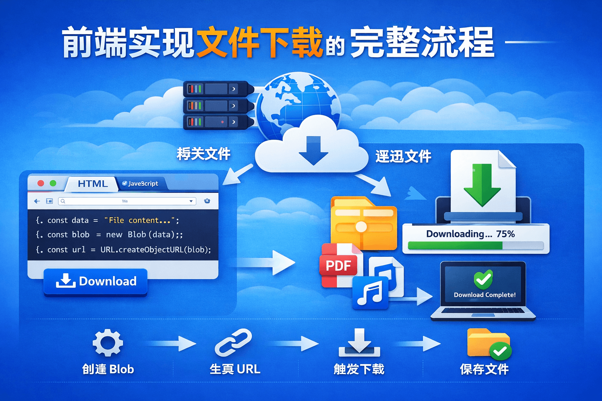

# 前端如何实现文件下载？从后端返回到浏览器保存的完整流程解析（Fetch + Blob）

[[toc]]



在企业项目中，经常会遇到 **导出 Excel、下载 PDF、下载日志文件等需求**。
很多人知道可以通过 `fetch` 或 `axios` 请求接口，但 **为什么请求后就能触发浏览器下载？**

下面将从 **前端请求 → 后端返回 → 浏览器保存文件** 的完整链路，详解其中实现原理。

## 一、文件下载的整体流程

一个完整的文件下载流程通常如下：

```
用户点击导出
     ↓
前端发送请求（fetch / axios）
     ↓
后端读取服务器文件
     ↓
后端返回文件流（binary stream）
     ↓
前端将响应转换为 Blob
     ↓
创建下载链接
     ↓
浏览器触发下载
```

简单来说就是：

**请求文件 → 转换为 Blob → 创建下载链接 → 触发下载**

## 二、前端发送下载请求

例如前端代码：

```javascript
const downloadInfoPubFile = async (data) => {
  const url = "/api/common/file/download";

  const response = await fetch(url, {
    method: "POST",
    headers: {
      "Content-Type": "application/json;charset=utf-8",
      Authorization: `Bearer ${token}`
    },
    body: JSON.stringify(data)
  });

  if (!response.ok) {
    throw new Error(`HTTP error! status: ${response.status}`);
  }

  const blob = await response.blob();

  return { blob };
};
```

请求接口：

```
POST /api/common/file/download
```

请求参数：

```json
{
  "filePath": "/upload/excel/report.xlsx"
}
```

这一步的作用是：

**告诉后端需要下载哪个文件。**

## 三、后端返回文件流

后端收到请求后，一般会做三件事：

1️⃣ 根据 `filePath` 找到服务器文件
2️⃣ 设置响应头
3️⃣ 返回文件流

例如：

```
Content-Type: application/vnd.openxmlformats-officedocument.spreadsheetml.sheet
Content-Disposition: attachment; filename="report.xlsx"
```

关键是 **Content-Disposition**：

```
Content-Disposition: attachment
```

表示：

**浏览器应该下载这个文件，而不是直接展示。**

后端返回的数据实际上是：

```
Binary Stream（二进制流）
```

例如：

```
PK....
.......
```

（Excel 本质是 zip 文件）

## 四、前端将文件流转换为 Blob

浏览器收到响应后：

```javascript
const blob = await response.blob();
```

此时浏览器会把 **二进制数据转换为 Blob 对象**。

Blob 可以理解为：

> 浏览器中的二进制文件对象。

例如：

```
Blob {
  size: 15324
  type: "application/vnd.openxmlformats-officedocument.spreadsheetml.sheet"
}
```

Blob 常用于表示：

* Excel
* PDF
* 图片
* 视频
* 任意二进制文件

## 五、生成浏览器可访问的文件 URL

Blob 不能直接下载，需要先生成一个 URL：

```javascript
const url = window.URL.createObjectURL(blob);
```

浏览器会生成类似：

```
blob:http://localhost:5173/3fa85f64-5717
```

这个地址指向 **浏览器内存中的文件数据**。

## 六、创建下载链接触发浏览器下载

浏览器下载文件的核心其实只有一个：

```
<a download>
```

代码实现：

```javascript
const link = document.createElement("a");
link.href = url;
link.download = "report.xlsx";

document.body.appendChild(link);
link.click();
document.body.removeChild(link);
```

浏览器实际执行的是：

```html
<a href="blob:xxxx" download="report.xlsx"></a>
```

当执行 `link.click()` 时：

浏览器就会自动下载文件。

## 七、完整下载代码示例

```javascript
const handleExport = async (record) => {
  const res = await downloadInfoPubFile({
    filePath: record.filePath
  });

  const url = window.URL.createObjectURL(res.blob);

  const link = document.createElement("a");
  link.href = url;
  link.download = "download.xlsx";

  document.body.appendChild(link);
  link.click();

  document.body.removeChild(link);

  window.URL.revokeObjectURL(url);
};
```

注意最后一行：

```javascript
URL.revokeObjectURL(url)
```

作用是：

**释放浏览器内存。**

否则大量下载可能造成 **内存泄漏**。

## 八、为什么不直接使用 window.open 下载？

很多人会写：

```javascript
window.open("/api/download");
```

这种方式在实际项目中问题很多：

### 1 不能携带 Token

企业系统基本都有登录认证：

```
Authorization: Bearer token
```

而 `window.open` 无法设置请求头。

### 2 不支持 POST 请求

很多下载接口需要：

```
POST
```

而浏览器地址栏只能：

```
GET
```

### 3 无法处理错误

如果接口返回：

```json
{
  "message": "文件不存在"
}
```

用户只会看到：

```
下载失败
```

但不会有明确提示。

使用 `fetch` 可以：

```
统一错误处理
```

## 九、JSON + Base64 下载方式

有些接口不会直接返回文件流，而是返回：

```json
{
  "filename": "report.xlsx",
  "data": "base64..."
}
```

前端需要先解码：

```javascript
const byteCharacters = atob(base64Data);
const byteNumbers = new Array(byteCharacters.length);

for (let i = 0; i < byteCharacters.length; i++) {
  byteNumbers[i] = byteCharacters.charCodeAt(i);
}

const byteArray = new Uint8Array(byteNumbers);
const blob = new Blob([byteArray]);
```

然后再执行下载。

## 总结

前端文件下载的核心步骤只有四步：

```
1 发送请求获取文件
2 将响应转换为 Blob
3 创建 Blob URL
4 使用 a 标签触发下载
```

完整流程：

```
前端 fetch 请求
      ↓
后端返回文件流
      ↓
response.blob()
      ↓
URL.createObjectURL()
      ↓
<a download>
      ↓
浏览器下载文件
```

**企业项目最佳实践：**

```
fetch / axios + Blob 下载
```

优点：

* 支持 Token 认证
* 支持 POST 请求
* 可以统一处理错误
* 可以动态文件名
* 支持各种文件类型

因此，这种方式已经成为 **前端文件下载的标准实现方案**。
