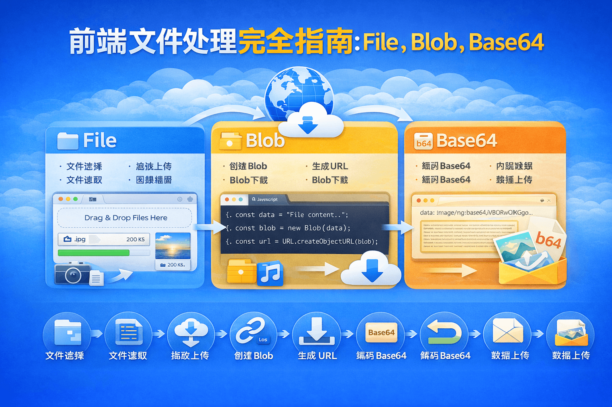

# 前端文件处理完全指南：File、Blob、Base64 转换与浏览器预览实践



在前端开发中，我们经常会遇到各种文件处理场景，例如：

* 图片上传并预览
* 视频上传播放
* 文件下载
* 文件格式转换
* Base64 上传接口

这些场景背后其实都围绕着 **三种核心数据格式**：

```
File
Blob
Base64
```

理解它们之间的关系，可以帮助我们更好地处理文件上传、预览与下载问题。

本文将从 **基础概念 → 实战代码 → 性能优化 → 实际应用场景**，系统讲解前端文件处理的最佳实践。

## 一、前端文件的三种核心数据格式

在浏览器中，文件通常有三种表现形式：

| 类型     | 说明           | 常见场景     |
| ------ | ------------ | -------- |
| File   | 用户选择的文件对象    | input 上传 |
| Blob   | 浏览器中的二进制文件对象 | 下载 / 预览  |
| Base64 | 字符串形式的文件数据   | 图片上传     |

三者之间可以互相转换：

```
File → Base64
File → Blob
Base64 → Blob
Blob → 浏览器预览 / 下载
```

理解这个关系后，很多文件处理问题都会变得简单。

## 二、获取 File 对象

在前端最常见的文件来源就是用户上传。

```html
<input type="file" accept="image/*" multiple @change="selectFile" />
```

获取文件对象：

```javascript
async function selectFile(event) {
  const filesObj = event.target.files;

  console.log("filesObj:", filesObj);

  const fileList = Object.values(filesObj);

  console.log(fileList);
}
```

获取到的 `File` 对象结构大致如下：

```
File {
  name: "image.png"
  size: 102400
  type: "image/png"
  lastModified: 1710000000000
}
```

需要注意的是：

> **File 是 Blob 的子类**，因此很多 Blob 的操作也可以直接用于 File。

## 三、File 转 Base64

Base64 是一种 **字符串形式的文件数据**，常用于：

* 图片上传
* 富文本编辑器
* 小文件传输

实现方式是通过浏览器提供的 **FileReader API**。

```javascript
/**
 * File 转 Base64
 * @param {File} file
 */
export function fileToBase64(file) {
  return new Promise((resolve, reject) => {

    const reader = new FileReader();

    reader.readAsDataURL(file);

    reader.onload = () => resolve(reader.result);

    reader.onerror = reject;

  });
}
```

使用示例：

```javascript
const base64 = await fileToBase64(file);

console.log(base64);
```

返回结果：

```
data:image/png;base64,iVBORw0KGgoAAAANSUhEUgAA...
```

需要注意：

Base64 会比原始文件 **大约增加 33% 体积**，因此不适合大文件。

## 四、Base64 转 Blob

有些接口返回 Base64 数据，此时可以转换为 Blob 进行预览或下载。

```javascript
/**
 * Base64 转 Blob
 */
export function base64ToBlob(base64) {

  if (!base64) {
    console.warn("base64 数据为空");
    return;
  }

  const arr = base64.split(",");

  const mime = arr[0].match(/:(.*?);/)[1];

  const bstr = atob(arr[1]);

  let n = bstr.length;

  const u8arr = new Uint8Array(n);

  while (n--) {
    u8arr[n] = bstr.charCodeAt(n);
  }

  return new Blob([u8arr], { type: mime });
}
```

其中关键函数：

```
atob()
```

作用是：

```
Base64 → 二进制字符串
```

## 五、File 转 Blob

实际上：

> **File 本身就是 Blob 类型**

因此很多情况下可以直接使用：

```javascript
const blob = new Blob([file], { type: file.type });
```

如果需要统一处理，也可以这样写：

```javascript
export function fileToBlob(file) {

  return new Blob([file], {
    type: file.type
  });

}
```

## 六、生成浏览器本地预览地址

在前端开发中，经常需要对文件进行 **本地预览**。

浏览器提供了一个非常重要的 API：

```
URL.createObjectURL()
```

示例：

```javascript
export function createObjectURL(file) {

  return URL.createObjectURL(file);

}
```

生成的地址类似：

```
blob:http://localhost:5173/ba51f68a-e024
```

这个地址指向 **浏览器内存中的文件数据**。

## 七、文件预览示例

### 1.图片预览

```javascript
const url = URL.createObjectURL(file);

img.src = url;
```

### 2.视频预览

```javascript
video.src = URL.createObjectURL(file);
```

### 3.PDF 预览

```javascript
iframe.src = URL.createObjectURL(file);
```

## 八、视频 Base64 头部兼容处理

某些视频格式（例如 iOS 录制的视频）可能会出现无法播放的问题。

常见格式包括：

```
mov
avi
wmv
```

这些格式在 Base64 中的头部可能是：

```
data:video/quicktime
data:video/avi
data:video/x-ms-wmv
```

可以统一替换为 `mp4`：

```javascript
export function handleBase64Preview(base64Url) {

  if (!base64Url) return false;

  const needReplaceHeaderList = [
    "data:video/avi",
    "data:video/quicktime",
    "data:video/x-ms-wmv",
    "data:video/x-matroska"
  ];

  const base64Header = base64Url.split(";")[0];

  if (needReplaceHeaderList.includes(base64Header)) {

    return base64Url.replace(base64Header, "data:video/mp4");

  }

  return base64Url;
}
```

## 九、判断是否为 iOS 设备

某些视频或文件处理逻辑在 iOS 上可能存在差异，因此有时需要做设备判断。

```javascript
export function isIOS() {

  return /iphone|ipad|ipod/i.test(navigator.userAgent);

}
```

## 十、性能与最佳实践

在实际项目中，建议遵循以下原则。

### 1.大文件不要使用 Base64

`Base64` 会增加约：

```
33% 体积
```

**推荐：**

| 文件类型 | 推荐方式   |
| ---- | ------ |
| 小图片  | Base64 |
| 视频   | Blob   |
| 大文件  | Blob   |

### 2. 使用完 URL 记得释放

```javascript
URL.revokeObjectURL(url);
```

否则可能造成：

```
内存泄漏
```

### 3.File 可以直接当 Blob 使用

因为：

```
File instanceof Blob === true
```

因此很多场景无需额外转换。

## 十一、常见应用场景

### 1.图片上传预览

```
File → Blob URL → img.src
```

### 2.图片 Base64 上传

```
File → Base64 → API
```

### 3.文件下载

```
接口 → Blob → createObjectURL → a标签下载
```

### 4.视频本地播放

```
File → createObjectURL → video.src
```
