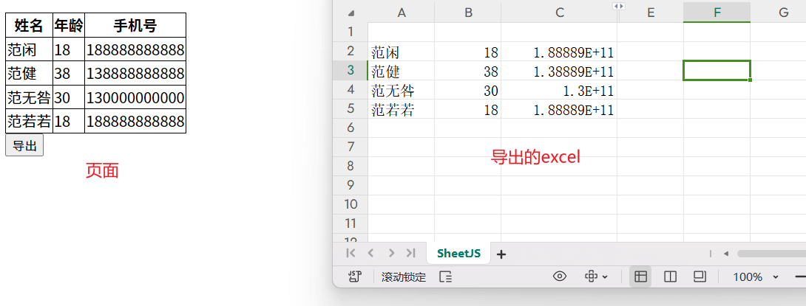

# 使用 XLSX.js 导出 excel 文件

**实现效果：**

::: tip



:::


`xlsx.core.min.js`文件下载地址：https://cdnjs.cloudflare.com/ajax/libs/xlsx/0.15.3/xlsx.core.min.js


**代码如下：**

```html
<!DOCTYPE html>
<html>
  <head>
    <title>HTML Template</title>
    <style>
      table {
        border-collapse: collapse;
      }
      th,
      td {
        border: 1px solid #000;
      }
    </style>
  </head>
  <script src="./xlsx.core.min.js"></script>
  <body>
    <table id="myTable">
      <thead>
        <tr>
          <th>姓名</th>
          <th>年龄</th>
          <th>手机号</th>
        </tr>
      </thead>
      <tbody>
        <tr>
          <td>范闲</td>
          <td>18</td>
          <td>188888888888</td>
        </tr>
        <tr>
          <td>范健</td>
          <td>38</td>
          <td>138888888888</td>
        </tr>
        <tr>
          <td>范无咎</td>
          <td>30</td>
          <td>130000000000</td>
        </tr>
        <tr>
          <td>范若若</td>
          <td>18</td>
          <td>188888888888</td>
        </tr>
      </tbody>
    </table>
    <button onclick="export_table_to_excel('myTable')">导出</button>
  </body>
  <script>
    function export_table_to_excel(id) {
      var theTable = document.getElementById(id);
      var oo = generateArray(theTable);
      var ranges = oo[1];

      /* original data */
      var data = oo[0];
      var ws_name = "SheetJS";

      var wb = new Workbook(),
        ws = sheet_from_array_of_arrays(data);

      /* add ranges to worksheet */
      // ws['!cols'] = ['apple', 'banan'];
      ws["!merges"] = ranges;

      /* add worksheet to workbook */
      wb.SheetNames.push(ws_name);
      wb.Sheets[ws_name] = ws;

      var wbout = XLSX.write(wb, {
        bookType: "xlsx",
        bookSST: false,
        type: "binary"
      });

      const newBlob = new Blob([s2ab(wbout)], {
        type: "application/octet-stream"
      });
      console.log("newBlob", newBlob);

      let fileName = "test.xlsx";

      var a = document.createElement("a");
      var url = window.URL.createObjectURL(newBlob);
      // var filename = response.headers.get('Content-Disposition');
      a.href = url;
      a.download = fileName;
      a.click();
      window.URL.revokeObjectURL(url);
    }

    function generateArray(table) {
      var out = [];
      var rows = table.querySelectorAll("tr");
      var ranges = [];
      for (var R = 0; R < rows.length; ++R) {
        var outRow = [];
        var row = rows[R];
        var columns = row.querySelectorAll("td");
        for (var C = 0; C < columns.length; ++C) {
          var cell = columns[C];
          var colspan = cell.getAttribute("colspan");
          var rowspan = cell.getAttribute("rowspan");
          var cellValue = cell.innerText;
          if (cellValue !== "" && cellValue == +cellValue) cellValue = +cellValue;

          //Skip ranges
          ranges.forEach(function (range) {
            if (R >= range.s.r && R <= range.e.r && outRow.length >= range.s.c && outRow.length <= range.e.c) {
              for (var i = 0; i <= range.e.c - range.s.c; ++i) outRow.push(null);
            }
          });

          //Handle Row Span
          if (rowspan || colspan) {
            rowspan = Number(rowspan) || 1;
            colspan = Number(colspan) || 1;
            ranges.push({
              s: {
                r: R,
                c: outRow.length
              },
              e: {
                r: R + rowspan - 1,
                c: outRow.length + colspan - 1
              }
            });
          }

          //Handle Value
          outRow.push(cellValue !== "" ? cellValue : null);

          //Handle Colspan
          if (colspan) for (var k = 0; k < colspan - 1; ++k) outRow.push(null);
        }
        out.push(outRow);
      }
      return [out, ranges];
    }

    function datenum(v, date1904) {
      if (date1904) v += 1462;
      var epoch = Date.parse(v);
      return (epoch - new Date(Date.UTC(1899, 11, 30))) / (24 * 60 * 60 * 1000);
    }

    function sheet_from_array_of_arrays(data, opts) {
      var ws = {};
      var range = {
        s: {
          c: 10000000,
          r: 10000000
        },
        e: {
          c: 0,
          r: 0
        }
      };
      for (var R = 0; R != data.length; ++R) {
        for (var C = 0; C != data[R].length; ++C) {
          if (range.s.r > R) range.s.r = R;
          if (range.s.c > C) range.s.c = C;
          if (range.e.r < R) range.e.r = R;
          if (range.e.c < C) range.e.c = C;
          var cell = {
            v: data[R][C]
          };
          if (cell.v == null) continue;
          var cell_ref = XLSX.utils.encode_cell({
            c: C,
            r: R
          });

          if (typeof cell.v === "number") cell.t = "n";
          else if (typeof cell.v === "boolean") cell.t = "b";
          else if (cell.v instanceof Date) {
            cell.t = "n";
            cell.z = XLSX.SSF._table[14];
            cell.v = datenum(cell.v);
          } else cell.t = "s";

          ws[cell_ref] = cell;
        }
      }
      if (range.s.c < 10000000) ws["!ref"] = XLSX.utils.encode_range(range);
      return ws;
    }

    function Workbook() {
      if (!(this instanceof Workbook)) return new Workbook();
      this.SheetNames = [];
      this.Sheets = {};
    }

    function s2ab(s) {
      var buf = new ArrayBuffer(s.length);
      var view = new Uint8Array(buf);
      for (var i = 0; i != s.length; ++i) view[i] = s.charCodeAt(i) & 0xff;
      return buf;
    }
  </script>
</html>
```
