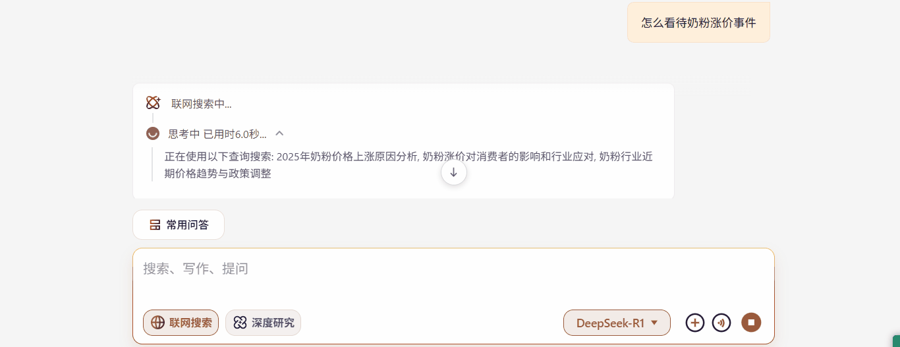

# png 序列 : 序列帧动画组件实现

序列帧动画是 Web 开发中常见的动画技术之一，通过快速切换静态图片帧来创建流畅的动画效果。

## 组件概述

**实现原理是**：组件使用 CSS 雪碧图技术，将所有动画帧垂直排列在一张图片中，通过改变 background-position-y 来切换帧：

这个`SequenceAnimation组`件是一个灵活的序列帧动画解决方案，主要特点包括：  
1、支持播放控制（播放/暂停）  
2、可配置帧率（FPS）  
3、支持循环和非循环模式  
4、响应式尺寸调整  
5、高性能的动画渲染

## 实现效果



## 组件实现

### 1、tsx

```tsx
"use client";
import React, { useEffect, useRef, useState } from "react";
import "./index.scss";

interface SequenceAnimationProps {
  index?: number;
  frameCount?: number;
  imageUrl: string;
  text?: string;
  isPlaying?: boolean;
  fps?: number;
  loop?: boolean;
  frameHeight?: number;
  className?: string;
  style?: React.CSSProperties;
}

/**
 * @description  序列帧动画
 * @param index  当前帧索引
 * @param frameCount  总帧数
 * @param imageUrl  图片地址
 * @param text  文本
 * @param isPlaying  是否播放
 * @param fps  帧率
 * @param loop  是否循环
 * @param frameHeight  帧高度
 * @param className  类名
 * @param style  行内样式
 * @returns
 */
const SequenceAnimation: React.FC<SequenceAnimationProps> = ({
  index = 0,
  frameCount = 32,
  imageUrl = "/imgs/network.png",
  isPlaying = false,
  fps = 24,
  loop = true,
  frameHeight = 24, // 默认高度改为20px
  className = "",
  style = {}
}) => {
  const containerRef = useRef < HTMLDivElement > null;
  const animationRef = useRef < number > 0;
  // eslint-disable-next-line @typescript-eslint/no-unused-vars
  const [currentFrame, setCurrentFrame] = useState < number > 0;
  const lastUpdateTimeRef = useRef < number > 0;
  const accumulatedTimeRef = useRef < number > 0;

  // 计算每帧间隔时间(毫秒)
  const frameInterval = 1000 / fps;

  // 动画帧函数
  const animate = (timestamp: number) => {
    if (!isPlaying) return;

    // 初始化或重置后第一次运行
    if (lastUpdateTimeRef.current === 0) {
      lastUpdateTimeRef.current = timestamp;
      animationRef.current = requestAnimationFrame(animate);
      return;
    }

    // 计算时间差
    const deltaTime = timestamp - lastUpdateTimeRef.current;
    lastUpdateTimeRef.current = timestamp;
    accumulatedTimeRef.current += deltaTime;

    // 当累积时间超过帧间隔时更新帧
    while (accumulatedTimeRef.current >= frameInterval) {
      setCurrentFrame((prev) => {
        let nextFrame = prev + 1;

        // 处理循环或停止逻辑
        if (nextFrame >= frameCount) {
          nextFrame = loop ? 0 : frameCount - 1;
          if (!loop) {
            // 不循环时停止在最后一帧
            cancelAnimationFrame(animationRef.current);
            return frameCount - 1;
          }
        }

        // 更新DOM显示
        if (containerRef.current) {
          containerRef.current.style.backgroundPositionY = `-${nextFrame * frameHeight}px`;
        }

        return nextFrame;
      });

      accumulatedTimeRef.current -= frameInterval;
    }

    animationRef.current = requestAnimationFrame(animate);
  };

  // 控制动画开始/停止
  useEffect(() => {
    if (isPlaying) {
      lastUpdateTimeRef.current = 0;
      accumulatedTimeRef.current = 0;
      animationRef.current = requestAnimationFrame(animate);
    } else {
      cancelAnimationFrame(animationRef.current);
    }

    return () => {
      cancelAnimationFrame(animationRef.current);
    };
  }, [isPlaying, fps, loop, frameCount, frameHeight]);

  // 重置当前帧
  useEffect(() => {
    if (!isPlaying) {
      setCurrentFrame(0);
      if (containerRef.current) {
        containerRef.current.style.backgroundPositionY = "0px";
      }
    }
  }, [isPlaying]);

  // 初始化背景样式
  useEffect(() => {
    if (containerRef.current) {
      containerRef.current.style.backgroundImage = `url(${imageUrl})`;
      containerRef.current.style.backgroundSize = `auto ${frameCount * frameHeight}px`;
      containerRef.current.style.height = `${frameHeight}px`;
      containerRef.current.style.width = `${frameHeight}px`;
    }
  }, [imageUrl, frameCount, frameHeight]);

  return (
    <div>
      <div className={`sequence-animation-container ${className}`} style={style}>
        <div ref={containerRef} className={`sequence-animation sequence-animation-${index}`} />
      </div>
    </div>
  );
};

export default SequenceAnimation;
```

### 2、scss

```scss
.sequence-animation-container {
  display: flex;
  flex-direction: column;
  align-items: center;
  justify-content: center;
}

.sequence-animation {
  background-position: 0 0;
  background-repeat: no-repeat;
}
```

## 组件使用

`isPlaying` 控制动画播放，为 `true` 时播放，为 `false` 时暂停。

```tsx
import { SequenceAnimation } from "@/components/SequenceAnimation";

<SequenceAnimation style={{ marginLeft: "-2px" }} imageUrl={`${config.ossIconBaseUrl}/messageItem/sequence-network-48.png`} isPlaying={message.loading}></SequenceAnimation>;
```
