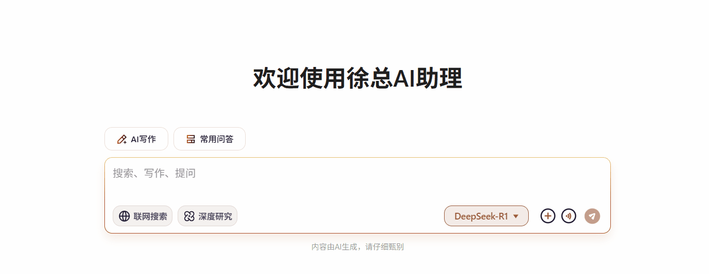

# 可编辑模板字符串

## 组件概述

`AiWritingTemplate`是一个智能化的写作模板组件，它通过解析模板字符串生成可编辑的表单界面，特别适合需要动态生成文本内容的 AI 写作场景。该组件的主要特点包括：

1、模板解析引擎：能够解析特殊格式的模板字符串  
2、动态表单生成：根据模板自动创建输入字段  
3、实时内容更新：编辑时即时反馈内容变化  
4、高度可定制：支持多种字段类型和配置

实现原理是 `contentEditable={true}` 这个属性可以用来使元素可编辑，当用户点击元素时，会出现一个可编辑的区域，用户可以在其中输入内容。

## 组件实现

后端需要返回的模板字符串格式为：

```
    帮我写一份{text:type}，场合为：{text:occasion}，
    对象所属区域为：{input:region,width:90}
    对象为：{input:object}，主题为：{input:subject}，
    目标为：{input:goal}，
    核心与会人为：{input:participants}，
    姓名：{input:name}，
    年龄：{input:age,type:number}，
    字数大概：{input:wordCount,type:number}字。
    其他要求：{input:otherRequirements,width:150,placeholder:如嘉宾简介等}。
```

组件核心是`renderTemplate`方法，它将模板字符串转换为 React 节点。

`handleInputChange`方法用于处理输入框内容变化，它会更新模板字符串中的对应字段值。获取的最终格式是字符串。

### 1、tsx

```tsx
"use client";
import React, { useRef, useEffect } from "react";
import "./index.scss";

interface AiWritingTemplateProps {
  templateString: string; // 模板字符串
  onFormChange: (templateString: string) => void; // 表单内容变化时的回调函数
}

/**
 * @description AI写作的模板组件  使用contentEditable属性实现可编辑的文本框
 * @param templateString 模板字符串
 * @param onFormChange 表单内容变化时的回调函数
 */
const AiWritingTemplate: React.FC<AiWritingTemplateProps> = ({ onFormChange, templateString }) => {
  const aiWritingTemplateRef = useRef<HTMLDivElement>(null);

  // 模板字符串样例 TODO:input字段暂时用不上
  // const templateString = `
  //     帮我写一份{text:type}，场合为：{text:occasion}，
  //     对象所属区域为：{input:region,width:90}
  //     对象为：{input:object}，主题为：{input:subject}，
  //     目标为：{input:goal}，
  //     核心与会人为：{input:participants}，
  //     姓名：{input:name}，
  //     年龄：{input:age,type:number}，
  //     字数大概：{input:wordCount,type:number}字。
  //     \\n其他要求：{input:otherRequirements,width:150,placeholder:如嘉宾简介等}。
  //   `;

  // 解析模板并生成React节点
  const renderTemplate = () => {
    const lines = templateString.split("\\n").filter((line) => line.trim());
    return (
      <section>
        {lines.map((line, i) => (
          <article key={`line-${i}`}>
            {line.split(/({.*?})/).map((part, j) => {
              const match = part.match(/{(\w+):(.*?)(?:,width:(\d+))?(?:,type:(\w+))?(?:,placeholder:([^}]+))?}/);
              if (!match) return part;
              // eslint-disable-next-line @typescript-eslint/no-unused-vars
              const [_match, fieldType, fieldName, fieldWidth, fieldInputType, placeholder] = match;
              const fieldInfo = {
                type: fieldType,
                inputType: fieldInputType || "text",
                width: fieldWidth ? parseInt(fieldWidth) : 70,
                placeholder: placeholder || "请输入"
              };

              return (
                <span className="editable-highlight" key={`${i}-${j}`}>
                  <span
                    className="editable-input"
                    contentEditable={true}
                    style={{ minWidth: `${fieldInfo.width}px` }}
                    data-placeholder={fieldInfo.placeholder || "请输入..."}
                    onInput={handleInputChange}
                  ></span>
                </span>
              );
            })}
          </article>
        ))}
      </section>
    );
  };

  /** 处理输入框内容变化 */
  const handleInputChange = () => {
    if (aiWritingTemplateRef.current) {
      const currentText = aiWritingTemplateRef.current.innerText;
      // const submitString = currentText.replace(/\n+/g, "\n").trim();
      const submitString = currentText.replace(/\n/g, "").trim(); // 去除所有的换行符
      console.log("submitString", submitString);
      onFormChange(submitString); // 调用回调函数，通知外部表单内容已更新
    }
  };

  /** templateString 变化时调用handleInputChange，确保正常处理字符串 */
  useEffect(() => {
    handleInputChange();
  }, [templateString]);

  return (
    <div className="formatted-template" ref={aiWritingTemplateRef}>
      {renderTemplate()}
    </div>
  );
};

export default AiWritingTemplate;
```

### 2、scss

```scss
// 添加格式化模板样式
.formatted-template {
  border-radius: 8px;
  padding: 8px 0px;
  min-height: 56px; // 和textArea的高度保持一致 防止抖动
  max-width: 780px; // 限制最大宽度;
  section {
    margin: 0;
    line-height: 2.2;
    color: #333;
    font-weight: 500;
    font-size: 14px;
  }

  // 转为行内元素
  article {
    display: block;
  }

  .editable-highlight {
    display: inline-flex;
    position: relative;
    color: #9a5a3c;
    background-color: rgba(255, 125, 0, 0.1);
    border-radius: 3px;
    padding: 1px;
    margin-right: 3px;
    cursor: pointer;

    // 覆盖原生输入框的样式
    .editable-input {
      // max-width: 740px; // 限制最大宽度;
      display: inline-flex;
      padding: 0;
      margin: 0;
      min-height: 23px;
      line-height: 23px;
      padding: 0 10px;
      border: none;
      outline: none;
      transition: all 0.2s;
      //text-align: center;
      font-weight: 500;
      background: transparent;
      color: #9a5a3c;

      &:empty::before {
        content: attr(data-placeholder);
        color: #cfb2a4;
        // 使占位居中
        width: 100%;
        text-align: center;
      }
    }

  }
}

```

## 组件使用

```tsx
import AiWritingTemplate from "./AiWritingTemplate";
const [selectedTemplate, setSelectedTemplate] = useState(""); // 选中的模板
// 给到父元素更新格式化模板
const updateFormattedTemplate = (templateString: string) => {};
<AiWritingTemplate templateString={selectedTemplate} onFormChange={updateFormattedTemplate} />;
```

## 实现效果


