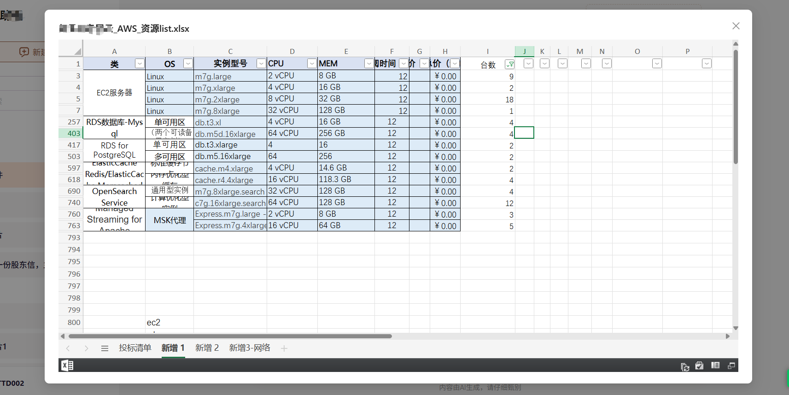

# 各格式文件预览

## 组件概述

`FilePreview` 是一个功能全面的文件预览组件，支持多种常见文件类型的在线预览，包括图`片、PDF、Markdown 和 Office `文档等。该组件基于 React 和 Ant Design 构建，具有以下特点：

1、多格式支持：自动识别文件类型并提供相应预览方式  
2、响应式设计：适应不同尺寸的屏幕  
3、高性能加载：按需加载内容，避免不必要请求  
4、良好的用户体验：加载状态提示、错误处理等

## 实现效果

**excel 预览**



**ppt 预览**


## 组件实现

### 1、tsx

```tsx
import React, { useState, useEffect, useMemo } from "react";
import { Modal, Spin } from "antd";
import ReactMarkdown from "react-markdown";
import PdfPreview from "@/components/common/PdfPreview";
import "./index.scss";

interface FilePreviewProps {
  visible: boolean;
  file?: {
    name: string;
    url: string;
  } | null;
  onCancel: () => void;
}

// 文件类型枚举
enum FileType {
  IMAGE = "image",
  PDF = "pdf",
  MARKDOWN = "markdown",
  OFFICE = "office",
  OTHER = "other"
}

// 获取文件类型
const getFileType = (fileName: string): FileType => {
  if (!fileName) return FileType.OTHER;

  const extension = fileName.split(".").pop()?.toLowerCase();

  if (["jpg", "jpeg", "png", "gif", "bmp"].includes(extension || "")) {
    return FileType.IMAGE;
  }

  if (extension === "pdf") {
    return FileType.PDF;
  }

  if (["md", "markdown"].includes(extension || "")) {
    return FileType.MARKDOWN;
  }

  if (["doc", "docx", "ppt", "pptx", "xls", "xlsx"].includes(extension || "")) {
    return FileType.OFFICE;
  }

  return FileType.OTHER;
};

// 获取预览URL
const getPreviewUrl = (fileUrl: string, fileName: string): string => {
  const fileType = getFileType(fileName);
  if (fileType === FileType.OFFICE) {
    return `https://view.officeapps.live.com/op/embed.aspx?src=${encodeURIComponent(fileUrl)}`;
  }
  return fileUrl;
};

/**
 * @description 文件预览组件
 * @param visible 预览可见性
 * @param file 预览文件信息
 * @returns
 */
const FilePreview: React.FC<FilePreviewProps> = ({ visible, file, onCancel }) => {
  const [markdownContent, setMarkdownContent] = useState("");
  const [loading, setLoading] = useState(false);

  // 获取文件类型
  const fileType = useMemo(() => getFileType(file?.name || ""), [file?.name]);

  // 获取预览URL
  const previewUrl = useMemo(() => {
    return file?.url ? getPreviewUrl(file.url, file.name) : "";
  }, [file?.url, file?.name]);

  // 加载Markdown内容
  useEffect(() => {
    if (fileType !== FileType.MARKDOWN || !file?.url) {
      setMarkdownContent("");
      return;
    }

    setLoading(true);
    fetch(file.url)
      .then((response) => response.text())
      .then((text) => {
        setMarkdownContent(text);
      })
      .catch((error) => {
        console.error("Error loading markdown:", error);
      })
      .finally(() => {
        setLoading(false);
      });
  }, [fileType, file?.url]);

  // 渲染预览内容
  const renderPreviewContent = () => {
    if (!file || !previewUrl) return null;

    switch (fileType) {
      case FileType.IMAGE:
        return ;

      case FileType.PDF:
        return <PdfPreview fileUrl={previewUrl} />;

      case FileType.MARKDOWN:
        return loading ? (
          <div className="loading-container">
            <Spin tip="加载Markdown内容..." />
          </div>
        ) : (
          <div className="markdown-container">
            <ReactMarkdown>{markdownContent}</ReactMarkdown>
          </div>
        );

      case FileType.OFFICE:
      case FileType.OTHER:
        return <iframe src={previewUrl} className="preview-iframe" title={file.name} allowFullScreen />;

      default:
        return null;
    }
  };

  return (
    <Modal
      open={visible}
      title={file?.name ? decodeURIComponent(file.name) : "文件预览"}
      footer={null}
      onCancel={onCancel}
      width="80%"
      style={{ top: 20 }}
      destroyOnHidden
      className="file-preview-modal"
      styles={{
        body: {
          height: "83vh",
          padding: 0,
          display: "flex",
          flexDirection: "column"
        }
      }}
    >
      <div className="file-preview-container">{renderPreviewContent()}</div>
    </Modal>
  );
};

export default FilePreview;
```

### 2、scss

```scss
.file-preview-container {
  @include mixin.fan-flex($direction: row, $align: center, $justify: center);
  width: 100%;
  min-height: 300px;
  .unsupported-preview {
    @include mixin.fan-flex($direction: column, $align: center, $justify: center);
    padding: 20px;
    text-align: center;
    p {
      margin-bottom: 20px;
    }
  }
}

.file-preview-container {
  width: 100%;
  height: 100%;
  flex: 1;
  @include mixin.fan-flex($direction: column);

  iframe {
    width: 100%;
    height: 100%;
    border: none;
    flex: 1;
  }
}

// 针对移动端优化
@media (max-width: 768px) {
  .file-preview-modal {
    .ant-modal {
      width: 95% !important;
      max-width: none;

      .ant-modal-content {
        height: 90vh;
        .ant-modal-body {
          height: calc(90vh - 110px) !important;
        }
      }
    }
  }
}
```

### 单独处理 PDF 的预览

由于 pdf 文件的预览在一些 window 电脑中有问题，导致无法直接预览，因此需要单独处理。这里使用了`pdfjs-dist`库来处理 pdf 文件的预览。

也封装成了组件 `PdfPreview`，使用方式如下：

```bash
npm install pdfjs-dist@4.10.38
```

然后把 `pdf.worker.4.10.38.mjs` 下载下来放到 `public` 目录下。

### 3、tsx

```tsx
"use client";
import { useState, useRef, useEffect } from "react";
import { Spin, Alert, Button } from "antd";
import * as pdfjsLib from "pdfjs-dist";
import "./index.scss";

pdfjsLib.GlobalWorkerOptions.workerSrc = "/pdf.worker.4.10.38.mjs"; // 设置 worker 路径

/**
 * @description PDF文件预览组件 (pdfjs-dist版本为4.10.38)
 * @param fileUrl PDF文件URL
 * @returns
 */
export default function PDFViewerInternal({ fileUrl }: { fileUrl: string }) {
  // 测试链接 "https://fosun-aiop-open-services.oss-cn-shanghai.aliyuncs.com/upload%2FHR%2520_S_HR%25C2%25B700_006_%2520V7.0%2520%25E5%25A4%258D%25E6%2598%259F%25E9%259B%2586%25E5%259B%25A2%25E9%25AB%2598%25E6%25A0%25A1%25E5%25AE%259E%25E4%25B9%25A0%25E7%2594%259F%25E7%25AE%25A1%25E7%2590%2586%25E5%258A%259E%25E6%25B3%2595.pdf?OSSAccessKeyId=LTAI5t82vZfxEUNFm3McMUe2&Expires=2064205593&Signature=%2BzaiGITWvbbbppWLbNzO%2Fhzt1fo%3D"
  const [numPages, setNumPages] = useState<number | 0>(0);
  const [loading, setLoading] = useState(true);
  const [error, setError] = useState<string | null>(null);
  const canvasRef = useRef<HTMLDivElement>(null);
  const [currentPage, setCurrentPage] = useState(1);
  const [scale, setScale] = useState(1.25); // 初始缩放比例

  useEffect(() => {
    const loadPdf = async () => {
      try {
        setLoading(true);
        const pdf = await pdfjsLib.getDocument(fileUrl).promise;
        setNumPages(pdf.numPages);

        // 渲染第一页
        await renderPage(pdf, currentPage);
        setLoading(false);
      } catch (err) {
        console.error("PDF 加载失败:", err);
        setError(err instanceof Error ? err.message : "无法加载 PDF 文件");
        setLoading(false);
      }
    };

    const renderPage = async (pdf: pdfjsLib.PDFDocumentProxy, pageNum: number) => {
      const page = await pdf.getPage(pageNum);
      const viewport = page.getViewport({ scale });

      if (!canvasRef.current) return;

      // 清除之前的画布
      canvasRef.current.innerHTML = "";

      const canvas = document.createElement("canvas");
      canvas.height = viewport.height;
      canvas.width = viewport.width;
      canvasRef.current.appendChild(canvas);

      const context = canvas.getContext("2d");
      if (!context) return;

      // 提高分辨率的关键设置-----
      const outputScale = window.devicePixelRatio || 1;
      canvas.width = Math.floor(viewport.width * outputScale);
      canvas.height = Math.floor(viewport.height * outputScale);
      canvas.style.width = Math.floor(viewport.width) + "px";
      canvas.style.height = Math.floor(viewport.height) + "px";
      context.scale(outputScale, outputScale);
      canvasRef.current.appendChild(canvas);
      // ------

      await page.render({
        canvasContext: context,
        viewport
      }).promise;
    };

    loadPdf();
  }, [fileUrl, currentPage, scale]);

  const goToPrevPage = () => {
    if (currentPage > 1) {
      setCurrentPage(currentPage - 1);
    }
  };

  const goToNextPage = () => {
    if (numPages && currentPage < numPages) {
      setCurrentPage(currentPage + 1);
    }
  };

  const zoomIn = () => {
    setScale(scale + 0.25);
  };
  const zoomOut = () => {
    if (scale > 0.5) {
      setScale(scale - 0.25);
    }
  };

  if (error) {
    return (
      <Alert
        type="error"
        message="PDF 加载失败"
        description={
          <>
            <p>错误信息: {error}</p>
            <p>请检查链接有效性或文件格式</p>
          </>
        }
        showIcon
      />
    );
  }

  return (
    <div className="pdf-viewer-wrapper">
      <div className="pdf-viewer-container">
        {
          <div className="pdf-controls">
            <div className="pdf-controls-group">
              <Button onClick={goToPrevPage} disabled={currentPage <= 1}>
                上一页
              </Button>
              <span className="pdf-page-indicator">
                第 {currentPage} 页 / 共 {numPages} 页
              </span>
              <Button onClick={goToNextPage} disabled={currentPage >= numPages}>
                下一页
              </Button>
            </div>
            <div className="pdf-controls-group">
              <Button onClick={zoomOut} disabled={scale <= 0.5}>
                缩小
              </Button>
              <span className="pdf-scale-indicator" style={{ minWidth: "40px" }}>
                {Math.round(scale * 100)}%
              </span>
              <Button disabled={scale >= 1.75} onClick={zoomIn}>
                放大
              </Button>
            </div>
          </div>
        }

        {/* pdf内容区域 */}
        <div className="pdf-content-area">
          {loading && (
            <div className="pdf-loading">
              <Spin tip="加载 PDF 文档..." size="large"></Spin>
            </div>
          )}
          <div ref={canvasRef} className="pdf-canvas" />
        </div>
      </div>
    </div>
  );
}
```

### 4、scss

```scss
.pdf-viewer-wrapper {
  height: 100%;
  max-width: 100%;
  min-width: 80%;
}

.pdf-viewer-container {
  @include mixin.fan-flex($direction: column);
  height: 100%;
  width: 100%;
  position: relative;
  border-radius: 8px;
  overflow: hidden;
  background: vars.$fan-global-chat-bg-color;
}

.pdf-controls {
  @include mixin.fan-flex($direction: row, $align: center, $justify: between, $gap: 20px);
  height: 40px;
  padding: 8px 0x;
  background: #fff;
  border-bottom: 1px solid #e8e8e8;
  box-shadow: 0 2px 8px rgba(0, 0, 0, 0.1);
  z-index: 10;
  box-sizing: border-box;
}

.pdf-controls-group {
  @include mixin.fan-flex($direction: row, $align: center, $justify: center, $gap: 10px);
}

.pdf-page-indicator,
.pdf-scale-indicator {
  min-width: 120px;
  text-align: center;
  font-size: 14px;
  color: #666;
}

.pdf-content-area {
  @include mixin.fan-flex($direction: row, $align: start, $justify: center);
  flex: 1;
  flex-shrink: 1;
  overflow-y: auto;
  padding: 5px;
  background: #525659;
}

.pdf-loading {
  position: absolute;
  top: 50%;
  left: 50%;
  transform: translate(-50%, -50%);
}

.pdf-canvas {
  width: 100%;
  @include mixin.fan-flex($justify: center);
}

.pdf-canvas canvas {
  box-shadow: 0 4px 12px rgba(0, 0, 0, 0.15);
  background: #fff;
}
```

## 组件使用

```tsx
import FilePreview from "@/components/FilePreview";
const [previewVisible, setPreviewVisible] = useState(false);
const [previewFile, setPreviewFile] = useState<{ name: string; url: string } | null>(null);
/**
 * 关闭预览
 */
const handleCancelPreview = () => {
  setPreviewVisible(false);
  setPreviewFile(null);
};
<FilePreview visible={previewVisible} file={previewFile} onCancel={handleCancelPreview} />;
```
