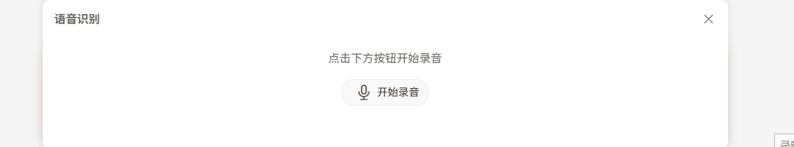

# PC 端录音组件

## 组件概述

`RecordingPanel`是一个可复用的 React PC 端录音面板组件，主要功能包括：麦克风权限、实时计时、音频格式兼容、录音上传等。

录音之后把文件上传给后端进行语音转文字。

## 实现效果



## 组件实现

### 1、tsx

```tsx
import React, { useState, useRef, useEffect } from "react";
import { AudioOutlined, AudioMutedOutlined, LoadingOutlined, CloseOutlined } from "@ant-design/icons";
import { Progress, App } from "antd";
import { fileAsr } from "@/app/lib/fileManage";
import { getSession } from "next-auth/react";
import "@/styles/RecordingPanel.scss";

interface RecordingPanelProps {
  visible: boolean;
  onClose: () => void;
  onTextUpdate: (text: string) => void;
}

/**
 * @description PC端录音面板组件，用于录音并上传到后端进行语音识别
 * @param visible 是否显示面板
 * @param onClose 关闭面板回调
 * @param onTextUpdate 识别结果回调
 */
const RecordingPanel: React.FC<RecordingPanelProps> = ({ visible, onClose, onTextUpdate }) => {
  const panelRef = useRef<HTMLDivElement>(null);
  const { message: messageApi } = App.useApp();

  // 录音相关状态
  const [isRecording, setIsRecording] = useState(false);
  const [recordingTime, setRecordingTime] = useState(0);
  const [hasPermission, setHasPermission] = useState<boolean | null>(null);
  const [isUploading, setIsUploading] = useState(false);

  // 录音技术相关引用
  const mediaRecorderRef = useRef<MediaRecorder | null>(null);
  const audioChunksRef = useRef<Blob[]>([]);
  const timerRef = useRef<NodeJS.Timeout | null>(null);

  // 面板动画状态
  const [isClosing, setIsClosing] = useState(false);

  /**
   * 处理面板关闭
   */
  const handleClose = () => {
    if (isRecording) {
      stopRecording();
    }

    setIsClosing(true);
    setTimeout(() => {
      onClose();
      setIsClosing(false);
    }, 300);
  };

  /**
   * 点击外部关闭面板
   */
  useEffect(() => {
    const handleClickOutside = (event: MouseEvent) => {
      if (panelRef.current && !panelRef.current.contains(event.target as Node)) {
        handleClose();
      }
    };

    if (visible) {
      document.addEventListener("mousedown", handleClickOutside);
    }

    return () => {
      document.removeEventListener("mousedown", handleClickOutside);
    };
  }, [visible, isRecording]);

  /**
   * 格式化时间显示
   */
  const formatTime = (seconds: number) => {
    const mins = Math.floor(seconds / 60);
    const secs = seconds % 60;
    return `${mins.toString().padStart(2, "0")}:${secs.toString().padStart(2, "0")}`;
  };

  /**
   * 上传录音文件到后端进行语音识别
   */
  const uploadAudio = async (blob: Blob) => {
    const session = await getSession();
    const userId = session?.user?.id || "recording";

    setIsUploading(true);
    try {
      const formData = new FormData();
      formData.append("file", blob, `${userId}.mp3`);
      const response = await fileAsr(formData);

      if (!response) {
        throw new Error("上传失败");
      }

      if (response.result) {
        onTextUpdate(response.result.text || "");
        // 修改为使用关闭动效
        handleClose();
      }
    } catch (error) {
      console.error("上传失败:", error);
      messageApi.error("音频上传失败,请重试");
    } finally {
      setIsUploading(false);
    }
  };

  /**
   * 开始录音
   */
  const startRecording = async () => {
    try {
      const stream = await navigator.mediaDevices.getUserMedia({ audio: true });
      setHasPermission(true);

      // 检测浏览器支持的音频格式
      const mimeType = MediaRecorder.isTypeSupported("audio/mp3")
        ? "audio/mp3"
        : MediaRecorder.isTypeSupported("audio/webm")
        ? "audio/webm"
        : MediaRecorder.isTypeSupported("audio/ogg")
        ? "audio/ogg"
        : "";

      const options = mimeType ? { mimeType } : undefined;
      const mediaRecorder = new MediaRecorder(stream, options);

      mediaRecorderRef.current = mediaRecorder;
      audioChunksRef.current = [];

      mediaRecorder.ondataavailable = (e) => {
        audioChunksRef.current.push(e.data);
      };

      mediaRecorder.onstop = async () => {
        const audioBlob = new Blob(audioChunksRef.current, {
          type: mimeType || "audio/wav"
        });
        await uploadAudio(audioBlob);
      };

      mediaRecorder.start();
      setIsRecording(true);
      setRecordingTime(0);

      // 定时更新录音时间
      timerRef.current = setInterval(() => {
        setRecordingTime((prev) => prev + 1);
      }, 1000);
    } catch (error) {
      console.error("获取麦克风权限失败:", error);
      messageApi.error("获取麦克风权限失败");
      setHasPermission(false);
    }
  };

  /**
   * 停止录音
   */
  const stopRecording = () => {
    if (mediaRecorderRef.current) {
      mediaRecorderRef.current.stop();
      mediaRecorderRef.current.stream.getTracks().forEach((track) => track.stop());

      if (timerRef.current) {
        clearInterval(timerRef.current);
        timerRef.current = null;
      }

      setIsRecording(false);
    }
  };

  // 组件卸载时清理资源
  useEffect(() => {
    return () => {
      if (isRecording) {
        stopRecording();
      }
    };
  }, []);

  if (!visible) return null;

  return (
    <div className={`recording-panel-container ${isClosing ? "closing" : ""}`}>
      <div className="recording-panel" ref={panelRef}>
        <div className="recording-panel-header">
          <h3>{isRecording ? "正在录音..." : "语音识别"}</h3>
          <button className="close-button" onClick={handleClose}>
            <CloseOutlined />
          </button>
        </div>

        <div className="recording-panel-content">
          <p className="recording-tip">{isUploading ? "正在识别语音..." : isRecording ? `已录制 ${formatTime(recordingTime)}` : "点击下方按钮开始录音"}</p>

          {isRecording && (
            <div className="recording-progress">
              <Progress percent={(recordingTime % 60) * (100 / 60)} showInfo={false} strokeColor="#52c41a" />
            </div>
          )}

          <button className={`voice-button-pc ${isRecording ? "recording" : ""}`} onClick={isRecording ? stopRecording : startRecording} disabled={hasPermission === false || isUploading}>
            {isUploading ? (
              <LoadingOutlined style={{ fontSize: "18px" }} />
            ) : isRecording ? (
              <AudioMutedOutlined style={{ fontSize: "18px", color: "#ff4d4f" }} />
            ) : (
              <AudioOutlined style={{ fontSize: "18px", color: "#9A5A3C" }} />
            )}
            {/* 当isUploading时显示正在识别 */}
            <span>{isUploading ? "正在识别..." : isRecording ? "停止录音" : "开始录音"}</span>
          </button>
        </div>
      </div>
    </div>
  );
};

RecordingPanel.displayName = "RecordingPanel";
export default RecordingPanel;
```

### 2、scss

```scss
.recording-panel-container {
  position: absolute;
  bottom: 0;
  left: -2px;
  right: 0;
  // width: 100%;
  width: calc(100% + 4px);
  border-radius: 8px;
  box-shadow: 0 -2px 10px rgba(0, 0, 0, 0.1);
  z-index: 10;
  animation: slideIn 0.3s ease-out forwards;
  overflow-y: auto;
  border: 1px solid rgba(207, 194, 210, 0.36);
  border-bottom: none;
  margin-bottom: -1px;
  min-height: 170px;
  box-sizing: border-box;
  border: 2px solid transparent;
  background-color: vars.$fan-global-white;
  &.closing {
    animation: slideOut 0.3s ease-in forwards;
  }
}

.recording-panel {
  width: 100%;
  height: 100%;
  padding: 8px 12px;
  @include mixin.fan-flex($direction: column);
  .recording-panel-header {
    @include mixin.fan-flex($direction: row, $justify: between, $align: center);
    margin-bottom: 6px;
    h3 {
      margin: 0;
      font-size: vars.$fan-global-font-size-13;
      font-weight: normal;
      color: #666;
    }

    .close-button {
      background: none;
      border: none;
      cursor: pointer;
      padding: 2px;
      color: #888;
      font-size: vars.$fan-global-font-size-13;

      &:hover {
        color: #333;
      }
    }
  }

  .recording-panel-content {
    @include mixin.fan-flex($direction: column, $align: center, $justify: center, $gap: 6px);
    flex: 1;
    padding: 6px 0;
    margin-top: 10px;

    .recording-icon {
      @include mixin.fan-flex($direction: row, $align: center, $justify: center);
      height: 48px;
      font-size: 48px;
      margin-bottom: 12px;
      color: vars.$fan-global-color;
    }

    .recording-tip {
      margin-bottom: 8px;
      text-align: center;
      min-height: 16px;
      font-size: vars.$fan-global-font-size-13;
      color: #666;
    }

    .recording-progress {
      width: 80%;
      margin-bottom: 10px;

      .ant-progress {
        .ant-progress-bg {
          height: 3px !important;
        }
      }

      .recording-time {
        text-align: center;
        font-size: 12px;
        color: vars.$fan-global-delete-color;
      }
    }

    .voice-button-pc {
      @include mixin.fan-flex($direction: row, $align: center, $justify: center);
      border-radius: 14px;
      padding: 5px 10px;
      cursor: pointer;
      transition: all 0.3s;
      min-width: 90px;
      background-color: #f8f8f8;
      border: 1px solid #eee;

      &:hover {
        background-color: #f0f0f0;
      }

      &.recording {
        background-color: #fff1f0;
        border-color: #ffccc7;
      }

      &:disabled {
        opacity: 0.5;
        cursor: not-allowed;
      }

      span {
        margin-left: 6px;
        font-size: 12px;
      }
    }
  }
}

/* 响应式调整 */
@media (max-width: 576px) {
  .recording-panel {
    padding: 6px 8px;

    .recording-panel-content {
      padding: 4px 0;

      .recording-icon {
        font-size: 36px;
        height: 36px;
        margin-bottom: 8px;
      }

      .recording-progress {
        width: 90%;
      }

      .voice-button-pc {
        padding: 4px 8px;

        span {
          font-size: 12px;
        }
      }
    }
  }
}

@keyframes slideIn {
  from {
    transform: translateY(100%);
  }
  to {
    transform: translateY(0);
  }
}

@keyframes slideOut {
  from {
    transform: translateY(0);
  }
  to {
    transform: translateY(100%);
  }
}
```

## 组件使用

```tsx
const [showRecordingPanel, setShowRecordingPanel] = useState(false);
<RecordingPanel
  visible={showRecordingPanel}
  onClose={() => setShowRecordingPanel(false)}
  onTextUpdate={(text) => {
    setShowRecordingPanel(false);
  }}
/>;
```
