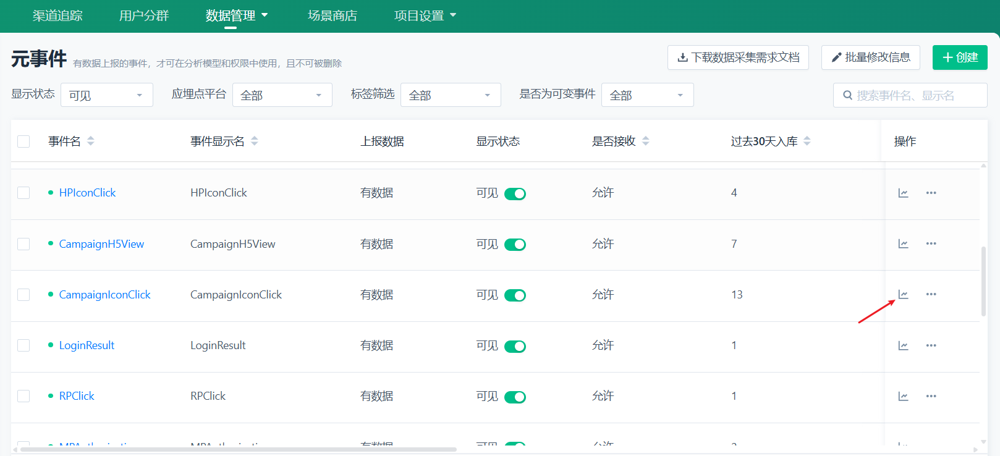

# Nextjs 项目接入神策埋点

## 1, 登录 获取数据接收地址

先登录神策后台，点击 数据管理- 数据接入，复制数据接收地址；


## 2, 封装组讲

封装一个客户端组件`SensorsAnalytics.tsx`，将神策埋点代码封装在组件中，并把 上一步获取的 `serverUrl` 写入。

```tsx
"use client";
import Script from "next/script";
import { chatStore } from "@/stores/chatState";

interface SensorsConfig {
  serverUrl: string;
  project: string;
  bid?: string; // 业务标识（可选）
}

export const SensorsProvider = () => {
  const { appId } = chatStore();

  // 只有dev环境和prd环境才加载 本地开发环境不监听
  const isProduction = process.env.NEXT_PUBLIC_ENV === "production" || process.env.NEXT_PUBLIC_ENV === "dev";
  if (!isProduction) return null;

  const config: SensorsConfig = {
    serverUrl: "", // 替换为获取到的数据接收地址
    project: "", // 替换为项目标识
    bid: appId // 业务标识
  };

  return (
    <Script id="sensors-analytics" strategy="lazyOnload">
      {`
          (function(serverUrl, project, bid) {
            // 1. 加载SDK
            var script = document.createElement('script');
            script.src = '/sensorsdata.js';
            script.crossorigin = true;
            
            // 2. SDK加载完成后初始化
            script.onload = function() {
              console.warn('神策埋点已加载');
              var sensors = window['sensorsDataAnalytic201505'];
              sensors.init({
                server_url: serverUrl + '?project=' + project,
                heatmap: {
                  clickmap: "default",
                  scroll_notice_map: "default"
                },
                is_track_single_page: true,
                use_client_time: true
              });

              // 3. 设置用户属性
              sensors.registerPage({
                platform_type: "web",
                project_name: project,
                app_id: bid,
              });

              // 4. 开启自动采集
              sensors.quick('autoTrack');
            };

            document.head.appendChild(script);
          })(
            "${config.serverUrl}",
            "${config.project}",
            "${config.bid}"
          );
        `}
    </Script>
  );
};
```

## 3, 引入组件

在 `layout.tsx` 中引入组件`SensorsProvider` 。

```tsx
import { SensorsProvider } from "@/app/components/SensorsAnalytics";

export default function RootLayout({ children }: { children: ReactNode }) {
  return (
    <html lang="en">
      <body>
        {/* 神策埋点组件 */}
        <SensorsProvider />
        {children}
      </body>
    </html>
  );
}
```

## 4, 查看数据

登录神策后台，查看数据。


分析数据：



**参考博客**：[vue 项目接入神策](https://blog.csdn.net/tt1234561009/article/details/130422786)
