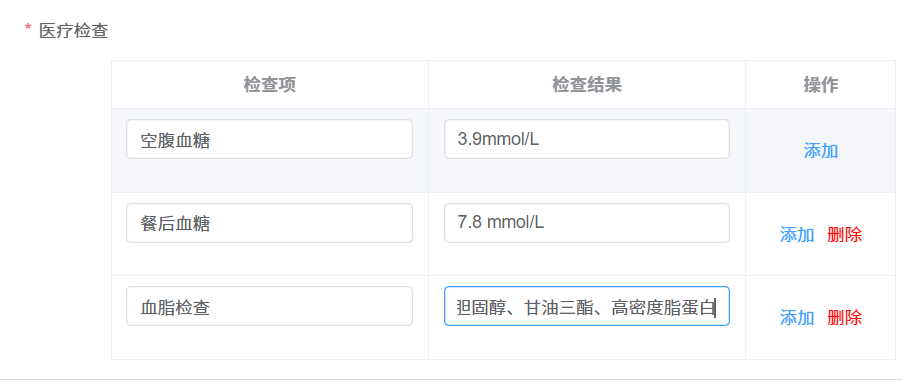

# form 表单嵌套 table 表格

---

下面是日常项目中 form 表单嵌套 table 表格的场景。同时也添加了表单项的校验规则。

::: tip 截图如下：



:::

1，`template` 模板部分如下：

```javascript
 <el-form>
      {/* 其他表单项 */}
      <el-form-item label="病症详情" prop="conditionDetails">
          <el-input v-model="formData.conditionDetails" placeholder="请输入病症详情" maxlength="20" />
        </el-form-item>

      {/* 嵌套项 */}
        <div class="table-content">
          <p class="star">医疗检查</p>
          <el-table :data="formData.medicalExaminationList" style="width: 90%; margin-left: auto" border>
            <el-table-column prop="k1" label="检查项" align="center">
              <template #default="scope">
                <el-form-item :required="true" :prop="'medicalExaminationList.' + scope.$index + '.k1'" :rules="formRules.k1">
                  <el-input v-model="scope.row.k1" />
                </el-form-item>
              </template>
            </el-table-column>
            <el-table-column prop="v1" label="检查结果" align="center">
              <template #default="scope">
                <el-form-item :required="true" :prop="'medicalExaminationList.' + scope.$index + '.v1'" :rules="formRules.v1">
                  <el-input v-model="scope.row.v1" />
                </el-form-item>
              </template>
            </el-table-column>
            <el-table-column label="操作" align="center" width="120px">
              <template #default="scope">
                <div style="display: flex; gap: 10px; justify-content: center">
                  <span class="tag" @click="copy">添加</span>
                  <span class="tag" v-if="scope.$index !== 0" @click="del(scope.$index)" style="color: red">删除</span>
                </div>
              </template>
            </el-table-column>
          </el-table>
        </div>
      </el-form>
```

2，`ts `主要代码如下：

```javascript
/** 绑定的一定是一个数组 */
const formData = {
  medicalExaminationList: [
    {
      k1: "",
      v1: ""
    }
  ]
};

/** 校验规则 */
const formRules = reactive({
  conditionDetails: [{ required: true, message: "病症详情不能为空", trigger: "change" }],
  k1: [{ required: true, message: "检查项不能为空", trigger: "change" }],
  v1: [{ required: true, message: "检查结果不能为空", trigger: "change" }]
});

/** 复制 */
function copy() {
  if (formData.value.medicalExaminationList.length >= 5) {
    return message.warning("最多只能录入5项");
  }
  formData.value.medicalExaminationList.push({
    k1: "",
    v1: ""
  });
}
/** 删除 */
function del(id: number) {
  if (formData.value.medicalExaminationList.length === 1) return message.warning("至少录入一项医疗检查");
  formData.value.medicalExaminationList.splice(id, 1);
}
```
