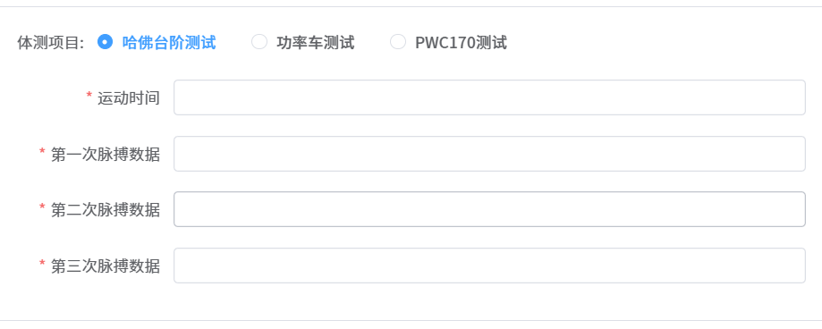
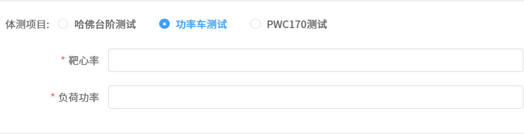

# 单选框的选择动态切换不同的 form 表单

---

**需求：** 

点击`单选框`，切换不同的 `form 表单`测试项，**不是暴力的显示隐藏，而是通过数据绑定**，切换不同的 form 表单；

这也是 `vue` 的核心思想，以**数据驱动视图**；

::: info 实现的效果图如下： 图一：



图二：

 

:::

1，`template` 部分：

```html
<div class="content" v-if="formType === 'create'">
  <el-form-item label="体测项目:" prop="assessmentProject">
    <el-radio-group v-model="formData.assessmentProject" @change="updateRadio">
      <el-radio v-for="dict in getIntDictOptions(DICT_TYPE.PHYSICAL_ASSESSMENT_PROJECT)" :key="dict.value" :value="dict.value">
        {{ dict.label }}
      </el-radio>
    </el-radio-group>
  </el-form-item>
  <!-- 显示的表单  -->
  <el-form ref="formRef" :model="physicalTestingProject" :rules="formRules" label-width="140px" v-loading="formLoading">
    <el-form-item v-for="(field, index) in currentFormFields" :key="index" :label="field.label" :prop="field.value" :rules="field.rules">
      <el-input v-model="physicalTestingProject[field.value]" @input="(value) => onlyInputNumber(value, field.value)" />
    </el-form-item>
  </el-form>
</div>
```

2，`ts` 部分：

```js
// 定义枚举值
const formTypes = reactive({
  typeMap: {
    1: "harvardStepTestVO",
    2: "powerCarTestVO",
    3: "pwc170TestVO"
  },
  typeMapText: {
    1: "哈佛台阶测试",
    2: "功率车测试",
    3: "PWC170测试"
  }
});

const physicalTestingProject = ref({}); // 表单数据
const selectedTestType = ref("harvardStepTestVO"); // 当前选中的体测项目

const formData =
  ref <
  CreatePhysicalAssessmentRecordReqVO >
  {
    assessmentProject: 1, // 体测项目
    patientId: null // 患者编号
  };

// 获取当前渲染的表单结构
const currentFormFields = computed(() => {
  return formStructure[selectedTestType.value];
});

/** 选择的体测项目 并清空之前的填写 - 选中单选框处方 */
const updateRadio = (e: number) => {
  physicalTestingProject.value = {};
  selectedTestType.value = formTypes.typeMap[e];
};

// 所有的表单项
const formStructure = {
  // 哈佛台阶测试 1
  harvardStepTestVO: [
    {
      label: "运动时间",
      value: "exerciseTime",
      rules: [{ required: true, message: "请输入运动时间", trigger: "blur" }]
    },
    {
      label: "第一次脉搏数据",
      value: "firstPulse",
      rules: [{ required: true, message: "请输入第一次脉搏数据", trigger: "blur" }]
    },
    {
      label: "第二次脉搏数据",
      value: "secondPulse",
      rules: [{ required: true, message: "请输入第二次脉搏数据", trigger: "blur" }]
    },
    {
      label: "第三次脉搏数据",
      value: "thirdPulse",
      rules: [{ required: true, message: "请输入第三次脉搏数据", trigger: "blur" }]
    }
  ],
  // 功率车测试 2
  powerCarTestVO: [
    {
      label: "靶心率",
      value: "pedalingRate",
      rules: [{ required: true, message: "请输入靶心率", trigger: "blur" }]
    },
    {
      label: "负荷功率",
      value: "loadPower",
      rules: [{ required: true, message: "请输入负荷功率", trigger: "blur" }]
    }
  ],
  // PWC170测试 pwc170TestVO 3
  pwc170TestVO: [
    {
      label: "第一次负荷功率",
      value: "firstLoadPower",
      rules: [{ required: true, message: "请输入第一次负荷功率", trigger: "blur" }]
    },
    {
      label: "第一次负荷后心率",
      value: "firstLoadPulseRate",
      rules: [{ required: true, message: "请输入第一次负荷后心率", trigger: "blur" }]
    },
    {
      label: "第二次负荷功率",
      value: "secondLoadPower",
      rules: [{ required: true, message: "请输入第二次负荷功率", trigger: "blur" }]
    },
    {
      label: "第二次负荷后心率",
      value: "secondLoadPulseRate",
      rules: [{ required: true, message: "请输入第二次负荷后心率", trigger: "blur" }]
    }
  ]
};

/** 只能输入数字 */
function onlyInputNumber(value, value2) {
  physicalTestingProject.value[value2] = value.replace(/\D/g, "");
}
```
