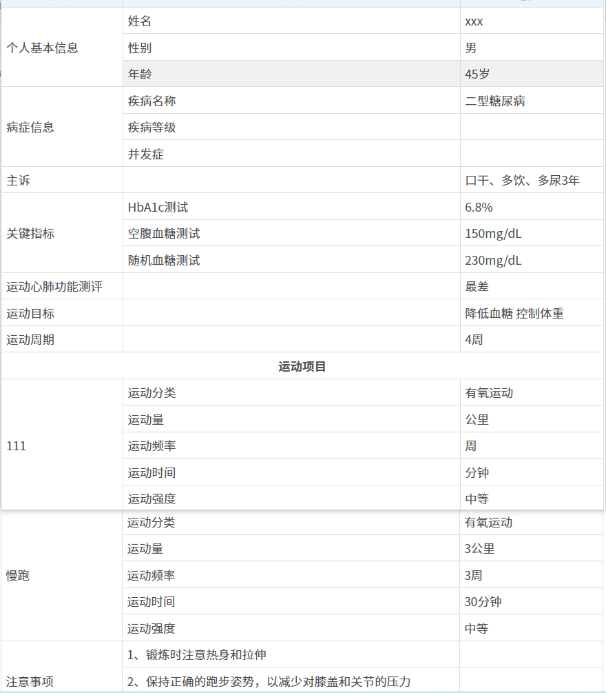

# 实现合并行列并循环的 table 表格

1，**效果图如下：** 

{width=80%}

2.`template` 代码如下：

```html
<table border="1">
  <thead>
    <tr>
      <th colspan="3">运动处方</th>
    </tr>
  </thead>

  <tr class="title">
    <th>类别</th>
    <th>子别</th>
    <th>信息</th>
  </tr>
  <!-- 个人基本信息 -->
  <tr>
    <td rowspan="4">个人基本信息</td>
  </tr>
  <tr>
    <td>姓名</td>
    <td>xxx</td>
  </tr>
  <tr>
    <td>性别</td>
    <td>{{ prescriptionData.sex }}</td>
  </tr>
  <tr>
    <td>年龄</td>
    <td>{{ prescriptionData.age }}岁</td>
  </tr>
  <!-- 病症信息 -->
  <tr>
    <td rowspan="4">病症信息</td>
  </tr>
  <tr>
    <td>疾病名称</td>
    <td>{{ prescriptionData.disease }}</td>
  </tr>
  <tr>
    <td>疾病等级</td>
    <td>{{ prescriptionData.diseaseLevel }}</td>
  </tr>
  <tr>
    <td>并发症</td>
    <td>{{ prescriptionData.complication }}</td>
  </tr>

  <tr>
    <td>主诉</td>
    <td></td>
    <td>{{ prescriptionData.chiefComplaint }}</td>
  </tr>

  <!-- 关键指标  -->
  <tbody>
    <tr>
      <td :rowspan="keyIndicatorsList.length + 1">关键指标</td>
    </tr>
    <tr v-for="(item, index) in keyIndicatorsList" :key="index">
      <td>{{ item.label }}</td>
      <td>{{ item.value }}</td>
    </tr>
  </tbody>
  <!-- 运动心肺功能测评 -->
  <tr>
    <td>运动心肺功能测评</td>
    <td></td>
    <td>{{ prescriptionData.cpet }}</td>
  </tr>

  <!-- 运动目标 -->
  <tr>
    <td>运动目标</td>
    <td></td>
    <td>{{ prescriptionData.exercisePrescriptionRespDTO.goal }}</td>
  </tr>
  <tr>
    <td>运动周期</td>
    <td></td>
    <td>{{ prescriptionData.exercisePrescriptionRespDTO.totalCycle }}周</td>
  </tr>
  <!-- 运动项目 -->
  <tr>
    <td colspan="3" align="center" style="font-weight: 600; text-align: center">运动项目</td>
  </tr>

  <!-- 运动子项 -->
  <tbody v-for="(item, index) in exerciseProjectList" :key="index">
    <tr>
      <td rowspan="7">{{ item.projectName }}</td>
    </tr>
    <tr>
      <td>运动分类</td>
      <td>{{ getDictLabel(DICT_TYPE.AI_EXERCISE_MAJOR_CATEGORY, item.majorCategory) }}</td>
    </tr>
    <tr>
      <td>运动量</td>
      <td>{{ item.volume }}{{ getDictLabel(DICT_TYPE.AI_EXERCISE_MEASUREMENT_UNIT, item.unit) }}</td>
    </tr>
    <tr>
      <td>运动频率</td>
      <td>{{ item.frequency }}{{ getDictLabel(DICT_TYPE.AI_EXERCISE_FREQUENCY, item.frequencyUnit) }}</td>
    </tr>
    <tr>
      <td>运动时间</td>
      <td>{{ item.duration }}{{ getDictLabel(DICT_TYPE.AI_EXERCISE_DURATION, item.durationUnit) }}</td>
    </tr>
    <tr>
      <td>运动强度</td>
      <td>{{ getDictLabel(DICT_TYPE.AI_EXERCISE_INTENSITY_LEVEL, item.intensity) }}</td>
    </tr>
    <tr>
      <td>是否分组</td>
      <td>{{ item.isGroup === 1 ? '是' : '否' }}</td>
    </tr>
  </tbody>
  <!-- 注意事项 -->
  <tr>
    <td :rowspan="tipsList.length + 1">注意事项</td>
  </tr>
  <tr v-for="(item, index) in tipsList" :key="index">
    <td>{{ item }}</td>
    <td></td>
  </tr>
</table>
```

3，`js` 如下：

```js
import { ref, reactive, toRefs, onMounted, computed, onBeforeMount } from "vue";
import { prescriptionStoreWithOut } from "@/store/modules/prescription"; // vuex
import { getIntDictOptions, DICT_TYPE, getDictLabel } from "@/utils/dict";
import { PrescriptionInfoMatchingRespVO } from "@/api/prescription/info/index";

const prescriptionStore = prescriptionStoreWithOut(); // vuex

// 处方信息
const prescriptionData =
  ref <
  PrescriptionInfoMatchingRespVO >
  {
    exercisePrescriptionRespDTO: {
      cycleUnit: "", // 周期单位
      followUp: "", // 随访
      goal: "", //目标
      id: null, //主键ID
      items: [], //处方明细
      medicalId: null, //就诊ID
      stage: "", //阶段
      tips: "", //注意事项
      totalCycle: null //周期数
    }
  };

// 注意事项列表
const tipsList = computed(() => {
  if (prescriptionData.value.exercisePrescriptionRespDTO.tips) {
    return prescriptionData.value.exercisePrescriptionRespDTO.tips.split("\n");
  }
  return [];
});

// 运动项列表
const exerciseProjectList = computed(() => {
  return prescriptionData.value.exercisePrescriptionRespDTO.items || [];
});

// 关键指标列表
const keyIndicatorsList = computed(() => {
  if (prescriptionData.value.keyIndicators) {
    const indicatorsObject = JSON.parse(prescriptionData.value.keyIndicators);
    const indicatorsArray = Object.entries(indicatorsObject).map(([label, value]) => {
      // 处理空值的情况 给默认值
      if (value === null || value === "") {
        return { label, value: "" };
      }
      return { label, value };
    });
    return indicatorsArray;
  } else {
    return [];
  }
});

onBeforeMount(() => {
  if (prescriptionStore.prescriptionObject) {
    prescriptionData.value = prescriptionStore.prescriptionObject;
  }
});
```

4，`css` 样式如下：

```css
<style scoped lang="scss">
  /* 重置表格默认样式 */
  table {
    // min-width: 700px; 在组件中直接更改宽度
    width: 100%;
    margin: 0 auto;
    border-collapse: collapse;
    td,
    th {
      border: 1px solid #ddd;
      padding: 5px;
      text-align: left;
      font-size: 14px;
      color: #525252;
    }

    /* 表头样式 */
    thead th {
      color: #333;
      text-align: center;
      padding: 8px;
      border: 1px solid #ddd;
      font-size: 16px;
    }

    .title th {
      background: #e7f5ff;
      color: #525252;
      text-align: center;
      font-size: 14px;
    }
  }

  /* 表格标题样式 */
  caption {
    font-size: 1.5em;
    text-align: left;
    padding: 10px;
    font-weight: bold;
  }

  /* 隔行变色 */
  table tr:nth-child(even) {
    // background-color: #f9f9f9;
  }

  /* 鼠标悬停样式 */
  table tr:hover {
    background-color: #f1f1f1;
  }

  /* 合并单元格时的样式 */
  // td[rowspan],
  // th[rowspan] {
  //   background-color: #e8e8e8;
  // }
</style>
```
