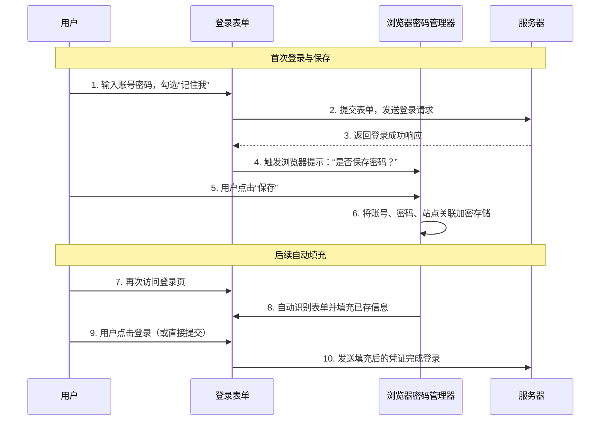

# 前端实现 [记住密码] 功能

---

我们在访问网站的时候，发现很多的登录页面都是有记住密码的功能的。

如`gitee码云`的登录页面：


## 一、核心实现原理：不是记住，而是“提示填充”

首先要澄清一个常见的误解：**前端的“记住密码”功能通常并不直接存储你的密码明文**。它的核心原理是：**请求浏览器将账号密码保存到其密码管理器中，并在下次检测到对应登录表单时，自动或提示用户填充。**

下图清晰地展示了这一核心流程：



## 二、技术实现方案详解

### 方案一：依赖浏览器原生行为（最常用）

这是最标准、最安全的做法。浏览器的密码管理器会自动识别符合规范的登录表单。

**1. 基础表单要求**
```html
<form id="login-form" method="post">
    <!-- 关键：input的type和name需规范 -->
    <input type="text" name="username" id="username" autocomplete="username">
    <input type="password" name="password" id="password" autocomplete="current-password">
    
    <!-- “记住我”复选框 -->
    <label>
        <input type="checkbox" name="remember-me" id="remember-me"> 记住密码
    </label>
    
    <button type="submit">登录</button>
</form>
```

**关键属性说明：**
- **`autocomplete`**：这是提示浏览器自动填充的**关键属性**。`username` 和 `current-password` 是标准值。
- **`type=”password”`**：浏览器通过此类型识别密码字段。
- **规范的 `name` 属性**：如 `username`、`password` 等，能帮助浏览器更准确地识别。

**2. 登录成功后的处理**
当表单提交且服务器验证成功后，如果用户勾选了“记住我”，**浏览器会自动弹出对话框**，询问用户是否保存密码。这个提示是由浏览器控制的，网站无法强制触发。

### 方案二：前端持久化存储（需谨慎考虑）

有时需要实现“记住登录状态”而非让浏览器管理密码本身（例如保持用户一周内免登录）。这时会使用前端存储。

**1. 实现示例：使用Cookie**
```javascript
function handleLogin(username, password, rememberMe) {
    // 向服务器发送登录请求...
    if (loginSuccess && rememberMe) {
        // 服务器在响应中设置一个长期的、HttpOnly的认证Token Cookie
        // 示例：Set-Cookie: session_token=abc123; Max-Age=604800; HttpOnly; Secure
        // 前端仅通过是否勾选“记住我”来影响服务器对Cookie有效期的设置
    }
}
```

**2. 实现示例：使用Web Storage（仅存储标识）**
```javascript
// 登录成功后
if (rememberMe && loginSuccess) {
    // 存储一个非敏感的、服务器颁发的Token（而非密码！）
    localStorage.setItem('auth_token', serverResponse.token);
    localStorage.setItem('username', username); // 仅用于显示，不用于认证
}

// 下次访问时检查
window.addEventListener('DOMContentLoaded', function() {
    const token = localStorage.getItem('auth_token');
    if (token) {
        // 使用Token向服务器请求验证，获取登录态
        autoLoginWithToken(token);
    }
});
```

## 三、安全考量与实践准则

记住密码功能在安全上如履薄冰，以下是必须遵守的准则：

| 安全风险 | 错误做法 | 正确实践 |
| :--- | :--- | :--- |
| **密码明文存储** | 将密码存到 `localStorage`、Cookie 或全局变量 | **绝不**在前端持久化存储明文密码。让浏览器的密码管理器负责安全存储。 |
| **传输安全** | 登录表单通过 HTTP 明文提交 | **始终使用 HTTPS**，确保凭证传输过程加密。 |
| **Cookie安全** | 使用 Cookie 时未设置安全标志 | 设置 `HttpOnly`（防XSS窃取）、`Secure`（仅HTTPS传输）、`SameSite`（防CSRF）属性。 |
| **会话管理** | 过长的会话有效期 | “记住我”的会话应有过期时间（如7天、30天），并提供便捷的“退出所有设备”功能。 |

## 四、最佳实践总结

1.  **优先使用浏览器原生功能**：对于“记住密码”，最安全的方式是让浏览器管理。确保你的登录表单语义清晰（规范的 `autocomplete` 和 `type`）。
2.  **区分“记住密码”和“保持登录”**：
    - **记住密码**：让浏览器保存凭证，下次自动填充。适用于个人设备。
    - **保持登录**：在用户关闭浏览器再打开后，通过安全的Token自动登录。实现时服务器颁发一个有时效性的Token（如7天）。
3.  **给予用户控制权**：在“账户设置”中提供“查看已保存设备”和“远程登出”的功能，增加用户安全感。
4.  **清晰的视觉提示**：当密码被自动填充或用户处于“记住登录”状态时，应有明确的界面提示。
5.  **关键操作重新验证**：即使用户处于“记住登录”状态，在进行支付、修改密码等敏感操作时，仍应要求重新输入密码或进行二次验证。

