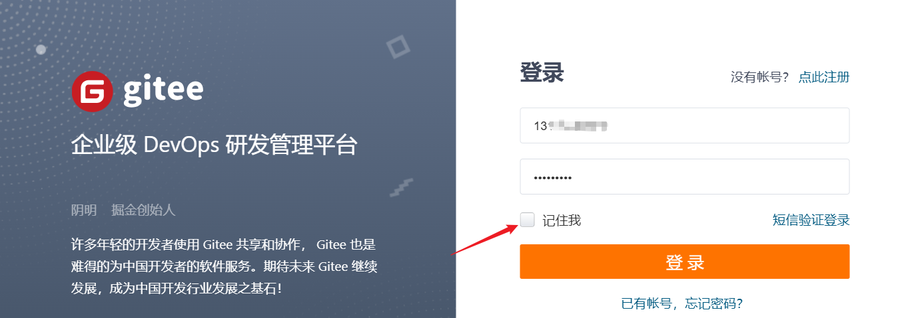

# 后台管理实现 [记住密码] 功能

---

我们在访问网站的时候，发现很多的登录页面都是有记住密码的功能的。

如码云的登录页面：



**那么，我们如何实现这个功能呢？**

其实也是很简单的，主要是使用 `localstorage` 本地存储来实现的。

**`localstorage` 和 `sessionStorage` 的知识回顾:**

| 特征           | `localStorage`                       | `sessionStorage`                                     |
| -------------- | ------------------------------------ | ---------------------------------------------------- |
| **持久性**     | 数据永久保存，除非用户清除或程序删除 | 数据只在当前会话期间保存，会话结束时（关闭窗口）清除 |
| **生命周期**   | 数据一直存在，直到被明确删除         | 数据在关闭窗口或标签页后被清除                       |
| **容量**       | 通常约 5MB                           | 通常约 5MB                                           |
| **跨页面共享** | 同一域名下的所有页面可以访问         | 同一域名下的所有页面可以访问                         |
| **事件通知**   | 支持 `storage` 事件                  | 支持 `storage` 事件                                  |
| **使用场景**   | 适合长期存储数据，如用户偏好设置     | 适合临时存储数据，如表单输入等                       |
| **安全性**     | 与 `sessionStorage` 类似，但更持久   | 与 `localStorage` 类似，但更短暂                     |

可以看出 `localstorage` 的生命周期更长，关闭浏览器也会依旧存在。而 `sessionStorage` 关闭该窗口就会被清除，更不要说关闭浏览器了。

所以使用 `sessionStorage` 来伤实现 **记住密码** 是比较常用的方式。

**实现如下：**


在用户点击 **记住密码** 的时候，将用户名和密码存入 `sessionStorage` 中。当然这是在用户成功登录的情况下进行的。否则，用户没有登录成功，则不进行存储。

**1. 用户点击登录按钮且成功时：**

```js
if (loginData.loginForm.rememberMe) {
    setLoginForm(loginData.loginForm);
} else {
    removeLoginForm();
}
 // 存储登录信息并进行加密
 const setLoginForm = (loginForm: LoginFormType) => {
  loginForm.password = encrypt(loginForm.password) as string
  loginForm.password = loginForm.password as string;
  wsCache.set(CACHE_KEY.LoginForm, loginForm, { exp: 30 * 24 * 60 * 60 });
};

 const removeLoginForm = () => {
  wsCache.delete(CACHE_KEY.LoginForm);
};
```

为了安全起见，我们还需要对密码进行加密处理。这里使用了`RSA非对称加密算法`。

不太懂加密的可以先了解下这篇文章：[前端常用加密方式使用](/column/Project/性能与架构/前端常用加密方式.html)

**2. 用户关闭浏览器时，下次进来时**

```js
 const getLoginForm = () => {
  const loginForm: LoginFormType = wsCache.get(CACHE_KEY.LoginForm);
  if (loginForm) {
    loginForm.password = decrypt(loginForm.password) as string // 进行解密
    loginForm.password = loginForm.password as string;
  }
  return loginForm;
};
onMounted(() => {
   const loginForm = getLoginForm(); // 获取存储的登录信息并解密
  // 然后赋值到登录表单中
  if (loginForm) {
    loginData.loginForm = {
      ...loginData.loginForm,
      username: loginForm.username ? loginForm.username : loginData.loginForm.username,
      password: loginForm.password ? loginForm.password : loginData.loginForm.password,
      rememberMe: loginForm.rememberMe,
      tenantName: loginForm.tenantName ? loginForm.tenantName : loginData.loginForm.tenantName
    };
  }
});

```

当用户关闭浏览器时，下次进来时，`onMounted` 生命周期函数就会执行，获取存储的登录信息并解密，然后赋值给 form 表单。
