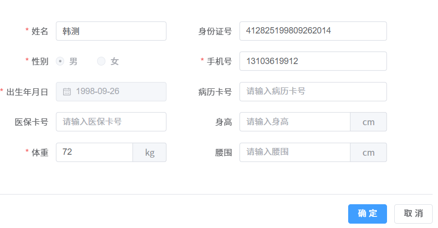

# 常用 form 表单的验证

::: tip 概括 
表单验证是确保用户输入数据有效性和正确性的关键步骤。在日常开发中，表单验证可以通过客户端（浏览器）和服务器端进行。客户端验证可以提供即时反馈，提高用户体验；而服务器端验证则是安全所必需的，因为客户端验证可以被绕过。 
:::

下面是日常项目中对姓名，身份证，手机号，出生年月，身高，体重，腰围的一些表单验证，此案例身份证号非必填；

如果填了身份证号，性别和出生年月日由身份自动带出，并禁用性别和出生年月。

::: tip 截图如下： 

:::

1，template 模板部分如下：比较简单，直接看代码：

```javascript
  <div class="form-content" v-if="formType !== 'detail'">
      <el-form ref="formRef" :model="formData" :rules="formRules" label-width="100px" v-loading="formLoading">
        <el-row :gutter="20">
          <el-col :span="10">
            <el-form-item label="姓名" prop="name">
              <el-input v-model="formData.name" placeholder="请输入姓名" />
            </el-form-item>
          </el-col>
          <el-col :span="12">
            <el-form-item label="身份证号" prop="idCard">
              <el-input v-model="formData.idCard" :clear="true" maxlength="18" @input="(value) => onlyInputAlphanumeric(value)" placeholder="请输入身份证号" /> </el-form-item
          ></el-col>
        </el-row>

        <el-row :gutter="20">
          <el-col :span="10">
            <el-form-item label="性别" prop="sex">
              <el-radio-group v-model="formData.sex">
                <el-radio v-for="dict in getIntDictOptions(DICT_TYPE.SYSTEM_USER_SEX)" :key="dict.value" :label="dict.value" :disabled="disabledIdCard">
                  {{ dict.label }}
                </el-radio>
              </el-radio-group>
            </el-form-item>
          </el-col>
          <el-col :span="12">
            <el-form-item label="手机号" prop="mobile">
              <el-input v-model.number="formData.mobile" @input="(value) => onlyInputNumber(value, 'mobile')" maxlength="11" placeholder="请输入手机号" />
            </el-form-item>
          </el-col>
        </el-row>

        <el-row :gutter="20">
          <el-col :span="10">
            <el-form-item label="出生年月日" prop="birthday">
              <el-date-picker v-model="formData.birthday" clearable placeholder="出生年月日" type="date" value-format="YYYY-MM-DD" :disabled-date="disableFutureDates" :disabled="disabledIdCard" />
            </el-form-item>
          </el-col>
          <el-col :span="12">
            <el-form-item label="病历卡号" prop="medicalCardNo">
              <el-input v-model="formData.medicalCardNo" placeholder="请输入病历卡号" />
            </el-form-item>
          </el-col>
        </el-row>

        <el-row :gutter="20">
          <el-col :span="10">
            <el-form-item label="医保卡号" prop="insuranceCardNo">
              <el-input v-model="formData.insuranceCardNo" placeholder="请输入医保卡号" />
            </el-form-item>
          </el-col>
          <el-col :span="12">
            <el-form-item label="身高" prop="height">
              <el-input v-model="formData.height" @input="(value) => onlyInputNumber(value, 'height')" placeholder="请输入身高">
                <template #append>
                  <span>cm</span>
                </template>
              </el-input>
            </el-form-item>
          </el-col>
        </el-row>

        <el-row :gutter="20">
          <el-col :span="10">
            <el-form-item label="体重" prop="weight">
              <el-input v-model="formData.weight" @input="(value) => onlyInputNumber(value, 'weight')" placeholder="请输入体重">
                <template #append>
                  <span>kg</span>
                </template></el-input
              >
            </el-form-item>
          </el-col>
          <el-col :span="12">
            <el-form-item label="腰围" prop="waistline">
              <el-input v-model="formData.waistline" @input="(value) => onlyInputNumber(value, 'waistline')" placeholder="请输入腰围">
                <template #append>
                  <span>cm</span>
                </template></el-input
              >
            </el-form-item>
          </el-col>
        </el-row>
      </el-form>
    </div>
```

2，ts主要代码如下：

```javascript
const formData = ref < InfoVO > formDataBasic; // 表单数据

// 定义规则
const formRules = reactive({
  name: [{ required: true, trigger: "blur", validator: validatorName }],
  mobile: [{ required: true, message: "请输入正确的手机号码", trigger: "change", pattern: /^1[3|4|5|6|7|8|9][0-9]\d{8}$/ }],
  sex: [{ required: true, message: "性别不能为空", trigger: "blur" }],
  idCard: [{ required: false, message: "请输入正确的身份证号", trigger: "blur", validator: validatorIdCard }],
  birthday: [{ required: true, message: "出生年月日不能为空", trigger: "blur" }],
  weight: [{ required: true, trigger: "blur", validator: validatorWeight }],
  height: [{ required: false, validator: validatorHeight }],
  waistline: [{ required: false, validator: validatorWaistline }]
});

/** 出生年月的日期限制 */
function disableFutureDates(time: Date) {
  // 获取今天的日期
  const today = new Date();
  // 设置时间为一天的开始，也就是午夜
  today.setHours(0, 0, 0, 0);
  // 比较日期
  return time.getTime() > today.getTime();
}

/** 校验姓名 */
function validatorName(rule: any, value: any, callback: any) {
  if (!value) return callback(new Error("姓名不能为空"));
  if (!/^[\u4e00-\u9fa5]{2,4}$/.test(value)) {
    return callback(new Error("姓名限制2~4个中文"));
  }
  callback();
}

/** 校验体重 */
function validatorWeight(rule: any, value: any, callback: any) {
  if (!value) return callback(new Error("体重不能为空"));
  if (value > 200) {
    return callback(new Error("请核对体重信息"));
  }
  callback();
}
/** 校验身高 */
function validatorHeight(rule: any, value: any, callback: any) {
  if (!value) callback();
  if (value > 300) {
    return callback(new Error("请核对身高信息"));
  }
  callback();
}
/** 校验腰围 */
function validatorWaistline(rule: any, value: any, callback: any) {
  if (!value) callback();
  if (value > 130) {
    return callback(new Error("请核对腰围信息"));
  }
  callback();
}

/** 校验身份证 */
function validatorIdCard(rule: any, value: any, callback: any) {
  if (!value) {
    callback();
    return;
  }
  // 根据身份证判断性别
  formData.value.sex = Number(value.substring(16, 17)) % 2 === 0 ? 2 : 1;
  // 根据身份证获取出生年月
  formData.value.birthday = getBirthDateFromIDCard(value);

  const data = validateIdent.IdentityCodeValid(value);
  if (data) {
    /** 只有正确的身份证号格式才会封印 年龄和性别 */
    disabledIdCard.value = true;
    callback();
  } else {
    disabledIdCard.value = false;
    return callback(new Error("请输入正确的身份证号"));
  }
}

/** 只能输入数字 */
function onlyInputNumber(value: string, prop: string) {
  formData.value[prop] = value.replace(/\D/g, "");
}

/** 只能输入数字和字母 */
function onlyInputAlphanumeric(value: string) {
  formData.value.idCard = value.replace(/[^0-9a-zA-Z]/g, "");
}

/** 提取出生年月 */
function getBirthDateFromIDCard(idCard: string) {
  // 检查身份证号码是否为18位
  if (idCard.length !== 18) {
    throw new Error("身份证号码必须为18位");
  }
  // 提取出生年月
  const year = idCard.substring(6, 10);
  const month = idCard.substring(10, 12);
  const day = idCard.substring(12, 14);
  // 返回出生年月
  return `${year}-${month}-${day}`;
}

/** 监听 idCard 改变，自动校验身份证号并改变年龄和出生年月 */
watch(
  () => formData.value.idCard,
  (newValue) => {
    if (newValue && newValue.length === 18 && validateIdent.IdentityCodeValid(newValue)) {
      // 根据身份证判断性别
      formData.value.sex = Number(newValue.substring(16, 17)) % 2 === 0 ? 2 : 1;
      // 根据身份证获取出生年月
      formData.value.birthday = getBirthDateFromIDCard(newValue);
      /** 只有正确的身份证号格式才会封印 年龄和性别 */
      disabledIdCard.value = true;
    } else {
      disabledIdCard.value = false;
    }
  }
);
```

3，身份证号的校验函数如下：

```js
/**
 * 身份证信息校验  使用：validateIdent.IdentityCodeValid
 */
export const validateIdent = {
  aIdentityCode_City: {
    11: '北京',
    12: '天津',
    13: '河北',
    14: '山西',
    15: '内蒙古',
    21: '辽宁',
    22: '吉林',
    23: '黑龙江',
    31: '上海',
    32: '江苏',
    33: '浙江',
    34: '安徽',
    35: '福建',
    36: '江西',
    37: '山东',
    41: '河南',
    42: '湖北',
    43: '湖南',
    44: '广东',
    45: '广西',
    46: '海南',
    50: '重庆',
    51: '四川',
    52: '贵州',
    53: '云南',
    54: '西藏',
    61: '陕西',
    62: '甘肃',
    63: '青海',
    64: '宁夏',
    65: '新疆',
    71: '台湾',
    81: '香港',
    82: '澳门',
    91: '国外'
  },
  IdentityCode_isCardNo(card: string): boolean {
    // 检查号码是否符合规范，包括长度，类型
    const reg = /^(^\d{17}(\d|X)$)/; // 身份证号码为18位，前17位为数字，最后一位是校验位，可能为数字或字符X
    return reg.test(card);
  },
  IdentityCode_checkProvince(card: string): boolean {
    // 取身份证前两位，校验省份
    const province = card.substr(0, 2);
    if (!this.aIdentityCode_City[province]) {
      return false;
    }
    return true;
  },
  IdentityCode_checkBirthday(card: string): boolean {
    // 检查生日是否正确，18位身份证号码
    const len = card.length;
    if (len !== 18) {
      return false;
    }
    const re_eighteen = /^(\d{6})(\d{4})(\d{2})(\d{2})(\d{3})([0-9]|X)$/;
    const arr_data = card.match(re_eighteen); // 正则取号码内所含出年月日数据
    if (!arr_data) {
      return false;
    }
    const year = arr_data[2];
    const month = arr_data[3];
    const day = arr_data[4];
    const birthday = new Date(`${year}-${month}-${day}`);
    return this.IdentityCode_verifyBirthday(year, month, day, birthday);
  },
  IdentityCode_verifyBirthday(year: string, month: string, day: string, birthday: Date): boolean {
    // 校验日期，并且出生日期不能为明天或以后
    const now = new Date();
    const tomorrow = new Date(now.getTime() + 24 * 60 * 60 * 1000); // 获取明天的日期
    // 年月日是否合理
    if (birthday.getFullYear() === parseInt(year) && birthday.getMonth() + 1 === parseInt(month) && birthday.getDate() === parseInt(day)) {
      // 确保出生日期不是明天或以后
      if (birthday <= now) {
        return true;
      } else {
        console.log('出生日期不能是明天或以后！');
        return false;
      }
    }
    console.log('生日日期格式错误！');
    return false;
  },
  IdentityCode_checkParity(card: string): boolean {
    // 校验位的检测
    const arrInt = [7, 9, 10, 5, 8, 4, 2, 1, 6, 3, 7, 9, 10, 5, 8, 4, 2];
    const arrCh = ['1', '0', 'X', '9', '8', '7', '6', '5', '4', '3', '2'];
    let cardTemp = 0;
    for (let i = 0; i < 17; i++) {
      cardTemp += parseInt(card.charAt(i), 10) * arrInt[i];
    }
    const valnum = arrCh[cardTemp % 11];
    return valnum === card.charAt(17);
  },
  IdentityCodeValid(card: string): boolean {
    // 身份证号码检验主入口
    let pass = true;
    // 是否为空
    if (pass && card === '') pass = false;
    // 校验长度，类型
    if (pass && !this.IdentityCode_isCardNo(card)) pass = false;
    // 检查省份
    if (pass && !this.IdentityCode_checkProvince(card)) pass = false;
    // 校验生日
    if (pass && !this.IdentityCode_checkBirthday(card)) pass = false;
    // 检验位的检测
    if (pass && !this.IdentityCode_checkParity(card)) pass = false;

    return pass;
  }
};

```