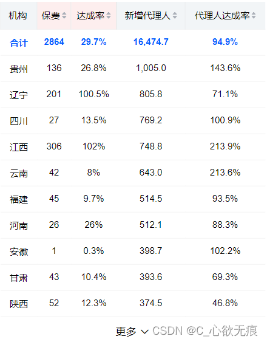

# 移动端的 table 表格简单实现

---

::: tip 主要实现功能：

1. 表头字段可以进行正序倒序排序功能；
2. 展开收起功能；
3. 蓝色这一行是合计数据 需要单独出来进行渲染，否则排序的时候此行会排乱掉；
4. 注意表头数据 thList，title 是标题，isSort 是否可以进行排序，backgroundColor 是表示是否添加特殊的背景颜色；sortField 是根据什么字段进行排序； 
:::


**效果图如下**：

::: tip 用到的模拟数据会放到最后面
{width=60%}
:::


## vue 代码如下

```javascript
<template>
  <div class="organizationDetails">
    <!-- 内容区 -->
    <div class="table-content" :class="controlHeight">
      <table ref="table" class="table">
        <!-- 表头 -->
        <tr class="top">
          <th v-for="(item_th, index_th) in thList" :key="index_th" :style="{ background: item_th.backgroundColor }">
            <span class="title">{{ item_th.title }}</span>
            <span class="sort" v-if="item_th.isSort" @click="needSort(item_th.sortField, index_th)" :class="[sortIndex === index_th && isNeedSort ? 'sortUp' : '']"></span>
          </th>
        </tr>
        <!-- 第一行的合计数据 需要高亮 -->
        <tr class="cont sum" v-for="(item, index) in totalData" :key="index + Math.random() * 24">
          <td>{{ item.comname2 }}</td>
          <td>{{ item.addAgent }}</td>
          <td>{{ item.addAgentRate }}</td>
          <td>{{ item.preium }}</td>
          <td>{{ item.premiumRate }}</td>
        </tr>

        <!--展示列表数据 -->
        <tr class="cont" v-for="(item_tr, index_tr) in data11" :key="index_tr">
          <td>{{ item_tr.comname2 }}</td>
          <td>{{ item_tr.addAgent }}</td>
          <td>{{ item_tr.addAgentRate }}</td>
          <td>{{ item_tr.preium }}</td>
          <td>{{ item_tr.premiumRate }}</td>
        </tr>
      </table>
    </div>
    <!-- 显示更多和收取 点击更多就展开 -->
    <div class="more" v-if="showMoreCom">
      <span :colspan="thList.length" @click="showMoreFun(true)" v-if="!showMore">
        更多
        <van-icon name="arrow-down" />
      </span>
      <span :colspan="thList.length" @click="showMoreFun2(false)" v-else>
        收起全部
        <van-icon name="arrow-up" />
      </span>
    </div>
  </div>
</template>

<script>
import { data11, totalData } from './mock/data.js';
export default {
  data() {
    return {
      // 数据
      data11: [],
      totalData: [],
      // 表头列表
      thList: [
        {
          title: '机构',
          isSort: false,
        },
        {
          title: '保费',
          isSort: true,// 是否进行排序
          backgroundColor: '#fdeeee', // 是否单独显示背景颜色
          sortField: 'addAgent',// 排序字段
        },
        {
          title: '达成率',
          isSort: true,
          backgroundColor: '#fdeeee',
          sortField: 'addAgentRate',
        },
        {
          title: '新增代理人',
          isSort: true,
          sortField: 'preium',
        },
        {
          title: '代理人达成率',
          isSort: true,
          sortField: 'premiumRate',
        },
      ],
      // 是否需要排序 默认不进行排序
      isNeedSort: false,
      // 排序序号
      sortIndex: null,
      // 排序形式 倒叙默认倒叙 false为正序
      order: true,
      // 是否显示更多
      showMore: this.showMoreCom,
    };
  },
  computed: {
    // 控制展开和收起的类名
    controlHeight() {
      if (this.showMore) {
        return 'normalHeight';
      } else {
        return 'controlHeight';
      }
    },
    // 判断是否展开  这里判断如果数大于11条时就进行显示展开
    showMoreCom() {
      return this.data11.length > 11;
    },
  },
  watch: {
    // 监听是否需要排序 与排序形式相统一 这是比较简便的方法
    isNeedSort: {
      handler(newV) {
        this.order = newV;
      },
      immediate: true, // 注意 这里要立即进行触发
    },
  },
  created() {
    this.data11 = data11;
    this.totalData = totalData; // 合计数据
  },
  mounted() {},
  methods: {
    chooseYearMonth(date) {
      this.yearMonth = date;
    },
    // 控制显示更多
    showMoreFun(boolean) {
      this.showMore = boolean;
    },
    showMoreFun2(boolean) {
      this.showMore = boolean;
    },

    // 点击排序处理排序箭头 然后调用排序方法 需要处理防抖
    needSort(sortField, index) {
      // 排序完成的数据 再次点击排序就恢复初始值
      if (this.isNeedSort) {
        this.isNeedSort = false;
        this.sortIndex = null;
        this.startSort(sortField, this.order);
        return;
      }
      this.isNeedSort = true;
      this.sortIndex = index;
      this.startSort(sortField, this.order);
    },
    // 开始排序 第一个参数是根据什么排序 第二个参数是倒序默认值
    startSort(sortField, order) {
      this.data11 = this.data11.sort((a, b) => {
        // 进行转换一下
        let value1 = b[sortField];
        let value2 = a[sortField];
        if (order) {
          // 倒序
          return parseFloat(this.delete(value1)) - parseFloat(this.delete(value2));
        } else {
          // 正序
          return parseFloat(this.delete(value2)) - parseFloat(this.delete(value1));
        }
      });
    },
    // 处理字符串
    delete(str) {
      if (typeof str === 'string') {
        return str.split(',').join('');
      } else {
        return str;
      }
    },
  },
};
</script>
<style scoped lang="scss">
// 控制高度
.controlHeight {
  height: 485px;
  overflow: hidden;
  transition: 0.3s;
}
// 正常高度
.normalHeight {
  height: 100%;
  transition: 0.3s;
}
// 头部
.header {
  display: flex;
  justify-content: space-between;
  align-items: center;
  padding: 0 10px;
  height: 40px;
}
// 表格相关样式
table {
  border-collapse: collapse;
  width: 98%;
  margin: 0 auto;
  text-align: center;
  font-size: 14px;
  // 每一行下面加边框
  tr {
    border-bottom: 1px solid #f1f1f1;
  }
  .cont {
    height: 40px;
  }
}
// 表头设置
.top {
  height: 40px;
  line-height: 40px;
  background: rgb(242, 245, 247);
  .title {
    margin-right: 3px;
  }
  th {
    border-left: 1px solid #e9ebec;
    font-weight: 500;
  }
}

// 合计一行高亮显示
.sum {
  color: #005dff;
  font-weight: bold;
}
// 正常排序的样式
.sort {
  display: inline-block;
  width: 7px;
  height: 10px;
  background-image: url(data:image/png;base64,iVBORw0KGgoAAAANSUhEUgAAABUAAAAeCAYAAAG012XDAAAABGdBTUEAALGPC/xhBQAAAppJREFUSA3dVjtvE0EQnjkbkCMRhBTIHwi/gdgSBQSIi1iOA3ZNT5HUQIfow6OnvwM/5BR2zKNAsvkP5A8kIEA4xALsW2b2POs9353jioKVzjP7zbezM7MvA1gNWXdrLWVhlhpvYTTeEuttNt2aLTaYSimvcc1zu90Mf9agQHVr+/cEdFjxaq0dAP9lIAGw2Xy/NBj++iysTPrcJdFPl0hJdImWtag9iXdEIE/qU6wpQ7ArNMlgbKawXlPNt8hQLZfyd8woUgzZbb7JwnDI84ZbOp2rFG72GJQYEhZwMi5UxwmcrIlnyS6JqbPWNdfpI3yJZRIu5TEJCtEu1alxup3Ohb29DxdlsEgdgnSUUg4cj76f/Pn5VetiIBkievU2J6ibrTNgiG6tfRJQJr82poluvf0JQEX3JmGBjVbLq7deKAX3J36iGiI+j6L/DEGv1n6sQD2aOSPiE9Qn8fBHpDShgcuLC04llxtQNa+EDHaHbMzRdawU8wfopEJHgrmMsY11szLl4q0qOrjLIDfWGQt6Mb98jsdnOWSN7MmQlTo62aP+O1BqFRA/wuXzN3Re00Srb8K0MKNSFLvA1WOH3FhSX+OGFVViI/UanS3ljzyiz5rUpyKW4+oTcuo2WiugoEffUnT+BITPPUJWVohZ2ul4k7ylvn15JnhJhHuwvLhm9gge9h8Q9WoifQ4DHbNVOOo/nIP6v1P0Qs1zNc1TCKrrs/Lm+rbZUvrlHf2m7aRW5nEQ4iAeZFJns4XCdf2sGKdCCt7IEW2vuJtXWCJxAOnUmrydBhVlWrqN/W3wfXO7TNvBcXYqxdtPIzgBkUhtEj9Jr+ptj/8CCE4Dqnc318tUP1+waTnTqZD5gYRjVVo4k2lsbFz7JniS/AspWgleJ+XDaAAAAABJRU5ErkJggg==);
  background-size: cover;
  background-position: 50%;
  background-repeat: no-repeat;
}
// 激活排序的样式
.sortUp {
  background-image: url(data:image/png;base64,iVBORw0KGgoAAAANSUhEUgAAABUAAAAeCAYAAAG012XDAAAABGdBTUEAALGPC/xhBQAAAqRJREFUSA3lVj1vE0EQnTljkFMQIRlRIDr4BRTJWUKQBEiKWE4Cdk1PkdRAh+gDpKe3Qz7kJiHEB0LyGck0tKSDICEQoAhijLGXmT3veffOd6c0NIxk7eybN7Ozs7O3BtAEpV5zhYZpanl9a5iF+UfwiaVrq8lkgkuW5me8JJlYrtcz/NOc+qrj3lKgJRWnsQQCngCPJAhOMwui81mxANOnfT1RQUqrTixbY7oq3y6BvGiPck35hOBGfINUao2nsoQ8BmSw3Revbej1eF1TLCsHV8ZcBj1y5GFofpP2ILAGR6rB3UUR5a5lzeX2Eb4MZRKuyhPKQy+Vcd5DIzWbo/Dq7amgzTt2hQphwUHnO3R+fgXWNTGXD5ZOK9PAy3EPtQCeqmEe0XHfUceFe5MxtpFQFzZWKJ/boWgm8Nic/tMZVta37wsQ92JXRXyA8iZ+OgiXRvc8c3LEKuVyLbohF3Tc0MnGHFnHUmFmD63UDYNAE8bYxrh/MsXCtTW0cFmRWWdMzUMj3+P+XTZsZlMYpv6k/j4D7f0and44IDbgxNlJyJ1rDaMqzE9TAcboNJbh14dDGZANHJjnjMfI8ExfugvQxQpFiVkUe5ASRbhsh+pjBnXenAfouJRRNiYR04RI9z5tw8RFeUJs9IJ6ddulYPrH03ROmiG6VO8prre3vfb+HbprY0l+CfZxaH+8m8D5H8zyoCobWytCQNKnKbEeiPioODe96LdUtepkW93f3E7UVkcUxL1M6ridz0/IZ8UPqsKUq89t+NPdpcYPf3kVyR+xBcdSU6X8Vfl2KjgUVBnKm88W6QGOvo6WtVQqXH+o+PoYGZRJgp6k1Y3tCv25WlBO5LB2c266SPXrKSw4xgZV5PLOzij8EPMj6czm7OylbwqPGv8Ccef3M+dWP3cAAAAASUVORK5CYII=);
}

.more {
  height: 40px;
  text-align: center;
  line-height: 40px;
  span {
    display: inline-block;
  }
  span:active {
    transition: height 0.3s;
  }
}
</style>

```

## 模拟数据data.js

```javascript
// 模拟数据 11月份机构详细
export const data11 = [
  {
    comname2: "贵州",
    addAgent: 136,
    addAgentRate: "26.8%",
    preium: "1,005.0",
    premiumRate: "143.6%"
  },
  {
    comname2: "辽宁",
    addAgent: 201,
    addAgentRate: "100.5%",
    preium: "805.8",
    premiumRate: "71.1%",
    children: [
      {
        comname2: "辽阳",
        addAgent: 100,
        addAgentRate: "120.5%",
        preium: "805.8",
        premiumRate: "71.1%"
      },
      {
        comname2: "沈阳",
        addAgent: 101,
        addAgentRate: "130.5%",
        preium: "805.8",
        premiumRate: "71.1%"
      }
    ]
  },
  {
    comname2: "四川",

    addAgent: 27,
    addAgentRate: "13.5%",
    preium: "769.2",
    premiumRate: "100.9%"
  },
  {
    comname2: "江西",

    addAgent: 306,
    addAgentRate: "102%",
    preium: "748.8",
    premiumRate: "213.9%"
  },
  {
    comname2: "云南",

    addAgent: 42,
    addAgentRate: "8%",
    preium: "643.0",
    premiumRate: "213.6%"
  },
  {
    comname2: "福建",

    addAgent: 45,
    addAgentRate: "9.7%",
    preium: "514.5",
    premiumRate: "93.5%"
  },
  {
    comname2: "河南",

    addAgent: 26,
    addAgentRate: "26%",
    preium: "512.1",
    premiumRate: "88.3%"
  },
  {
    comname2: "安徽",

    addAgent: 1,
    addAgentRate: "0.3%",
    preium: "398.7",
    premiumRate: "102.2%"
  },
  {
    comname2: "甘肃",

    addAgent: 43,
    addAgentRate: "10.4%",
    preium: "393.6",
    premiumRate: "69.3%"
  },
  {
    comname2: "陕西",

    addAgent: 52,
    addAgentRate: "12.3%",
    preium: "374.5",
    premiumRate: "46.8%"
  },
  {
    comname2: "湖南",

    addAgent: 53,
    addAgentRate: "10.2%",
    preium: "356.5",
    premiumRate: "45%"
  },
  {
    comname2: "海南",

    addAgent: 36,
    addAgentRate: "12.8%",
    preium: "341.3",
    premiumRate: "103.7%"
  },
  {
    comname2: "湖北",

    addAgent: 25,
    addAgentRate: "6.5%",
    preium: "336.5",
    premiumRate: "98.1%"
  },
  {
    comname2: "青岛",

    addAgent: 10,
    addAgentRate: "6.7%",
    preium: "289.0",
    premiumRate: "111.1%"
  },
  {
    comname2: "黑龙江",

    addAgent: 5,
    addAgentRate: "2.2%",
    preium: "286.2",
    premiumRate: "54%"
  },
  {
    comname2: "广东",

    addAgent: 17,
    addAgentRate: "3.5%",
    preium: "265.9",
    premiumRate: "57.8%"
  },
  {
    comname2: "重庆",

    addAgent: 46,
    addAgentRate: "31.3%",
    preium: "240.6",
    premiumRate: "88.5%"
  },
  {
    comname2: "江苏",

    addAgent: 40,
    addAgentRate: "9.6%",
    preium: "238.2",
    premiumRate: "34%"
  },
  {
    comname2: "山西",

    addAgent: 178,
    addAgentRate: "57.6%",
    preium: "214.9",
    premiumRate: "75.1%"
  },
  {
    comname2: "新疆",

    addAgent: 13,
    addAgentRate: "130%",
    preium: "189.1",
    premiumRate: "370.8%"
  },
  {
    comname2: "青海",

    addAgent: 6,
    addAgentRate: "3.9%",
    preium: "152.1",
    premiumRate: "257.8%"
  },
  {
    comname2: "宁夏",

    addAgent: 7,
    addAgentRate: "2.5%",
    preium: "144.1",
    premiumRate: "87.9%"
  },
  {
    comname2: "广西",

    addAgent: 0,
    addAgentRate: "0%",
    preium: "108.7",
    premiumRate: "63.9%"
  },
  {
    comname2: "宁波",

    addAgent: 8,
    addAgentRate: "14.3%",
    preium: "106.8",
    premiumRate: "113.6%"
  },
  {
    comname2: "天津",

    addAgent: 16,
    addAgentRate: "7.8%",
    preium: "96.0",
    premiumRate: "68.6%"
  },
  {
    comname2: "苏州",

    addAgent: 0,
    addAgentRate: "0%",
    preium: "21.2",
    premiumRate: "0%"
  },
  {
    comname2: "厦门",

    addAgent: 0,
    addAgentRate: "0%",
    preium: "0.2",
    premiumRate: "0.4%"
  },
  {
    comname2: "深圳",

    addAgent: 0,
    addAgentRate: "0%",
    preium: "0.0",
    premiumRate: "0%"
  },
  {
    comname2: "无锡",

    addAgent: 0,
    addAgentRate: "0%",
    preium: "0.0",
    premiumRate: "0%"
  },
  {
    comname2: "上海",

    addAgent: 0,
    addAgentRate: "0%",
    preium: "0.0",
    premiumRate: "0%"
  },
  {
    comname2: "北京",

    addAgent: 0,
    addAgentRate: "0%",
    preium: "0.0",
    premiumRate: "0%"
  }
];
// 第一行合计数据
export const totalData = [
  {
    comname2: "合计",
    addAgent: 2864,
    addAgentRate: "29.7%",
    preium: "16,474.7",
    premiumRate: "94.9%"
  }
];
```
