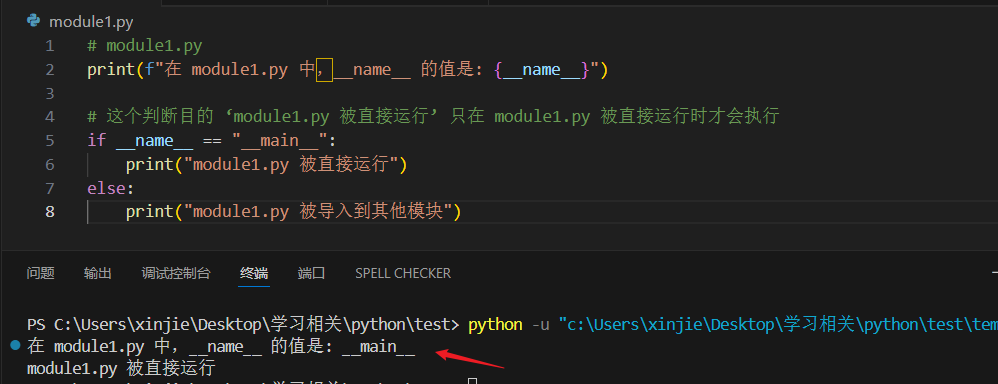
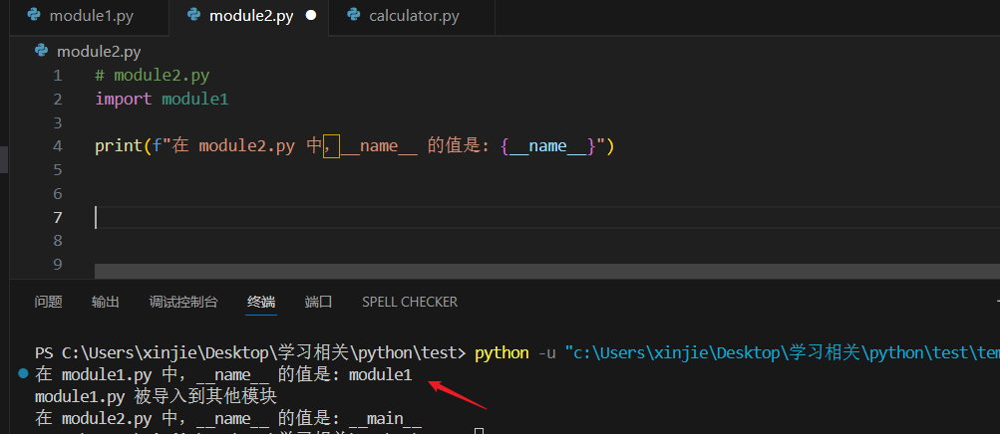
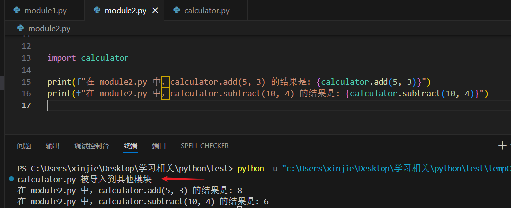

# Python 中的 `__name__` 与 `__main__` 详解

[[toc]]

平时我们经常会看到这样的 Python 代码：

```python
if __name__ == "__main__":
    main()
```

在 `Python` 中，`__name__ 和 __main__ `是两个与模块和脚本执行相关的特殊变量。
`__name__ 和 __main__ 通`常用于控制代码的执行方式，尤其是在模块既可以作为独立脚本运行，也可以被其他模块导入时

## 一、什么是 `__name__`？

`__name__` 是 `Python` 中的一个内置变量，用于表示当前模块的名称。

- 当模块被直接运行时，`__name__` 的值为 `"__main__"`
- 当模块被导入到其他模块时，`__name__` 的值为模块本身的名称

## 二、基本用法

### 1. 直接运行模块时的行为

```python
# module1.py
print(f"在 module1.py 中，__name__ 的值是: {__name__}")

if __name__ == "__main__":
    print("module1.py 被直接运行")
else:
    print("module1.py 被导入到其他模块")
```

直接运行 module1.py 的输出：

```
在 module1.py 中，__name__ 的值是: __main__
module1.py 被直接运行
```

**如图：**



### 2. 导入模块时的行为

```python
# module2.py
import module1

print(f"在 module2.py 中，__name__ 的值是: {__name__}")
```

运行 module2.py 的输出：

```
在 module1.py 中，__name__ 的值是: module1
module1.py 被导入到其他模块
在 module2.py 中，__name__ 的值是: __main__
```

**如图：**



## 三、实际应用场景

### 1. 测试代码的隔离

```python
# calculator.py
def add(a, b):
    """加法函数"""
    return a + b

def subtract(a, b):
    """减法函数"""
    return a - b

# 测试代码
if __name__ == "__main__":
    # 这些代码只有在直接运行 calculator.py 时才会执行
    print("测试计算器功能:")
    print(f"5 + 3 = {add(5, 3)}")
    print(f"10 - 4 = {subtract(10, 4)}")
else:
    print("calculator.py 被导入到其他模块")

```

现在将 `calculator.py` 导入到 `module2.py` 中运行输出为：

```
calculator.py 被导入到其他模块
在 module2.py 中，calculator.add(5, 3) 的结果是: 8
在 module2.py 中，calculator.subtract(10, 4) 的结果是: 6
```

**如图：**



### 2. 模块的多功能使用

```python
# data_processor.py
import json

def load_data(filename):
    """加载数据文件"""
    with open(filename, 'r') as f:
        return json.load(f)

def process_data(data):
    """处理数据"""
    # 数据处理逻辑
    return processed_data

def save_data(data, filename):
    """保存数据"""
    with open(filename, 'w') as f:
        json.dump(data, f, indent=2)

# 当作为脚本运行时，执行完整的数据处理流程
if __name__ == "__main__":
    # 命令行参数处理
    import sys
    if len(sys.argv) != 3:
        print("用法: python data_processor.py 输入文件 输出文件")
        sys.exit(1)

    input_file, output_file = sys.argv[1], sys.argv[2]

    # 执行完整流程
    data = load_data(input_file)
    processed_data = process_data(data)
    save_data(processed_data, output_file)
    print("数据处理完成!")
```

### 3. 包中的 `__main__.py`（例如数据库的初始化可以独立执行）


**数据库初始化**


**如图所示**：

项目中虽然有 `backend/app/db/init_db.py`，但它是作为一个独立脚本存在的（通过 `if __name__ == "__main__":` 触发）。它通常需要在启动服务前手动运行一次（例如 `python app/db/init_db.py`）来创建表和初始数据，并不会在每次启动 `uvicorn` 时自动重新执行所有逻辑。

::: tip 独立工具脚本

这个文件在当前的项目结构中确实属于**独立工具脚本**，使用了` if __name__ == "__main__"`: 保护。这意味着里面的核心逻辑（如
`init_db()`只有在你手动运行该文件时（例如` python app/db/init_db.py`）才会执行。

:::


## 四、高级用法

### 1. 调试模式检测

```python
if __name__ == "__main__":
    # 开发调试模式
    DEBUG = True
    # 详细的日志输出
    print("调试模式启用")
else:
    # 生产模式
    DEBUG = False
```

### 2. 性能测试

```python
import time

def expensive_operation():
    """一个耗时的操作"""
    time.sleep(1)
    return "完成"

if __name__ == "__main__":
    # 只有直接运行时才进行性能测试
    start_time = time.time()
    result = expensive_operation()
    end_time = time.time()
    print(f"操作耗时: {end_time - start_time:.2f} 秒")
```
