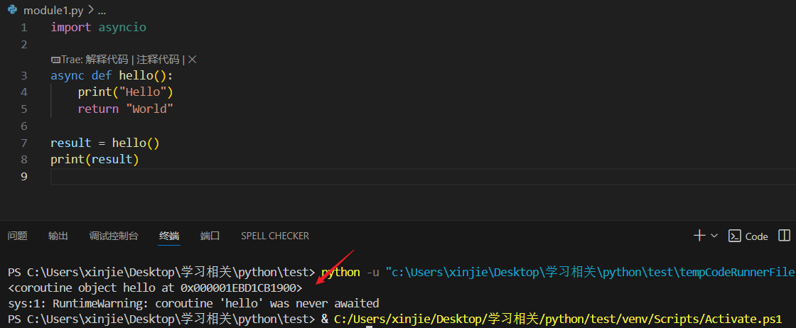

# Python 中的 `async` 和 `await` 入门

[[toc]]

在 Python 里，`async` / `await` 用来写 **异步代码**。它们的主要作用是： 👉 让程序 **同时处理多个任务**，而不是一个个排队等。

## 一、为什么需要异步？

举个例子：

你写了一个程序，要做两件事：

1. 下载一个文件（需要 5 秒）
2. 打印 1 到 5 的数字

如果用普通（同步）的写法：

```python
import time

def download_file():
    print("开始下载...")
    time.sleep(5)  # 模拟下载，卡住 5 秒
    print("下载完成！")

def print_numbers():
    for i in range(1, 6):
        print(i)
        time.sleep(1)

download_file()
print_numbers()
```

**运行结果：**

```
开始下载...
（卡住 5 秒）
下载完成！
1
2
3
4
5
```

**问题：**

- 下载的时候，程序被 **卡住**，不能同时去做别的事情。

这就是 **同步** —— 一件事没做完，下一件事只能等。

## 二、异步的好处

用异步就不一样了。下载的时候，程序不用干等，可以去做别的事情。等下载好了再回来继续。

这就像：

- **同步**：你烧水的时候，站在水壶前等 5 分钟，啥也不干。
- **异步**：你烧水的时候，顺便去切菜、洗菜。水开了再回来处理。

异步的目标就是 **提高效率**。

## 三、Python 里的 `async` / `await`

- `async` 用来定义一个 **异步函数**（叫做 coroutine 协程）。
- `await` 用来 **等待一个异步任务完成**，在等待的同时，程序可以去干别的事。

### 示例：

```python
import asyncio

# 定义异步函数
async def download_file():
    print("开始下载...")
    await asyncio.sleep(5)  # 模拟下载，不会卡住
    print("下载完成！")

async def print_numbers():
    for i in range(1, 6):
        print(i)
        await asyncio.sleep(1)  # 模拟耗时操作

# 主函数
async def main():
    # 同时执行两个任务
    await asyncio.gather(
        download_file(),
        print_numbers()
    )

# 运行
asyncio.run(main())
```

**运行结果：**

```
开始下载...
1
2
3
4
5
下载完成！
```

**你会发现：**

- 数字和下载是“同时”进行的。
- 下载没有把程序卡死，两个任务在并发执行。

## 四、关键点总结

1. **定义异步函数**

   ```python
   async def func():
       ...
   ```

2. **调用异步函数时，要用 `await`**

   ```python
   await func()
   ```

3. **异步的好处**

   - 适合 I/O 密集型任务（网络请求、读写文件、数据库操作）。
   - 不适合 CPU 密集型任务（比如复杂的数学计算），那还是多进程更好。

4. **asyncio.run()函数**

作用是运行异步的主函数

**参数:**

- `coro`: 要运行的异步函数
- `debug=False`: 是否开启调试模式

```python
async def main():
    print("Hello")
asyncio.run(main())  # 运行异步程序

```

1. **asyncio.gather()函数**

作用是同时运行多个异步任务

**参数:**

- `delay`: 等待的时间，单位是秒

```python
await asyncio.sleep(1)  # 等待1秒，期间可以运行其他任务
```

6. **asyncio.gather()函数**

作用是并发执行多个异步任务

**参数:**

- `*aws`: 多个异步任务（用逗号分隔）

- `return_exceptions=False`: 是否将异常作为结果返回

```python
# 同时执行3个任务，等待所有完成
results = await asyncio.gather(
    task1(),
    task2(),
    task3()
)

# 错误处理版本
results = await asyncio.gather(
    task1(), task2(), task3(),
    return_exceptions=True  # 异常不会抛出，而是作为结果返回
)
```

## 五、实际应用

在 Python 的一些框架中（如 **FastAPI、aiohttp、Tornado**），`async` / `await` 被用来处理 **高并发请求**。例如 FastAPI 里写接口时：

```python
from fastapi import FastAPI

app = FastAPI()

@app.get("/")
async def hello():
    return {"message": "Hello, async world!"}
```

这里的 `async def` 就表示这个接口是异步的，可以同时处理很多用户的请求，而不会一个个卡着排队。

## 常见问题

### 1. 被 async 修饰的函数，如果直接调用会怎么样？

来看个例子：

```python
import asyncio

async def hello():
    print("Hello")
    return "World"

result = hello()
print(result)
```

**运行结果：**



⚠️ 注意：不会打印 "Hello"。  
**原因是：**

- async def 定义的函数，调用后不会立刻执行，而是返回一个 协程对象（coroutine object）。
- 这个协程对象就像一个“任务计划”，要等到 await 或事件循环（asyncio.run / asyncio.create_task 等）驱动时，才会真正执行。

所以直接调用只会得到“一个计划”，而不是结果。

### 2. await 是做什么的？

`await` 就是用来 等待一个异步任务（协程对象）完成，并获取它的返回值。它只能在 `async` 函数里使用。

继续上面的例子：

```python
import asyncio

async def hello():
    print("Hello")
    return "World"

async def main():
    result = await hello()  # 这里才真正执行
    print("结果:", result)

asyncio.run(main())

```

**输出结果：**

```
Hello
结果: World
```

**流程解释：**

- hello() 返回一个协程对象。
- await hello() 才会真正执行 hello() 里的代码，并拿到返回值。

::: tip 注意

如果一个 async 函数没有写 return，那它的返回值就是 None，和普通函数完全一样。

:::
