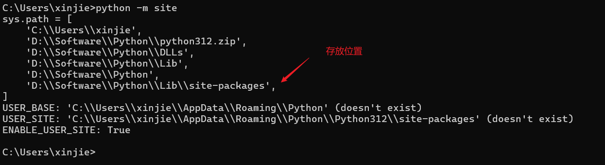
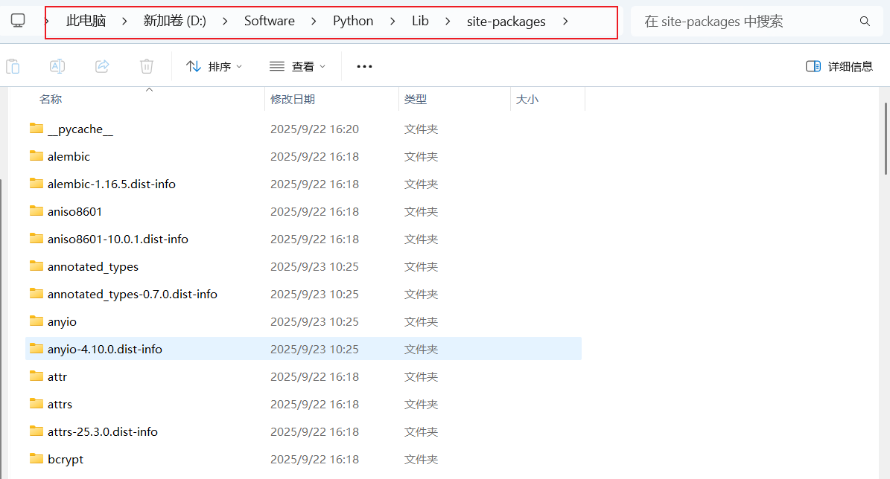
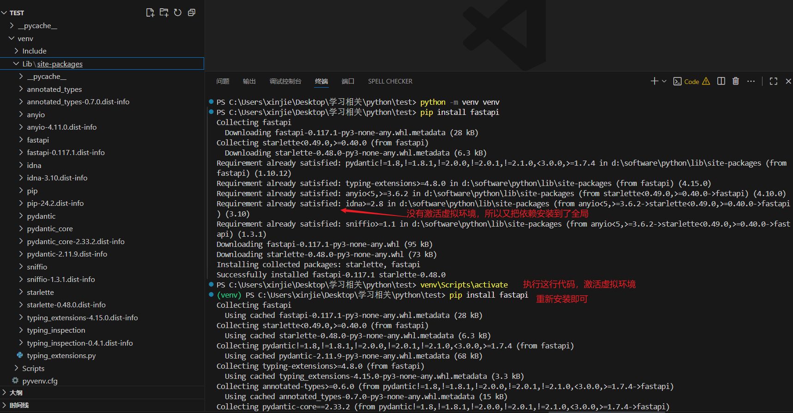

# `pip` 和 `requirements.txt` 详解

[[toc]]

{width=80%}

在 `Python` 项目开发中,我们经常会用到第三方库，比如 `requests`、`flask`、`numPy` 等。如果不加管理，项目可能会出现“我的环境能跑，你的环境报错”的问题。

这时就需要了解两个核心工具：**`pip`** 和 **`requirements.txt`**。

## 一、什么是 `pip`

`pip` 是 `Python` 的官方包管理工具（Package Installer for Python）。它可以用来 **安装、卸载和管理 Python 包**。

[`pip`安装依赖存放位置](#五、pip-依赖存放位置)

### 常用命令

1. **安装包**

   ```bash
   pip install requests
   ```

   安装最新版本的 `requests`。

   如果需要指定版本：

   ```bash
   pip install requests==2.31.0
   ```

2. **卸载包**

   ```bash
   pip uninstall requests
   ```

3. **查看已安装包**

   ```bash
   pip list
   ```

4. **查看某个包的详细信息**

   ```bash
   pip show requests
   ```

   会显示版本、安装路径、依赖等。

5. **更新包**

   ```bash
   pip install --upgrade requests
   ```

6. **冻结（导出）当前环境依赖**

   ```bash
   pip freeze
   ```

   输出类似：

   ```
   Flask==2.2.5
   requests==2.31.0
   SQLAlchemy==2.0.23
   ```

## 二、什么是 `requirements.txt`

`requirements.txt` 是一个纯文本文件，用来记录项目所需的依赖库及其版本。它通常和 `pip` 配合使用，作用类似于 **“项目依赖清单”**。

### 1. 创建 `requirements.txt`

最常见的方法是用：

```bash
pip freeze > requirements.txt
```

生成的文件内容可能是：

```
Flask==2.2.5
requests==2.31.0
SQLAlchemy==2.0.23
```

这样别人拿到项目后，可以快速在新环境里安装所有依赖。

### 2. 使用 `requirements.txt`

安装依赖：

```bash
pip install -r requirements.txt
```

这样会一键安装文件里列出的所有包及对应版本。

### 3. 版本控制写法

在 `requirements.txt` 里，你可以指定包的版本范围：

- **固定版本**

  ```
  requests==2.31.0
  ```

  必须安装 2.31.0。

- **大于等于某个版本**

  ```
  Flask>=2.0
  ```

- **小于某个版本**

  ```
  Django<4.0
  ```

- **范围**

  ```
  SQLAlchemy>=1.4,<2.0
  ```

这样能避免兼容性问题。

## 三、为什么要用 `requirements.txt`

1. **保证环境一致** 开发、测试、生产环境都使用同样的依赖版本，避免“本地能跑，线上报错”的情况。

2. **方便协作** 团队成员只需要 `pip install -r requirements.txt` 就能快速搭建环境。

3. **便于部署** 部署到服务器或容器时，也可以一键安装依赖。

## 四、常见实践

1. **虚拟环境配合 `requirements.txt`** 通常我们会先创建一个虚拟环境，再在其中安装依赖并生成 `requirements.txt`。

   ```bash
   python -m venv venv
   source venv/bin/activate   # Linux/Mac
   venv\Scripts\activate      # Windows
   pip install -r requirements.txt
   ```

   这样不同项目之间不会冲突。

2. **分层依赖** 有些项目会维护多个依赖文件，比如：

   - `requirements.txt`（基础依赖）
   - `requirements-dev.txt`（开发调试用，比如 pytest, black）
   - `requirements-prod.txt`（生产环境依赖）

## 五、pip 依赖存放位置

::: tip `pip`和安装的依赖都存放到了哪里，本地项目文件夹并没有？

这是个很常见的疑问 👍。  
你用 pip install xxx 安装依赖后，默认情况下 不会安装到你的项目文件夹，而是安装到 Python 的 site-packages 目录 下。具体情况取决于你是用 系统 Python 还是 虚拟环境。

:::

### 1. 全局安装（没有虚拟环境时）

如果你直接执行：

```bash
pip install requests
```

那么包会被安装到 **全局 Python 解释器的 site-packages** 目录。

你可以通过下面的命令找到位置：

```bash
python -m site
```

输出里会有类似：

```
sys.path = [
    '...',
    '/usr/local/lib/python3.11/site-packages',
]
```

最后这一项就是 `pip` 安装依赖的路径。

**如图：**



或者更直接：

```bash
pip show requests
```

**如图：**


输出里会有：

```
Location: /usr/local/lib/python3.11/site-packages
```

**文件资源管理位置：**



### 2. 虚拟环境（推荐）

通常开发时我们不会全局安装，而是用 **虚拟环境** 隔离依赖。

例如：

```bash
python -m venv venv
source venv/bin/activate  # Linux/Mac
venv\Scripts\activate     # Windows 下激活虚拟环境 不要忘记了
pip install requests
```

此时依赖会装到：

```
<项目目录>/venv/lib/python3.11/site-packages
```

（Windows 下是 `venv\Lib\site-packages`）

**如图：**



这样依赖就会跟随项目，而不是全局共享。

### 3. 为什么项目文件夹里看不到

因为 `pip` 安装不会把包散落到你的源码目录，而是集中放在 **site-packages**，Python 运行时通过 `sys.path` 去找到这些包。如果你需要“记录”依赖，可以用：

```bash
pip freeze > requirements.txt
```

下次在新的环境里可以：

```bash
pip install -r requirements.txt
```
